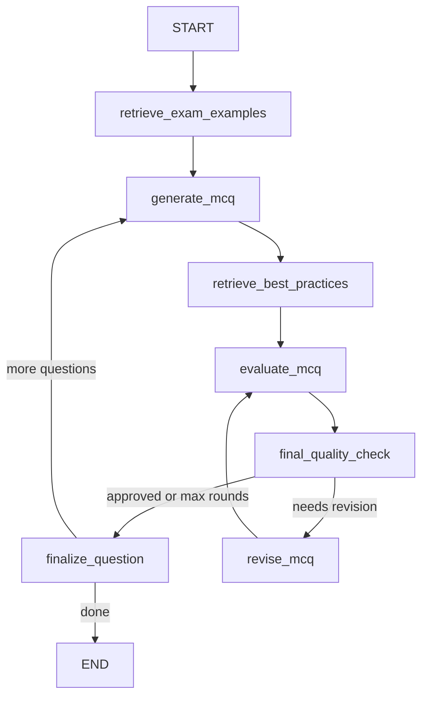

# MCQ Agent — LangGraph Workflow

Agentic pipeline for generating chemistry multiple-choice questions using RAG over sample exams and MCQ best-practice documents. Questions are generated, evaluated, revised in a loop, and written to JSON/Markdown.

## Project layout

```text
mcq_agent/
├── data/
│   ├── mds_exams/              # Sample exams (symlinked to ../dataFolder/mds_exams)
│   └── mds_best_practices/     # Best-practice papers
├── src/
│   ├── ingestion.py            # Document loading (.md, .json, .png)
│   ├── vectorstore.py          # Chroma indexes and retrievers
│   ├── schemas.py              # Pydantic models
│   ├── prompts.py              # Prompt templates
│   ├── graph.py                # LangGraph workflow
│   ├── agents.py               # LLM generation / evaluation / revision
│   ├── export.py               # Pandoc DOCX/PDF export
│   └── utils.py                # Config, paths, output writers
├── outputs/                    # generated_mcqs.json / .md
├── generate_mcqs.py            # CLI entry point
├── export_mcqs.py              # Pandoc export to DOCX/PDF
├── requirements.txt
└── .env.example
```

## Install

```bash
cd mcq_agent
python -m venv .venv
source .venv/bin/activate
pip install -r requirements.txt
cp .env.example .env
# Edit .env and set OPENAI_API_KEY
```

## Data folders

Place (or symlink) your corpora under `mcq_agent/data/`:

| Folder | Purpose | Vector collection |
|--------|---------|-------------------|
| `data/mds_exams/` | Sample exams for style/content RAG | `exam_examples` |
| `data/mds_best_practices/` | MCQ design guidelines for evaluation | `best_practices` |

Each exam or paper should live in its own subfolder and may contain `.md`, `.json`, and `.png` files.

This repo already has data at `../dataFolder/`; symlinks were created automatically:

```bash
data/mds_exams -> ../../dataFolder/mds_exams
data/mds_best_practices -> ../../dataFolder/mds_best_practices
```

Override paths with environment variables if needed:

- `MCQ_DATA_DIR`
- `MCQ_EXAMS_DIR`
- `MCQ_BEST_PRACTICES_DIR`

## Build the vector database

Indexes are built automatically on first run. To build (or rebuild) explicitly:

```bash
python generate_mcqs.py --index-only
python generate_mcqs.py --index-only --rebuild-index
```

Chroma persists to `mcq_agent/.chroma/` by default (`MCQ_VECTORSTORE_DIR` to override).

## Generate MCQs

```bash
python generate_mcqs.py \
  --topic "toxicology" \
  --learning_objective "Understand dose-response relationships" \
  --difficulty medium \
  --num_questions 5
```

Outputs:

- `outputs/generated_mcqs.json`
- `outputs/generated_mcqs.md`

## Export to DOCX and PDF

Use `export_mcqs.py` to convert the Markdown output with [Pandoc](https://pandoc.org/):

```bash
# DOCX + PDF (default)
python export_mcqs.py

# Custom input/output paths
python export_mcqs.py \
  --input outputs/generated_mcqs.md \
  --output-docx outputs/generated_mcqs.docx \
  --output-pdf outputs/generated_mcqs.pdf

# DOCX only (no PDF engine required)
python export_mcqs.py --docx-only
```

PDF export requires a Pandoc PDF engine such as `pdflatex` or `xelatex` (TeX Live) or `wkhtmltopdf`. If none is installed, use `--docx-only` or pass `--pdf-engine NAME` once you have one installed.

Optional flags:

| Flag | Description |
|------|-------------|
| `--docx-only` | Skip PDF conversion |
| `--pdf-only` | Skip DOCX conversion |
| `--pdf-engine pdflatex` | Choose the Pandoc PDF engine |
| `--reference-doc template.docx` | Custom Word styling via a reference DOCX |

Optional flags (generation):

| Flag | Description |
|------|-------------|
| `--max_revision_rounds 3` | Max evaluate/revise loops per question |
| `--rebuild-index` | Re-ingest documents before running |
| `--output-json PATH` | Custom JSON output path |
| `--output-md PATH` | Custom Markdown output path |

## LangGraph workflow



1. **retrieve_exam_examples** — RAG from `exam_examples` using topic + learning objective.
2. **generate_mcq** — LLM writes one MCQ in the style of retrieved samples.
3. **retrieve_best_practices** — RAG from `best_practices` for the evaluator rubric.
4. **evaluate_mcq** — Checks stem clarity, distractors, alignment, cognitive level, etc.
5. **final_quality_check** — Routes to revision or finalization.
6. **revise_mcq** — Improves the question from evaluator feedback (preserves learning objective).
7. **finalize_question** — Saves the question and loops until `--num_questions` are done.

## Customization

### Model and API

Edit `mcq_agent/.env`:

```env
OPENAI_API_KEY=...
OPENAI_MODEL=gpt-4o-mini
OPENAI_BASE_URL=https://your-compatible-provider/v1   # optional
OPENAI_EMBEDDING_MODEL=text-embedding-3-small
OPENAI_TEMPERATURE=0.3
```

### Retrieval

```env
RETRIEVAL_EXAM_K=6
RETRIEVAL_BEST_PRACTICES_K=5
INGESTION_CHUNK_SIZE=1200
INGESTION_CHUNK_OVERLAP=200
```

### Prompts

Edit `src/prompts.py` for generation, evaluation, and revision instructions.

### PNG / OCR

`src/ingestion.py` defines `ImageTextExtractor` and `PlaceholderImageTextExtractor`. Implement a subclass and pass it to `ingest_all(image_extractor=...)` when you add OCR or vision captioning.

### Programmatic use (e.g. future web app)

```python
from src.graph import run_workflow
from src.utils import write_outputs
from src.schemas import MCQBatchOutput

state = run_workflow(
    topic="stoichiometry",
    learning_objective="Balance chemical equations",
    difficulty="medium",
    num_questions=3,
)
batch = MCQBatchOutput(
    topic="stoichiometry",
    learning_objective="Balance chemical equations",
    difficulty="medium",
    num_questions=len(state["completed_questions"]),
    questions=state["completed_questions"],
)
write_outputs(batch)
```

## MCQ output schema

Each question includes: `question`, `options` (A–D), `correct_answer`, `explanation`, `learning_objective`, `difficulty`, `cognitive_level`, `source_context_used`, `evaluator_feedback`, `revision_rounds`, and `approved`.
