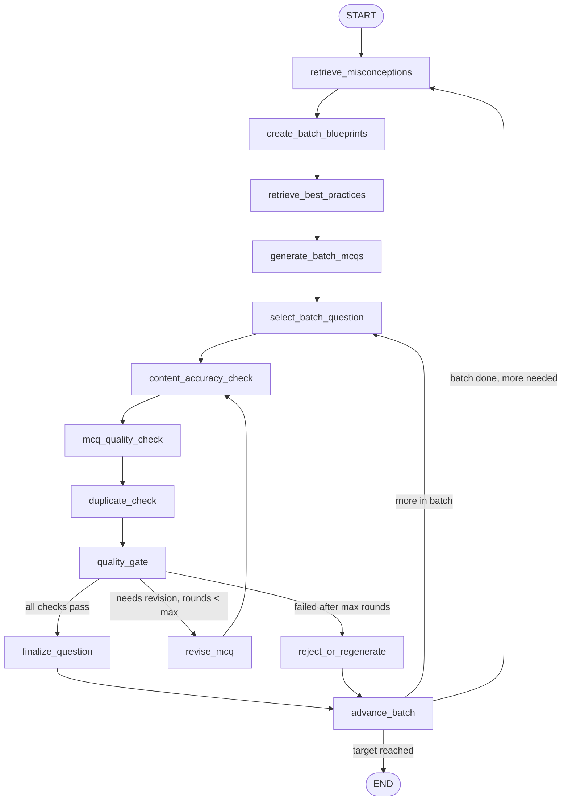

# MCQ Agent — LangGraph Workflow

Agentic pipeline for generating chemistry multiple-choice questions using RAG over literature-backed student misconceptions and MCQ best-practice documents. Questions are planned in batches, generated to target specific misconceptions, reviewed for content accuracy and item quality, checked for duplicates, revised when needed, and written to JSON/Markdown. Failed questions are rejected—not saved as completed.

## Project layout

```text
mcq_agent/
├── data/
│   ├── mds_misconceptions/     # Topic misconception corpora (3 subfolders)
│   └── mds_best_practices/     # Best-practice papers
├── src/
│   ├── ingestion.py            # Document loading (.md, .json, .png)
│   ├── vectorstore.py          # Chroma indexes and retrievers
│   ├── schemas.py              # Pydantic models
│   ├── prompts.py              # Prompt templates
│   ├── prompt_store.py         # Session prompt overrides (contextvars)
│   ├── cost_tracking.py        # Token usage callback
│   ├── graph.py                # LangGraph workflow
│   ├── agents.py               # LLM blueprint / generation / evaluation / revision
│   ├── export.py               # Pandoc DOCX/PDF export
│   └── utils.py                # Config, paths, output writers
├── tests/
│   └── test_workflow.py        # Routing, schema, and loop-guard tests
├── outputs/                    # generated_mcqs.json / .md, rejected_mcqs.json
├── generate_mcqs.py            # CLI entry point
├── export_mcqs.py              # Pandoc export to DOCX/PDF
├── streamlit_app.py            # Browser GUI for collaborators
├── requirements.txt
└── .env.example
```

## Install

```bash
cd mcq_agent
python -m venv .venv
source .venv/bin/activate
pip install -r requirements.txt
cp .env.example .env
# Edit .env and set OPENAI_API_KEY
```

## Data folders

Place (or symlink) your corpora under `mcq_agent/data/`:

| Folder | Purpose | Vector collection |
|--------|---------|-------------------|
| `data/mds_misconceptions/` | Literature-backed student misconceptions (3 topic subfolders) | `misconceptions` |
| `data/mds_best_practices/` | MCQ design guidelines for generation and evaluation | `best_practices` |

Each misconception topic folder contains `misconceptions_corpus.md` and `extracted_misconceptions.json`.

This repo already has data at `../dataFolder/`; symlinks under `data/mds_misconceptions/`:

```bash
data/mds_misconceptions/mds_IMFs -> ../../../dataFolder/mds_IMFs
data/mds_misconceptions/mds_ox_redox -> ../../../dataFolder/mds_ox_redox
data/mds_misconceptions/mds_sn1_sn2_reduction -> ../../../dataFolder/mds_sn1_sn2_reduction
data/mds_best_practices -> ../../dataFolder/mds_best_practices
```

Override paths with environment variables if needed:

- `MCQ_DATA_DIR`
- `MCQ_MISCONCEPTIONS_DIR`
- `MCQ_MISCONCEPTIONS_IMFS_DIR` / `MCQ_MISCONCEPTIONS_OX_REDOX_DIR` / `MCQ_MISCONCEPTIONS_SN1_SN2_DIR`
- `MCQ_BEST_PRACTICES_DIR`

## Build the vector database

Indexes are built automatically on first run. To build (or rebuild) explicitly:

```bash
python generate_mcqs.py --index-only
python generate_mcqs.py --index-only --rebuild-index
```

Chroma persists to `mcq_agent/.chroma/` by default (`MCQ_VECTORSTORE_DIR` to override).

## Generate MCQs

```bash
python generate_mcqs.py \
  --topic "intermolecular forces" \
  --learning_objective "Explain how IMFs affect boiling points" \
  --difficulty medium \
  --num_questions 7 \
  --batch_size 5
```

Outputs:

- `outputs/generated_mcqs.json` — approved questions with full audit trail
- `outputs/generated_mcqs.md` — human-readable report (includes rejected section when applicable)
- `outputs/rejected_mcqs.json` — questions that failed after max revision rounds (written only when rejections occur)

Only **approved** questions count toward `--num_questions`. If too many candidates are rejected, you may receive fewer approved items than requested (the CLI logs a warning).

### Text-native tables and figures

Across a run, the agent assigns stem media types deterministically (~20% table, ~20% figure, remainder text). For `--num_questions 5` that is typically **1 table + 1 figure + 3 text**.

- **table** — Markdown pipe table in `media_content`; stem references it.
- **figure** — ASCII/Unicode or fenced text diagram in `media_content` (no image files or URLs).
- **text** — `media_content` left empty.

These fields appear on each MCQ and blueprint in `generated_mcqs.json`, and tables/figures are rendered in the Markdown report for Pandoc export.

## Streamlit GUI

Collaborators can run generation from a browser UI with live logs, session-only prompt editing, token usage, and downloads (JSON / Markdown / DOCX):

```bash
cd mcq_agent
source .venv/bin/activate   # if using a venv
pip install -r requirements.txt
streamlit run streamlit_app.py
```

Notes:

- **Prompt edits** apply only to the current browser session (reset on refresh). They are not written to `src/prompts.py`. Session system prompts are appended to the Markdown/JSON outputs.
- **Config** (model, embeddings, retrieval) is loaded from `mcq_agent/.env.example`. Enter your **OpenAI API key** in the Streamlit sidebar (required; not read from `.env`).
- **Token usage** (prompt / completion / embedding) is shown in the UI after each run.
- **DOCX download** uses Pandoc (`pypandoc_binary` in `requirements.txt`, or a system Pandoc on `PATH`). JSON and Markdown downloads still work without it.
- The CLI still uses `mcq_agent/.env` for `OPENAI_API_KEY` and local overrides.

## Export to DOCX and PDF

Use `export_mcqs.py` to convert the Markdown output with [Pandoc](https://pandoc.org/):

```bash
# DOCX + PDF (default)
python export_mcqs.py

# Custom input/output paths
python export_mcqs.py \
  --input outputs/generated_mcqs.md \
  --output-docx outputs/generated_mcqs.docx \
  --output-pdf outputs/generated_mcqs.pdf

# DOCX only (no PDF engine required)
python export_mcqs.py --docx-only
```

PDF export requires a Pandoc PDF engine such as `pdflatex` or `xelatex` (TeX Live) or `wkhtmltopdf`. If none is installed, use `--docx-only` or pass `--pdf-engine NAME` once you have one installed.

Optional flags:

| Flag | Description |
|------|-------------|
| `--docx-only` | Skip PDF conversion |
| `--pdf-only` | Skip DOCX conversion |
| `--pdf-engine pdflatex` | Choose the Pandoc PDF engine |
| `--reference-doc template.docx` | Custom Word styling via a reference DOCX |

Optional flags (generation):

| Flag | Description |
|------|-------------|
| `--batch_size 5` | Number of MCQs to blueprint and generate per batch |
| `--output_name NAME` | Base filename for outputs (`outputs/NAME.json`, `.md`, `_rejected.json`) |
| `--max_revision_rounds 3` | Max evaluate/revise loops per question |
| `--rebuild-index` | Re-ingest documents before running |
| `--output-json PATH` | Custom JSON output path |
| `--output-md PATH` | Custom Markdown output path |

## Tests

```bash
cd mcq_agent
python -m pytest tests/ -v
```

Tests cover quality-gate routing, structured evaluator schemas, finalize/reject behavior, and loop guards (no infinite reject/regenerate cycles).

## LangGraph workflow



`generate_mcqs.py` calls `write_outputs()` after the graph finishes (not a LangGraph node).

### Pipeline nodes

1. **retrieve_misconceptions** — RAG from merged topic corpora (`mds_IMFs`, `mds_ox_redox`, `mds_sn1_sn2_reduction`) using topic and learning objective. Runs at the start of each batch.
2. **create_batch_blueprints** — LLM plans up to `--batch_size` questions (or fewer if remaining), each targeting a distinct misconception.
3. **retrieve_best_practices** — RAG from `best_practices` for item-writing constraints (used at generation and evaluation).
4. **generate_batch_mcqs** — LLM writes a batch of MCQs from the blueprints, misconception context, and best-practice guidance.
5. **select_batch_question** — Selects the current question from the batch for per-question evaluation.
6. **content_accuracy_check** — Verifies scientific correctness, correct answer key, and that no distractor is accidentally correct.
7. **mcq_quality_check** — Evaluates MCQ-writing quality (stem clarity, distractors, alignment, ambiguity, clueing, rubric adherence).
8. **duplicate_check** — Compares the candidate against `completed_questions` for near-duplicate stems, concepts, or misconceptions.
9. **quality_gate** — Combines all three reviewer results and routes to finalize, revise, or reject.
10. **revise_mcq** — Revises using structured feedback from content, quality, and duplicate checks; re-enters the review chain.
11. **finalize_question** — Appends an approved `CompletedMCQRecord` and clears per-question working state.
12. **reject_or_regenerate** — Records a `RejectedQuestionRecord` (does **not** finalize failed questions).
13. **advance_batch** — Moves to the next question in the batch or starts a new batch.

### Quality gate routing

The gate in `route_after_quality_gate` (`src/graph.py`) uses this logic:

```python
if content.approved and quality.approved and not duplicate.is_duplicate:
    route = "finalize_question"
elif revision_rounds < max_revision_rounds:
    route = "revise_mcq"
else:
    route = "reject_or_regenerate"
```

Questions are **never** finalized just because max revision rounds were reached. Failed candidates go to `reject_or_regenerate` → `advance_batch` → next question or new batch.

A generation attempt cap (`num_questions × (max_revision_rounds + 4)`) prevents infinite reject/regenerate loops.

## Customization

### Model and API

Edit `mcq_agent/.env`:

```env
OPENAI_API_KEY=...
OPENAI_MODEL=gpt-4o-mini
OPENAI_BASE_URL=https://your-compatible-provider/v1   # optional
OPENAI_EMBEDDING_MODEL=text-embedding-3-small
OPENAI_TEMPERATURE=0.3
```

### Retrieval

```env
RETRIEVAL_MISCONCEPTIONS_K=8
RETRIEVAL_BEST_PRACTICES_K=5
INGESTION_CHUNK_SIZE=1200
INGESTION_CHUNK_OVERLAP=200
```

### Prompts

Edit `src/prompts.py` for blueprint, generation, content/quality/duplicate checks, and revision instructions.

### PNG / OCR

`src/ingestion.py` defines `ImageTextExtractor` and `PlaceholderImageTextExtractor`. Implement a subclass and pass it to `ingest_all(image_extractor=...)` when you add OCR or vision captioning.

### Programmatic use (e.g. future web app)

```python
from src.graph import run_workflow
from src.utils import write_outputs
from src.schemas import MCQBatchOutput

state = run_workflow(
    topic="stoichiometry",
    learning_objective="Balance chemical equations",
    difficulty="medium",
    num_questions=3,
    batch_size=5,
)
batch = MCQBatchOutput(
    topic="stoichiometry",
    learning_objective="Balance chemical equations",
    difficulty="medium",
    num_questions=len(state["completed_questions"]),
    questions=state["completed_questions"],
    rejected_questions=state.get("rejected_questions", []),
)
write_outputs(batch)
```

## MCQ output schema

### Cognitive level

Final MCQs use the `CognitiveLevel` enum: `recall`, `application`, `analysis`, `evaluation` (Bloom’s taxonomy, simplified).

### Question blueprint (per question)

Planned before generation:

```json
{
  "topic": "...",
  "learning_objective": "...",
  "difficulty": "...",
  "cognitive_level": "...",
  "target_misconception": "...",
  "correct_answer_concept": "...",
  "expected_reasoning": "...",
  "question_style_notes": "...",
  "stem_media_type": "text | table | figure"
}
```

### Structured evaluator output

Content and quality reviewers return:

```json
{
  "approved": false,
  "score": 0.0,
  "issues": ["..."],
  "revision_instructions": "...",
  "blocking_errors": ["..."]
}
```

Duplicate check returns:

```json
{
  "is_duplicate": false,
  "similarity_reason": "",
  "most_similar_question_id": null,
  "revision_instructions": ""
}
```

### Completed question record

Each approved entry in `generated_mcqs.json` includes:

- **mcq** — `question`, `options` (A–D), `correct_answer`, `explanation`, `learning_objective`, `difficulty`, `cognitive_level`, `stem_media_type`, `media_content`, `revision_rounds`, `approved`
- **question_blueprint** — the plan used to generate the item (includes `stem_media_type`)
- **content_evaluation** — content accuracy review summary
- **quality_evaluation** — MCQ quality review summary
- **duplicate_evaluation** — duplicate check result

Rejected questions (in `rejected_mcqs.json`) include the last candidate, blueprint, rejection reason, and evaluator snapshots when available.
