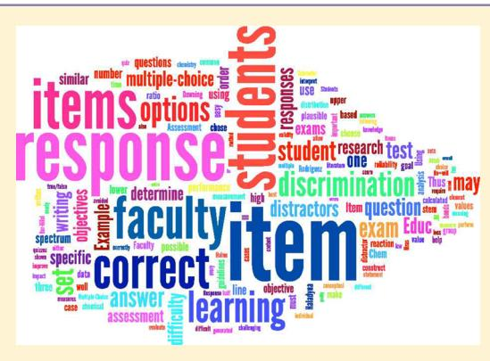

Article

pubs.acs.org/jchemeduc

# Guide To Developing High-Quality, Reliable, and Valid Multiple-Choice Assessments

Marcy H. Towns\*

Department of Chemistry, Purdue University, West Lafayette, Indiana 47906, United States

ABSTRACT: Chemistry faculty members are highly skilled in obtaining, analyzing, and interpreting physical measurements, but often they are less skilled in measuring student learning. This work provides guidance for chemistry faculty from the research literature on multiple-choice item development in chemistry. Areas covered include content, stem, and response construction; item analysis; item difficulty; and item discrimination. The goal is to help faculty construct high-quality, reliable, and valid multiple-choice items to evaluate students' ability to meet learning objectives and to demonstrate proficiency in the content domain under study. Using item-writing guidelines based upon the research literature allows faculty to create assessments that are reliable and valid, with greater ability to discriminate between high- and low-achieving students.

**KEYWORDS:** First-Year Undergraduate/General, Second-Year Undergraduate, Upper-Division Undergraduate, Curriculum, Testing/Assessment, Student-Centered Learning

#### ■ INTRODUCTION

The design and interpretation of assessments of student learning is a responsibility of chemistry faculty. Developing familiarity and expertise about assessment—vocabulary, design, and interpretation—has been the topic of recent editorials and research articles in the Journal. The aim of this work is to provide guidance for chemistry faculty in developing multiple-choice items leading to reliable and valid assessments. If exams are thought of as a tool for measurement of student learning, then the goal should be to develop the best tools possible.

The purpose of assessment is for faculty to learn what students know or can do. The purpose of a specific task is to provide formative (homework, quizzes, or exams given during the semester) or summative (exams or final projects at the end of the semester) feedback to faculty and students on the students' ability to achieve specific learning objectives. In this work it is assumed that faculty have specific, measurable learning objectives for each chapter, unit, module, and/or experiment in their course.

The terms *reliability* and *validity* are used to describe assessment tasks (and occasionally items) and frequently occur in the lexicon of assessment. Reliability refers to a task's reproducibility (or its precision). Validity refers to the degree to which the task measures what it purports to measure (or its accuracy). Thus, reliable and valid assessments allow faculty to measure in a precise and accurate way the students' ability to meet specific learning objectives.

There are many different ways to assess student learning and a wide literature base to peruse and use as resources. Faculty may be familiar with Bloom's Taxonomy and the revised taxonomy that uses a knowledge dimension and cognitive process dimension to generate 24 different types of possible assessment tasks of varying complexity. 4–6 Computer-based assessment, electronic

homework platforms, and technology platforms such as BeSocratic7 facilitate a wide variety of assessment tasks. Kathleen Scalise's "Computer-Based Assessment: 'Intermediate Constraint' Questions and Tasks for Technology Platforms" is a rich resource for the development of questions linked to electronic delivery. These resources can help faculty consider what kind of knowledge they would like to assess (factual, conceptual, procedural, or metacognitive), at what level (recall, understanding, application, and analysis, etc.), and how they would like to do it (multiple-choice questions, essay questions, drawings, or projects, etc.). To determine if students have achieved a learning objective, faculty make decisions about what evidence they will accept predicated upon their own assessment proclivities, class size, level of the course, and time available for grading.

This work gleans from the research and practice literature guidelines for the development of multiple-choice items. Given that faculty may use such items in homeworks, quizzes, or exams to assess student learning, it is sensible to collect what is known about item writing into a work that is useful to chemistry faculty.

#### **■ MULTIPLE-CHOICE QUESTIONS**

Multiple-choice questions are a traditional type of assessment task for students that can be used on exams or quizzes. Such items have the advantage of ease of scoring, especially if scoring is automated. The item begins with a question or *stem*, and the correct answer is selected from a list of possible *response options*. There is one *correct response* and the other options are called *distractors*.

Published: July 31, 2014

Fortunately there are sets of guidelines for writing multiplechoice items that have received attention in the research literature most notably by Haladyna and Downing, 9,10 and Halydyna et al. 11 Referencing their work, considering new contributions, 12 and connecting these guidelines to chemistry allow for the formulation of guidelines specifically useful to chemistry faculty.

#### **■ CONTENT GUIDELINES**

The crucial component of writing multiple-choice items is to have well-defined learning objectives that facilitate item writing. Every item must evaluate the student's understanding of a specific learning objective. If a test is viewed as an instrument that measures student achievement of specific learning objectives, then items that do not contribute to that measurement must be removed.

Generating exam or quiz items flows from established learning objectives of a course. Usually due to the number of learning objectives covered on one exam it is not reasonable to assess all of them. Thus, a sampling problem emerges which can be resolved by establishing priorities to determine the relative importance of each learning objective. It is easy to write test items that require student recall of trivia; however faculty should not fall into this trap. Exam items should evaluate student understanding of learning objectives faculty deem to be most important and require students to apply knowledge. 9–12

Faculty are encouraged to set a goal of writing exam or quiz items weekly to build a pool of possible items as opposed to waiting until a few days before the exam or quiz to generate items. This weekly activity will allow faculty time to edit and revise items before they are assembled into a quiz or an exam. Writing high-quality multiple-choice items that are aligned with learning goals requires time and effort. Thus, it is beneficial for faculty to schedule time to construct and refine test items.

## **■ GENERAL ITEM-WRITING GUIDELINES**

All items must use appropriate grammar, punctuation, spelling, nomenclature, and chemical symbolism as a minimum standard. Given adequate time and careful editing and revision, this goal can be achieved. It is a crucial step in developing reliable and valid assessments. As noted above, every item must assess one learning objective so that the learning objectives and assessment are aligned.

It is good practice to analyze the kinds of questions asked in an assessment with with the goal of asking a variety of types. Using Bloom's taxonomy one can classify items based upon the type of knowledge required (factual, conceptual, and/or procedural knowledge) and the level at which the question is asked (remembering, understanding, applying, or analyzing, etc.).

Specific guidance is provided for constructing item stems and response sets in the following sections, but there are some types of items that should be avoided. Items that are complex multiple choice such as example 1 in Box 1 (called a type K format in the assessment literature) should be avoided. The reason is that these items tend to test analytic skills different from the learning objectives that the faculty seek to evaluate. In Example 1 if a student knows that statement III is true, then he/she can eliminate responses A and B by using test-taking skills leaving only three plausible responses.

### STEM CONSTRUCTION

Stems should be clearly written and not overly wordy; 9–12 the goal is to be clear and succinct. Write the stem positively and avoid negative phrasing or wording such as "not" or "except". 9–12

# Box 1. Complex Multiple-Choice Item (Type K Item) That Should Be Avoided

Example 1:

Which of the following statement(s) is (are) true?

- Multiple bonds are shorter than single bonds between the same two elements.
- II. The covalent radius of an element is calculated from a single gas phase atom of that element.
- III. As the bond order between two atoms increases, so does the bond energy.

A. I

B. II

C. III

D. I and III

E. I, II, and III

If those words must be used, then highlight them by using bold font, an underline, or capitalization.

Ideally, students should be able to answer the item without looking at the response set.  $^{9-12}$  Thus, every attempt should be made to include all of the information required to answer the item in the stem. When writing the stem, include as many words to keep the response set brief; the response set should not contain a repetitive phrase as shown in Box 2. In the case of example 2, formatting the responses in a table provides clarity and ease of reading.

# Box 2. Response Set for Example 2: Revision of Original Repetitive Wording To Shorten the Response Set and Make the Item Clearer

Example 2 (original):

What is the electron-pair geometry and molecular geometry of ICl3?

- A. The electron-pair geometry is trigonal-planar and the molecular geometry is trigonal planar.
- B. The electron-pair geometry is trigonal-bipyramidal and the molecular geometry is trigonal planar.
- C. The electron-pair geometry is trigonal-bipyramidal and the molecular geometry is linear.
- D. The electron-pair geometry is linear and the molecular geometry is linear.

Example 2 (revised):

What is the electron-pair geometry and molecular geometry of ICl2?

## Electron-Pair Geometry Molecular Geometry

A. Trigonal-planar Trigonal-planar

B. Trigonal-bipyramidal Trigonal-planar

C. Trigonal-bipyramidal Linear

D. Linear Linear

## **■ RESPONSE SET CONSTRUCTION**

Response sets should have one correct answer and be arranged vertically, not horizontally.  $^{9-12}$  If they are numerical, then arrange them in ascending or descending order as shown in example 3 in Box 3. For verbal responses, they should be kept to nearly the same length and arranged logically.  $^{9-12}$  When writing

# Box 3. Examples 3 and 4 Illustrating Aspects of Response Set Construction

Example 3: In this item numerical responses are shown in ascending order.

The combustion of sugar  $(C_{12}H_{22}O_{11})$  is exothermic and proceeds according to the following reaction. How much energy is released when 5.00 g of sugar is burned? (342.30 g/mol)

$$C_{12}H_{22}O_{11}(s) + O_2(g) \rightarrow 12CO_2(g) + 11H_2O(g)$$
  
 $\Delta H^{\circ}_{reach} = -5643 \text{ kJ/mol}$ 

A. −282,000 kJ

B. -5643 kJ

C. -82.4 kJ

Example 4: In this case the longest response is the correct one, which students may preferentially choose using a test-wiseness strategy.

What is the best definition of an oxidation-reduction reaction?

- A. A chemical reaction between a metal and oxygen.
- B. A chemical reaction where an element is reduced by a gain of electrons and another element is oxidized by a loss of electrons.
- C. A chemical reaction where a precipitate is produced.
- D. A chemical reaction where a neutral metal is oxidized by a gain of electrons.

the correct response, it is tempting to make sure that the statement is unequivocally correct which leads to the response being overly long, as shown in example 4. Students may use a "look for the longest response" heuristic to choose answers on an exam when they are unsure of the correct response. 9-12 Thus, attempting to make the responses approximately the same length moves away from this bias and improves the validity of the measurement. In terms of arranging responses logically, they can be arranged alphabetically when appropriate (when ordering element or compound names for example) or ordered in ways that are sensible, that flow logically. If software is used to construct examinations, faculty may need to review examinations and reorder response sets to follow this guideline.

The responses "all of the above" or "none of the above" should be avoided. 9-12 The reason is that students can use analytic test-taking skills to eliminate or to choose these distractors; thus they do not operate reliably or validly. "None of the above" additionally turns an item into a true/false item where the student must determine the veracity of each response and arrive at the conclusion that none are correct. Avoid using words such as "never" or "always" because students may gravitate away from options that are stated in absolute terms. Finally, word the response options positively, rather than negatively.

To develop a numerical response set, use common computational errors that students make to generate distractors. Consider example 5 in Box 4, which is a solution stoichiometry question. Once the correct answer is calculated, factors can be removed or inverted and the answer recalculated generating a distractor. In this example removing the mole-to-mole factor generated one distractor and removing one of the volume conversion factors generated another. Using common errors to design the distractors in the response set increases the likelihood that the options are plausible to students.

Box 4. How To Use the Correct Response (Equation 1) and Common Student Errors To Create Distractors (Equations 2 and 3)

Example 5:

If 10.0 mL of 0.200 M HCl (aq) is titrated with 20.0 mL of Ba(OH)2 (aq), what is the concentration of the Ba(OH)2 solution?

$$2HCl(aq) + Ba(OH)_2(aq) \rightarrow BaCl_2(aq) + 2H_2O(l)$$
 correct answer:

$$(0.200 \text{ M HCl}) \left( 10.0 \text{ mL} \times \frac{1.00 \text{ L}}{1000 \text{ mL}} \right) \left( \frac{1 \text{ mol Ba(OH)}_2}{2 \text{ mol HCL}} \right)$$
$$\times \left( \frac{1}{20.0 \text{ mL} \times \frac{1.00 \text{ L}}{1000 \text{ mL}}} \right) = 5.00 \times 10^{-2} \text{ M Ba(OH)}_2$$

Possible distractors can be generated by using common student mistakes. For example, remove the mole-to-mole ratio factor.

$$(0.200 \text{ M HCl}) \left(10.0 \text{ mL} \times \frac{1.00 \text{ L}}{1000 \text{ mL}}\right) \left(\frac{1}{20.0 \text{ mL} \times \frac{1.00 \text{ L}}{1000 \text{ mL}}}\right)$$

 $= 1.00 \times 10^{-1} \,\mathrm{M\,Ba(OH)_2}$ 

Another way to generate a distractor would be convert one volume to liters, but not both.

$$(0.200 \text{ M HCl}) \left(10.0 \text{ mL} \times \frac{1.00 \text{ L}}{1000 \text{ mL}}\right) \left(\frac{1 \text{ mol Ba(OH)}_2}{2 \text{ mol HCL}}\right)$$
$$\times \left(\frac{1}{20.0 \text{ mL}}\right) = 5.00 \times 10^{-5} \text{ M Ba(OH)}_2$$

Avoid writing items that are true/false items as multiple choice. 12 In many cases the faculty member had a specific concept, relationship, or definition in mind, but when students attempt to interpret the question, it is ambiguous or overly complex. Consider example 6 in Box 5 which requires the

# Box 5. True—False Question Written as a Multiple-Choice Item

Example 6: Which is a polar molecule or ion with covalent bonds?

A. NO3

B.  $CO_2$ 

C. CH2Cl2

D. MgCl2

following steps and inferences for each response: Construct a Lewis dot structure of the molecule or ion, determine the three-dimensional structure using VSEPR theory, consider the polarity of individual bonds and their spatial orientation, determine the polarity of the molecule or ion, and determine whether covalent bonds are present. Empirical evidence suggests that many students find this type of connection of concepts and inferences to be quite complex.13,14 Additionally, it likely tests more than one concept and presumably more than one learning objective.

True—false questions may ask students to remember a specific fact with no application of knowledge. Although some questions at the recall level are included on most exams, it is far better to ask students to apply knowledge than to simply recall it. 9-12

For example, asking students to identify a halogen or an alkaline earth metal from a list of elements is a recall question. Asking students to identify an ionic compound composed of an alkaline earth metal and a halogen requires application of knowledge.

Multiple-choice items should be independent from one another and not written in such a way that they are linked. 9–12 If a student chooses the wrong response to an item, then it should not doom the student to answering subsequent items incorrectly. The entire test is an instrument to measure student understanding of learning objectives and proficiency in a content domain. Each item needs to independently contribute to that measurement. Moreover, measures of test reliability and validity assume that the items are independent from one another.

#### **Optimum Number of Responses in a Set**

The number of options in a response set has been an area of inquiry. The guiding principle in response set construction is that every option must be plausible. Setting an expectation of a specific number of responses is not sensible if every option is not reasonable. Further, writing response sets that contain nonfunctioning or implausible options decreases the reliability and validity of the item. 15

Research has been carried out to determine the optimal number of options and the impact of decreasing the number of options on the exam's difficulty, discrimination, and reliability. 15,16 Rodriguez conducted a meta-analysis of 80 years of research on the effect of altering the number of response options.15 The research demonstrates that three options, a correct answer and two distractors, are optimal. Moving from 5 options to 3, or 4 options to 3, has little impact on item difficulty, discrimination, and reliability. Rodriguez wrote "... that in most cases, only three [options] are feasible. . . Using more options does little to improve item and test score statistics and typically results in implausible distractors." In the health sciences, Tarrant et al. reached the same conclusions in a study that investigated the "relationship between the number of functioning distractors per item and the item psychometric characteristics." They wrote, "Findings from this study are consistent with the body of research supporting three-option MCQs [multiple-choice questions ."

There are also practical arguments to accompany the research findings. It takes less faculty time to construct two plausible distractors than three. Students need less time to answer an item with three responses than four, thus faculty can give more items and cover more learning objectives at different cognitive levels on a test. Including more items that are well-written will improve the reliability and validity of the exam.

Regarding response set construction, the best research-based advice to faculty constructing multiple-choice items is to make every response plausible, and in many cases only three options are plausible.

#### **Issues Related to Test-wiseness**

There are certain cues that students who are said to be test-wise may use in order to determine the correct response or to eliminate answers from the response set. These pitfalls can be avoided by careful item construction and review of the exam. For example, ensure that all of the responses follow grammatically from the stem since distractors that are grammatically incorrect can be eliminated by students from the response set. Be cautious about using terms such as "always" or "never" in distractors as they signal an incorrect response due to being overly specific. Another cue students may use is repetition of a phrase in the stem and in the correct response option as a signal to the correct

response. Finally, analyze the entire exam making sure that one item does not contain information that cues students to the correct response in a different item.

#### Correct Response Issues and Key Balancing

When the exam is complete, it is prudent to review each item to verify that it has only one correct response and to perform a frequency count of the correct responses. Often faculty may be concerned about placing the correct response first or last in the set resulting in more correct responses in the middle position. Performing a frequency count allows faculty to revise items and position the correct response such that there is a reasonable distribution among all possible options, i.e., A, B, or C, etc. a practice known as key balancing. 18,19

### ■ ITEM ORDER AND RESPONSE ORDER EFFECTS

Recently Schroeder et al. conducted an analysis of item order and response order effects on American Chemical Society (ACS) exams, and their results have implications for instructor-generated exams. Three threats were discovered that can lead to greater measurement error in examinations. Given that a test is an instrument designed to measure student proficiency in a given content domain, it is wise to engage in practices that decrease error in the measurement.

Requiring students to perform several challenging items in a row will ultimately drive down performance on a subsequently demanding item. For example, asking students to perform three or four challenging stoichiometry or equilibrium problems in a row could negatively impact student performance on the last item (meaning fewer students identify the correct answer). Thus, it is important to intentionally order items on an exam such that the challenging items are not clustered sequentially. The use of software associated with test banks that creates multiple versions of exams with randomized item ordering still leaves with the faculty the obligation of ensuring that challenging items are not randomly accumulated in one section of one exam (or worse, clustered together on one exam but not the others).

Students can be primed to perform better on an item when the preceding item is similar in nature. It could be that both items require similar types of calculations, use similar cognitive processes, or apply similar conceptual knowledge such as a set of VSEPR problems that require students to determine molecular shape. Essentially the preceding items give hints or allow students to practice cognitive processes that will allow weaker students to improve their performance. Thus, items should be ordered on an exam such that priming effects are decreased. In the case where software is used to generate multiple versions of an examination, faculty must review the exam for priming effects.

Finally, Schroeder et al. found evidence that suggests a response order effect on conceptual questions where students may choose an earlier answer and not read the entire response set. Thus, students are less likely to choose later distractors. The findings of this research suggest that it is important to randomize the placement of the correct response on conceptual items.

## ■ USING ITEM ANALYSIS TO IMPROVE ITEM WRITING

Once an exam has been administered, item analysis can be used to determine how each item functioned. Were any too difficult? Too easy? Were there items where more students chose a distractor rather than the correct response? An item analysis can help faculty answer all of these questions as well as provide data on the quality of each item and the overall exam. Recent literature

on faculty familiarity with assessment terminology indicates a discussion of item analysis terms and their meaning is in order.3

On some campuses a data processing center will read and analyze Scantron sheets producing an item analysis report for faculty. In other cases, faculty can produce such analyses. In either case there are certain statistics that can help faculty determine the quality of a multiple-choice item. Those that are presented here, item difficulty and item discrimination, are associated with classical test theory and are fairly intuitive in terms of the calculation and interpretation. Other methods such as Rasch analysis are explained in the literature and can be used to measure learning gains and the impact of educational innovations.21

#### **Item Difficulty**

For an item with one correct response the item difficulty is the percentage of students who answer the question correctly (thus, it is rather counterintuitive). This statistic ranges from 0 to 100 (or from 0 to 1.00 if the ratio is not multiplied by 100). A higher difficulty value means the question was easier with more students selecting the correct response. Items that are either very easy, meaning the percentage of students choosing the correct response is high, or very difficult, meaning the percentage of students choosing the correct response is low, do not discriminate well between students who can meet the learning objective being evaluated.

Each item can be interpreted within the context of the learning objective it evaluates and the faculty member's purpose. If the learning objective is fundamental in nature, then faculty may expect between 90 and 100% of the students to score correctly. If it is more challenging, then faculty may be pleased with an item difficulty of less than 30%. A rule of thumb to interpret values is that above 75% is easy, between 25% and 75% is average, and below 25% is difficult. Items that are either too easy or too difficult provide little information about item discrimination.

#### **Item Discrimination**

The aim of an assessment is to measure the extent to which students can meet a set of learning objectives. In practice this will sort or differentiate students based upon exam performance. An item discrimination value can help faculty determine how well an item discriminated between students whose overall test performance suggests they were proficient in the content domain being evaluated and those whose performance suggests they were not.

There are several methods to calculate item discrimination. If the data set is to be analyzed by faculty using a program such as Excel, then *extreme group method* can be used. The class is divided into two groups using the mean score producing an upper half and a lower half. The ratio of students in each group who chose the correct answer is calculated by dividing the number of students who chose the correct response by the total number of students in the group. Then the difference of the ratios is calculated as shown in

item discrimination:

$$d = \text{upper half ratio} - \text{lower half ratio}$$
 (4

Using this method, the largest value of d would be 1.00 meaning every student in the upper half got the item correct, but none in the lower half did, and the smallest value would be -1.00 indicating the opposite case occurred. Negative d values are an indication that the item did not discriminate well. In large data sets with a normal distribution of scores the method uses the performance of the upper 27% compared to the lower 27%.22

There are a variety of methods to calculate item discrimination that use different cutoff percentages.

A discrimination index may be calculated using a point-biserial method that determines the correlation between the student's score on a particular item (1 for correct, 0 for incorrect) with the score on the overall test. Values are represented as decimals and range between 1.00 and -1.00. Often faculty look for values greater than 0.40 indicating that high scorers on the exam have a higher probability of answering the item correctly than low scorers. Thus, items with high discrimination values are those that are effective in differentiating high-achieving students from low-achieving students. Table 1 shows how discrimination indices may be interpreted.

Table 1. Interpretation of Discrimination Index Values for Items

| Discrimination Value | Interpretation                                                 |
|-------------------------|----------------------------------------------------------------|
| Above 0.40              | The item is excellent with high discrimination.                |
| 0.20-0.40               | The item is good; however, it may be improved.                 |
| 0.0-0.20                | The item is unacceptable and needs to be discarded or revised. |
| Negative values         | The item is flawed or not keyed correctly.                     |

When reviewing item analyses for each question, it should be the case that the correct response has a positive item discrimination and all of the distractors have a negative item discrimination. Distractors with positive item discriminations signal an issue with the validity of the question that should be addressed if a similar item is used in subsequent exams.

#### **Distribution of Responses**

Finally, faculty can interpret items based upon the distribution of responses among the correct answers and distractors. The proof of the plausibility of each distractor can be found in these data. If less than 5% of the students chose a particular distractor, then one interpretation is that the response was not plausible (it could also be the case that the question was quite easy and most students chose the correct response). In such cases, faculty can improve items by either removing distractors that function in this manner or by replacing such distractors with those that include computational or conceptual student errors.

#### CONCLUSION

The research-based resources described herein can help faculty develop multiple-choice items for exams and quizzes that measure student achievement of learning objectives and proficiency in a content domain. In the laboratory chemists collect measurements and seek to obtain the best measures possible for the phenomena under study. In the classroom faculty should have the same goal. Using item-writing guidelines based upon research allows faculty to create assessments that are more reliable and valid, with greater ability to discriminate between high- and low-achieving students than rules derived from private empiricism. 23

Faculty can use student performance, item difficulty, discrimination, and response distribution to interpret the students' ability to meet course learning objectives. Assessment outcomes can suggest meaningful changes in a course relevant to the learning objectives and the curriculum that benefit students and faculty.24,25

# ■ AUTHOR INFORMATION

## Corresponding Author

\*E-mail: [mtowns@purdue.edu](mailto:mtowns@purdue.edu).

#### Notes

The authors declare no competing financial interest.

# ■ REFERENCES

- (1) Pienta, N. Striking a Balance with Assessment. J. Chem. Educ. 2011, 88, 1199−1200.
- (2) Bretz, S. L. Navigating the Landscape of Assessment. J. Chem. Educ. 2012, 89, 689−691.
- (3) Raker, J. R.; Emenike, M. E.; Holme, T. A. Using Structural Equation Modeling to Understand Chemistry Faculty Familiarity of Assessment Terminology: Results from a National Survey. J. Chem. Educ. 2013, 90, 981−987.
- (4) Bloom, B. S.; Krathwohl, D. R. The classification of educational goals, by a committee of college and university examiners. Taxonomy of educational objectives. Handbook 1: Cognitive domain. Longman: New York, 1956.
- (5) Anderson, L. W.; Krathwohl, D. R., Eds.; A taxonomy for learning, teaching and assessing: A revision of Bloom's taxonomy of educational objectives, complete edition; Longman: New York, 2001.
- (6) A Model of Learning Objectives, Iowa State Center for Excellence in Learning and Teaching, [http://www.celt.iastate.edu/teaching/](http://www.celt.iastate.edu/teaching/RevisedBlooms1.html?utm_source=rss&utm_medium=rss&utm_campaign=a-model-of-learning-objectives) [RevisedBlooms1.html?utm\\_source=rss&utm\\_medium=rss&utm\\_](http://www.celt.iastate.edu/teaching/RevisedBlooms1.html?utm_source=rss&utm_medium=rss&utm_campaign=a-model-of-learning-objectives) [campaign=a-model-of-learning-objectives](http://www.celt.iastate.edu/teaching/RevisedBlooms1.html?utm_source=rss&utm_medium=rss&utm_campaign=a-model-of-learning-objectives) (accessed July 2014).
- (7) Cooper, M. M.; Klymkowsky, M.; Bryfczynski, S.; Hester, J. beSocratic,<http://besocratic.chemistry.msu.edu> (accessed July 2014).
- (8) Scalise, K. Computer-Based Assessment: ″Intermediate Constraint" Questions and Tasks for Technology Platforms, [http://pages.](http://pages.uoregon.edu/kscalise/taxonomy/taxonomy.html) [uoregon.edu/kscalise/taxonomy/taxonomy.html](http://pages.uoregon.edu/kscalise/taxonomy/taxonomy.html) (accessed July 2014).
- (9) Haladyna, T. M.; Downing, S. M. A taxonomy of multiple-choice item-writing rules.A Taxonomy of Multiple-Choice Item-Writing Rules. Appl. Meas. Educ. 1989a, 2 (1), 37−50.
- (10) Haladyna, T. M.; Downing, S. M. Validity of a Taxonomy of Multiple-Choice Item-Writing Rules. Appl. Meas. Educ. 1989b, 2 (1), 51−78.
- (11) Haladyna, T. M.; Downing, S. M.; Rodriguez, M. C. A Review of Multiple-Choice Item-Writing Guidelines for classroom Assessment. Appl. Meas. Educ. 2002, 15 (3), 309−334.
- (12) Case, S. M., Swanson, D. B. Constructing Written Test Questions For the Basic and Clinical Sciences, 3rd ed., 2002, National Board of Medical Examiners, Philadelphia, PA, [http://www.nbme.org/publications/item](http://www.nbme.org/publications/item-writing-manual.html)[writing-manual.html](http://www.nbme.org/publications/item-writing-manual.html) (accessed Jul 2014).
- (13) Cooper, M. M.; Grove, N.; Underwood, S. M.; Klymkowsky, M. W. Lost in Lewis Structures: An Investigation of Student Difficulties in Developing Representational Competence. J. Chem. Educ. 2010, 87 (8), 869−874.
- (14) Cooper, M. M.; Underwood, S. M.; Hilley, C. Z.; Klymkowsky, M. W. Development and Assessment of a Molecular Structure and Properties Learning Progression. J. Chem. Educ. 2012, 89, 1351−1357.
- (15) Rodriguez, M. C. Three options are optimal for multiple-choice items: A meta-analysis of 80 years of research. Educ. Meas. Issues Pract. 2005, 24 (2), 3−13.
- (16) Tarrant, M.; Ware, J.; Mohammed, A. M. An Assessment of Functioning and Non-Functioning Distractors in Multiple-Choice Questions: A Descriptive Analysis. BMC Med. Educ. 2009, 9(40), 10.1186/1472-6920-9-40.
- (17) Attali, Y.; Bar-Hillel, M. Guess Where: The Position of Correct Answers in Multiple-Choice Test Items as a Psychometric Variable. J. Educ. Meas. 2003, 40 (2), 109−128.
- (18) Bar-Hillel, M.; Attali, Y. Seek Whence: Answer Sequences and Their Consequences in Key Balanced Multiple-Choice Texts. Am. Stat. 2002, 56, 299−303.
- (19) Bar-Hillel, M.; Budescu, D.; Attali, Y. Scoring and Keying Multiple Choice Tests: A Case Study in Irrantionality. Mind Soc. 2005, 4, 3−12.

- (20) Schroeder, J.; Murphy, K.; Holme, T. A. Investigating Factors That Influence Item Performance on ACS Exams. J. Chem. Educ. 2012, 89, 346−350.
- (21) Pentecost, T.; Barbera, J. Measuring Learning Gains in Chemical Education: A Comparison of Two Methods. J. Chem. Educ. 2013, 90, 839−845.
- (22) Kelley, T. L. The selection of upper and lower groups for the validation of test items. J. Educ. Psychol. 1939, 30, 17−24.
- (23) Cooper, M. M. Science 2007, 317, 1171 DOI: 10.1126/ science.317.5842.1171.
- (24) Towns, M. H. Developing Learning Objectives and Assessment Plans at a Variety of Institutions: Examples and Case Studies. J. Chem. Educ. 2010, 87 (1), 91−96.
- (25) Emenike, M. E.; Schroeder, J.; Murphy, K.; Holme, T. A. Results from a National Needs Assessment Survey: A View of Assessment Efforts within Chemistry Departments. J. Chem. Educ. 2013, 90, 561− 567.