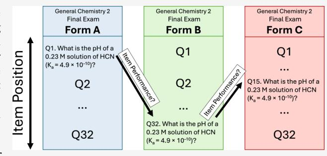
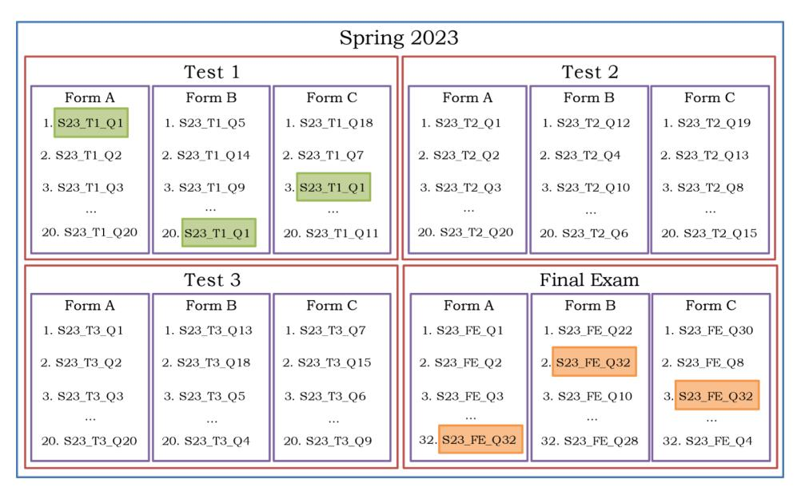
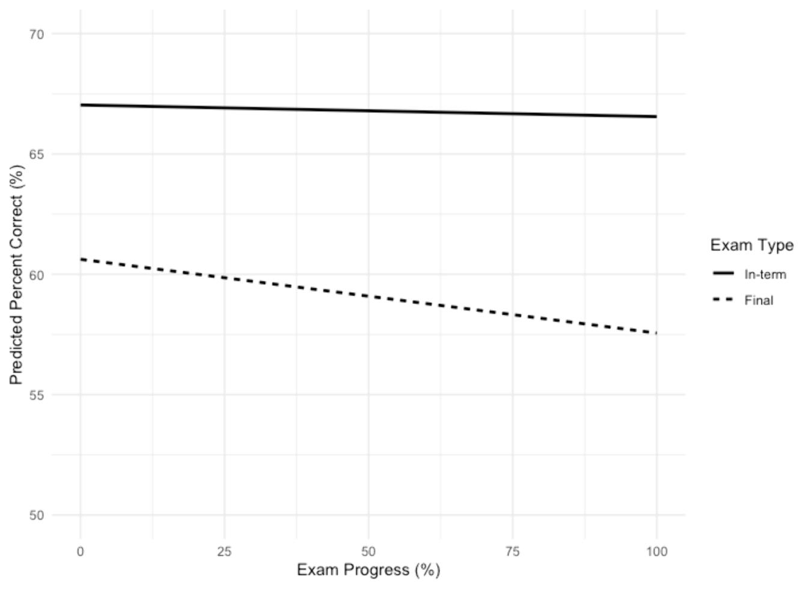
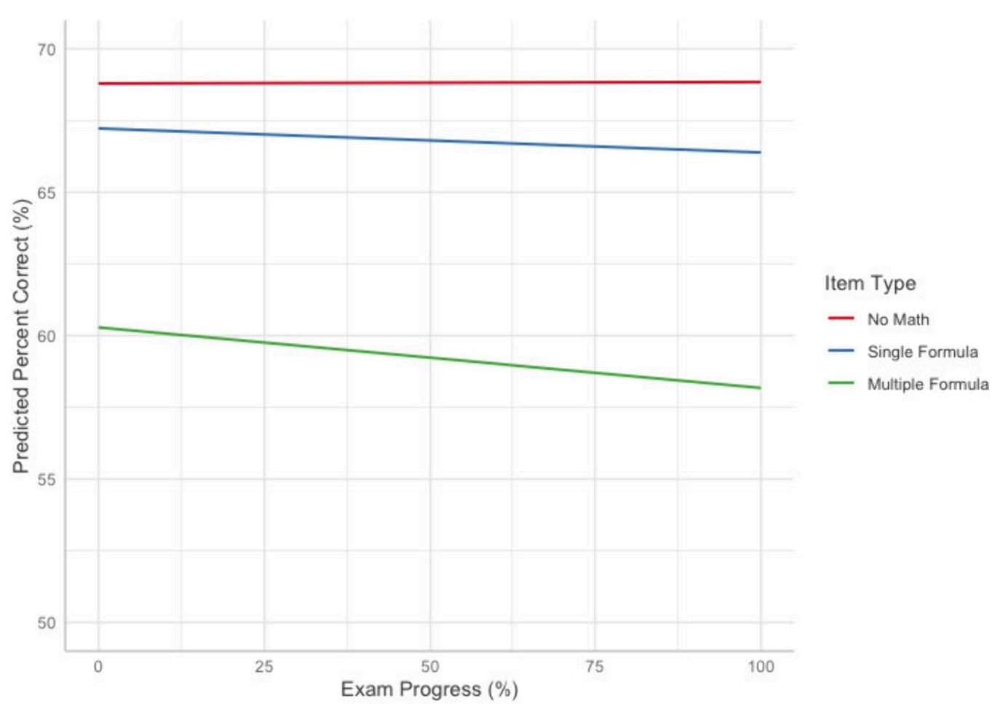
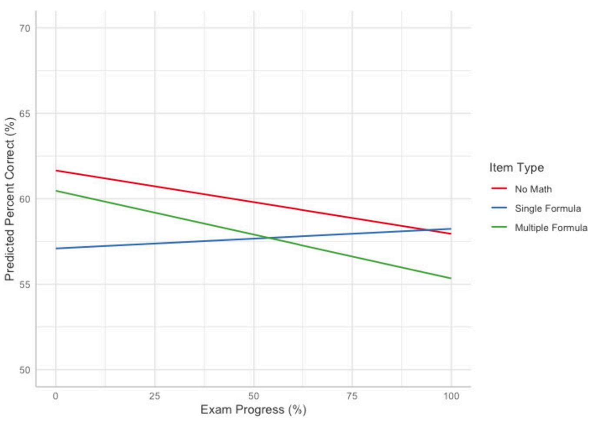

pubs.acs.org/jchemeduc Chemical Education Research

# Item Position Impact on Student Performance in General Chemistry Multiple-Choice Exams

Oscar A. Teran, Pallavi Nayyar, and Scott E. Lewis\*

Cite This: J. Chem. Educ. 2026, 103, 1170-1181

**ACCESS** I

Metrics & More

Article Recommendations

si Supporting Information

ABSTRACT: General chemistry instructors often use multiple exam forms with different item orders to minimize cheating during high-stakes assessments. However, doing so can introduce item order effects that may negatively impact students based on their assigned form. While item order effects have been shown to be prevalent in chemistry examinations, little is known about the effect of item position, meaning where items are placed within an exam, on student performance. This study explored the effect of item position on student performance for multiple-choice exams over 5 semesters of a second-semester general chemistry course. Hierarchical linear modeling was used to determine the effect of

item position on percent correct on two types of exams (in-term and final exams) and for three different types of chemistry exam items, varying by the number of mathematical formulas required to solve them. Results showed a significant effect of item position on performance on the final exams but not on the in-term tests. Additionally, results showed a significant effect of item position on performance for items that require either no or multiple mathematical formulas and not for items that require a single mathematical formula to solve. Given these findings, instructors should consider prioritizing placing single formula type items toward the end of exams and avoid switching different types of items with one another when crafting multiple exam forms.

KEYWORDS: Chemical Education Research, Assessment, Context Effects, General Chemistry

### ■ INTRODUCTION

Assessment in chemistry is fundamental for providing instructors and students information on students' proficiencies with specific learning objectives. As such, chemistry faculty are expected to design and administer fair, valid and reliable assessments. In large lecture courses, such as general chemistry, a common strategy to minimize cheating during high-stakes examinations is to create different exam forms or booklets with the same set of items in different orders. However, this practice has the potential of introducing item order effects that may negatively impact students based on the form they are assigned. Thus, several considerations must be taken when crafting these exam forms, and yet many instructors may rely on general rules-of-thumb that have not been tested empirically. Given that exams are ubiquitous in general chemistry, particular care must be taken to ensure the design and implementation of exams are fair for all students.

Past research on chemistry assessments has focused on internal characteristics, such as content and format of exam items, 3,10 rather than external characteristics, such as the order of items. 11 While research has explored the effects of item order on examinations in chemistry, none have exclusively considered the impact of item position on student performance. That is, empirical investigations have not explored how the placement of items in an exam form influences students' performance on these

items. Research across disciplines has demonstrated that item position is an important consideration when creating exams, with items placed later in exams tending to have decreased student performance. 12,13 Nonetheless, it is inevitable for some items to appear at the end of exams, making it impossible for instructors to avoid this effect altogether. As such, this study aims to further our understanding of the item position effect in general chemistry examinations by considering the extent to which item position influences student performance on two different types of chemistry exams (in-term and final) and for three different types of chemistry items (No Math, Single Formula and Multiple Formula). Doing so will provide instructors with strategies to minimize the unintended consequences of item order when developing assessments and crafting multiple exam forms. This contributes to the effort of supporting chemistry faculty in crafting fair assessments for their students.

Received: October 29, 2025 Revised: February 2, 2026 Accepted: February 3, 2026 Published: February 16, 2026

### ■ LITERATURE REVIEW

### **Item Order Effects**

Item order effects, also known as context or booklet effects, refer to any influence that a test item may acquire as a result of its relationship to the other items making up the test. 14 In other words, item order effects refer to how the external properties of an item, such as where it is placed or which items surround it, influence performance on the item.6,8 Research on item order effects in high-stakes chemistry examinations identified two types of order effects: content priming and preceding item difficulty.7,8,15 Content priming occurs when the content on a previous item is similar to the content on the target item, thus resulting in an increased performance on the target item.8 Preceding item difficulty occurs when the target item follows one or a series of difficult items, causing a decreased performance on the target item.8 Two studies looking at item order effects in general and organic chemistry ACS exams found evidence for both content priming and preceding item difficulty effects.7,8 While this research has established the importance of order effects in chemistry examinations and highlights two important causes, one type of order effect has been neglected in chemistry: the item position effect.

### **Item Position Effect**

The item position effect refers to how changes in the position of an item in an exam influences its performance. That is, how the placing of exam items earlier or later in exams influences students' performance on the items. 16 Past research in other disciplines has identified two kinds of item-position effects: positive effects (i.e., exam items appear easier when placed later in exams), 17 and negative effects (i.e., exam items appear harder when placed later in exams). 12, 13, 16, 18–20 Research on the underlying causes of position effects has adopted either an examinee perspective, considering how test-taker variables such as proficiency or effort relate to position effects, 13, 21–24 or an item perspective, considering how item variables such as item type or cognitive demand relate to position effects. 13, 17–19

Research adopting an examinee perspective often considers factors relating to students' cognitive processes during an exam. For positive position effects, researchers argue that the cause is a practice effect, meaning that items placed later become easier as test-takers become more familiar with them over the course of the exam.17 Conversely, negative position effects are often attributed to fatigue or speededness.19 Fatigue refers to a decrease in performance due to sustained demands on cognitive effort over an extended period of time.25 Various research studies have demonstrated that subjective cognitive fatigue increases with time-on-task during cognitively demanding tasks, such as exams. 25-27 That is, students tend to experience fatigue over the course of longer examinations. A study compared three versions of the SAT, varying in number of items and total testing time, and found subjective cognitive fatigue increased with increasing test length.26 Further, findings showed that performance in the last 50 min of the longest version of the test decreased significantly compared to the penultimate 50 min of the test, suggesting that performance decreased over time.26 Similarly, studies have found students' test-taking effort diminishes considerably over the course of long examinations, resulting in decreased performance on later items. 22,24 On the other hand, speededness in testing refers to an interaction between three factors: the cognitive speed at which the examinee works to answer items, the amount of labor required by the items, and the time limit on the test.28 Put another way,

speededness refers to the extent to which a test's time limit affects examinees' performance and problem solving approaches when under time pressure.29 That is, timed exams may cause students to run out of time, which would disproportionately affect items placed later in exams.30 Given these findings, it is evident that exam length and testing time are important factors to consider when exploring position effects. As such, the present study compares the extent to which item position influences student performance on two types of exams (in-term and final exams) that vary in length and quantity of content covered.

Fewer studies have adopted an item perspective to explore how various item features moderate position effects. 13,17-19 Kingston and Dorans explored the item position effect for different item types on the Graduate Record Examination.17 They found that analytical items (i.e., analysis of explanations and logical reasoning) and verbal items (i.e., analogies, sentence completions and reading comprehension) were more sensitive to position changes than quantitative items (i.e., numerical comparisons, data interpretation and mathematics), and that analytical items were prone to a positive position effect.17 Davis and Ferdous conducted a study using a reading and math standardized state achievement test for elementary school students and found only reading items were influenced by position, but not math items. 18 Similarly, a study by Le found that open-response items exhibited greater changes in difficulty compared with other item types, such as multiple choice, on a reading, science and math standardized exam for high-school students. 19 Recently, a study by Ong and Pastor evaluated the degree to which position effects on college-level, low-stakes social and environmental science assessments were moderated by item length, number of response options, mental taxation and presence of graphics.13 They found that the items exhibited significant negative position effects and that item length, defined as the number of words in the item, was a significant moderator of the effect, with longer items being more prone to negative position effects than shorter items. Findings from these studies highlight the importance of item features in exploring the item position effect. In particular, an item's cognitive demand is a common factor across the studies, with more cognitively demanding items, such as longer items or items that require longer responses, being more susceptible to negative position effects. 13,18,19,31

## Cognitive Demand and Student Performance on Chemistry Exam Items

Several studies have explored the cognitive demand of various types of general chemistry exam items, categorizing them based on features such as students' problem solving approaches, 32,33 level of math required, or item complexity. These studies have demonstrated that students tend to perform differently on chemistry items with varying levels of cognitive demand. In particular, work by Niaz has focused on characterizing chemistry items based on Pascual-Leone's concept of Mdemand,38 which refers to the maximum number of cognitive schemes that must be simultaneously activated at any point in the process of performing a task.39 In other words, M-demand describes the distinct number of cognitive steps that must be taken to successfully solve a problem. Niaz's work has demonstrated that increasing the number of steps required for solving chemistry problems decreases student performance. 36,40 In an experimental study, the number of steps required to solve stoichiometry problems were manipulated by omitting the balanced equation or adding additional factors such as purity,

**Journal of Chemical Education [pubs.acs.org/jchemeduc](pubs.acs.org/jchemeduc?ref=pdf)** Chemical Education Research

Figure 1. Schematic of hypothetical exam administration in Spring 2023. Each semester had 3 in-term tests (20 items) and a cumulative final exam (32 items). Each exam had 3 possible forms with the same items in different orders. Items are labeled with an Item ID consisting of the semester, test, and position in Form A. For example, for Test 1, item 1 in Form A (i.e., S23\_T1\_Q1) appeared in position 20 in Form B and position 3 in Form C (green boxes). For the final exam, item 32 in From A (i.e., S23\_FE\_Q32) appeared in position 2 in Form B and position 3 in Form C (orange boxes). The same structure was followed for the remaining 4 semesters (F23, S24, F24, and S25).

showing that performance decreased with increasing number of steps[.40](#page-11-0) This suggests that even small changes in the amount of information required for problem solving can lead to working memory overload, impacting student performance.[40](#page-11-0) These findings have been reinforced over the years. For example, a study on multiple-choice items in general chemistry found a decrease of 4.5% correct with each additional step required for solving the problem.[41](#page-11-0) Their findings also suggest that adding unique steps required to arrive at the answer, such as requiring students to calculate concentrations rather than providing them, results in a decreased performance. Similarly, the level of math required to solve chemistry problems has been shown to be an important factor in students' performance.[35,42](#page-11-0) A recent study conducted with General Chemistry I students at various community colleges categorized items by level of math required, ranging from items that require no math to more complex algebraic problems, such as those involving logarithms.[35](#page-11-0) Students' performance had a strong and statistically significant dependence on math level, with initial performance being around 76% correct for chemistry items with no math and dropping to around 36% correct for items with the highest math level. That is, student performance on items tends to decrease with increased level of math required[.35](#page-11-0)

From the extant literature, it is expected that both the item position and item type combine to influence the performance on exam items. However, it can be difficult and time-consuming for instructors to discern their exam items based on elaborate categorizations, such as rating items based on cognitive complexity, that oftentimes require extensive rubrics or lengthy procedures to measure[.13](#page-10-0),[37](#page-11-0) Thus, the present work explores how item position influences student performance on three different types of chemistry items that vary by the number of mathematical formulas required to solve them, which can be easily gleaned by instructors.

## ■ **CURRENT STUDY**

While item order effects have been demonstrated on chemistry examinations, no studies have focused specifically on the item position effect. Findings from other disciplines emphasize the potential threat that changes in item position across forms could pose on student performance. Given the common practice in general chemistry courses of creating different exam forms to minimize cheating, it is important to empirically examine the consequences of changes in item position during these examinations. This study aims to determine the effect of item position on student performance by comparing the percent correct of items across three exam forms, consisting of the same items in different orders, over five semesters of a secondsemester general chemistry course. To do so, this study will first compare this effect between in-term and final exams, varying in the total number of items and breadth of content covered. Then, this study aims to determine how different types of exam items, varying by the number of mathematical formulas required to solve them, are affected by changes in the position. Considering these factors can help instructors minimize these unintended effects in their assessments and avoid disadvantaging students based on the test form they receive. This study is guided by the following research questions:

- 1. To what extent does the position of an exam item affect its percent correct for in-term and final exams in a secondsemester general chemistry course?
- 2. To what extent does the position of an exam item affect its percent correct for exam items that require no, one or multiple mathematical formulas to solve in a secondsemester general chemistry course?

## ■ **METHODS**

### **Research Setting**

This study was conducted at a large public research-intensive university in the southeastern United States across 5 semesters (Spring 2023− Spring 2025) of a second-semester general chemistry course. At this

Table 1. Final Item Codebook

| Explanation | Students need to identify the IMFs that each substance will exhibit with water and remember the relative strengths of IMFs. No mathematical formulas are required to solve this problem.                                                      | Students need to identify the correct relationship between half-life and rate constant for a first order reaction (k = ln 2/t1/2) and plug in the value for t1/2 to get k.          | Students need to set up an ICE table for the dissociation of HCN. Then, students need to set up the expression Ka = [H+][CN−]/[HCN] and use it to find [H+] (eq 1). Finally, students need to plug in this value into pH = −log ([H+]) to reach the answer (eq 2). |
|-------------|--------------------------------------------------------------------------------------------------------------------------------------------------------------------------------------------------------------------------------------------------|----------------------------------------------------------------------------------------------------------------------------------------------------------------------------------------|--------------------------------------------------------------------------------------------------------------------------------------------------------------------------------------------------------------------------------------------------------------------------|
| Examplea    | Which of the following substances will exhibit the strongest inter molecular forces with water? 2 (B) CH NH H8 18 3 (D) KCl H2S (E) Xe (A) C (C)                                                                | The half-life for a first order reaction What is the rate (C) 2.6 × 10−4 s−1 (D) 3.9 × 103 s−1 (E) 1.9 × 103 s−1 (A) 0.015 s−1 (B) 65 s−1 constant? is 2700 s. | M solution of HCN (Ka = 4.9 × 10−10)? What is the pH of a 0.23 (E) 10.95 (C) 4.97 (D) 5.47 (A) 1.64 (B) 3.05                                                                                                                                        |
| Definition  | Item requires recall or application of a topic without using equations to solve for any variable. Includes items that require setting up equations without performing calculations with the equation (e.g., finding the expression for K). | Item directly requires setting up and/or using one unique equation or formula to arrive at the answer, regardless of the number of steps.                                           | Item directly requires setting up and/or using more than one unique equation or formula to arrive at the answer, regardless of the number of steps.                                                                                                                   |
| Code        | (n = 257) Math No                                                                                                                                                                                                                          | Single For (n = 95) mula                                                                                                                                                         | Formula (n = 72) Multiple                                                                                                                                                                                                                                          |

*a*Correct answer is bolded.

institution, multiple classes of second-semester general chemistry are offered each semester. Each class is taught by a single instructor, but classes are coordinated among the instructors with a common textbook, learning objectives, syllabus, and grading scheme. The course focuses on principles and applications of chemistry, covering topics such as solutions, kinetics, equilibria, aqueous chemistry, chemical thermodynamics, electrochemistry, and nuclear chemistry. Grading consists of three in-term tests (each worth 15% of the course grade), a cumulative final exam (25% of course grade), weekly homework assignments (10% of course grade), and varied assignments based on instructor discretion, such as clicker questions, weekly quizzes, or textbook reading activities (20% of course grade).

### **Exam Administration**

Exams were common across classes each semester but differed from semester to semester. In-term tests and final exams consisted of multiple-choice items with five answer choices (labeled A to E). Each item had only one correct answer and was graded dichotomously (i.e., correct or incorrect). These exam items were developed collectively by the team of instructors each semester based on a list of learning objectives. In-term tests consisted of 20 multiple-choice items, and students had 65 min to complete the exam. Final exams consisted of 32 multiple-choice items, and students had 110 min to complete the exam. The content covered in each exam remained largely consistent over the 5 semesters of interest, albeit with minor changes due to scheduling. Test 1 covered intermolecular forces, solutions, and kinetics; test 2 covered fundamentals of equilibrium and introduction to acids and bases; and test 3 covered acid−base equilibria and thermodynamics. The final exam was cumulative, covering content from the entire term as well as electrochemistry and nuclear chemistry, which were covered after test 3.

All exams were administered in person and proctored by graduate teaching assistants and course instructors. For every exam, students received one of three possible forms (labeled A, B, or C), consisting of the same set of items placed in an arbitrarily different order by the course teaching assistant ([Figure](#page-2-0) 1). In each form, items were randomly ordered; there were no forms that had an item order matching the order of content presentation. Once students were seated in the testing room, exam forms were distributed randomly, only ensuring that no two students sitting adjacent had the same form. As such, students received one of three forms in a random fashion. For instance, a student could receive form A for test 1, form C for test 2, form C again for test 3 and form B for the final exam. To assist with form distribution, each form was printed on different colored paper. Students bubbled in the form they received and their answer choices on their exam scantron to ensure proper grading. During exams, students were provided with a cover sheet containing testing instructions, a periodic table of elements, and an equation sheet consistent with the content of the exam. The equations provided to the students for each exam can be found in the Supporting [Information](https://pubs.acs.org/doi/suppl/10.1021/acs.jchemed.5c01572/suppl_file/ed5c01572_si_001.pdf).

[Figure](#page-2-0) 1 shows a schematic of a hypothetical exam administration in Spring 2023. Each exam over the semester had 3 possible forms with the same items in different orders. For example, for Test 1, item 1 in Form A (labeled S23\_T1\_Q1, green) appears as item 20 in Form B and as item 3 in Form C. A similar pattern is depicted in the final exam (in orange). That is, the same item appears once in all three forms for every exam. The same structure was followed for the 5 semesters of interest.

### **Data Compilation**

The institutional review board at the research setting approved the data collection procedures for this study (S23, S24, F24, S25: IRB Study #002811; F23: IRB Study #002374). Consent from students to access their exam data was collected for each semester. No unexpected or unusually high safety hazards were encountered by the participants or in the data collection. Consented sample sizes ranged from 583 to 885 students in the on-sequence (Spring) semesters and from 309 to 392 students in the off-sequence (Fall) semesters. As will be shown, the data analysis will use the percent correct for each test item from each test form as the unit of observation. The differing sample sizes for each semester are not expected to impact the results as percent correct is not influenced by sample size. Data were compiled for every exam from course records, consisting of students' answers to every item (i.e., whether the item was answered correctly or incorrectly) and the exam form they received. Due to a hurricane in the Fall of 2024, each class instructor administered their own final exam in this semester, and as such, data from this exam were omitted for the current study. This resulted in data from 19 exams across the 5 semesters. Further information on each exam, such as specific sample sizes and descriptive statistics (e.g., averages and standard deviations), can be found in the Supporting [Information](https://pubs.acs.org/doi/suppl/10.1021/acs.jchemed.5c01572/suppl_file/ed5c01572_si_001.pdf).

### **Item Analysis**

Over the 19 exams, a total of 424 unique exam items were identified (300 on the in-term tests and 124 on the final exams), after accounting for items with missing data (2 items with errors for which all students received credit post exam administration) and removing items testing content outside of the learning objectives (2 items related to possible careers in chemistry). There were no exam items repeated across the semesters. To explore the effect of position on performance, each item in each form was described as follows.

**Item Position.** To measure the item position, a value of exam progress was calculated for every item in each form, representing the position of the item in the overall exam in terms of the percent of the exam that had progressed. Rather than relying on the absolute position, an exam progress measure allows for comparison between in-term tests with 20 items and final exams with 32 items. For instance, an item placed first in an in-term test (i.e., 1 out of 20) represents 5% of the total exam progress, an item placed 10th represents 50% and an item placed 20th represents 100%. Similarly, an item placed first in a final exam (i.e., 1 out of 32) represents 3.125% of the total exam, an item placed 10th represents 31.25% and an item placed 20th represents 62.5%.

**Item Performance.** As a measure of performance, the average percent correct was calculated for every item in each of the three forms (i.e., the number of students who answered the item correctly divided by the total number of students who received the form).[43](#page-11-0) In other words, performance was measured as the proportion of students who received a particular form that answered the item in the said form correctly. For instance, if for a particular exam 100 students received form A, of which 50 answered item 1 correctly, the percent correct for the item would be 50%. On the other hand, if 100 students received form B, of which 60 answered the same item correctly, the percent correct for the item would be 60%. Item analysis resulted in 1,272 data points (424 unique items appearing once in each of the three forms) with a unique exam progress value and average percent correct.

**Item Type.** To discern the impact of item position for various types of general chemistry exam items, a coding scheme was developed to characterize exam items based on the number of mathematical formulas required to solve the item. The number of formulas needed to solve the problem were used instead of the number of mathematical steps as the number of steps can vary widely among students solving the same problem. The coding process was conducted collaboratively by the first and second authors. Initially, each author independently reviewed a sample of exam items to generate preliminary codebooks, which were then compared and discussed to develop a common codebook. The final codebook consisted of three codes: No Math, Single Formula, or Multiple Formula. No Math items are those that do not require any mathematical calculation, Single Formula items are those that require only one unique mathematical formula to reach the answer, and Multiple Formula items are those that require students to setup and/or use more than one unique mathematical formula to reach the answer. For this purpose, a unique formula consisted of one provided to the students on the exam cover sheet (see Supporting [Information\)](https://pubs.acs.org/doi/suppl/10.1021/acs.jchemed.5c01572/suppl_file/ed5c01572_si_001.pdf) or one setup by students to describe a single relationship, such as an equilibrium constant expression or a concentration expression (e.g., M = mol/L). [Table](#page-3-0) 1 shows the final codebook, including the definition and an example item coded under each code with a brief explanation. Additionally, a more extensive list of items coded as single-formula and multiple-formula is included in the Supporting [Information.](https://pubs.acs.org/doi/suppl/10.1021/acs.jchemed.5c01572/suppl_file/ed5c01572_si_001.pdf)

Consensus coding by both authors was applied to the entire data set of items. That is, any discrepancies in coding were discussed and finalized until full agreement was reached; 257 items were coded as No Math, 95 items were coded as Single Formula, and 72 items were coded as Multiple Formula. To check the consistency of the types of items being coded in each code and support the trustworthiness of the coding process, two general chemistry instructors at the research setting coded a random subset of approximately 10% of the items. These instructors contributed to the writing of some of the items, but were unaffiliated with the research project. The percent agreement between the researchers' coding and each instructor's independent coding was 86% and 90%, with corresponding Cohen's Kappa values of 0.75 and 0.83 respectively. These values indicate a strong level of agreement with the instructors, suggesting that the identified codes are clear and distinct enough to discern between types of exam items. The service of the suggestion of the control of the service of the suggestion of the codes are clear and distinct enough to discern between types of exam items.

### **Data Analysis**

To investigate the effect of item position on item performance, mixedeffect linear regression analyses were conducted. Mixed effects models are a type of hierarchical linear modeling (HLM) that include both fixed and random effects, to account for nested data structures in which data points are not independent.46 In this case, given that the same exam item appears three times (once per form in a different position), all observations are not independent of one another. A fixed slope, random intercept approach was chosen, allowing each item group (i.e., the three observations of a unique item) to have a different intercept, which represents the predicted percent correct of the item at an exam progress value of 0, but the same slope, which represents the change in percent correct for every one-unit change in exam progress. This allows the model to isolate the impact of item position (i.e., the fixed effect) on percent correct while accounting for the inherent differences in difficulty for each item (i.e., the random effects). The model determines the impact of position on performance for each item across the three observations, thus controlling for the fact that certain items are inherently easier or harder than others. This analysis is akin to a repeated-measures design, but instead of multiple observations over time, the multiple observations correspond to the same item in a different position across the three forms. 46 Analysis was conducted with R (version 4.4.1)47 and RStudio (version 2025.05.1 + 513)48 using the *lmer* function from the *lme4* package.49 Further details on the analysis approach can be found in the Supporting Information.

### RESULTS

## RQ1: To What Extent Does the Position of an Exam Item Affect Its Percent Correct for in-Term and Final Exams in a Second-Semester General Chemistry Course?

To determine the effect of exam progress on percent correct for in-term and final exams, a model was tested with two independent variables: exam progress and a binary categorical variable indicating the type of exam (in-term or final), and one dependent variable: percent correct. Table 2 shows the model

Table 2. Linear Mixed-Effects Model Output of Percent Correct by Exam Progress and Exam Type

| Fixed Effects                               | Estimate | Std. Error | <i>t</i> -value | p-value |
|---------------------------------------------|----------|---------------|-----------------|---------|
| Intercept (Final Exam)                      | 60.623   | 1.54          | 39.332          | < 0.001 |
| Exam Progress (Final Exam)                  | -0.0307  | 0.007         | -4.464          | < 0.001 |
| Intercept In-term (Change in intercept)     | 6.411    | 1.832         | 3.499           | <0.001  |
| Exam Progress $x$ In-term (Change in slope) | 0.0258   | 0.008         | 3.181           | 0.002   |

output with Final Exam as the reference level for the exam type variable. Model outputs for all reference levels can be found in the Supporting Information. First, results indicate that there is a significant interaction effect between exam progress and the type of exam ( $\Delta b = 0.0258$ , p = 0.002), meaning that there is evidence that the effect of exam progress on percent correct is different for

in-term and final exams. Exam progress is not a significant predictor of percent correct (b = -0.0048, p = 0.263) for in-term tests. This means that for in-term tests there is not sufficient evidence to conclude that the position of an item impacts the percent correct. However, exam progress is a significant negative predictor (b = -0.0307, p < 0.001) of percent correct in the final exams. The regression estimates show that moving from one item position to the next possible item position results in a reduction of 0.096% in student performance on the item. That means that if an item is in the first position in form A and the last position in form B (i.e., a 31-position increase), the percent correct of the item would drop by approximately 2.97% from form A to form B. These results indicate that item performance on in-term tests may be stable across exam progress, while percent correct significantly declines across exam progress in the final exams (Figure 2).

# RQ2: To What Extent Does the Position of an Exam Item Affect Its Percent Correct for Exam Items That Require No, One, or Multiple Mathematical Formulas to Solve in a Second-Semester General Chemistry Course?

To determine the effect of exam progress on percent correct for three different types of chemistry exam items, a second model was tested with exam progress and two dummy-coded categorical variables to model the three types of items (i.e., No Math, Single Formula, and Multiple Formula) as independent variables and percent correct as the dependent variable. Given the results from RQ1, suggesting that item position impacts performance differently for in-term and final exams, the model was tested separately for in-term and final exams to discern the impact of the position and item type on performance for each exam type.

**In-Term Tests.** The model was first tested with only in-term test items (N = 900 items). Despite the results from RQ1 demonstrating no evidence of the impact of position on item performance for in-term tests, this model is able to discern between the three types of items, which could be canceling out the overall effect of item position. That is, the three types of items could still be affected differently by the item position on the in-term tests. Table 3 shows the model output with Single Formula as the reference level for the item type variable. Exam progress was not a significant predictor of percent correct for any type of item (No Math: b = 0.0005, p = 0.924; Single Formula: b = -0.008, p = 0.368, Multiple Formula: b = -0.00, p = 0.063). This result suggests that student performance on all three types of items remains stable across exam progress in the in-term tests (Figure 3)

Final Exams. The model was then tested with only final exam items (N = 372 items). Table 4 shows the model output with Single Formula as the reference level for the item type variable. Results indicate that the effect of exam progress varied by item type in the final exams. Exam progress is not a significant predictor of percent correct for Single Formula items (b =0.0115, p = 0.441) despite a small positive increase in percent correct across exam progress. This means that there is not sufficient evidence to conclude that item position impacts percent correct for Single Formula items. However, there is a significant difference in the effect of exam progress on percent correct for both No Math ( $\Delta b = -0.0485$ , p = 0.004) and Multiple Formula ( $\Delta b = -0.0628$ , p = 0.003) items when each is compared to Single Formula items. Exam progress is a significant negative predictor (b = -0.0371, p < 0.001) of percent correct for No Math items. The regression estimates show that moving a

Figure 2. Predicted percent correct with exam progress by exam type

Table 3. Linear Mixed-Effects Model Output of Percent Correct by Exam Progress and Item Type for In-Term Tests

| Fixed Effects                                         | Estimate | Std. Error | t-Value | p-Value |
|-------------------------------------------------------|----------|---------------|---------|---------|
| Intercept (Single Formula)                            | 67.226   | 1.93          | 34.754  | <0.001  |
| Exam Progress (Single Formula)                        | −0.008   | 0.01          | −0.901  | 0.368   |
| No Math (Change in intercept)                         | 1.568    | 2.28          | 0.686   | 0.493   |
| Multiple Formula (Change in intercept)             | −6.939   | 3.06          | −2.265  | 0.024   |
| Exam Progress * No Math (Change in slope)          | 0.008    | 0.01          | 0.821   | 0.412   |
| Exam Progress * Multiple Formula (Change in slope) | −0.013   | 0.01          | −0.868  | 0.386   |

No Math item from one item position to the next possible item position in a final exam results in a reduction of 0.12% in percent correct. Thus, if a No Math item is in the first position in form A and in the last position in form B, the percent correct of the item would drop by approximately 3.58% from form A to form B. Similarly, exam progress was also a significant negative predictor (*b* = −0.0513, *p* < 0.001) of percent correct for Multiple Formula items. The regression estimates show that moving a Multiple Formula item from one item position to the next possible item position in a final exam results in a reduction of 0.16% in percent correct. Thus, if an item is in the first position in form A and the last position in form B, the percent correct of the Multiple Formula item would drop by approximately 4.97% from form A to form B. These results indicate that performance on Single Formula items is uniquely stable across exam progress, while percent correct significantly declines across exam progress for No Math and Multiple Formula items ([Figure](#page-8-0) 4).

## ■ **DISCUSSION**

The purpose of this study was to examine the effect of item position on student performance in second-semester general chemistry multiple-choice examinations. First, this study compared the effect of position on performance between interm and final exams, which differed in the total number of items and breadth of content covered. Results showed that exam progress was a significant negative predictor of percent correct on the final exams but not on the in-term tests. This suggeststhat performance is particularly sensitive to position on the final exams, with items placed later having a decreased performance. This finding aligns with previous research showing that performance tends to decrease over the course of exams, and that this effect may be more prominent in longer examinations.[22](#page-10-0),[24,26](#page-10-0) Studies have demonstrated that cognitive fatigue tends to increase with increasing exam length and that students tend to lose motivation throughout the course of lengthy exams.[24,26](#page-10-0) It is plausible that both the increased number of items and the cumulative nature of the final exams contribute to students' decrease in performance on later items, which is not the case for shorter examinations like the in-term tests. Since students have to solve more items and are being tested on content from the entire semester, they may be more susceptible

Figure 3. Predicted percent correct with exam progress by item type for in-term tests.

Table 4. Linear Mixed-Effects Model Output of Percent Correct by Exam Progress and Item Type for Final Exams

| Fixed Effects                                         | Estimate | Std. Error | t-value | p-value |
|-------------------------------------------------------|----------|---------------|---------|---------|
| Intercept (Single Formula)                            | 57.094   | 3.84          | 14.856  | <0.001  |
| Exam Progress (Single Formula)                        | 0.0115   | 0.01          | 0.772   | 0.441   |
| No Math (Change in Intercept)                         | 4.560    | 4.37          | 1.043   | 0.299   |
| Multiple Formula (Change in Intercept)             | 3.375    | 5.38          | 0.628   | 0.531   |
| Exam Progress * No Math (Change in Slope)          | −0.0485  | 0.02          | −2.879  | 0.004   |
| Exam Progress * Multiple Formula (Change in Slope) | −0.0628  | 0.02          | −2.968  | 0.003   |

to experiencing fatigue and diminishing effort over the course of final exams, resulting in a negative impact of item position. Thus, this study provides evidence that position influences performance differently, depending on the length of the exam and scope of content being tested. Therefore, particular care should be taken when changing the order of items to create multiple exam forms for assessments like final exams as items placed later in these exams will appear more difficult to students than the same items placed earlier.

This study also sought to compare the effect of position on performance among three types of general chemistry exam items categorized based on the number of mathematical formulas required to solve them, with this being an item feature that can be easily identified by instructors when developing exams. Given the initial finding that item position influences performance differently on in-term and final exams, this analysis was conducted separately for each exam type. While exam progress was not a significant predictor of percent correct on the in-term tests, it was possible that this effect was being offset by different types of items being affected differently by position. However, results showed that exam progress was still not a significant predictor of performance for any type of item on the in-term tests. On the other hand, results showed that the effect of position on student performance was not the same across the three item types on the final exams. Thus, it is probable that the shorter length of the in-term tests outweighs any potential differences in effect for various item types.

When considering the final exams, results showed that No Math and Multiple Formula items were each significantly impacted by position, meaning that performance on these items decreased over the course of the final exam but not Single Formula items. This finding extends prior research demonstrating that position effects are not uniform across item types, but instead impact items differently based on their features[.13](#page-10-0),[31](#page-10-0) The stability of Single Formula items over the course of final exams may be due to mathematical automaticity, which refers to the ability of students to deliver a correct answer to mathematics problems computationally as a procedural task with less conscious thought.[50](#page-11-0) That is, single-formula-type items often draw on the automatic retrieval of a formula and a routine calculation to reach the answer. Thus, these types of items are less cognitively demanding and, as such, are less susceptible to

Figure 4. Predicted percent correct with exam progress by item type for final exams.

fatigue and reductions in effort over the course of the exam, making their performance more robust to changes in position.[51,52](#page-11-0) Students are able to solve these items correctly regardless of other factors, such as cognitive fatigue or time pressure, which increase as items are placed in later positions on longer exams. While some research has argued for the deemphasis of these types of items during chemistry examinations[,34](#page-11-0) others highlight the importance of these types of mathematical computational skillsin chemistry, as they are likely to continuously reappear in students' future courses and subsequent careers[.42,53](#page-11-0),[54](#page-11-0) These findings provide one advantage for the inclusion of these items in general chemistry examinations, in that they act as buffers in the creation of multiple exam forms. That is, Single Formula items can be disproportionately placed among the later items when creating multiple forms rather than other types of items, such as Multiple Formula items. While this work lays the foundation for these claims, future research is needed to substantiate them.

In contrast to Single Formula items, both No Math and Multiple Formula items tend to be more cognitively demanding, which makes them more susceptible to error when placed toward the end of examinations.[13](#page-10-0),[31](#page-10-0),[55](#page-11-0) No Math items require students to apply the underlying principles of chemistry by making comparisons, visualizing mental models and interpreting graphical representations.[56](#page-11-0) In addition, these items may be less familiar to students, meaning that they cannot rely on a memorized set of procedures to arrive at the correct answer. Therefore, as students begin to experience cognitive fatigue and time pressure over the course of an exam, No Math items placed later during exams will result in lower performance. Similarly, Multiple Formula items require students to activate multiple cognitive schemessimultaneously, as students have to establish a problem-solving procedure, coordinate multiple equations and manage intermediate results, processes that are particularly sensitive to declinesin test-taking effort and attention.[57](#page-11-0) Further, while some students can still benefit from mathematical automaticity when solving Multiple Formula problems, these types of items often take longer for students to solve, which disproportionally affects their performance as time pressure increases when they are placed toward the end of examinations.[30](#page-10-0) Thus, these types of items will also be more susceptible to decreasing performance when placed later in exams as students are increasingly exposed to fatigue and time constraints.

## ■ **IMPLICATIONS FOR INSTRUCTION**

These findings highlight the importance of considering the impact of item position on student performance when developing multiple exam forms in general chemistry, particularly for longer summative assessments such as final exams. Based on the findings, we recommend to instructors the following strategies to minimize such impacts when crafting these forms. First, instructors should avoid placing items that require multiple mathematical formulas to solve toward the end of their exams, given that performance tends to decrease the most with increasing position for these items. Instead, instructors should try to prioritize placing Multiple Formula items toward the beginning of exams and leave the later spots for mathematical items that require only a single formula to solve, as Single Formula items appear to be uniquely stable with position. Second, when crafting different exam forms, instructors should be mindful of keeping similar items in the same positions across the forms. For instance, instructors should avoid switching Multiple Formula items with Single Formula items, as this is likely to generate unbalanced forms that may disadvantage a group of students based on their arbitrarily assigned form. A strategy to do this could be to identify the same type of items and switch those from one form to another. For example, if two Multiple Formula items are placed in positions 2 and 27, and two Single Formula items are in positions 3 and 10, switching items 2 and 27, and 3 and 10 respectively, rather than switching items 2 and 10 or items 3 and 27. Doing so could be a simple and efficient way to help minimize the item position effect across exam forms during high-stakes examinations.

■ **IMPLICATIONS FOR RESEARCH** The findings of the study distinguish the effect of item position on performance between three different types of secondsemester general chemistry exam items, categorized based on the number of mathematical formulas required to solve them. While this study hypothesizes some potential causes based on previous work, future research is needed to understand the mechanism behind why No Math and Multiple Formula items tend to be particularly sensitive to position but not Single Formula items. Further, while previous studies on standardized exams have explored other order effects in chemistry, such as content priming and previous item difficulty,[7,8](#page-10-0) this study establishes item position as another important order effect to consider in the development of these exams. As demonstrated, this is particularly important in longer exams, such as those developed and administered by the ACS Exams Institute for various disciplines of chemistry, which commonly range between 50 and 70 items over 110 min.[58,59](#page-11-0) Thus, future research should take the item position effect into consideration when developing standardized exams to ensure items that are particularly sensitive to position can be properly addressed. Similarly, future research should explore the item position effect for other item features and other chemistry courses; the methodology presented in this study offers a possible path for conducting such studies. For example, organic chemistry, which often has large class sizes and a need for different exam forms, has items known to be unique in their difficulty and format[,60](#page-11-0) making it necessary to explore how the position of exam items may affect student performance. Identifying organic chemistry item features and establishing differences in how organic chemistry item types are affected by position could shed light on how to best handle item position when crafting exam formsin these courses.

## ■ **LIMITATIONS**

This study was conducted with data from a single institution, meaning that the results may not be generalizable acrosssettings. In addition, this study specifically focused on multiple choice exams in a second-semester general chemistry course, and as such, the specific results presented may not be broadly transferable to other domains. As an observational study, the findings rely on trends that occur across the data rather than on an experimental design testing the direct effect of position on performance. Future work following an experimental design may be needed to corroborate and strengthen this study's claims.

The study design explored patterns in item performance across hundreds of items, where each item was taken by a minimum of approximately one hundred students. The reliance on a large cohort of data and the analysis choices make the impact of confounding variables unlikely but still possible. One potential confounding variable is that students who were better prepared for the test may disproportionately receive one of the three test forms. Differences in overall performance between forms would not directly influence the effect observed based on item position. For instance, ifstudentsreceiving one form scored higher overall, their performance on items at the start and end of the test would be expected to improve comparably. Additionally, since at least a hundred students took each form, random differences in overall performance for each form are less likely. Also since tests were collected across multiple semesters, random differences within a single test would have a lower impact on the results because data was combined from multiple semesters. Another potential confounding variable is that items may be affected by context effects such as preceding item difficulty, and these context effects may disproportionately appear with a particular item type. Since the test items were randomly ordered and the patterns presented arise from at least 72 items per item type, the chance for context effects disproportionately impacting one item type is also considered less likely. Third, it is possible that students may have taken the test in an order different from the given order. While it is not possible to quantify the extent this occurred, the results presented suggest that the given order does influence student performance on particular item types. Likely explanations are either that relatively few students take the test out of order or that the given order influences student performance, even among those who take the test out of order.

## ■ **CONCLUSION**

Given the common practice in general chemistry courses of creating multiple exam forms with the same items but in different orders, it is important to consider how item order influences student performance. This study specifically establishes the position of items, meaning whether items appear early or late in the test, as an important consideration when developing assessments in general chemistry. In longer and more comprehensive examinations, such as final exams, student performance on items decreases as they appear later in the exam. Further, items that require multiple mathematical formulas to solve are the most sensitive to this effect, while items that require a single mathematical formula to solve appear to be unaffected. These findings can provide instructors and researchers with strategies to minimize the unintended consequences of item order by considering the number of mathematical formulas required to solve items in crafting multiple exam forms. Due to the fundamental and ubiquitous nature of examinations in general chemistry and beyond, research and instruction should continue to focus on ensuring fair assessment practices.

## ■ **ASSOCIATED CONTENT**

### \***sı Supporting Information**

The Supporting Information is available at [https://pubs.ac](https://pubs.acs.org/doi/10.1021/acs.jchemed.5c01572?goto=supporting-info)[s.org/doi/10.1021/acs.jchemed.5c01572.](https://pubs.acs.org/doi/10.1021/acs.jchemed.5c01572?goto=supporting-info)

Equations provided to students, descriptive statistics by exam, expanded code list and data analysis, model output with different referents [\(PDF](https://pubs.acs.org/doi/suppl/10.1021/acs.jchemed.5c01572/suppl_file/ed5c01572_si_001.pdf), [DOCX](https://pubs.acs.org/doi/suppl/10.1021/acs.jchemed.5c01572/suppl_file/ed5c01572_si_002.docx))

## ■ **AUTHOR INFORMATION**

### **Corresponding Author**

Scott E. Lewis − *Department of Chemistry, University of South Florida, Tampa, Florida 33620, United States;* [orcid.org/](https://orcid.org/0000-0002-6899-9450) [0000-0002-6899-9450](https://orcid.org/0000-0002-6899-9450); Email: [slewis@usf.edu](mailto:slewis@usf.edu)

### **Authors**

Oscar A. Teran − *Department of Chemistry, University of South Florida, Tampa, Florida 33620, United States*

Pallavi Nayyar − *Department of Chemistry, University of South Florida, Tampa, Florida 33620, United States*

Complete contact information is available at: [https://pubs.acs.org/10.1021/acs.jchemed.5c01572](https://pubs.acs.org/doi/10.1021/acs.jchemed.5c01572?ref=pdf)

### **Notes**

Researcher S.E.L. receives funding from the Royal Society of Chemistry. The Royal Society of Chemistry did not play a role in the data collection, data analysis or presentation of the research results.

The authors declare no competing financial interest.

■ **ACKNOWLEDGMENTS** The researchers would like to acknowledge Caroline Crowder for her support in data compilation, and the students and instructors at the research setting for their efforts and their permission to conduct the research.

## ■ **REFERENCES**

- (1) Bretz, S. L. Navigating the Landscape of [Assessment.](https://doi.org/10.1021/ed3001045?urlappend=%3Fref%3DPDF&jav=VoR&rel=cite-as) *J. Chem. Educ.* 2012, *89* (6), 689−691.
- (2) Towns, M. H. Guide To Developing [High-Quality,](https://doi.org/10.1021/ed500076x?urlappend=%3Fref%3DPDF&jav=VoR&rel=cite-as) Reliable, and Valid [Multiple-Choice](https://doi.org/10.1021/ed500076x?urlappend=%3Fref%3DPDF&jav=VoR&rel=cite-as) Assessments. *J. Chem. Educ.* 2014, *91* (9), 1426−1431.
- (3) Tellinghuisen, J.; Sulikowski, M. M. Does the [Answer](https://doi.org/10.1021/ed085p572?urlappend=%3Fref%3DPDF&jav=VoR&rel=cite-as) Order Matter on [Multiple-Choice](https://doi.org/10.1021/ed085p572?urlappend=%3Fref%3DPDF&jav=VoR&rel=cite-as) Exams? *J. Chem. Educ.* 2008, *85* (4), 572.
- (4) Campbell, M. L. [Multiple-Choice](https://doi.org/10.1021/ed500465q?urlappend=%3Fref%3DPDF&jav=VoR&rel=cite-as) Exams and Guessing: Results from a One-Year Study of General [Chemistry](https://doi.org/10.1021/ed500465q?urlappend=%3Fref%3DPDF&jav=VoR&rel=cite-as) Tests Designed To [Discourage](https://doi.org/10.1021/ed500465q?urlappend=%3Fref%3DPDF&jav=VoR&rel=cite-as) Guessing. *J. Chem. Educ.* 2015, *92* (7), 1194−1200.
- (5) Beerepoot, M. T. P. Formative and [Summative](https://doi.org/10.1021/acs.jchemed.3c00120?urlappend=%3Fref%3DPDF&jav=VoR&rel=cite-as) Automated Assessment with [Multiple-Choice](https://doi.org/10.1021/acs.jchemed.3c00120?urlappend=%3Fref%3DPDF&jav=VoR&rel=cite-as) Question Banks. *J. Chem. Educ.* 2023, *100* (8), 2947−2955.
- (6) Whitely, S. E.; Dawis, R. V. The Influence of [TestContext](https://doi.org/10.1177/001316447603600211) On Item [Difficulty.](https://doi.org/10.1177/001316447603600211) *Educ. Psychol. Meas.* 1976, *36* (2), 329−337.
- (7) Schroeder, J.; Murphy, K. L.; Holme, T. A. [Investigating](https://doi.org/10.1021/ed101175f?urlappend=%3Fref%3DPDF&jav=VoR&rel=cite-as) Factors That Influence Item [Performance](https://doi.org/10.1021/ed101175f?urlappend=%3Fref%3DPDF&jav=VoR&rel=cite-as) on ACS Exams. *J. Chem. Educ.* 2012, *89* (3), 346−350.
- (8) Michels, O.; Schreurs, D. G.; Nedungadi, S.; Pentecost, T. C.; Kreke, P. J.; Raker, J. R.; Murphy, K. L. [Identification](https://doi.org/10.1021/acs.jchemed.4c00921?urlappend=%3Fref%3DPDF&jav=VoR&rel=cite-as) and Analysis of Item Environment Effects on Organic Chemistry [Multiple-Choice](https://doi.org/10.1021/acs.jchemed.4c00921?urlappend=%3Fref%3DPDF&jav=VoR&rel=cite-as) [Exams.](https://doi.org/10.1021/acs.jchemed.4c00921?urlappend=%3Fref%3DPDF&jav=VoR&rel=cite-as) *J. Chem. Educ.* 2025, *102*, 43.
- (9) Frey, B. B.; Petersen, S.; Edwards, L. M.; Pedrotti, J. T.; Peyton, V. [Item-Writing](https://doi.org/10.1016/j.tate.2005.01.008) Rules: Collective Wisdom. *Teach. Teach. Educ.* 2005, *21* (4), 357−364.
- (10) Breakall, J.; Randles, C.; Tasker, R. [Development](https://doi.org/10.1039/C8RP00262B) and Use of a [Multiple-Choice](https://doi.org/10.1039/C8RP00262B) Item Writing Flaws Evaluation Instrument in the Context of General [Chemistry.](https://doi.org/10.1039/C8RP00262B) *Chem. Educ. Res. Pract.* 2019, *20* (2), 369−382.
- (11) Undersander, M. A.; Lund, T. J.; Langdon, L. S.; Stains, M. Probing the Question Order Effect While [Developing](https://doi.org/10.1039/C5RP00228A) a Chemistry Concept [Inventory.](https://doi.org/10.1039/C5RP00228A) *Chem. Educ. Res. Pract.* 2017, *18* (1), 45−54.

- (12) Meyers, J. L.; Miller, G. E.; Way, W. D. Item [Position](https://doi.org/10.1080/08957340802558342) and Item Difficulty Change in an [IRT-Based](https://doi.org/10.1080/08957340802558342) Common Item Equating Design. *Appl. Meas. Educ.* 2008, *22* (1), 38−60.
- (13) Ong, T. Q.; Pastor, D. A. [Uncovering](https://doi.org/10.1177/01466216221108134) the Complexity of Item Position Effects in a [Low-Stakes](https://doi.org/10.1177/01466216221108134) Testing Context. *Appl. Psychol. Meas.* 2022, *46* (7), 571−588.
- (14) Wainer, H.; Kiely, G. L. Item Clusters and [Computerized](https://doi.org/10.1111/j.1745-3984.1987.tb00274.x) [Adaptive](https://doi.org/10.1111/j.1745-3984.1987.tb00274.x) Testing: A Case for Testlets. *J. Educ. Meas.* 1987, *24* (3), 185− 201.
- (15) Pentecost, T. C.; Raker, J. R.; Murphy, K. L. [Application](https://doi.org/10.7275/pare.1256) of Two-Parameter Item Response Theory for Determining [Form-Dependent](https://doi.org/10.7275/pare.1256) Items on Exams Using [Different](https://doi.org/10.7275/pare.1256) Item Orders. *Pract. Assess. Res. Eval.* 2023, *28* (1), No. 9.
- (16) Albano, A. D. [Multilevel](https://doi.org/10.1111/jedm.12026) Modeling of Item Position Effects. *J. Educ. Meas.* 2013, *50* (4), 408−426.
- (17) Kingston, N. M.; Dorans, N. J. Item [Location](https://doi.org/10.1177/014662168400800202) Effects and Their [Implications](https://doi.org/10.1177/014662168400800202) for IRT Equating and Adaptive Testing. *Appl. Psychol. Meas.* 1984, *8* (2), 147−154.
- (18) Davis, J.; Ferdous, A. *Using Item Difficulty and Item Position to Measure Test Fatigue*; American Institutes for Research: Washington, DC, 2005. [https://www.air.org/sites/default/files/2021-06/](https://www.air.org/sites/default/files/2021-06/AERA2005Test_Fatigue11_0.pdf) [AERA2005Test\\_Fatigue11\\_0.pdf.](https://www.air.org/sites/default/files/2021-06/AERA2005Test_Fatigue11_0.pdf)
- (19) Le, L. Effects of Item Positions on Their Difficulty and Discrimination: A Study in PISA Science Data across Test Language and Countries. Presented at the 72nd Annual Meeting of the Psychometric Society, Tokyo, July 2007. [https://research.acer.edu.](https://research.acer.edu.au/pisa/2) [au/pisa/2](https://research.acer.edu.au/pisa/2).
- (20) Debeer, D.; Janssen, R. Modeling [Item-Position](https://doi.org/10.1111/jedm.12009) Effects Within an IRT [Framework.](https://doi.org/10.1111/jedm.12009) *J. Educ. Meas.* 2013, *50* (2), 164−185.
- (21) Kendhammer, L.; Holme, T.; Murphy, K. Identifying [Differential](https://doi.org/10.1021/ed4000298?urlappend=%3Fref%3DPDF&jav=VoR&rel=cite-as) [Performance](https://doi.org/10.1021/ed4000298?urlappend=%3Fref%3DPDF&jav=VoR&rel=cite-as) in General Chemistry: Differential Item Functioning Analysis of ACS General [Chemistry](https://doi.org/10.1021/ed4000298?urlappend=%3Fref%3DPDF&jav=VoR&rel=cite-as) Trial Tests. *J. Chem. Educ.* 2013, *90* (7), 846−853.
- (22) Qian, J. An [Investigation](https://doi.org/10.1177/0146621614534312) of Position Effects in Large-Scale Writing [Assessments.](https://doi.org/10.1177/0146621614534312) *Appl. Psychol. Meas.* 2014, *38* (7), 518−534.
- (23) Bulut, O. An Empirical Analysis of Gender-Based DIF Due to Test Booklet Effect. *Eur. J. Res. Educ.* 2015, *3* (1), 7−16.
- (24) Weirich, S.; Hecht, M.; Penk, C.; Roppelt, A.; Böhme, K. [Item](https://doi.org/10.1177/0146621616676791) Position Effects Are Moderated [byChangesin](https://doi.org/10.1177/0146621616676791) Test-Taking Effort. *Appl. Psychol. Meas.* 2017, *41* (2), 115−129.
- (25) Ackerman, P. L.; Kanfer, R.; Shapiro, S. W.; Newton, S.; Beier, M. E. Cognitive Fatigue During Testing: An [Examination](https://doi.org/10.1080/08959285.2010.517720) of Trait, Timeon-Task, and Strategy [Influences.](https://doi.org/10.1080/08959285.2010.517720) *Hum. Perform.* 2010, *23* (5), 381− 402.
- (26) Ackerman, P. L.; Kanfer, R. Test Length and [Cognitive](https://doi.org/10.1037/a0015719) Fatigue: An Empirical Examination of Effects on [Performance](https://doi.org/10.1037/a0015719) and Test-Taker [Reactions.](https://doi.org/10.1037/a0015719) *J. Exp. Psychol. Appl.* 2009, *15* (2), 163.
- (27) Jensen, J. L.; Berry, D. A.; Kummer, T. A. [Investigating](https://doi.org/10.1371/journal.pone.0070270) the Effects of Exam Length on [Performance](https://doi.org/10.1371/journal.pone.0070270) and Cognitive Fatigue. *PLoS One* 2013, *8* (8), No. e70270.
- (28) van der Linden, W. J. Test Design and [Speededness.](https://doi.org/10.1111/j.1745-3984.2010.00130.x) *J. Educ. Meas.* 2011, *48* (1), 44−60.
- (29) Schnipke, D. L.; Scrams, D. J. [Modeling](https://doi.org/10.1111/j.1745-3984.1997.tb00516.x) Item Response Times With a Two-State Mixture Model: A New Method of [Measuring](https://doi.org/10.1111/j.1745-3984.1997.tb00516.x) [Speededness.](https://doi.org/10.1111/j.1745-3984.1997.tb00516.x) *J. Educ. Meas.* 1997, *34* (3), 213−232.
- (30) Cintron, D. W. Methods for Measuring [Speededness:](https://doi.org/10.1002/ets2.12337) Chronology, Classification, and Ensuing Research and [Development.](https://doi.org/10.1002/ets2.12337) *ETS Res. Rep. Ser.* 2021, *2021* (1), 1−36.
- (31) Lane, D. S.; Bull, K. S.; Kundert, D. K.; Newman, D. L. [The](https://doi.org/10.1177/0013164487474002) Effects of Knowledge of Item [Arrangement,](https://doi.org/10.1177/0013164487474002) Gender, and Statistical and Cognitive Item Difficulty on Test [Performance.](https://doi.org/10.1177/0013164487474002) *Educ. Psychol. Meas.* 1987, *47*, 865.
- (32) Zoller, U. Algorithmic, LOCS and HOCS [\(Chemistry\)](https://doi.org/10.1080/09500690110049060) Exam Questions: [Performance](https://doi.org/10.1080/09500690110049060) and Attitudes of College Students. *Int. J. Sci. Educ.* 2002, *24* (2), 185−203.
- (33) Smith, K. C.; Nakhleh, M. B.; Bretz, S. L. An [Expanded](https://doi.org/10.1039/C005463C) [Framework](https://doi.org/10.1039/C005463C) for Analyzing General Chemistry Exams. *Chem. Educ. Res. Pract.* 2010, *11* (3), 147−153.

- (34) Stowe, R. L.; Scharlott, L. J.; Ralph, V. R.; Becker, N. M.; Cooper, M. M. You Are What You Assess: The Case for [Emphasizing](https://doi.org/10.1021/acs.jchemed.1c00532?urlappend=%3Fref%3DPDF&jav=VoR&rel=cite-as) Chemistry on Chemistry [Assessments.](https://doi.org/10.1021/acs.jchemed.1c00532?urlappend=%3Fref%3DPDF&jav=VoR&rel=cite-as) *J. Chem. Educ.* 2021, *98* (8), 2490−2495.
- (35) Koedinger, K. R.; Blaser, M.; McLaughlin, E. A.; Cheng, H.; Yaron, D. J. [Mathematics](https://doi.org/10.1021/jacsau.4c01126?urlappend=%3Fref%3DPDF&jav=VoR&rel=cite-as) Matters or Maybe Not: An Astonishing [Independence](https://doi.org/10.1021/jacsau.4c01126?urlappend=%3Fref%3DPDF&jav=VoR&rel=cite-as) between Mathematics and the Rate of Learning in General [Chemistry.](https://doi.org/10.1021/jacsau.4c01126?urlappend=%3Fref%3DPDF&jav=VoR&rel=cite-as) *JACS Au* 2025, *5* (3), 1268−1278.
- (36) Niaz, M. Relation between M Space of [Students](https://doi.org/10.1021/ed064p502?urlappend=%3Fref%3DPDF&jav=VoR&rel=cite-as) and M Demand of Different Items of General Chemistry and Its [Interpretation](https://doi.org/10.1021/ed064p502?urlappend=%3Fref%3DPDF&jav=VoR&rel=cite-as) Based upon the [Neo-Piagetian](https://doi.org/10.1021/ed064p502?urlappend=%3Fref%3DPDF&jav=VoR&rel=cite-as) Theory of Pascual Leone. *J. Chem. Educ.* 1987, *64* (6), 502.
- (37) Knaus, K.; Murphy, K.; Blecking, A.; Holme, T. A [Valid](https://doi.org/10.1021/ed900070y?urlappend=%3Fref%3DPDF&jav=VoR&rel=cite-as) and Reliable Instrument for Cognitive Complexity Rating [Assignment](https://doi.org/10.1021/ed900070y?urlappend=%3Fref%3DPDF&jav=VoR&rel=cite-as) of [Chemistry](https://doi.org/10.1021/ed900070y?urlappend=%3Fref%3DPDF&jav=VoR&rel=cite-as) Exam Items. *J. Chem. Educ.* 2011, *88* (5), 554−560.
- (38) Pascual-Leone, J. A [Mathematical](https://doi.org/10.1016/0001-6918(70)90108-3) Model for the Transition Rule in Piaget's [Developmental](https://doi.org/10.1016/0001-6918(70)90108-3) Stages. *Acta Psychol. (Amst.)* 1970, *32*, 301− 345.
- (39) Bereiter, C.; Scardamalia, M. [Pascual-Leone's](https://doi.org/10.1016/0160-2896(79)80005-7) *M* Construct as a Link between [Cognitive-Developmental](https://doi.org/10.1016/0160-2896(79)80005-7) and Psychometric Concepts of [Intelligence.](https://doi.org/10.1016/0160-2896(79)80005-7) *Intelligence* 1979, *3* (1), 41−63.
- (40) Niaz, M. [Manipulation](https://doi.org/10.1002/tea.3660250804) of M Demand ofChemistry Problems and Its Effect on Student Performance: A [Neo-Piagetian](https://doi.org/10.1002/tea.3660250804) Study. *J. Res. Sci. Teach.* 1988, *25* (8), 643−657.
- (41) Hartman, J. R.; Lin, S. Analysis of Student [Performance](https://doi.org/10.1021/ed100133v?urlappend=%3Fref%3DPDF&jav=VoR&rel=cite-as) on [Multiple-Choice](https://doi.org/10.1021/ed100133v?urlappend=%3Fref%3DPDF&jav=VoR&rel=cite-as) Questions in General Chemistry. *J. Chem. Educ.* 2011, *88* (9), 1223−1230.
- (42) Shelton, G. R.; Mamiya, B.; Weber, R.; Rush Walker, D.; Powell, C. B.; Jang, B.; Dubrovskiy, A. V.; Villalta-Cerdas, A.; Mason, D. [Early](https://doi.org/10.1021/acs.jchemed.1c00714?urlappend=%3Fref%3DPDF&jav=VoR&rel=cite-as) Warning Signals from [Automaticity](https://doi.org/10.1021/acs.jchemed.1c00714?urlappend=%3Fref%3DPDF&jav=VoR&rel=cite-as) Diagnostic Instruments for Firstand [Second-Semester](https://doi.org/10.1021/acs.jchemed.1c00714?urlappend=%3Fref%3DPDF&jav=VoR&rel=cite-as) General Chemistry. *J. Chem. Educ.* 2021, *98* (10), 3061−3072.
- (43) Crocker, L.; Algina, J. *Introduction to Classical and Modern Test Theory*; ERIC, 1986.
- (44) Cohen, J. A [Coefficient](https://doi.org/10.1177/001316446002000104) of Agreement for Nominal Scales. *Educ. Psychol. Meas.* 1960, *20* (1), 37−46.
- (45) McHugh, M. L. Interrater [Reliability:](https://doi.org/10.11613/BM.2012.031) The Kappa Statistic. *Biochem. Medica* 2012, *22* (3), 276−282.
- (46) Theobald, E. Students Are Rarely [Independent:](https://doi.org/10.1187/cbe.17-12-0280) When, Why, and How to Use Random Effects in [Discipline-Based](https://doi.org/10.1187/cbe.17-12-0280) Education Research. *CBE*�*Life Sci. Educ.* 2018, *17* (3), rm2.
- (47) R Core Team. *R: A Language and Environment for Statistical Computing*, 2021. [https://www.R-project.org/.](https://www.R-project.org/)
- (48) Posit team. *RStudio: Integrated Development Environment for R*, 2025. <http://www.posit.co/>.
- (49) Bates, D.; Mächler, M.; Bolker, B.; Walker, S. [Fitting](https://doi.org/10.18637/jss.v067.i01) Linear [Mixed-Effects](https://doi.org/10.18637/jss.v067.i01) Models Using Lme4. *J. Stat. Softw.* 2015, *67*, 1−48.
- (50) Powell, C. B.; Simpson, J.; Williamson, V. M.; Dubrovskiy, A.; Walker, D. R.; Jang, B.; Shelton, G. R.; Mason, D. Impact of [Arithmetic](https://doi.org/10.1039/D0RP00006J) Automaticity on Students' Success in [Second-Semester](https://doi.org/10.1039/D0RP00006J) General [Chemistry.](https://doi.org/10.1039/D0RP00006J) *Chem. Educ. Res. Pract.* 2020, *21*, 1028.
- (51) Stamovlasis, D.; Tsaparlis, G.; Kamilatos, C.; Zarotiadou, E.; Papaoikonomou, D. Conceptual Understanding Versus Algorithmic Problem Solving: A Principal Component Analysis of a National Examination. *Chem. Educ.* 2004, *9*, 398−405.
- (52) Surif, J.; Ibrahim, N. H.; Dalim, S. F. [Problem](https://doi.org/10.1016/j.sbspro.2014.01.1055) Solving: Algorithms and Conceptual and [Open-Ended](https://doi.org/10.1016/j.sbspro.2014.01.1055) Problems in Chemistry. *Procedia - Soc. Behav. Sci.* 2014, *116*, 4955−4963.
- (53) Moore, J. W. [Mathematics](https://doi.org/10.1021/ed085p1019?urlappend=%3Fref%3DPDF&jav=VoR&rel=cite-as) Education. *J. Chem. Educ.* 2008, *85* (8), 1019.
- (54) Phelps, A. J. "But You Didn't Give Me the [Formula!"](https://doi.org/10.1021/bk-2019-1316.ch007?urlappend=%3Fref%3DPDF&jav=VoR&rel=cite-as) And Other Math [Challenges](https://doi.org/10.1021/bk-2019-1316.ch007?urlappend=%3Fref%3DPDF&jav=VoR&rel=cite-as) in the Context of a Chemistry Course. In *It's Just Math: Research on Students' Understanding of Chemistry and Mathematics*; ACS Symposium Series; American Chemical Society, 2019; Vol. *1316*, pp 105−118. DOI: [10.1021/bk-2019-1316.ch007.](https://doi.org/10.1021/bk-2019-1316.ch007?urlappend=%3Fref%3DPDF&jav=VoR&rel=cite-as)
- (55) Csányi, R.; Molnár, G. Item- and [Person-Level](https://doi.org/10.1016/j.ijedro.2024.100373) Factors in Test-Taking [Disengagement:](https://doi.org/10.1016/j.ijedro.2024.100373) Multilevel Modelling in a Low-Stakes Context. *Int. J. Educ. Res. Open* 2024, *7*, 100373.

- (56) Zoller, U.; Lubezky, A.; Nakhleh, M. B.; Tessier, B.; Dori, Y. J. Success on [Algorithmic](https://doi.org/10.1021/ed072p987?urlappend=%3Fref%3DPDF&jav=VoR&rel=cite-as) and LOCS vs. Conceptual Chemistry Exam [Questions.](https://doi.org/10.1021/ed072p987?urlappend=%3Fref%3DPDF&jav=VoR&rel=cite-as) *J. Chem. Educ.* 1995, *72* (11), 987.
- (57) Seah, R.; Horne, M. Solving Multistep Problems: What Will It Take?. *Proceedings of the 44th Annual Conference of the Mathematics Education Research Group of Australasia*, Launceston, Tasmania, 2022. (58) Holme, T. [Assessment](https://doi.org/10.1021/ed080p594?urlappend=%3Fref%3DPDF&jav=VoR&rel=cite-as) and Quality Control in Chemistry [Education.](https://doi.org/10.1021/ed080p594?urlappend=%3Fref%3DPDF&jav=VoR&rel=cite-as) *J. Chem. Educ.* 2003, *80* (6), 594.
- (59) *ACS Exams*; ACS Division of Chemical Education Examinations Institute. <https://uwm.edu/acs-exams/> (accessed 2025−10−19).
- (60) Raker, J. R.; Trate, J. M.; Holme, T. A.; Murphy, K. [Adaptation](https://doi.org/10.1021/ed400373c?urlappend=%3Fref%3DPDF&jav=VoR&rel=cite-as) of an Instrument for Measuring the Cognitive [Complexity](https://doi.org/10.1021/ed400373c?urlappend=%3Fref%3DPDF&jav=VoR&rel=cite-as) of Organic [Chemistry](https://doi.org/10.1021/ed400373c?urlappend=%3Fref%3DPDF&jav=VoR&rel=cite-as) Exam Items. *J. Chem. Educ.* 2013, *90* (10), 1290−1295.

