# **International Subject Test**— **Chemistry Practice Test**

The ACT® International Subject Test—Chemistry Practice Test is an official AIST practice test. The full-length Chemistry Practice Test consists of items drawn from the International Subject Test Chemistry formative assessment pool and adheres to the AIST Chemistry Test Specifications.

This pdf file includes Chemistry Practice Test questions and answer keys. Taking the AIST Official full-length practice test is the best way to prepare for the two sessions of the AIST Chemistry test.

# **Chemistry**

## Part 1

*45 Minutes—38 Questions* 

For each question, choose the best answer.

You are permitted to use an approved calculator on this test. A Periodic Table of Elements and a Reference Sheet have been included in this Chemistry Practice Test, beginning on the next page.

Your score will be based only on the number of questions you answer correctly during the time allowed. You will not be penalized for guessing. **It is to your advantage to answer every question even if you must guess.**

If you finish before time ends, you should use the time remaining to reconsider questions you are uncertain about.

# Periodic Table of the Elements

|   |    |       |    |          |       |    |    |       |    |    |       |    |                |       |           |    |             | 1   |     |             |   |
|---|----|-------|----|----------|-------|----|----|-------|----|----|-------|----|----------------|-------|-----------|----|-------------|-----|-----|-------------|---|
| 7 | He | 4.003 | 10 | Ne       | 20.18 | 18 | Αr | 36.68 | 36 | Ā  | 83.80 | 54 | Xe             | 131.3 | 98        | Rn | (222)       |     |     |             |   |
|   |    |       | 6  | ш        | 19.00 | 17 | ū  | 35.45 | 35 | Br | 79.90 | 23 | H              | 126.9 | 85        | Αt | (210)       |     |     |             |   |
|   |    |       | 8  | 0        | 16.00 | 16 | S  | 32.07 | 34 | Se | 78.96 | 52 | Te             | 127.6 | 84        | Po | 209.0 (209) |     |     |             |   |
|   |    |       | 7  | Z        | 14.01 | 15 | ۵  | 30.97 | 33 | As | 74.92 | 51 | Sb             | 121.8 | 83        | Bi | 209.0       |     |     |             |   |
|   |    |       | 9  | O        | 12.01 | 14 | Si | 28.09 | 32 | де | 72.59 | 20 | Sn             | 118.7 | 82        | Pb | 207.2       |     |     |             |   |
|   |    |       | 2  | <b>B</b> | 10.81 | 13 | A  | 26.98 | 31 | Сa | 69.72 | 49 | In             | 114.8 | 81        | F  | 204.4       |     |     |             |   |
|   |    |       |    |          |       |    |    |       | 30 | Zn | 65.38 | 48 | B              | 112.4 | 80        |    |             |     |     |             |   |
|   |    |       |    |          |       |    |    |       | 29 | Cn | 63.55 | 47 | Ag             | 107.9 | 6/        | Αu | 197.0       |     |     |             |   |
|   |    |       |    |          |       |    |    |       | 28 | Z  | 58.69 | 46 | Pd             | 106.4 | 28        | F  | 195.1       | 110 | Ds  | (281)       |   |
|   |    |       |    |          |       |    |    |       | 27 | ပိ | 58.93 | 45 | Rh             | 102.9 | <i>LL</i> | i  | 192.2       | 109 | ¥   | (268)       |   |
|   |    |       |    |          |       |    |    |       | 56 | Fe | 55.85 | 44 | Ru             | 101.1 | 9/        | Os | 190.2       | 108 |     | (265)       |   |
|   |    |       |    |          |       |    |    |       | 25 | Σ  | 54.94 | 43 | T C | (86)  | 75        | Re | 186.2       | 107 | Bh  | (564)       |   |
|   |    |       |    |          |       |    |    |       | 24 | Ċ  | 52.00 | 42 | Θ              | 95.94 | 74        | >  | 183.9       | 106 | Sg  | (263)       |   |
|   |    |       |    |          |       |    |    |       |    | >  | 50.94 |    |                |       |           | Та | 180.9       | 105 | Dp  | (262)       |   |
|   |    |       |    |          |       |    |    |       | 22 | F  | 47.88 | 40 | Zr             | 91.22 | 72        | Ŧ  | 178.5       | 104 |     | (261)       | _ |
|   |    |       |    |          |       |    |    |       |    |    | 44.96 |    | >              | 88.91 | 22        | *e | 138.9       | 68  | Act | (227)       |   |
|   |    |       | 4  | Be       | 9.012 |    |    | 24.31 | 20 |    | 40.08 | 38 | S              | 87.62 | 26        | Ba | 137.3       | 88  | Ra  | 226.0 (227) |   |
|   | Ξ  | 1.008 | n  | "        | 6.941 | 11 | Na | 22.99 | 19 | ¥  | 39.10 | 37 | Rb             | 85.47 | 22        | Cs | 132.9       | 87  |     | (223)       |   |
|   |    |       |    |          |       |    |    |       |    |    |       |    |                |       |           |    |             |     |     |             |   |

|   | 58     | 29    | 09       | 61     | 62    | 63    | 64    | 65    | 99    | 29    | 89    | 69    | 70     | 71    |
|---|--------|-------|----------|--------|-------|-------|-------|-------|-------|-------|-------|-------|--------|-------|
| * | S      | Pr    | PZ       | Pm     | Sm    | Eu    | В     | Д     | Dγ    | 웃     | ш     | Tm    | Yb     | 3     |
|   | 140.1  | 140.9 | 144.2    | (145)  | 150.4 | 152.0 | 157.3 | 158.9 | 162.5 | 164.9 | 167.3 | 168.9 | 173.0  | 175.0 |
|   | 96     | 91    | 92       | 93     | 94    | 95    | 96    | 97    | 86    | 66    | 100   | 101   | 102    | 103   |
| + | ۲ ۲ | Pa    | <b>-</b> | N D | Pu    | Am    | CH    | BK    | Ç     | Es    | Ē     | Μd    | 8 N | ۲     |
|   | 232.0  | (231) | 238.0    | (237)  | (244) | (243) | (247) | (247) | (251) | (252) | (257) | (258) | (259)  | (260) |

## Chemistry Reference Sheet

#### **Atomic Structure**

E = hv E = energy

 $h = \text{Planck's constant} = 6.63 \times 10^{-34} \text{ J} \cdot \text{s}$ 

 $c = \lambda v$  v =frequency

 $c = \text{speed of light} = 3.0 \times 10^8 \text{ m/s}$ 

 $\lambda$  = wavelength

 $N_A = \text{Avogadro's number} = 6.02 \times 10^{23} \text{ mol}^{-1}$ 

#### Gases

 $d=\frac{m}{V}$ 

 $T(K) = {}^{\circ}C + 273$ 

 $P_{\text{total}} = P_{\text{A}} + P_{\text{B}} + P_{\text{C}} + \dots$ 

PV = nRT

 $n = \frac{m}{M}$ 

 $d = \frac{PM}{RT}$ 

 $P_1V_1=P_2V_2$ 

 $\frac{V_1}{T_1} = \frac{V_2}{T_2}$ 

 $\frac{P_1}{T_1} = \frac{P_2}{T_2}$ 

 $\frac{P_1 V_1}{T_1} = \frac{P_2 V_2}{T_2}$ 

d = density (solids, liquids, and gases)

m = mass

V = volume

T = temperature

P = pressure

n = number of moles

 $R = gas constant = 0.0821 L \cdot atm/mol \cdot K$ 

M = molar mass

STP = 1.00 atm and 0.00°C

1 atm = 760 mm Hg = 760 torr = 101.3 kPa

1 mol of ideal gas = 22.4 L at STP

#### **Percent Yield and Percent Error**

% Yield =  $\frac{\text{actual yield}}{\text{theoretical yield}} \times 100$ 

% Error =  $\frac{\left| \text{accepted value} - \text{experimental value} \right|}{\text{accepted value}} \times 100$ 

#### **Liquids and Solutions**

Percent (mass/mass) = 
$$\frac{\text{mass of solute (g)}}{\text{mass of solution (q)}} \times 100$$

$$M = \frac{\text{moles of solute}}{\text{L of solution}}$$

$$m = \frac{\text{moles of solute}}{\text{kg of solvent}}$$

$$X_A = \frac{\text{moles}_A}{\text{moles}_{\text{total}}}$$

$$M_1V_1=M_2V_2$$

$$\Delta T_{\rm f} = K_{\rm f} \times m$$

$$\Delta T_{\rm b} = K_{\rm b} \times m$$

M = molarity

m = molality

 $X_A$  = mole fraction of component A

V = volume

 $\Delta T$  = temperature change

 $K_f$  = molal freezing point depression constant

 $K_{\rm f}$  (H2O) = 1.86°C/m

 $K_{\rm b}$  = molal boiling point elevation constant

 $K_{\rm b} ({\rm H_2O}) = 0.512 {\rm ^{\circ}C}/m$ 

#### **Calorimetry and Thermodynamics**

$$q = mC\Delta T$$

$$\Delta H_{rxn}^{\circ} = \Delta H_{f}^{\circ}(products) - \Delta H_{f}^{\circ}(reactants)$$

$$\Delta S_{\text{ryn}}^{\circ} = S^{\circ}(\text{products}) - S^{\circ}(\text{reactants})$$

q = heat

m = mass

C = specific heat capacity

 $C(H_2O) = 4.184 \text{ J/g} \cdot ^{\circ}C$ 

 $[H^+] = H^+ \text{ molarity}$  $[OH^-] = OH^- \text{ molarity}$ 

 $K_{\rm w} = 1.0 \times 10^{-14}$  at 25°C  $K_{\rm eq} = {\rm equilibrium~constant}$ 

 $\Delta T$  = temperature change

 $\Delta H^{o} = \text{standard enthalpy change}$ 

 $\Delta S^{\circ}$  = standard entropy change

 $K_{\rm w} = {\rm ion\text{-}product}$  constant for water

 $K_{sp}$  = solubility product constant

#### Acids, Bases, and Equilibrium

$$pH = -log[H^+]$$

$$pOH = -log [OH^{-}]$$

$$pH + pOH = 14$$

$$K_{\mathsf{w}} = [\mathsf{H}^+][\mathsf{O}\mathsf{H}^-]$$

$$K_{\text{eq}} = \frac{[C]^c[D]^d}{[A]^a[B]^b}$$
 where  $a A + b B \implies c C + d D$ 

$$K_{\rm sp} = [A^+]^a [B^-]^b$$
 where  $A_a B_b(s) \iff a A^+(aq) + b B^-(aq)$ 

**1.** At 25°C, germanium(II) chloride rapidly reacts with chlorine to produce germanium(IV) chloride.

$$\text{GeCl}_2 + \text{Cl}_2 \rightarrow \text{GeCl}_4$$

Which statement correctly describes this reaction?

- **A.** The mass of Cl2 consumed is greater than the mass of GeCl4 produced.
- **B.** The mass of GeCl2 consumed is greater than the mass of GeCl4 produced.
- **C.** The sum of the masses of Cl2 and GeCl4 consumed equals the mass of GeCl2 produced.
- **D.** The sum of the masses of GeCl2 and Cl2 consumed equals the mass of GeCl4 produced.

**2.** Which of the following acids is a strong acid?

- **A.** HBr
- **B.** HCN
- **C.** H2O
- **D.** H2S

**3.** Use the valence-shell electron-pair repulsion (VSEPR) theory to determine the geometry of the NO3 − ion.

- **A.** T-shaped
- **B.** Trigonal planar
- **C.** Trigonal pyramidal
- **D.** Trigonal bipyramidal

**4.** These representations show 4 different types of atomic orbitals. Which type contains the outermost electron in a neon atom?

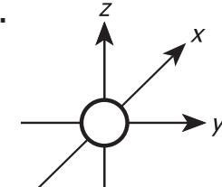

#### **C.**

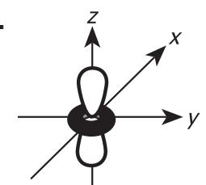

#### **B.**

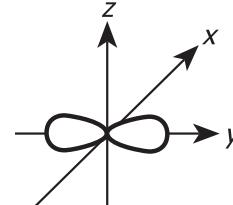

**D.**

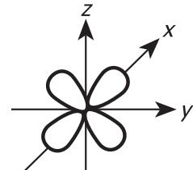

**5.** At high temperatures, tantalum(V) oxide (Ta2O5) reacts with carbon to produce tantalum and carbon dioxide.

$$2\mathsf{Ta}_2\mathsf{O}_5(s) + 5\mathsf{C}(s) \to 4\mathsf{Ta}(s) + 5\mathsf{CO}_2(g)$$

Greg adds 2.34 g of Ta2O5 to an excess of C in a crucible. Using a Bunsen burner, he heats the mixture until CO2 is no longer released and isolates 1.75 g of Ta. What is the percent yield of Ta for this reaction?

- **A.** 37.4%
- **B.** 54.7%
- **C.** 74.8%
- **D.** 91.3%
- **6.** A student dissolves 2.00 g of sodium hydroxide in enough distilled water to make 250.0 mL of solution. What is the concentration of the resulting solution?
  - **A.** 2.00 × 10−4 *M*
  - **B.** 8.00 × 10−3 *M*
  - **C.** 0.200 *M*
  - **D.** 8.00 *M*
- **7.** Which statement describes a property of all the Group 4A (14) elements?
  - **A.** They are metals.
  - **B.** They are nonmetals.
  - **C.** They form anions with a 2− charge.
  - **D.** They have 2 valence electrons in *p* orbitals.
- **8.** In chemistry lab, Justin adds an aqueous solution of Ba(OH)2 to an aqueous solution of K2SO4. Use the solubility data in the table to predict the products and determine the balanced chemical equation for this reaction.

|      | Solubility of Ionic Compounds in H2O |           |
|------|-----------------------------------------|-----------|
|      | Hydroxide                               | Sulfate   |
| Ba2+ | soluble                                 | insoluble |
| K+   | soluble                                 | soluble   |

- **A.** Ba(OH)2(*aq*) + K2SO4(*aq*) → 2KOH(*aq*) + BaSO4(*s*)
- **B.** Ba(OH)2(*aq*) + K2SO4(*aq*) → 2KOH(*s*) + BaSO4(*aq*)
- **C.** 2 Ba(OH)2(*aq*) + K2SO4(*aq*) → 2K(OH)2(*aq*) + Ba2SO4(*s*)
- **D.** 2 Ba(OH)2(*aq*) + K2SO4(*aq*) → 2K(OH)2(*s*) + Ba2SO4(*aq*)

- **9.** At 25°C, the solubility product constant (*K*sp) for CaF2 is 3.90 × 10−11. What is the concentration of Ca2+ in a saturated solution of CaF2 at 25°C?
  - **A.** 3.39 × 10−4 *M*
  - **B.** 2.14 × 10−4 *M*
  - **C.** 6.25 × 10−6 *M*
  - **D.** 4.42 × 10−6 *M*
- **10.** How many protons and how many neutrons are in the nucleus of a 27 60Co atom?
  - **A.** 27 protons and 33 neutrons
  - **B.** 27 protons and 60 neutrons
  - **C.** 33 protons and 27 neutrons
  - **D.** 33 protons and 60 neutrons
- **11.** What is the chemical symbol for the element iron?
  - **A.** F
  - **B.** Fe
  - **C.** I
  - **D.** Ir
- **12.** Ingrid uses the acid-base indicator bromothymol blue in a titration of approximately 0.1 *M* KOH with 0.05 *M* HCl. Bromothymol blue is yellow in acidic solutions and blue in basic solutions. What colors does Ingrid observe, and when?
  - **A.** Blue at the start of the titration, green at the equivalence point, and yellow after adding excess HCl
  - **B.** Blue at the start of the titration, yellow at the equivalence point, and green after adding excess HCl
  - **C.** Yellow at the start of the titration, green at the equivalence point, and blue after adding excess HCl
  - **D.** Yellow at the start of the titration, blue at the equivalence point, and green after adding excess HCl
- **13.** Which of the following statements correctly describes a role of a catalyst in a chemical reaction?
  - **A.** It is consumed during the reaction.
  - **B.** It increases the rate of the reaction.
  - **C.** It changes the product of the reaction.
  - **D.** It decreases the equilibrium constant for the reaction.

- **14.** At 83.7 kPa and 35.0°C, what is the density of PH3 gas?
  - **A.** 0.528 g/L
  - **B.** 1.11 g/L
  - **C.** 1.52 g/L
  - **D.** 2.39 g/L
- **15.** Which of the following sets contains elements that each have the same number of valence electrons as Ge?
  - **A.** Al, Sb, Po
  - **B.** As, Br, Ga
  - **C.** C, Pb, Si
  - **D.** In, O, P
- **16.** A sample of a compound containing only nickel and oxygen has a mass of 24.6 g. Analysis of the sample shows that 10.4 g is Ni and the remaining 14.2 g is O. What is the percent by mass of Ni in this sample?
  - **A.** 26.8%
  - **B.** 42.3%
  - **C.** 57.7%
  - **D.** 73.2%
- **17.** A scientist adds 1.0 g of a solid to 1 L of water. The solid does not dissolve, and the mixture is cloudy. Can this mixture be classified as a solution?
  - **A.** Yes, because the solid is the solute and water is the solvent.
  - **B.** Yes, because the solid is distributed uniformly throughout the water.
  - **C.** No, because the solid does not settle to the bottom of the mixture.
  - **D.** No, because the solid does not dissolve in the solvent.
- **18.** At 1,254 m above sea level, the city of Helena, Montana, has an average atmospheric pressure of 0.859 atm. A chemistry student in Helena finds that distilled water boils at 95.9°C. Compared to the boiling point of water at sea level, the boiling point of water at high elevations:
  - **A.** increases due to lower atmospheric pressure.
  - **B.** increases due to higher atmospheric pressure.
  - **C.** decreases due to lower atmospheric pressure.
  - **D.** decreases due to higher atmospheric pressure.

- **19.** Which of the following lists contains elements arranged in order of increasing electronegativity?
  - **A.** Be, B, C, F
  - **B.** Br, Se, Ga, K
  - **C.** N, P, As, Sb
  - **D.** O, Ge, In, Hg
- **20.** According to the definition of the ion-product constant for water (*K*w) in homogenous systems at 25°C, which of the following statements describing the relationship between the hydrogen ion and the hydroxide ion is always correct?
  - **A.** The concentration of H+ equals the concentration of OH− .
  - **B.** The sum of the concentrations of H+ and OH− equals 14.
  - **C.** Whenever the concentration of H+ decreases, the concentration of OH− decreases.
  - **D.** Whenever the concentration of H+ increases, the concentration of OH− decreases.
- **21.** Calcium carbonate reacts with hydrochloric acid to produce calcium chloride, carbon dioxide, and water.

$$\mathsf{CaCO}_3(s) + \mathsf{2HCl}(aq) \to \mathsf{CaCl}_2(aq) + \mathsf{CO}_2(g) + \mathsf{H}_2\mathsf{O}(I)$$

A chemistry student adds 21.54 g of CaCO3 to an excess of HCl. Assuming the reaction goes to completion, what mass of CO2 does the reaction produce?

- **A.** 3.877 g
- **B.** 9.471 g
- **C.** 23.88 g
- **D.** 48.99 g
- **22.** Quinn must determine the concentration of HCl in an unknown aqueous solution. He decides to titrate 35.0 mL of the unknown HCl solution with 1.038 *M* aqueous NaOH. The equivalence point is reached when Quinn adds 45.5 mL of 1.038 *M* NaOH solution. What is the concentration of HCl in the unknown solution?
  - **A.** 1.35 *M*
  - **B.** 1.12 *M*
  - **C.** 0.958 *M*
  - **D.** 0.798 *M*
- **23.** What is the wavelength of light with a frequency of 5.80 × 1014 Hz?
  - **A.** 3.85 × 10−19 m
  - **B.** 5.17 × 10−7 m
  - **C.** 1.93 × 106 m
  - **D.** 1.74 × 1023 m

- **24.** Ground magnesium silicate, Mg3Si4O10(OH)2, is commonly referred to as talcum powder. How many oxygen atoms are in 1 formula unit of magnesium silicate?
  - **A.** 2
  - **B.** 3
  - **C.** 11
  - **D.** 12
- **25.** What is the ground-state electron configuration of an atom of As?
  - **A.** [Ar] 4*s*2 3*d*10 4*p*3
  - **B.** [Ar] 4*s*2 3*d*10 4*p*4
  - **C.** [Ar] 4*s*2 4*d*10 4*p*3
  - **D.** [Ar] 4*s*2 4*d*10 4*p*4
- **26.** Adriana prepares barium carbonate (BaCO3) through the reaction of barium nitrate (Ba(NO3)2) with sodium carbonate (Na2CO3).

$$\mathsf{Ba}(\mathsf{NO}_3)_2(aq) + \mathsf{Na}_2\mathsf{CO}_3(aq) \to \mathsf{Ba}\mathsf{CO}_3(s) + 2\mathsf{Na}\mathsf{NO}_3(aq)$$

If she combines 15 mL of aqueous 0.10 *M* Ba(NO3)2 and excess Na2CO3, what is the maximum mass of BaCO3 that can be produced?

- **A.** 0.0015 g
- **B.** 0.30 g
- **C.** 1.5 g
- **D.** 3.0 g
- **27.** What is the balanced chemical equation for the reaction of solid aluminum hydroxide with aqueous hydrochloric acid?
  - **A.** Al(OH)2(*s*) + 2HCl(*aq*) → AlCl2(*aq*) + H2O(*l*)
  - **B.** Al(OH)2(*s*) + 2HCl(*aq*) → AlCl2(*aq*) + 2H2O(*l*)
  - **C.** Al(OH)3(*s*) + 3HCl(*aq*) → AlCl3(*aq*) + 3H2O(*l*)
  - **D.** Al(OH)3(*s*) + 3HCl(*aq*) → AlCl3(*aq*) + 4H2O(*l*)
- **28.** What is the Lewis structure of AsI3?
  - **A.**
- **C.**
- **B.**
- **D.**

- 29. In a chemistry laboratory, a student adds aqueous ammonium chloride to aqueous silver acetate to produce aqueous ammonium acetate and solid silver chloride. What is the net ionic equation for this reaction?
  - **A.**  $Cl^-(aq) + Ag^+(aq) \rightarrow AgCl(s)$
  - **B.**  $NH_4^+(aq) + C_2H_3O_2^-(aq) \rightarrow NH_4C_2H_3O_2(aq)$
  - **C.**  $NH_4Cl(aq) + AgC_2H_3O_2(aq) \rightarrow NH_4C_2H_3O_2(aq) + AgCl(s)$
  - **D.**  $NH_4^+(aq) + Cl^-(aq) + Ag^+(aq) + C_2H_3O_2^-(aq) \rightarrow NH_4^+(aq) + C_2H_3O_2^-(aq) + AgCl(s)$
- **30.** Which molecule has a dipole moment of zero?
  - **A.** SO2
  - B. NH3
  - C. CHCl3
  - D. CCl4
- 31. Which of the following statements best describes a role of water H2O when HCl dissolves in  $H_2O$ ? When HCl dissolves in  $H_2O$ , the  $H_2O$ :
  - **A.** accepts a hydrogen ion (H+) from HCl.
  - **B.** donates a hydrogen ion (H+) to HCl.
  - **C.** accepts a hydroxide ion (OH-) from HCl.
  - **D.** donates a hydroxide ion (OH-) to HCl.
- **32.** Samantha suspects that the tap water in the lab contains high levels of Cl-. Use the data in the table to determine which procedure she should use to test for Cl- in the water.

| Solubility of Ionic Compounds in H2O |                  |                |                  |                  |  |  |
|--------------------------------------|------------------|----------------|------------------|------------------|--|--|
|                                      | Al 3+ | K + | Pb 2+ | Zn 2+ |  |  |
| CI-                                  | soluble          | soluble        | insoluble        | soluble          |  |  |
| NO 3                      | soluble          | soluble        | soluble          | soluble          |  |  |
| SO 4 2-        | soluble          | soluble        | insoluble        | soluble          |  |  |

- **A.** Adding  $Al_2(SO_4)_3(aq)$  to produce solid  $AlCl_3$
- **B.** Adding  $K_2SO_4(aq)$  to produce solid KCl
- **C.** Adding  $Pb(NO_3)_2(aq)$  to produce solid  $PbCl_2$
- **D.** Adding  $Zn(NO_3)_2(aq)$  to produce solid  $ZnCl_2$

- **33.** According to the collision theory of reactions, which statement does NOT accurately describe gas particles in a reaction at constant volume?
  - **A.** When the particles move faster, more collisions occur per second.
  - **B.** When the number of particles increases, more collisions occur per second.
  - **C.** The particles need a minimum activation energy in order to react.
  - **D.** Each collision between particles produces products regardless of the available kinetic energy.
- **34.** In Mg3N2, nitrogen has a charge of 3−. What is the electron configuration of the N3− ion?
  - **A.** [He] 2*s*1
  - **B.** [He] 2*s*2
  - **C.** [He] 2*s*2 2*p*3
  - **D.** [He] 2*s*2 2*p*6
- **35.** Fluorine gas reacts with aqueous iron(II) iodide to produce aqueous iron(II) fluoride and iodine liquid. What is the balanced chemical equation for this reaction?
  - **A.** F2(*g*) + FeI2(*aq*) → FeF2(*aq*) + I2(*l*)
  - **B.** F2(*g*) + 2Fe2I(*aq*) → 2Fe2F(*aq*) + I2(*l*)
  - **C.** 2F(*g*) + FeI2(*aq*) → FeF2(*aq*) + 2I(*l*)
  - **D.** F(*g*) + Fe2I(*aq*) → Fe2F(*aq*) + I(*l*)
- **36.** Under which of the following conditions will oxygen gas most likely have the greatest solubility in water?
  - **A.** 15°C and 0.5 atm
  - **B.** 15°C and 2.0 atm
  - **C.** 75°C and 0.5 atm
  - **D.** 75°C and 2.0 atm
- **37.** When Alexis distills Liquid X, she obtains 3 different pure liquids with boiling points of 150°C, 250°C, and 350°C. How should Alexis classify Liquid X?
  - **A.** Element
  - **B.** Compound
  - **C.** Mixture
  - **D.** Molecule
- **38.** What type of solid is CsBr?
  - **A.** Ionic
  - **B.** Metallic
  - **C.** Molecular
  - **D.** Network

## **International Subject Test**— **Chemistry Practice Test**

Part 1 Answer Key

The following table contains the question number and the correct answer (key) for each question in Part 1 of this pdf file.

| D |
|---|
| A |
| B |
| B |
| D |
| C |
| D |
| A |
| B |
| A |
| B |
| A |
| B |
| B |
| C |
| B |
| D |
| C |
| A |
|   |

| 20 | D |
|----|---|
| 21 | B |
| 22 | A |
| 23 | B |
| 24 | D |
| 25 | A |
| 26 | B |
| 27 | C |
| 28 | B |
| 29 | A |
| 30 | D |
| 31 | A |
| 32 | C |
| 33 | D |
| 34 | D |
| 35 | A |
| 36 | B |
| 37 | C |
| 38 | A |
|    |   |

# **Chemistry**

## Part 2

*45 Minutes—38 Questions* 

For each question, choose the best answer.

You are permitted to use an approved calculator on this test. A Periodic Table of Elements and a Reference Sheet have been included in this Chemistry Practice Test, beginning on the next page.

Your score will be based only on the number of questions you answer correctly during the time allowed. You will not be penalized for guessing. **It is to your advantage to answer every question even if you must guess.**

If you finish before time ends, you should use the time remaining to reconsider questions you are uncertain about.

1. This table shows the percent composition data for an unknown organic compound.

|         | %           |
|---------|-------------|
|         | , , ,       |
| Element | composition |
| С       | 70.54       |
| Н       | 10.66       |
| 0       | 18.80       |

What is the empirical formula of this compound?

- A.  $C_5H_9O$
- **B.**  $C_6H_{11}O$
- **C.**  $C_7H_{10}O_2$
- **D.**  $C_8H_8O_2$
- 2. During chemistry lab, James studied the equilibrium reaction between Compound D and Compound X in water.

$$2D(aq) + 3X(aq) \Longrightarrow D_2X_3(aq)$$

He studied the reaction at 4 different temperatures, and he measured the concentration of each chemical species at equilibrium. James recorded his results in this table.

| Temperature (°C) | D ( <i>M</i> ) | X (M) | D 2 X 3 ( <i>M</i> ) |
|------------------|-------------------|----------|--------------------------------------------|
| 25               | 0.350             | 0.400    | 0.250                                      |
| 35               | 0.280             | 0.310    | 0.340                                      |
| 45               | 0.220             | 0.270    | 0.360                                      |
| 55               | 0.210             | 0.280    | 0.360                                      |

Use the data in the table to determine the temperature of the reaction with the largest equilibrium constant.

- **A.** 25°C
- **B.** 35°C
- **C.** 45°C
- **D.** 55°C
- **3.** At 25°C, a chemistry student prepared a saturated aqueous solution of AgBr in water. The concentration of Br- in the solution was  $7.07 \times 10^{-7}$  M. Calculate the solubility product constant ( $K_{\rm sp}$ ) for AgBr at 25°C.
  - **A.**  $5.00 \times 10^{-13}$
  - **B.**  $2.00 \times 10^{-12}$
  - **C.**  $3.54 \times 10^{-7}$
  - **D.**  $1.41 \times 10^{-6}$

**4.** Hydrazine (N2H4) reacts with hydrogen peroxide to produce nitrogen and water.

$$N_2H_4(I) + 2H_2O_2(I) \rightarrow N_2(g) + 4H_2O(I)$$

The standard enthalpy of reaction ( $\Delta H_{rxn}^{\circ}$ ) for this reaction is -818.23 kJ. Use  $\Delta H_{rxn}^{\circ}$  and the data in this table to calculate  $\Delta H_{f}^{\circ}$  for  $N_{2}H_{4}(I)$ .

| Substance                         | $\Delta H_{\rm f}^{\circ}$ (kJ/mol) |
|-----------------------------------|-------------------------------------|
| N 2 H 4 (/) | ?                                   |
| H 2 O 2 (/) | -187.80                             |
| $N_2(g)$                          | 0                                   |
| H 2 O(/)               | -285.80                             |

- **A.** -1291.83 kJ/mol
- **B.** -344.63 kJ/mol
- C. 50.63 kJ/mol
- **D.** 700.57 kJ/mol
- 5. In sodium hypochlorite (NaClO), chlorine has an oxidation number of +1. What is the electron configuration of Cl+?
  - **A.** [Ne]  $3s^2 3p^3$
  - **B.** [Ne]  $3s^2 3p^4$
  - **C.** [Ne]  $3s^2 3p^5$
  - **D.** [Ne]  $3s^2 3p^6$
- 6. A bond between 2 atoms having identical electronegativities is best classified as which of the following types of bonds?
  - A. Covalent bond
  - B. Hydrogen bond
  - C. Ionic bond
  - D. Polar bond
- 7. What scientist proposed that it is impossible to know both the location and the velocity of an electron in an atom at the same time?
  - **A.** Maria Goeppert-Mayer
  - **B.** Werner Heisenberg
  - C. C. Friedrich Hund
  - D. Wolfgang Pauli
- 8. In which of the following lists are all the phase changes exothermic processes?
  - **A.** Condensation, deposition, and freezing
  - **B.** Condensation, melting, and vaporization
  - C. Deposition, freezing, and sublimation
  - **D.** Melting, sublimation, and vaporization

- **9.** Which of the following statements accurately defines the law of conservation of energy in any chemical process?
  - **A.** Energy can be created and destroyed.
  - **B.** Energy can be created but not destroyed.
  - **C.** Energy can not be created, but it can be destroyed.
  - **D.** Energy can not be created, nor can it be destroyed.
- **10.** Which of the following statements is an accurate description of Period 3 in the periodic table? Period 3 contains several different elements with:
  - **A.** the same number of protons.
  - **B.** the same number of valence electrons.
  - **C.** outermost protons in the same principal energy level.
  - **D.** outermost electrons in the same principal energy level.
- **11.** For his term paper, Paolo plans to write about the unique features of bonding in carbon compounds. Which of the following statements should Paolo include in his paper to accurately describe the bonding in carbon compounds?
  - **A.** Carbon forms covalent bonds with sodium atoms.
  - **B.** Carbon forms ionic bonds with hydrogen atoms.
  - **C.** Carbon forms single and double covalent bonds with oxygen atoms.
  - **D.** Carbon forms single, double, and triple ionic bonds with other carbon atoms.
- **12.** Hydroiodic acid, HI, is a strong acid. Which of the following diagrams best represents the degree of dissociation of HI in water?

(Note: Individual H2O molecules have been omitted from the diagram.)

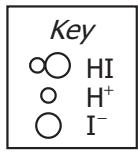

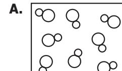

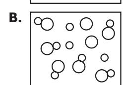

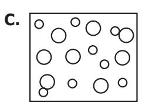

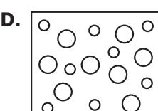

**13.** A certain chemical reaction has 2 steps.

Step 1: 
$$NH_3 + C_2H_4O_2 \rightarrow NH_4C_2H_3O_2$$

Step 2: 
$$NH_4C_2H_3O_2 \rightarrow C_2H_5NO + H_2O$$

Classify the chemical reactions in Step 1 and Step 2, respectively.

- **A.** Synthesis and decomposition
- **B.** Synthesis and single replacement
- **C.** Decomposition and single replacement
- **D.** Double replacement and single replacement

**14.** When a chemist places K metal into H2O, H2 gas is released, and a solution of KOH forms. What is the balanced chemical equation for this reaction, including the appropriate symbols of state for each species?

- **A.** 2K(*s*) + 2H2O(*l*) → H2(*g*) + 2KOH(*aq*)
- **B.** 2K(*s*) + 2H2O(*aq*) → H2(*g*) + 2KOH(*s*)
- **C.** K(*s*) + H2O(*l*) → H2(*g*) + KOH(*aq*)
- **D.** K(*s*) + H2O(*aq*) → H2(*g*) + KOH(*s*)

**15.** Which chemical name and symbol are NOT correctly matched?

- **A.** Copper, Cu
- **B.** Potassium, K
- **C.** Silver, Au
- **D.** Sodium, Na

**16.** Sodium stearate, a surfactant, is a common ingredient in soaps. Surfactants reduce the surface tension of water, allowing for easy removal of dirt from a surface such as human skin or clothing. The chemical formula for sodium stearate is CH3(CH2)16COONa. How many carbon atoms are in 1 formula unit of sodium stearate?

- **A.** 3
- **B.** 18
- **C.** 20
- **D.** 36

**17.** A chemist purchases a small gas cylinder containing 150.0 g of phosphorus trifluoride (PF3) gas. How many molecules of PF3 are in the gas cylinder?

- **A.** 3.531 × 1023 molecules
- **B.** 1.026 × 1024 molecules
- **C.** 3.734 × 1025 molecules
- **D.** 1.433 × 1026 molecules

**18.** Under anhydrous conditions, sodium peroxide reacts with carbon dioxide to produce sodium carbonate and oxygen.

$$2Na_2O_2+2CO_2\rightarrow 2Na_2CO_3+O_2$$

- What is the minimum mass of CO2 required to produce 26.7 g of O2?
- **A.** 73.4 g
- **B.** 36.7 g
- **C.** 18.4 g
- **D.** 9.71 g
- **19.** In the chemistry lab, Juanita adds solid potassium chlorate (KClO3) and a small amount of a catalyst to a flame-dried test tube. Using a Bunsen burner, she carefully heats the test tube until the solid melts. Then, she continues heating the liquid until a solid forms in the test tube and a gas is given off. Which balanced chemical equation contains the correct products for this reaction?
  - **A.** KClO3(*s*) → KClO(*s*) + O2(*g*)
  - **B.** 2KClO3(*s*) → 2KCl(*s*) + 3O2(*g*)
  - **C.** 2KClO3(*s*) → 2KClO2(*s*) + O2(*g*)
  - **D.** 2KClO3(*s*) → 2K(*s*) + Cl2(*g*) + 3O2(*g*)
- **20.** What is the volume of a sample of glycerol with a density of 1.20 g/mL and a mass of 43.7 g ?
  - **A.** 36.4 mL
  - **B.** 42.5 mL
  - **C.** 44.9 mL
  - **D.** 52.4 mL
- **21.** For a homework assignment, a student is asked to draw the Lewis structure of CS2. Which of the following structures should the student draw?
  - **A.**
  - **B.**
  - **C.**
  - **D.**

- **22.** A student measures the mass of a nickel on an analytical balance and records a result of 4.947 g in her laboratory notebook. The United States Mint has a specification of 5.000 g for the mass of a nickel. Assuming the United States Mint's specification is the actual mass of a nickel, what is the percent error associated with the student's measurement?
  - **A.** 1.071%
  - **B.** 1.060%
  - **C.** 0.01071%
  - **D.** 0.01060%
- **23.** This table shows the mass composition of a sample of ethyl acetate, a solvent used in some fingernail polish removers.

| Element | Mass composition (g) |
|---------|----------------------------|
| C       | 6.16                       |
| H       | 1.03                       |
| O       | 4.11                       |

If the molar mass of ethyl acetate is 88.10 g/mol, what is the molecular formula for ethyl acetate?

- **A.** C2H4O
- **B.** C3H4O3
- **C.** C4H8O2
- **D.** C6HO4
- **24.** Which of the following sets contains only physical properties?
  - **A.** Color, taste, ability to rust
  - **B.** Boiling point, volume, viscosity
  - **C.** Density, flammability, freezing point
  - **D.** Melting point, odor, reactivity to light
- **25.** As the pH of an aqueous solution increases from 5 to 9, what happens?
  - **A.** The concentrations of H+ and OH− both decrease.
  - **B.** The concentrations of H+ and OH− both increase.
  - **C.** The concentration of H+ decreases, and the concentration of OH− increases.
  - **D.** The concentration of H+ increases, and the concentration of OH− decreases.

- **26.** At 25°C, an aqueous solution of LiOH has a molarity of 0.025 *M*. What is the pH of this solution?
  - **A.** 1.60
  - **B.** 2.40
  - **C.** 12.40
  - **D.** 13.60
- **27.** Phosphorus pentachloride reacts with water to produce phosphoric acid and hydrochloric acid.

$$PCl_5(s) + 4H_2O(I) \rightarrow H_3PO_4(aq) + 5HCl(aq)$$

Which of the following statements correctly relates the rate of disappearance of a reactant to the rate of appearance of a product in this reaction?

- **A.** H2O disappears at a faster rate than HCl appears.
- **B.** H2O disappears at a slower rate than H3PO4 appears.
- **C.** PCl5 disappears at a faster rate than H3PO4 appears.
- **D.** PCl5 disappears at a slower rate than HCl appears.
- **28.** How many electrons does a calcium atom lose when it forms a stable compound with elemental bromine?
  - **A.** 0
  - **B.** 1
  - **C.** 2
  - **D.** 4
- **29.** Calcium chloride reacts with sodium phosphate to produce calcium phosphate and sodium chloride.

$$3CaCl_2(aq) + 2Na_3PO_4(aq) \rightarrow Ca_3(PO_4)_2(s) + 6NaCl(aq)$$

When a chemist adds 200.0 mL of 0.150 *M* CaCl2(*aq*) to 115.0 mL of 0.250 *M* Na3PO4(*aq*), what is the maximum number of moles of Ca3(PO4)2 that the reaction can produce?

- **A.** 0.0100 mol
- **B.** 0.0144 mol
- **C.** 0.0288 mol
- **D.** 0.0300 mol

**30.** What is the equilibrium constant law expression for this chemical equilibrium?

$$4NH3(g) + 3O2(g) \Longrightarrow 6H2O(g) + 2N2(g)$$

**A.** 
$$K_{eq} = \frac{[H_2O] + [N_2]}{[NH_3] + [O_2]}$$

**B.** 
$$K_{eq} = \frac{[H_2O] - [N_2]}{[NH_3] - [O_2]}$$

**C.** 
$$K_{eq} = \frac{[H_2O]^6 \times [N_2]^2}{[NH_3]^4 \times [O_2]^3}$$

**D.** 
$$K_{eq} = \frac{6[H_2O]^6 \times 2[N_2]^2}{4[NH_3]^4 \times 3[O_2]^3}$$

**31.** Nitric acid reacts with the fluoride ion to produce hydrofluoric acid and the nitrate ion, as shown in this chemical equilibrium.

$$HNO_3(aq) + F^-(aq) \Longrightarrow HF(aq) + NO_3^-(aq)$$

Which statement accurately describes 1 of the conjugate acid-base pairs in this equilibrium?

- **A.** F- is the conjugate acid of HF.
- **B.**  $F^-$  is the conjugate acid of HNO3.
- **C.**  $NO_3^-$  is the conjugate base of HF.
- **D.**  $NO_3^-$  is the conjugate base of  $HNO_3$ .
- **32.** Carbonic acid ( $H_2CO_3$ ) has an acid dissociation constant ( $K_a$ ) of  $4.4 \times 10^{-7}$  for its first ionizable hydrogen, and nitrous acid ( $HNO_2$ ) has a  $K_a$  value of  $7.2 \times 10^{-4}$ . Which statement accurately compares the 2 acids?
  - **A.**  $H_2CO_3$  is a stronger acid than  $HNO_2$  because  $H_2CO_3$  has a larger  $K_a$  value.
  - **B.**  $H_2CO_3$  is a stronger acid than  $HNO_2$  because  $H_2CO_3$  has a smaller  $K_a$  value.
  - **C.**  $H_2CO_3$  is a weaker acid than  $HNO_2$  because  $H_2CO_3$  has a larger  $K_a$  value.
  - **D.**  $H_2CO_3$  is a weaker acid than  $HNO_2$  because  $H_2CO_3$  has a smaller  $K_a$  value.
- **33.** Hydrogen bonding does NOT explain which of the following properties of  $H_2O$ ?
  - **A.** The pH of pure  $H_2O$  is 7.
  - **B.** H2O has a high surface tension.
  - **C.** Solid  $H_2O$  is less dense than liquid  $H_2O$ .
  - $\mathbf{D}$ .  $H_2O$  has a relatively high boiling point.

**34.** Evaporation of water from a surface is an efficient way to cool the surface. The heat of vaporization of H2O is 40.8 kJ/mol. If 36.0 g of H2O evaporates from the surface, how much heat does the surface lose?

(Note: Assume all the heat comes from the surface.)

- **A.** 20.4 kJ
- **B.** 76.8 kJ
- **C.** 81.5 kJ
- **D.** 94.8 kJ
- **35.** In water, ammonia reacts with nitric acid to produce ammonium nitrate.

$$NH_3(aq) + HNO_3(aq) \rightarrow NH_4NO_3(aq)$$

Dana carefully adds 0.550 mol of NH3 to an excess of HNO3. What is the maximum mass of NH4NO3 that the reaction can produce?

- **A.** 44.0 g
- **B.** 53.4 g
- **C.** 115 g
- **D.** 146 g
- **36.** A chemistry student is given a beaker containing a mixture of solid CuSO4 and sand. When the student adds water to the beaker, a blue CuSO4 solution forms, and the sand settles to the bottom of the beaker. What technique would best separate the blue CuSO4 solution from the sand?
  - **A.** Chromatography
  - **B.** Distillation
  - **C.** Evaporation
  - **D.** Filtration

**37.** A vessel connected to an open-ended mercury manometer contains N2 gas. The atmospheric pressure is 0.993 atm. The height difference of the Hg between the 2 arms of the manometer is 122 mm.

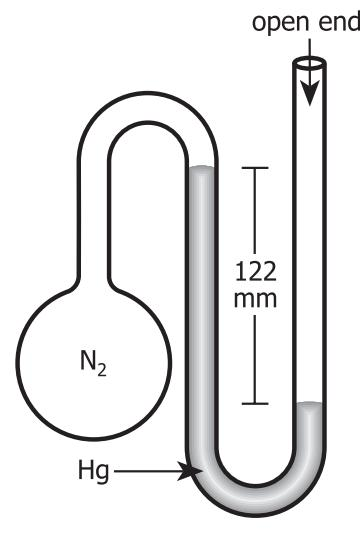

What is the pressure of the N2 gas?

- **A.** 122 mm Hg
- **B.** 633 mm Hg
- **C.** 755 mm Hg
- **D.** 877 mm Hg
- **38.** In chemistry class, the students learn that the plumbate ion (PbO3 2− ) has 3 resonance structures that obey the octet rule. Which of the following structures is 1 of the resonance structures of PbO3 2− ?

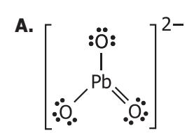

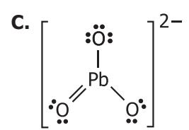

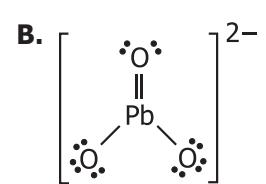

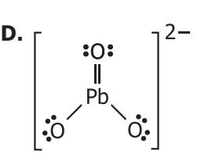

## **International Subject Test**— **Chemistry Practice Test**

### Part 2 Answer Key

The following table contains the question number and the correct answer (key) for each question in Part 2 of this pdf file.

| 1  | A |
|----|---|
| 2  | C |
| 3  | A |
| 4  | C |
| 5  | B |
| 6  | A |
| 7  | B |
| 8  | A |
| 9  | D |
| 10 | D |
| 11 | C |
| 12 | D |
| 13 | A |
| 14 | A |
| 15 | C |
| 16 | B |
| 17 | B |
| 18 | A |
| 19 | B |

| 20 | A |
|----|---|
| 21 | D |
| 22 | B |
| 23 | C |
| 24 | B |
| 25 | C |
| 26 | C |
| 27 | D |
| 28 | C |
| 29 | A |
| 30 | C |
| 31 | D |
| 32 | D |
| 33 | A |
| 34 | C |
| 35 | A |
| 36 | D |
| 37 | B |
| 38 | B |
|    |   |