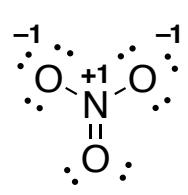
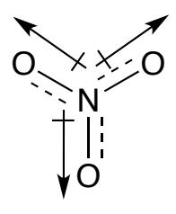
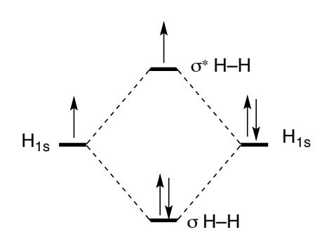

Section (*circle)* A-Katz / B-King Name: \_\_\_\_**Answer Key**\_\_\_\_\_\_\_\_

## **Part I. Multiple Choice**:

1. Which ion with a +2 charge has the electron configuration 1s2 2s2 2p6 3s2 3p6 3d10?

- \_\_ A. K
- \_\_ B. Si
- **X**\_ C. Zn
- \_\_ D. Ca
- \_\_ E. Ge

2. Which of the following elements has the lowest first ionization energy?

- \_\_ A. Be
- \_\_ B. Mg
- **X** \_ C. Ca
- \_\_ D. S
- \_\_ E. Si

3. Order the ions Na+1, Mg+2, and Al+3 in terms of increasing ionic radii.

- \_\_ A. Na+1, Mg+2, Al+3
- \_\_ B. Mg+2, Al+3, Na+1
- \_\_ C. Al+3, Na+1, Mg+2
- **X** \_ D. Al+3, Mg+2, Na+1
- \_\_ E. Na+1, Al+3, Mg+2

4. Which of the following quantum number sets describes a 4d orbital?

- **X** \_ A. n=4, l=2, ml = 0
- \_\_ B. n=2, l=4, ml = -1
- \_\_ C. n=3, l=2, ml = -1
- \_\_ D. n=3, l=1, ml = +1
- \_\_ E. n=4, l=1, ml = 2

5. Which compound below as the largest lattice energy?

- \_\_ A. KCl
- \_\_ B. LiCl
- \_\_ C. KI
- \_\_ D. NaI
- **X** \_ E. LiF

CH141 – Fall 2016 – Exam 3 Page 2 of 5 6. Which molecule/ion below has the largest dipole? \_\_ A. CO2 \_\_ B. SiH4 **X** \_ C. SO2 \_\_ D. BF4 –1 \_\_ E. F2 **Part II. Short Answers**: *You must show your work for full credit!* 7. In one or two sentences, clearly explain why the 2s and 2p orbitals are the same energy in a hydrogen atom, but different energies in a sodium atom. *energy.*

*In single electron systems (hydrogen), there is no shielding and the 2s and 2p are the same* 

*In multi-electron systems (sodium), there is shielding and the 2s becomes lower energy than the 2p.*

8. Give the electron configuration for the following atoms and ions (condensed notation is OK).

Br 
$$[Ar] 4s^2 3d^{10} 4p^5$$

Cu+2 \_\_\_\_[**Ar] 3d9** \_\_\_\_\_\_\_\_\_\_\_\_\_\_\_\_\_\_\_\_\_\_\_\_\_\_\_\_

- 9. What atom is isoelectronic with lithium ion? \_\_**He**\_\_\_\_\_\_\_\_
- 10. a) In the space below, draw a Lewis structure for the nitrate ion (NO3 -1 ) and assign formal charges to all the atoms.

b) What is the O-N-O bond angle in nitrate? \_\_**120°**\_\_\_\_\_\_\_

c) What is the hybridization of the N atom of nitrate? \_\_\_**sp2** \_\_\_\_\_\_\_\_\_\_\_\_\_

d) What is the shape of the nitrate ion? \_\_\_**trigonal planar**\_\_\_\_\_\_\_\_\_\_\_\_\_\_\_\_\_\_\_\_

e) How many σ bonds in nitrate? \_\_**3**\_\_\_\_\_\_\_

f) How many π bonds in nitrate? \_\_\_**1**\_\_\_\_\_\_

g) In the space below, draw all additional resonance structures for the nitrate ion.

$$\begin{array}{cccccccccccccccccccccccccccccccccccc$$

h) What is the bond order of an N-O bond in nitrate? \_\_**1.33**\_\_\_\_\_\_\_

i) Is nitrate polar? Why or why not? *Clearly but briefly explain your answer. You may use words and drawings.*

*No, nitrate is nonpolar. The ion has polar bonds but the bond dipoles cancel.*

## 11. Complete the following Table:

| Chemical Formula:                              | Chemical Formula:                                  |
|------------------------------------------------|----------------------------------------------------|
| PH3                                            | ClF3                                               |
| Lewis Structure:                               | Lewis Structure: (chlorine is the central atom) |
| H                                              | F                                                  |
| P                                              | Cl                                                 |
| H                                              | F                                                  |
| H                                              | F                                                  |
| Molecular Geometry:                            | Molecular Geometry:                                |
| (words only, you do not                        | (words only, you do not                            |
| have to draw the molecule in three dimensions) | have to draw the molecule in three dimensions)     |
| trigonal pyramidal                             | T-shaped                                           |
| Molecular Polarity                             | Molecular Polarity                                 |
| (yes/no):                                      | (yes/no):                                          |
| Idealized Bond Angle                           | Idealized Bond Angle                               |
| for H–P–H                                      | for F–Cl–F                                         |
| 109.5°                                         | 90°                                                |
|                                                |                                                    |

12. a) Draw a molecular orbital (MO) diagram for H2 –1 and include the number of electrons and their spins in each MO (In other words, identify the MOs in the first quantum shell and the electrons in each of these MOs). *You do not have to draw pictures of the MOs.* 

b) Circle each of the following compounds that is stable (has a bond order greater than zero). *Hint: use an MO analysis like you did in part (a).*

$$\underline{\underline{H}_2}^{-1}$$
  $\underline{\underline{H}_2}^{+1}$   $\underline{He_2}$ 

- 13. The reaction of ethylene  $(C_2H_4)$  with diazene  $(H_2N_2)$  affords ethane  $(C_2H_6)$  and nitrogen gas.
- a) Write a balanced equation for this reaction

$$C_2H_4 + H_2N_2 \rightarrow C_2H_6 + N_2$$

b) Draw the Lewis structure of each compound in your balanced reaction.

$$\begin{array}{cccccccccccccccccccccccccccccccccccc$$

c) Using the bond enthalpies in the table below, calculate the enthalpy change  $(\Delta H_{rxn}^{\circ})$  for the reaction above (assume the reaction is run at standard state).

| Bond type | ΔH (kJ/mol) |
|-----------|-------------|
| H–H       | 436         |
| С–Н       | 413         |
| N–H       | 391         |
| C–C       | 348         |
| C=C       | 614         |
| C≡C       | 839         |
| N-N       | 163         |
| N=N       | 418         |
| N≡N       | 941         |

$$\Delta H_{rxn}^{\circ}$$
 = bonds broken – bonds formed

$$\Delta H_{rxn}^{\circ} = [(614) + 418 + 2(391)] - [(348) + (941) + 2(413)] = -301 \text{ kJ/mol}$$