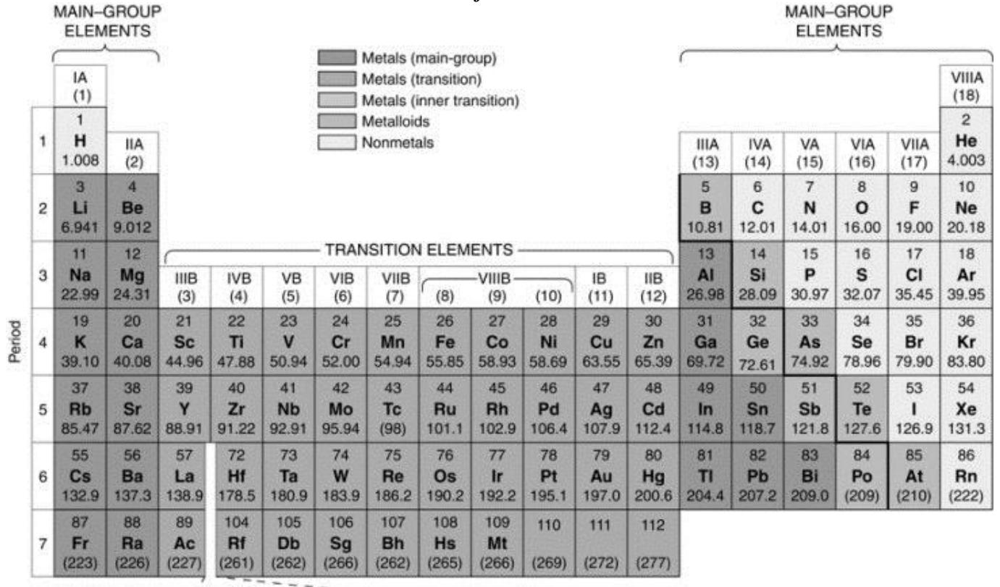

# **Chemistry 110**

#### Practice Exam 1 (Ch 1-2)

#### Note:

- 1. Use a softhead pencil, fill in you name, z-number, department name (CHEM), course name (110), and today's date () in the scantron sheet.
- 2. Use the following Periodic Table for the problems involving atomic mass and group names in this exam.
- 3. This is a **closed-book** exam. You **cannot** use your textbook or notes. However, you should use a calculator. **Cell phones are not allowed during the exam**. The following data will be helpful to you.

Temperature conversion equations:

$${}^{o}F = (1.8 \times {}^{o}C) + 32$$
  
 ${}^{o}C = ({}^{o}F - 32) \div 1.8$   
 $K = {}^{o}C + 273$ 

Some common equalities:

2.54 cm = 1 in 1 m = 39.4 in 1 km = 0.621 mile 1 lb = 16 oz 1 gallon = 4 qts 0.946 L = 1 qt 1 L = 1.06 qt 1 kg = 2.20 lb 454 g = 1 lb 1 pound = 16 ounces

### Periodic Table of the Elements:

## Choose the most appropriate answer. Each question is worth 4 points

13. The number 74,500,000 expressed correctly using scientific notation is A)  $0.745 \times 10^3$  B)  $7.45 \times 10^7$  C)  $74.50 \times 10^5$  D)  $74.5 \times 10^6$  E) 74.5

| Choose the most appropriate answer. Each question is worth 4 points                                                                                                                                                                                                             |  |  |  |  |  |
|---------------------------------------------------------------------------------------------------------------------------------------------------------------------------------------------------------------------------------------------------------------------------------|--|--|--|--|--|
| 1. Which of the following setups would convert mile to meter?  A) meter $\times \frac{0.621 mile}{km} \times \frac{1000 meters}{km}$ B) mile $\times \frac{km}{0.621 mile} \times \frac{1000 meters}{km}$                                                                       |  |  |  |  |  |
| km km 0.021mue km                                                                                                                                                                                                                                                               |  |  |  |  |  |
| C) mile $\times \frac{0.621 mile}{km} \times \frac{1000 meters}{km}$ D) mile $\times \frac{0.621 km}{mile} \times \frac{1000 meters}{km}$                                                                                                                                       |  |  |  |  |  |
| E) mile $\times \frac{km}{0.621mile} \times \frac{km}{1000meters}$                                                                                                                                                                                                              |  |  |  |  |  |
| 2. Which of the following is the smallest mass? A) 1.25 g B) 1.25 mg C) 1352 g D) 1.25 μg E) 2.25 kg                                                                                                                                                                            |  |  |  |  |  |
| 3. How many significant figures are there in 0.00130 g? A) 4 B) 5 C) 6 D) 2 E) 3                                                                                                                                                                                                |  |  |  |  |  |
| 4. Orange is an example of A) heterogeneous solution B) element C) compound D) homogeneous mixture E) heterogeneous mixture                                                                                                                                                     |  |  |  |  |  |
| <ul> <li>5. Which one of the following is a chemical property of alcohol?</li> <li>(A) It burns in air</li> <li>(B) It is colorless</li> <li>(C) It mixes with water very well</li> <li>(D) It evaporates quickly</li> <li>(E) None of the above</li> </ul>                     |  |  |  |  |  |
| 6. One liter is equal to how many microliters? A) $10^3$ B) $10^{-9}$ C) $10^{-3}$ D) $10^{-6}$ E) $10^6$                                                                                                                                                                       |  |  |  |  |  |
| 7. A patient has a temperature of 100.5 °F. What is the temperature in degrees Celsius? A) 13.1 °C B) 39.03 °C C) 31.2 °C D) 38.06 °C E) 40.3 °C                                                                                                                                |  |  |  |  |  |
| 8. A constructor measured the length and width of a room to be 25.75 feet and 30.5 feet, respectively. Using appropriate significant figures, the area of the room should be reported as  A) 785.375 sq ft.  B) 785.38 sq ft.  C) 785.3 sq ft.  D) 785.4 sq ft.  E) 785 sq  ft. |  |  |  |  |  |
| 9. Diamond has a density of 3.52 g/ cm 3 . What is the mass in grams of a diamond with a volume of 5.12 cm 3 ? A) 1.45 g B) 3.27 g C) 5.51 g D) 18.0 g E) 0.233 g                                                                                         |  |  |  |  |  |
| 10. The measurement 0.000231 g, expressed correctly using scientific notation, is A) $2.31 \times 10^{-4}$ g B) $0.231 \times 10^{-5}$ g C) $2.31 \times 10^{5}$ g D) $2.31$ g E) $2.31 \times 10^{-6}$ g                                                                       |  |  |  |  |  |
| <ul><li>11. Which of the following is the smallest unit?</li><li>A) meter B) micrometer C) millimeter D) kilometer E) decimeter</li></ul>                                                                                                                                       |  |  |  |  |  |
| 12. What is the density of a substance with a mass of 35.00 g and a volume of 16.4 mL?  A) 1.325 g/mL B) 1.33 g/mL C) 1.70 g/mL D) 2.13 g/mL E) 5.48 g/mL                                                                                                                       |  |  |  |  |  |

| 14 The correct answer for the addition of the measured numbers A) 13.7867 g. B) 13.8 g.                                                                                                                                                                                                                                                | C) 13.7 g.                                       | D) 13.78                                       | 7.51 g.              | g + 2.265 g + 1.3117 g + 2.7 g is E) 13.787 g. |
|----------------------------------------------------------------------------------------------------------------------------------------------------------------------------------------------------------------------------------------------------------------------------------------------------------------------------------------------------|-----------------------------------------------------|------------------------------------------------|-------------------------|---------------------------------------------------------|
| 15. Rutherford's experiment with alpha particle scattering by gold foil established that: A) electrons have negative charge B) atoms are neutral C) most mass of the gold atom is in a very small region called nucleus                                                                                                                   |                                                     |                                                |                         |                                                         |
| D) neutrons have no charge E) protons have a positive charge                                                                                                                                                                                                                                                                                    |                                                     |                                                |                         |                                                         |
| 16. Which of the following is a characteristic of the modern periodic table? A) The elements in the first column all have two valence electrons B) A group is a horizontal row on the periodic table. C) The elements in the last column are all metals D) A period is a column on the periodic table E) The elements in each group | (family)                                            | have the same number of valence electrons      |                         |                                                         |
| 17. The correct symbol for the isotope of sodium with 12 neutrons is 23 11 11Na 11Na A) B)                                                                                                                                                                                                                                       | 12 11Na C)                                    | 23 11 So D)                              | 22 11 S E)        |                                                         |
| 18. How many protons and electrons are present in a Mg A) 12 protons, 11 electrons D) 10 protons, 11 electrons                                                                                                                                                                                                                      | B) 12 protons, 12 E) 10 protons, 10 electrons | atom? electrons                             | C) 12                   | protons, 10 electrons                                |
| 19. Which of the following is NOT A) Cu B) F                                                                                                                                                                                                                                                                                              | a metal? C) Co                                   | D) Cr                                          | E) Al                   |                                                         |
| 20. Choose the element that is a metal. A) Zn B) C                                                                                                                                                                                                                                                                                           | C) He                                               | D) F                                           | E) P                    |                                                         |
| 21) In the Periodic Table, chlorine A) Period 2, group VIIA D) Period 3, group VIIA                                                                                                                                                                                                                                                       | is located at                                    | B) Period 3, group VIA E) none of the above |                         | C) Period 2, group VA                                   |
| 22. The number of valence electrons in A) 6 B) 5                                                                                                                                                                                                                                                                                             | a carbon C) 4                                    | atom is D) 8                                | E) 3                    |                                                         |
| 23. How many elements are found in Period 3 in the Periodic Table A) 2 B) 4                                                                                                                                                                                                                                                                  | C)6                                                 | D) 8                                           | ? E)                 | 10                                                      |
| 24.) The electron configuration of oxygen is 1s22s22p2 A) 1s22s22p4 D)                                                                                                                                                                                                                                                              | B) E)                                            | 1s22s22p1 1s22s22p3                         | C)                      | 1s22s12p2                                               |
| 25.) To form an ion, a magnesium atom A) loses two electrons. D) loses one electron.                                                                                                                                                                                                                                                         | B) loses seven electrons. E) gains one electron. |                                                | C) gains two electrons. |                                                         |
| - end -                                                                                                                                                                                                                                                                                                                                      |                                                     |                                                |                         |                                                         |