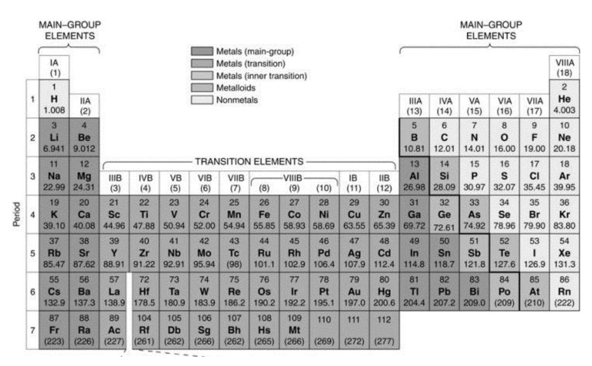
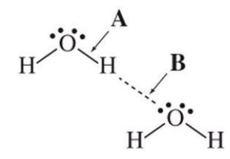

## **Chemistry 110**

## **Practice Exam 3 (Ch 5,6,7[Energy])**

## Note:

- 1. Sit according to the seat number assigned (ask the TA or the instructor).
- 2. Use a softhead pencil, fill in you name, z-number, department name (CHEM), course name (110), and today's date () in the scantron sheet.
- 3. Use the following Periodic Table for the problems involving atomic mass and group names in this exam.
- 4. This is a **closed-book** exam. You **cannot** use your textbook or notes. However, you should use a calculator. **Cell phones are not allowed during the exam**. The following data will be helpful to you.

Gas constant R = 0.0821 L atm/(mol K) Avogadro's number N = 6.022 1023

Molar volume of an ideal gas at STP = 22.4 L/mol

Ideal gas equation: PV = nRT

Pressure units: 1 atm = 760 mm Hg = 760 torr

Pressure units: 1 atm = 760 mm Hg = 760 torr PiVi=PfVf

G° = H° - TS°

q= (amt)(ΔT) (Specific heat)

## Concentration units:

m/V %= (grams of solute/mL of solution) 100% m/m % = (grams of solute/grams of solution) 100%

ppm = (grams of solute/grams of solution) 106 ppb = (grams of solute/grams of solution) 109

Molarity = moles of solute / Volume of solution in L

Dilution equation: M1V1 = M2V2

| Choose the most appropriate answer. 1. What state(s) of matter is(are) A. Liquid                                                                                                                                                                                                                                                                                                                                                             | is C. Gas         | least compressible? C. Solid and gas                                                            | D. Liquid and gas                                              | E. Solid                                                 |  |  |  |  |
|----------------------------------------------------------------------------------------------------------------------------------------------------------------------------------------------------------------------------------------------------------------------------------------------------------------------------------------------------------------------------------------------------------------------------------------------------------|-------------------------|-------------------------------------------------------------------------------------------------------|-------------------------------------------------------------------|-------------------------------------------------------------|--|--|--|--|
| 2. When we measure the pressure of a gas using a pressure gauge, we really are measuring A. the stickiness of the gas molecules B. the weight of the gas molecules C. the bond energy of the gas molecules D. the shape of the gas molecules E. how strong and how often the gas molecules hit the pressure gauge                                                                                                                |                         |                                                                                                       |                                                                   |                                                             |  |  |  |  |
| A. 1.00 atm                                                                                                                                                                                                                                                                                                                                                                                                                                              | B. 2.00 atm             | 3. A 10.0-L tank contains helium gas at 2280 mm Hg. What is the pressure of the gas in C. 3.00 atm | atm? D. 4.00 atm                                               | E. 5.00 atm                                                 |  |  |  |  |
| 4. Which of the following correctly describes the process of expiration (air leaving the lungs)? A. The lungs expand, causing their internal pressure to increase. B. The lungs contract, causing their internal pressure to decrease. C. The lungs contract, causing their internal pressure to increase. D. The lungs expand, causing their internal pressure to decrease. E. There is no change in the internal pressure in the lungs. |                         |                                                                                                       |                                                                   |                                                             |  |  |  |  |
| 5. In the calculations using the gas equations, we need to use the Kelvin temperature unit. To convert from Kelvins to Celsius degrees , we need to A. do nothing B. add 100 to Kelvins C. add 273 to Kelvins D. subtract 273 from Kelvins E. subtract 32 from Kelvins                                                                                                                                                           |                         |                                                                                                       |                                                                   |                                                             |  |  |  |  |
| A. smaller; greater                                                                                                                                                                                                                                                                                                                                                                                                                                   | B. greater; smaller  | 6. In comparing gases with liquids, gases have compressibility and density. C. greater; greater | D. smaller; smaller                                            | E. none of the above                                     |  |  |  |  |
| 7. Which description best fits a gas? A. Volume and shape of container; no intermolecular attractions B. Definite shape and volume; strong intermolecular attractions C. Definite volume; shape of container; weak intermolecular attractions D. Volume and shape of container; strong intermolecular attractions E. Definite volume; shape of container; moderate intermolecular attractions                              |                         |                                                                                                       |                                                                   |                                                             |  |  |  |  |
| 8. A gas sample contains 16.0 A. 22.4 L                                                                                                                                                                                                                                                                                                                                                                                                         | g of O2 B. 11.2 L | and 4.00 C. 44.8 L                                                                              | g of He. What is the volume of the sample at STP? D. 33.6 L | E. 4.00 L                                                |  |  |  |  |
| 9. At constant temperature, a sample of helium at 760. the new pressure exerted by the helium on its container? A. 440. torr                                                                                                                                                                                                                                                                                                                       | B. 328 torr       | torr in a closed container C. 151 torr                                                       | D. 190. torr                                                   | was expanded from 1.00 L to 4.00 L. What was E. 782 torr |  |  |  |  |
| torr, and a temperature of 25 oC. 10. A sample of nitrogen gas had a volume of 1.00 L, a pressure in its closed container of 760. oC and the new pressure was 380. What was the new volume of the gas when the temperature was changed to 323 torr? A. 2.00 L B. 3.00 L C. 4.00 L D. 5.00 L E. 1.00 L                                                                                                                      |                         |                                                                                                       |                                                                   |                                                             |  |  |  |  |
| oC and 4.00 oC. What is the 11. A sample of argon at 25.0 atm pressure is cooled in the same container to a temperature of -124 new pressure?                                                                                                                                                                                                                                                                                             |                         |                                                                                                       |                                                                   |                                                             |  |  |  |  |
| A. 5.00 atm                                                                                                                                                                                                                                                                                                                                                                                                                                        | B. 10.0 atm          | C. 25.0 atm                                                                                        | D. 2.00 atm                                                    | E. 1.00 atm                                                 |  |  |  |  |
| 12. How many moles of gas are there in a gas-filled balloon, which has a volume of 22.4 L at a pressure of 2.00 atm and a oC? temperature of 273                                                                                                                                                                                                                                                                                             |                         |                                                                                                       |                                                                   |                                                             |  |  |  |  |
| A. 0.250 mol                                                                                                                                                                                                                                                                                                                                                                                                                                       | B. 1.00 mol       | C. 22.4 mol                                                                                     | D. 2.00 mol                                                 | E. 0.500 mol                                             |  |  |  |  |
| 13. A gas sample having a total pressure of 2280. mmHg contains helium and oxygen. The partial pressure of helium is 1520. mmHg. What is the partial pressure of oxygen?                                                                                                                                                                                                                                                                        |                         |                                                                                                       |                                                                   |                                                             |  |  |  |  |

A. 1520. mmHg B. 780. mmHg C. 380. mmHg D. 190. mmHg E. 760. mmHg

|                                                                                       |                                                                                                                                                                                                                                                                                                                                                                                                                                                     |                                                      | 14. What would be the new pressure if a 400 mL gas sample at 380 mm Hg is expanded to 800 mL with no change in |                                                                               |
|---------------------------------------------------------------------------------------|-----------------------------------------------------------------------------------------------------------------------------------------------------------------------------------------------------------------------------------------------------------------------------------------------------------------------------------------------------------------------------------------------------------------------------------------------------|------------------------------------------------------|----------------------------------------------------------------------------------------------------------------|-------------------------------------------------------------------------------|
| temperature? A. 760 mm Hg                                                       | B. 190 mm Hg                                                                                                                                                                                                                                                                                                                                                                                                                                     | C. 950 mm Hg                                      | D. 570 mm Hg                                                                                                | E. 380 mm Hg                                                               |
| A. C. Each sample weighs the same amount. E. none of the above            | 15. Consider a sample of helium and a sample of neon, both at 25°C and 1.0 Which statement concerning these samples is not true? Each sample contains the same number of moles of gas. B.                                                                                                                                                                                                                                                     | D.                                                   | atm. Both samples have a volume of 22.4 Each sample contains the same number of atoms of gas.               | liters. The density of the neon is greater than the density of the helium. |
| 16. Which description best fits a solid?                                              | A. Definite volume; shape of container; moderate intermolecular attractions B. Definite volume; shape of container; no intermolecular attractions C. Volume and shape of container; no intermolecular attractions D. Volume and shape of container; strong intermolecular attractions E. Definite shape and volume; strong intermolecular attractions                                                                                   |                                                      |                                                                                                                |                                                                               |
| 17) Which transformation is sublimation? A) solid → gas D) liquid → solid | B) gas → liquid E) solid → liquid                                                                                                                                                                                                                                                                                                                                                                                                          | C) liquid → gas                                   |                                                                                                                |                                                                               |
| A. 16% B. 31%                                                                      | 18). Calculate the % (m/m) of platinum in a gold ring that contains 5.0 g platinum and 11 g gold C. 69%                                                                                                                                                                                                                                                                                                                                          | D. 5%                                                | E. 11%                                                                                                         |                                                                               |
|                                                                                       | 19. Which of the following properly describes a colligative property of a solution? A) a solution property that depends on the identity of the solute particles present B) a solution property that depends on the electrical charges of the solute particles present C) a solution property that depends on the amount of solute particles present D) a solution property that depends on the pressure of the solute particles present |                                                      | E) a solution property that depends on the amount, identity, and pressure of the solute particles present      |                                                                               |
| A. nonpolar compounds (like oil) C. ionic compounds (like NaCl)                    | 20. In considering general behavior, water can be used to dissolve which type of compounds?                                                                                                                                                                                                                                                                                                                                                         | B. polar compounds (like ethanol) D. both A and B | E. both B and C                                                                                                |                                                                               |
| 21. The solubility of gases in liquids                                                | A. increases as temperature increases and decreases as pressure increases B. increases as temperature increases and increases as pressure increases C. is independent of temperature and increases as pressure increases D. decreases as temperature increases and increases as pressure increases E. decreases as temperature increases and decreases as pressure increases                                                            |                                                      |                                                                                                                |                                                                               |
| B. C. D. E. None of these statements is correct.                          | 22. Which statement best explains the meaning of the phrase "like dissolves like"? A. The only true solutions are formed when water dissolves a polar solute. The only true solutions are formed when water dissolves a non-polar solute. A solvent and solute with similar intermolecular forces will readily form a solution. A solvent will easily dissolve a solute of similar mass.                                                |                                                      |                                                                                                                |                                                                               |
| A. Vapor pressure lowering D. Freezing point depression                            | 23. Which of the following is NOT a colligative property of a solution? B. Conductivity E. Osmotic pressure                                                                                                                                                                                                                                                                                                                                   |                                                      | C. Boiling point elevation                                                                                     |                                                                               |

24. The drawing shows two water molecules. Which statement is correct?

A. A: covalent bond; B: covalent bond

B. A: covalent bond; B: hydrogen bond

C. A: hydrogen bond; B: covalent bond

D. A: ionic bond: B: covalent bond

E. A: hydrogen bond; B: hydrogen bond

25. Which one of the following samples is NOT an example of solution?

A. gasoline

B. wine

C. chicken noodle soup

D. air

E. vinegar

26. How can pure water be made to boil at a temperature above 100 °C?

A. Decrease pressure below 1 atm

B. Increase volume of water

C. Decrease volume of water

D. Both B and C

E. Increase pressure above 1 atm

27. Which of the following will exhibit the Tyndall effect?

A. wine

(B. fog)

C. a mixture of oxygen and nitrogen D. salty water

E. glass

28. How many grams of sugar are present in 250.0 mL of a 2.00% (W/V) solution?

A. 5.00 g

B. 7.5 g

C. 75 g

D. 10.0 g

E. 25.0 g

29. What is the molarity of a solution prepared by dissolving 48.0 g of NaOH in enough water to make 1.50 L of solution?

A. 0.0313 M

B. 0.556 M

C. 0.800 M

D. 1.28 M

E. 32.0 M

30. How many moles of KCl are present in 250.0 mL of a 1.00 M solution?

A. 0.0500 mol

B. 0.0250 mol

C. 2.50 mol

(D. 0.250 mod

E. 0.347 mol

31. How many grams of NaCl are present in 250.0 mL of a 2.00 M solution?

A. 5.32 g

B. 58.5 g

C. 29.3 g

D. 9.18 g

E. 2.93 g

32. How many mL of a 0.100 M solution can be made from 5.00 mL of a 1.00 M solution of sodium chloride in water?

A. 10.0 mL

B. 100. mL

C. 500. mL

D. 50.0 mL

E. 1,000 mL

33. A 20.0 g sample of groundwater was found to contain 5.0  $\mu$ g of Pb2+. What is the concentration of Pb2+ in parts per million?

A. 5.0 ppm

B. 0.50 ppm

C. 0.050 ppm

D. 0.25 ppm

E.  $2.5 \times 10^{-7} \text{ ppm}$ 

34. Which of the following aqueous solutions would possess the greatest boiling point.

A) 1.0 M Sucrose

B) 1.0M NaCl

(c) 1.0M MgCl2

D) pure water

E) Not enough information is given to answer the question.

35. Under normal conditions, which of the following would have the lowest entropy?

A. gaseous oxygen

B. solid iron

C. liquid nitrogen

D. mixture of liquid nitrogen and liquid oxygen

E. liquid helium

36. The chemical reaction equation  $CH_4 \rightarrow C + 2 H_2$  has a  $\Delta H = 18$  kcal. This tells us that this reaction is a

A. kilo calorie reaction

B. kilo watt reaction

C. heat seeking reaction

D. endothermic reaction

E. exothermic reaction

37. When gasoline burns, which of the following is a correct description of the process?

A. The reaction is exothermic; *H* < 0 B. The reaction is endothermic; *H* > 0

C. The reaction is endothermic; *H* < 0 D. The reaction is exothermic; *H* > 0

E. None of these statements is correct

- 38. Which statement is true about reaction rate for the reaction: A + B C + D?
- A. When the forward reaction rate is equal to the reverse reaction rate, the volume of the mixture will decrease
- B. When the forward reaction rate is greater than the reverse reaction rate, the temperature of the mixture will go down
- C. When the forward reaction rate is smaller than the reverse reaction rate, the temperature of the mixture will go up
- D. When the forward reaction rate is equal to the reverse reaction rate, both forward and reverse reactions will stop
- E. When the forward reaction rate is equal to the reverse reaction rate, there will be no change in the concentrations of reactants and products
- 39. After initiating a reaction in a coffee cup calorimeter, the temperature of the water was observed to decrease by several degrees.

Based on this information, the reaction is

A. accelerated by a catalyst B. Exothermic C. Endothermic

D. ΔS >0 E. ΔS < 0

40. 10g of octane is burned in a bomb calorimeter containing 100g of H2O. How much energy was released (in calories) if the temperature increased by 10°C. (note: specific heat of water is 1 cal/g/°C).

A.1000 cal B. 100 cal C. 1 cal

D. 10 kcal E. 100 kcal

- **end** -

(Sign and write down your seat number in the back of the scantron. Hand in the scantron and keep this copy for your record)