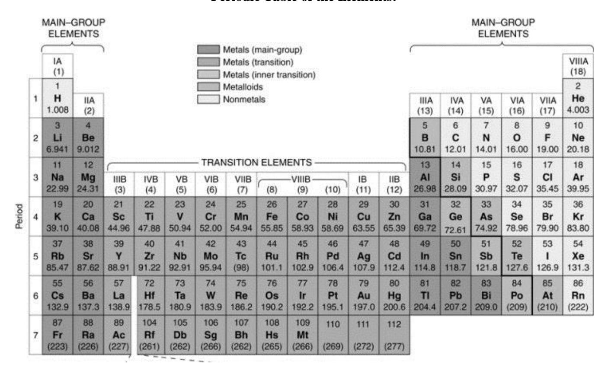
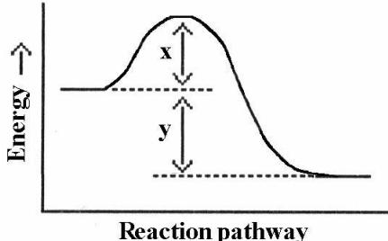

### **Chemistry 110 Section 3**

# Practice Exam 4 (Ch 7[Rate&Equilibrium], 8, and 9)

## Note:

- 1. Sit according to the seat number assigned (ask the TA or the instructor).
- 2. Use a softhead pencil, fill in you name, z-number, department name (CHEM), course name (110), and today's date () in the scantron sheet.
- 3. Use the following Periodic Table for the problems involving atomic mass and group names in this exam.
- 4. This is a **close-book** exam. You **cannot** use your textbook or notes. However, you should use a calculator. **Cell phones are not allowed during the exam**. The following data may be helpful to you.

Avogadro's number:  $N_A = 6.022 \times 10^{23} = 1 \text{ mole}$ 

Gas constant R = 0.0821 L atm/(mol K)

pH definition:  $pH = -log[H_3O^+], \ [H_3O^+] = 10^{-pH}$  Water ion-product constant  $K_w = [H_3O^+] \ [OH^-] = 1.0 \times 10^{-14}$  Acid-Base titration equation  $n_H(M_{acid})(V_{acid}) = n_{OH}(M_{base})(V_{base})$ 

 $\Delta G^{\circ} = \Delta H^{\circ} - T \Delta S^{\circ}$ 

 $q = (amt)(\Delta T)$  (Specific heat)

### **Periodic Table of the Elements:**

#### Choose the most appropriate answer.

1. Which of the following will not affect the rate of a reaction:

A.Equilibrium constant

- B. Concentration of reactants
- C. Temperature of reactants

D.Physical state of reactants

- E. Presence of a catalyst
- 2. For the following reaction  $2A + B \rightarrow 3D$ , it was determined the reaction was first order with respect to A and second order with respect to B, the correct general rate law for this reaction would be:

A. rate=k[A][B]

B. rate= $k[A]^2[B]$ 

C. rate= $k[A][B]^2$ 

D. rate= $k[A]^3[B]^3$ 

E. rate=k

3. The rate law for a reaction is: rate=k [I]2. If the concentration of [I] is doubled, the rate will

A. increase 2-fold

(B) increase 4-fold

C. decrease 2-fold

D. decrease 4-fold

E. not change

4. The rate law for a reaction is: rate=k [A]. If the concentration of [A] is halved, the rate will

A. increase 2-fold

B. increase 4-fold

(C.)decrease 2-fold

D. decrease 4-fold

E. not change

5. Which energy difference in the energy profile below corresponds to  $\Delta H^{\circ}$ ?

A. x+y

B. x-y

C. x÷v

D. x

6. At equilibrium of the following reaction, the concentration of dinitrogen tetroxide is 0.022 M and the concentration of nitrogen dioxide is 0.010. Calculate the value of the equilibrium constant  $(K_{eq})$ .  $2NO_2(g) \leftrightarrow N_2O_4(g)$ 

A. 0.022

B. 1.0

 $C. 4.5 \times 10^{-3}$ 

 $(D.2.2 \times 10^2)$ 

E.  $2.2 \times 10^4$ 

7. What is the equilibrium constant expression for the following reaction  $2NH_3(g) \rightleftharpoons N_2(g) + 3H_2(g)$ 

A.  $[N_2][H_2]^2$ 

B.  $[N_2][H_2]^3$ 

 $[NH_3]^3$ 

C.  $[NH_3]^2$ 

D. [NH3]

E. None of the above

 $[N_2][H_2]^3$ 

 $[N_2][H_2]$ 

8. Write the equilibrium expression for the following reaction:  $CaCO_3$  (s)  $\iff$   $Ca^{2+}(aq) + CO_3^{2-}(aq)$ 

A.  $[Ca^{2+}][CO_3^{2-}]$ [CaCO3]

B. [Ca2+][CO32-]

C.  $[Ca^{2+}]^2[CO_3^{2-}]^2$ 

D.  $[Ca^{2+}]^2[CO_3^{2-}]^2$ 

E. None of the above

| 9. A reaction was determined to have an equilibrium constant K to the; the concentration of products is relatively                                                                                                                                                                                                                                                                                                                                                         |                                                                                                  |
|----------------------------------------------------------------------------------------------------------------------------------------------------------------------------------------------------------------------------------------------------------------------------------------------------------------------------------------------------------------------------------------------------------------------------------------------------------------------------|--------------------------------------------------------------------------------------------------|
| A. the left; small  D. the left; large  E. neither direction; large                                                                                                                                                                                                                                                                                                                                                                                                        |                                                                                                  |
| 10. Given this equilibrium: $2NH_3(g) + heat \rightleftharpoons N_2(g) + 3H_2(g)$ , which action will increase the relative number of moles of $N_2$ present at equilibrium?                                                                                                                                                                                                                                                                                               |                                                                                                  |
| A) heating the equilibrium mixture C) adding hydrogen to the reaction chamber E) removing NH 3 from the mixture                                                                                                                                                                                                                                                                                                                                                 | <ul><li>B) adding a catalyst.</li><li>D) decreasing the volume of the reaction chamber</li></ul> |
| 11. Given the equilibrium system: $Pb^{2+}(aq) + CO_3^{2-}(aq) \rightleftharpoons PbCO_3(s)$ , after equilibrium, addition of $CO_3^{2-}(aq)$ :  A) causes no effect  B) causes the amount of $PbCO_3(s)$ to decrease, and the $Pb^{2+}(aq)$ concentration to decrease  C) causes the amount of $PbCO_3(s)$ to increase, and the $Pb^{2+}(aq)$ concentration to decrease  D) causes the amount of $PbCO_3(s)$ to increase, and the $Pb^{2+}(aq)$ concentration to increase |                                                                                                  |
| E) causes the amount of $PbCO_3(s)$ to decrease, and the $Pb^{2+}(aq)$ concentration to increase                                                                                                                                                                                                                                                                                                                                                                           |                                                                                                  |
| 12. What is the $[H_3O^+]$ in a solution with $[OH^-] = 1 \times 10^{-8} M^{\circ}$ A) $1 \times 10^2 M$ B) $1 \times 10^{-6} M$ C) $1 \times 10^{-8}$                                                                                                                                                                                                                                                                                                                  | M D) 1 x 10 -7 M E) 1 x 10 -5 M                                            |
| 13. What is the pH of a solution with $[H_3O^+] = 3.1 \times 10^{-10} \text{ M}$ ? A) -9.51 B) 4.7 x $10^{-7}$ M                                                                                                                                                                                                                                                                                                                                                        |                                                                                                  |
| 14. In which of the following are the pH values arranged from A) 7, 10, 14, 4, 3, 1 B) 14, 10, 7, 4, 3, 1 C) 2, 5, 7, 9,                                                                                                                                                                                                                                                                                                                                                   |                                                                                                  |
| 15. What is the pH of a 0.20 <i>M</i> HCl solution? A.) < 0 B) 0.70 C). 1.61 D). 12.39                                                                                                                                                                                                                                                                                                                                                                                  | E.) 13.30                                                                                        |
| 16. What is the [OH - ] for a solution at 25°C that has $[H_3O^+] = 8.23 \times 10^{-2} M$ ?                                                                                                                                                                                                                                                                                                                                                                    |                                                                                                  |
| A) > $10^{-5} M$ B) $1.22 \times 10^{-6} M$ C) $8.23 \times 10^{-12} M$                                                                                                                                                                                                                                                                                                                                                                                                    | (D) $1.22 \times 10^{-13} M$ E) $8.23 \times 10^{-16} M$                                         |
| 17. Select the pair of substances which is not a conjugate acid-base pair.                                                                                                                                                                                                                                                                                                                                                                                                 |                                                                                                  |
| A) H 3 O + , H 2 O B) HNO 2 , NO 2 C) H 2 SO 4 , HS D) H 2 S, S 2- E) NH 3 , NH 2                                                                                                                                                                                                                                                                 | $SO_4^-$                                                                                         |
| 18. Select the pair of substances in which an acid is listed followed by its conjugate base.                                                                                                                                                                                                                                                                                                                                                                               |                                                                                                  |
| A) H + , HCl B) NH 3 , NH 4 + E) CH 3 COOH, CH 3 COOH 2 +                                                                                                                                                                                                                                                                                                                          | C) $HPO_4^{2-}$ , $H_2PO_4^{-}$                                                                  |
| 19. A strong acid dissociation reaction will react, a                                                                                                                                                                                                                                                                                                                                                                                                                      | and will be expected to have a equilibrium                                                       |

constant

A. partially; large

B. Completely; small C. partially; small

(D) Completely; large

E. partially; intermediate

20) In which of the following are the pH values arranged from the most acidic to the most basic?

- A) 7, 10, 14, 4, 3, 1
- B) 14, 10, 7, 4, 3, 1
- C) 2, 5, 7, 9, 14, 11
- D) 14, 10, 7, 1, 3, 5

(E)1, 3, 6, 8, 11, 14

21) Which of the following is a neutralization reaction?

- A)  $C + O_2 \rightarrow CO_2$
- (B) $H_2SO_4 + 2LiOH \rightarrow Li_2SO_4 + 2H_2O$
- C)  $2NO_2 \rightarrow 2NO + O_2$
- D)  $4\text{Na} + \text{O}_2 \rightarrow 2\text{Na}_2\text{O}$  E)  $4\text{Ng} + \text{HCl} \rightarrow 4\text{Ng} + \text{HNO}_3$

22) What are the spectator ions in the reaction  $HNO_3 + KOH \rightarrow \square KNO_3 + H_2O$ ?

- $(A)K^+$  and  $NO_3^-$
- B)  $H_2O$
- C) HNO3
- D) KOH

E) H+ and OH-

23) In a buffer system of HF and its salt, NaF,

- A) F neutralizes added base.
- B) HF neutralizes added acid
- C) HF is not necessary.

- (D) F neutralizes added acid.
- E) F neutralizes added Na+.

24) Which statement about nuclear reactions is true?

- A) The rate of a nuclear reaction is increased by the addition of a catalyst.
- (B) Energy changes in nuclear reactions are much greater than in ordinary chemical reactions.
- C) Nuclear reactions do not change in the nucleus of an atom.
- D) A nuclear reaction is the same no matter what isotope is used
- E) Nuclear reactions normally do not occur at very low temperature

25) Which is the best description of a beta particle?

- A) charge 0; mass of 0 amu; high penetrating power
- B) charge +2; mass of 4 amu; low penetrating power
- (C) charge -1; mass of 0 amu; medium penetrating power
- D) charge +1; mass of 0 amu; high penetrating power
- E) charge +2; mass of 4 amu; high penetrating power

26) The nuclear reaction shown below is an example of what type of process?

$$^{224}_{90}Th \rightarrow ^{220}_{88}Ra + ^{4}_{2}He$$
 emission B) fission

- A) alpha emission
- C) beta emission
- D) fusion

E) translation

27) What is the unknown isotope X in the following nuclear reaction?

$$X \rightarrow {}^{234}_{90}Th + {}^{4}_{2}He$$

- A) alpha particle
- B) beta particle
- C)  $^{238}_{90}Th$  D)  $^{238}_{92}Th$