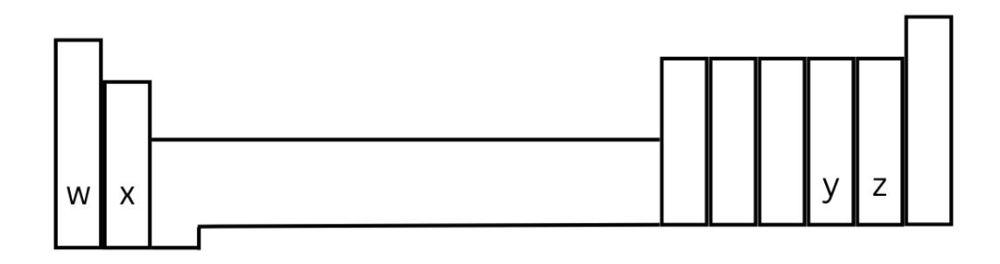
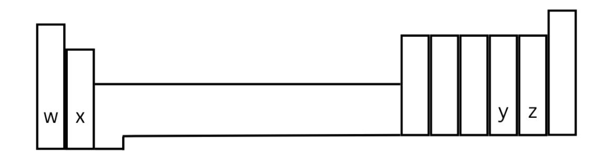
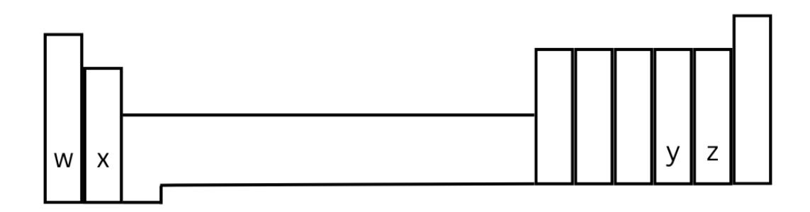

## **CHEM 1411**

# **Chapter 2 Practice Test**

- 1. Which one of the following is not one of the postulates of Dalton's atomic theory?
  - a. all matter is composed of tiny, indivisible particles called atoms
  - b. all atoms of a given element are identical to each other and different from those of other elements
  - c. during a chemical reaction, atoms are changed into atoms of different types
  - d. compounds are formed when atoms of different elements combine
- 2. Which statement below correctly describes the responses of the three radiation types to an electric field?
  - a. both beta and gamma are bent in the same direction, while alpha shows no response
  - b. both alpha and gamma are bent in the same direction, while beta shows no response
  - c. both alpha and beta are bent in the same direction, while gamma shows no response
  - d. alpha and beta are bent in opposite directions, while gamma shows no response
  - e. only alpha is bent, while beta and gamma show no response
- 3. Which one of the following is a pair of isotopes of the same element?
  - a  $\frac{116}{02}X^{2+}$   $\frac{119}{02}X$
  - b.  ${}^{116}_{92}X^{2+}$ ,  ${}^{122}_{89}X^{2+}$
  - c.  ${}^{96}_{45}X$ ,  ${}^{116}_{92}X$
  - d  $\frac{233}{23}$   $\chi^{2+}$   $\frac{116}{2}$   $\chi^{4+}$
  - e.  ${}^{22}_{11}X$ ,  ${}^{79}_{38}X^{2+}$

TR 7.30.25

- 4. How many electrons, protons, and neutrons are in an atom of 35 77 3-?
  - a. 38 electrons, 35 protons, 42 neutrons
  - b. 77 electrons, 32 protons, 77 neutrons
  - c. 32 electrons, 80 protons, 35 neutrons
  - d. 77 electrons, 77 protons, 35 neutrons
- 5. In the Rutherford nuclear atom model
  - a. the heavy subatomic particles, protons and neutrons, reside in the nucleus
  - b. the three principal subatomic particles, protons, neutrons, and electrons, all have essentially the same mass
  - c. the light subatomic particles, protons and neutrons, reside in the nucleus
  - d. mass is spread essentially uniformly throughout the atom
  - e. both the three principal subatomic particles, protons, neutrons, and electrons, all have essentially the same mass and mass is spread essentially uniformly throughout the atom
- 6. Which species has 36 electrons?
  - a. 36 80
  - b. 35 80
  - c. 34 78
  - d. 17 34
- 7. In the modern periodic table, the elements are arranged in
  - a. alphabetical order
  - b. order of increasing atomic number
  - c. order of increasing metallic properties
  - d. order of increasing neutron content
- 8. Which one of the following is a nonmetal?
  - a. W
  - b. Sr
  - c. Os
  - d. Ir
  - e. Br

TR 7.30.25 2

9. Which one of the following should be the most similar to strontium in chemical and physical properties?

- a. Li
- b. At
- c. Rb
- d. Ba
- e. Cs

10. The most metallic elements would be found at the bottom of which group?

- a. w
- b. x
- c. y
- d. z

11. The elements found in which group are found uncombined, as monatomic species in nature?

- a. noble gases
- b. chalcogens
- c. alkali metals
- d. alkaline earth metals
- e. Halogens

12. What is the formula of the compound formed between strontium ions and nitrogen ions?

- a. SrN
- b. Sr3N2
- c. Sr2N3
- d. SrN2
- e. SrN3

13. Which species has 54 electrons?

- a. 54 132+
- b. 52 1282-
- c. 50 1182+
- d. 48 1122+

14. Which species has 16 neutrons?

- a.31P
- b. 34S 2-
- c. 36Cl
- d. 80Br-

15. Which group of elements is most likely to form ions by losing one electron?

- a. w
- b. x
- c. y
- d. z

16. Which group of elements is most likely to form oxides with the general formula XO?

- a. w
- b. x
- c. y
- d. z

17. The correct name of the compound, PCl₃, is

- a. potassium chloride
- b. phosphorus trichloride
- c. phosphorus (III) chloride
- d. monophosphorous trichloride

18. The formula of aluminum ion in its compounds is

- a. Al²⁻
- b. Al²⁺
- c. Al⁻
- d. Al³⁺
- e. Al⁺

19. Nitrate ion is

a. NO₂⁻

| b. | NO₂⁺ |
|----|------|
| c. | NO₃⁺ |
| d. | NO₃⁻ |
| e. | NO₄⁻ |
|    |      |
|    |      |
|    |      |
|    |      |

20. Element M reacts with fluorine to form an ionic compound with the general formula MF₃. The M ion has 18 electrons. Element M is

- a. P
- b. Sc
- c. Ar
- d. Ca

21. Which one of the following is the correct name for Mg(ClO₃)₂?

- a. magnesium chlorate
- b. manganese chlorate
- c. magnesium chloroxide
- d. magnesium perchlorate

22. When calcium reacts with sulfur the compound formed is

- a. Ca₂S₂
- b. Ca₃S₂
- c. CaS
- d. CaS₂

23. The formula for bromic acid is

- a. HBrO₄
- b. HBrO₃
- c. HBrO₂
- d. HBr

### 24. The correct name for HIO₂ is

- a. hypolodic acid
- b. hydroiodic acid
- c. periodous acid
- d. iodous acid

#### 25. What is the charge on the silver (Ag) ion in Ag₂CO₃?

- a. 3⁻
- b. 1⁺
- c. 2⁺
- d. 3⁺

#### Answers

- 1. c
- 2. d
- 3. a
- 4. a
- 5. a
- 6. a
- 7. b
- 8. e
- 9. d
- 10.a
- 11.a
- 12.b
- 13.b
- 14.a
- 15.a
- 16.b
- 17.b
- 18.d
- 19.d
- 20.b

21.a

22.c

23.b

24. d

25.b

TR 7.30.25