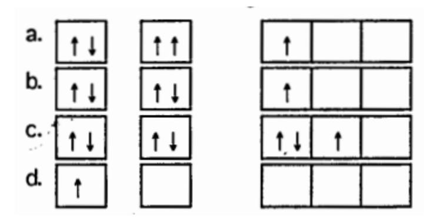
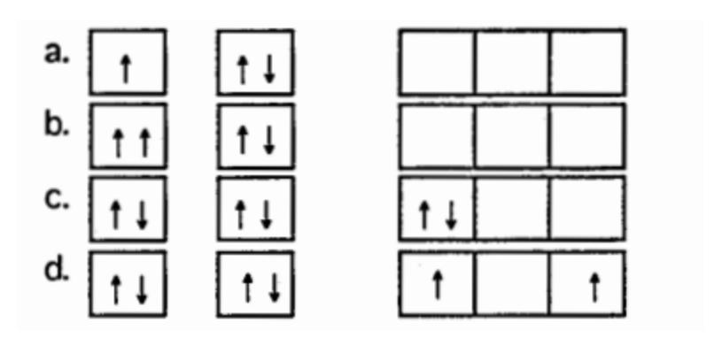
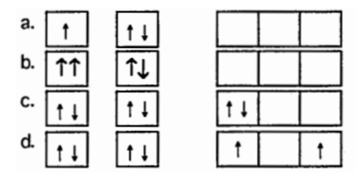
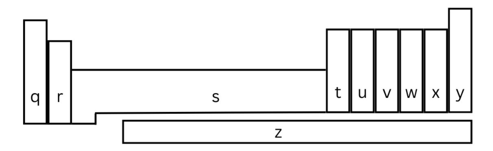

## Chemistry 1411

## Chapter 6 Practice Test

|    | 1 1013 1. What is the wavelength of light that has a frequency of 1.20 x s ? |
|----|---------------------------------------------------------------------------------------------------------------------------------|
|    | 25.0µm a. b. 2.50 × 10-5 µm 0.0400 µm c. d. 12.0 µm                                            |
| 2. | The photoelectric effect                                                                                                        |
|    | a. is the total reflection of light by metals giving them their typical luster                                               |

3. Which one of the following forms of electromagnetic radiation has the shortest \_\_\_\_\_\_\_\_\_\_\_\_ wavelength?

c. is the ejection of electrons by a metal when struck by light

b. is the production of current by silicon solar cells when exposed to sunlight

d. is the darkening of photographic film when exposed to an electric field

- a. ultraviolet
- b. X-ray
- c. microwave
- d. Infrared
- 4. What is the frequency of a photon with an energy of 3.7 × 10-18 J? (h = 6.63 × 10-34 J · s)
  - a. 5.6 × 1015 s-1
  - b. 1.8 × 10-16 s-1

TR 9.23.25 1

c. 
$$2.5 \times 10^{-51} \text{ s}^{-1}$$

d. 5.4 × 10-8 s-1

## 5. Helium was first discovered

- a. In camel dung
- b. In rocks recovered from geologic faults
- c. In seawater in the vicinity of volcanic vents
- d. In the sun
- 6. Which one of the following electron transitions in a hydrogen atom results in the greatest release of energy from the atom?

a. n=3 to n=4

b. 
$$n=1 \text{ to } n=3$$

c. 
$$n=6 \text{ to } n=4$$

d. n=7 to n=5

- 7. An electron in a hydrogen atom is found to have an energy of -1.362 × 10-19 J. What orbit would the electron be in according to the Bohr model of the hydrogen atom? (RH = 2.18 × 10-18 J.)
  - a. 1
  - b. 2
  - c. 3
  - d. 4
- 8. The scientist to whom the wave nature of matter is attributed is
  - a. Schrodinger
  - b. Heisenberg
  - c. de Broglie
  - d. Einstein
  - e. Bohr
- 9. The de Broglie wavelength of an electron Is 8.7 × 10-11 m. The mass of this electron is

TR 9.23.25 2

| a.                   | 8.4 × 103                                                                                                                                |
|----------------------|---------------------------------------------------------------------------------------------------------------------------------------------|
| b.                   | 1.2 × 10-7                                                                                                                               |
| c. d.             | 6.9 × 10-54 8.4 × 106                                                                                                              |
|                      |                                                                                                                                             |
| 10.                  | The Heisenberg Uncertainty Principle states that it is impossible to know precisely both the position and the of an electron in an atom. |
| a.                   | mass                                                                                                                                        |
| b.                   | color                                                                                                                                       |
| c.                   | momentum                                                                                                                                    |
| d.                   | shape                                                                                                                                       |
| 11.                  | The values of the principal quantum number and the azimuthal quantum number of                                                              |
| a. b. c. d. | the electrons in a 3d subshell are 3,3 2,3 3,2 2,2                                                                              |
| 12.                  | How many orbitals are in the third shell?                                                                                                   |
| a.                   | 25                                                                                                                                          |
| b.                   | 4                                                                                                                                           |
| c.                   | 9                                                                                                                                           |
| d.                   | 16                                                                                                                                          |
| e.                   | 1                                                                                                                                           |

TR 9.23.25 3

a. the same shell and subshell, but different orbitals

I, and ml, are said to be in

| b.  | the same shell, but different subshells and orbitals                                                                |
|-----|---------------------------------------------------------------------------------------------------------------------|
| c.  | the same shell, subshell, and orbital                                                                               |
| d.  | the same subshell and orbital, but different shells                                                                 |
| e.  | different shells, subshells, and orbitals                                                                           |
|     |                                                                                                                     |
| 14. | Which set of quantum numbers cannot be correct?                                                                     |
| a.  | n=2, l=0, ml=0                                                                                                      |
| b.  | n=2, l=1, ml=-1                                                                                                     |
| c.  | n=3, l=1, ml=-1                                                                                                     |
| d.  | n=1, l=1, ml=1                                                                                                      |
|     |                                                                                                                     |
| 15. | What is the value of the l quantum number for the outermost electrons in a nitrogen atom in the ground state? |
| a.  | 0                                                                                                                   |
| b.  | 1                                                                                                                   |
| c.  | 2                                                                                                                   |
| d.  | 3                                                                                                                   |
|     |                                                                                                                     |
| 16. | Which type of orbital is spherically symmetrical?                                                                   |
| a.  | s                                                                                                                   |
| b.  | p                                                                                                                   |
| c.  | d                                                                                                                   |
| d.  | f                                                                                                                   |
|     |                                                                                                                     |
| 17. | The lowest energy shell that contains f orbitals is the shell with n =                                              |
| a.  | 3                                                                                                                   |
| b.  | 2                                                                                                                   |
| c.  | 4                                                                                                                   |
| d.  | 1                                                                                                                   |

| 18. Which one of the following is an incorrect orbital notation?                                                                            |                                               |  |  |  |
|------------------------------------------------------------------------------------------------------------------------------------------------|-----------------------------------------------|--|--|--|
| a.                                                                                                                                             | 4f                                            |  |  |  |
| b.                                                                                                                                             | 2d                                            |  |  |  |
| c.                                                                                                                                             | 3s                                            |  |  |  |
| d.                                                                                                                                             | 2p                                            |  |  |  |
| 19. A major effect of the Pauli Exclusion rule is to allow                                                                                  |                                               |  |  |  |
| a.                                                                                                                                             | only one subshell in the first electron shell |  |  |  |
| b.                                                                                                                                             | only seven electron shells total for any atom |  |  |  |
| c.                                                                                                                                             | three orbitals in the 3p subshell             |  |  |  |
| d.                                                                                                                                             | three orbitals in any p subshell              |  |  |  |
| e.                                                                                                                                             | no more than two electrons per orbital        |  |  |  |
| 20. Which one of the following represents an incorrect set of quantum numbers for an electron in an atom? (arranged as n, l, ml, and ms) |                                               |  |  |  |
| a.                                                                                                                                             | 2, 1, -1, -½                                  |  |  |  |
| b.                                                                                                                                             | 1, 0, 0, ½                                    |  |  |  |
| c.                                                                                                                                             | 3, 3, 3, ½                                    |  |  |  |
| d.                                                                                                                                             | 5, 4, -3, ½                                   |  |  |  |
| 21. What is the maximum number of electrons in an atom that can have the quantum numbers n = 4, I = 2, ml = -1?                       |                                               |  |  |  |
| a.                                                                                                                                             | 2                                             |  |  |  |
| b.                                                                                                                                             | 5                                             |  |  |  |
| c.                                                                                                                                             | 10                                            |  |  |  |
| d.                                                                                                                                             | 32                                            |  |  |  |

22. A 3p orbital can hold \_\_\_\_\_\_ electrons

a. 1 b. 2

d. 4

e. 8

- 23. The valence shell of the element X contains 2 electrons in a 5s orbital. Below that shell, element X has a partially filled 4d subshell. What type of element is X?
  - a. main group element
  - b. chalcogen
  - c. halogen
  - d. transition metal
  - e. alkali metal
- 24. The principal quantum number of the first d subshell is
  - a. 1
  - b. 2
  - c. 3
  - d. 4
- 25. Which set of orbital diagrams shows a violation of the Pauli Exclusion Principle?

26. Which diagram represents a violation of Hund's Rule?

27. Which diagram represents an atom in the ground state?

28. The electron configuration of Ag is

- a. [Ar]4s2 4d9
- b. [Kr]5s1 4d10
- c. [Kr]5s23d9
- d. [Ar]4s1 4d10

29. The electron configuration of Fe is given by

- a. 1s2 2s2 3s2 3p6 3d6
- b. 1s2 2s2 2p6 3s2 3p6 3d6 4s2
- c. 1s2 2s2 2p6 3s2 4s2
- d. 1s2 2s2 2p6 3s2 4s2 4d6

30. Which one of the following elements has the ground state electron configuration [Ar]4s1 3d9 ?

- a. V
- b. Mn
- c. Fe
- d. Cr

31. How many unpaired electrons are there in an unexcited phosphorus atom?

- a. 0
- b. 1
- c. 2
- d. 3

32. For the 25Mn atom, which subshell is partially filled?

- a. 3s
- b. 4s
- c. 4p
- d. 3d
- e. 4d

33. Elements with the outermost electron configuration ns2 are found in which portion of the periodic table?

- a. q
- b. r
- c. s
- d. t

## **Answers**

- 1. a
- 2. c
- 3. b
- 4. a
- 5. d
- 6. c
- 7. d
- 8. c
- · ·
- 9. d
- 10. c
- 11. c
- 12. c
- 13. c
- 14. d
- 15. b
- 16. a
- 17. c
- 18. b
- 19. e
- 20. c
- 21. a
- 22. b
- 23. d
- 24. c
- 25. a
- 26. c
- 27. d
- 28. b
- 29. b
- 30. d
- 31. d
- 32. d
- 33. b