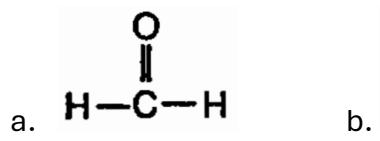
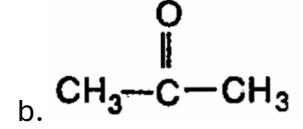
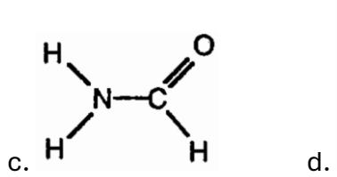
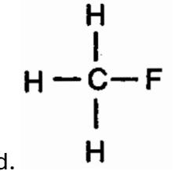
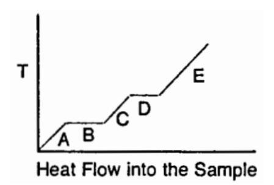
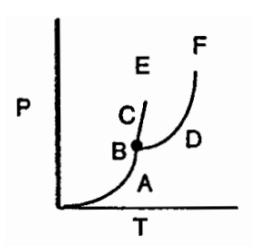
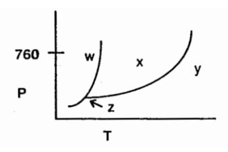
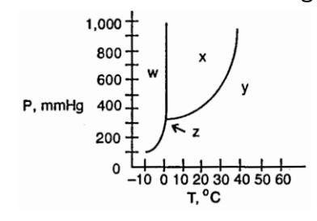

## Chemistry 1411

## Chapter 11 Sample Exam

- 1. In liquids, the attractive Intermolecular forces are
  - a. Very weak compared with kinetic energies of the molecules
  - b. Strong enough to hold molecules relatively close together
  - c. Strong enough to keep the molecules confined to vibrating about their fixed lattice points
  - d. Not strong enough to keep molecules from moving past each other
  - e. Strong enough to hold molecules relatively close together but not strong enough to keep molecules from moving past each other
- 2. The strength of ion-dipole forces is proportional to
  - a. 3 / 2
  - b. 1/ 3
  - c. 12 ∕ 2
  - d. ∕ 2
- 3. Which one of the following should have the lowest boiling point?
  - a. 3
  - b. 2
  - c.
  - d. 4
- 4. Hydrogen bonding is a special case of
  - a. London-dispersion forces
  - b. Ion-dipole attraction

- c. dipole-dipole attraction
- d. None of these
- 5. What is the predominant intermolecular force in 4?
  - a. London-dispersion forces
  - b. ion-dipole attraction
  - c. ionic bonding
  - d. dipole-dipole attraction
  - e. hydrogen-bonding
- 6. What is the predominant intermolecular force in 3?
  - a. London-dispersion forces
  - b. Ion-dipole attraction
  - c. Ionic bonding
  - d. Dipole-dipole attraction
  - e. Hydrogen-bonding
- 7. The intermolecular force(s) responsible for 4 's having the lowest boiling point in the set 4 , 4 , 4 , 4 is/are
  - a. Hydrogen bonding
  - b. Dipole-dipole interactions
  - c. London-dispersion forces
  - d. mainly hydrogen bonding but also dipole-dipole interactions
  - e. mainly London dispersion forces but also dipole-dipole Interactions
- 8. Which one of the following substances has dispersion forces as its only intermolecular force?
  - a. 3
  - b. 3
  - c. 2
  - d. 4

9. Which one of the following substances would have hydrogen bonding as one of its intermolecular forces?

- 10.Which one of the following substances would have the highest boiling point?
  - a. 2
  - b. 2
  - c. 4
  - d.
- 11. Which one of the following substances would have the greatest surface tension at 25° ?
  - a. 4
  - b. 3
  - c. 3
  - d. 2
- 12. Which one of the following is an exothermic process?
  - a. Melting
  - b. Subliming
  - c. Freezing
  - d. Boiling
- 13. The curve below was generated by measuring the heat flow and temperature of a solid as it was heated. Which physical state of this substance has the greatest heat capacity?

- a. Gas
- b. Liquid
- c. solid
- 14. The vapor pressure of a liquid
  - a. increases linearly with increasing temperature
  - b. increases nonlinearly with increasing temperature
  - c. decreases linearly with increasing temperature
  - d. decreases nonlinearly with increasing temperature
  - e. is totally unrelated to its molecular structure
- 15. What effect does molecular weight have on the vapor pressure of straight chain hydrocarbons, (2+2)?
  - a. vapor pressure increases as molecular weight increases
  - b. vapor pressure increases as molecular weight decreases
  - c. Molecular weight has no effect on vapor pressure
- 16. Increasing the amount of liquid in a closed container will cause the vapor pressure of the liquid to
  - a. Increase
  - b. Decrease
  - c. Remain the same
  - d. Depends on the liquid
- 17. On the diagram below, the coordinates of point \_\_\_\_\_\_\_\_ correspond to the critical temperature and pressure

ZM 9.25.25 4

- a. A
- b. B
- c. C
- d. D
- e. E
- f. F

18. Using the phrase diagram below, identify the region that corresponds to the solid phase.

- a. W
- b. X
- c. Y
- d. Z

19. What is the normal boiling point of this substance?

- a. -3
- b. 10

- c. 25
- d. 38
- 20. A solid was found to slowly soften and eventually become liquid upon heating. What type of solid was it?
  - a. Crystalline
  - b. Amorphous
- 21. How many atoms are actually contained within a face-centered cubic unit cell?
  - a. 1
  - b. 1.5
  - c. 3
  - d. 4
  - e. 2
- 22. Crystalline solids differ from amorphous solids in that crystalline solids have
  - a. appreciable intermolecular attractive forces
  - b. a long-range repeating pattern of atoms, molecules, or ions
  - c. atoms, molecules, or ions that are close together
  - d. much larger atoms, molecules, or ions
- 23. The solid of which one of the following has the highest melting point?
  - a. 4
  - b. 4
  - c. 4
  - d. 4
- 24. The type(s} of solid generally characterized by very high melting point, great hardness, and extremely low electrical conductivity is/are
  - a. Ionic
  - b. Molecular
  - c. Metallic
  - d. Network covalent
  - e. Both metallic and network covalent

## 25. Which choice below is not characteristic of a metallic solid?

- a. Excellent thermal conductivity
- b. Excellent electrical conductivity
- c. Variable hardness (function of identity of metal)
- d. Extreme brittleness
- e. Variable melting point (function of identity of metal)

## Answers:

- 1. E
- 2. D
- 3. D
- 4. C
- 5. A
- 6. D
- 7. C
- 8. D
- 9. C
- 10.A
- 11.C
- 12.C
- 13.B
- 14.B
- 15.B
- 16.C
- 17. F
- 18.A
- 19.C
- 20.B
- 21.D
- 22.B
- 23.C
- 24.D
- 25.D