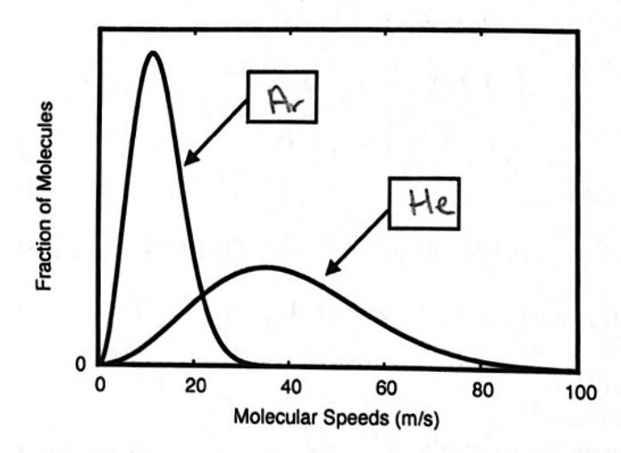

| NAME_ | KEY |
|-------|-----|
|-------|-----|

Section \_\_\_\_\_

## CHEMISTRY 141 Second Hour Exam, October 25, 2018

Part I. Short Answer (5 points each) (Answer 7 of 8) Cross out the question that you skip.

1) Calculate the value of  $\Delta E$  in joules for a system that loses 73 J of heat and has 150 J of work performed on it by the surroundings. q = -73 J  $\omega = +150$ 

2) Given the following conditions, indicate how the internal energy of the system change.

Answer either Increase, Decrease, or Not Enough Data.

a) The system loses heat and does work on the surroundings. Decrease

b) The system gains heat and does work on the surroundings. Not Enough Date

c) The system loses heat and has work done on it by the surroundings. Not Enough Data

d) The system gains heat and has work done on it by the surroundings. Increase

e) The system loses heat and there is no work done on it by the surroundings. Decrease

3) What is the oxidation number of each METAL in the following:

E

4) Which solution has the same number of moles of NaOH as 50.00 mL of 0.100M solution of NaOH? Circle one answer.

c) 30.00 mL of 0.145M solution of NaOH d) 50.00 mL of 0.125M solution of NaOH

5) Write the balanced exchange reaction between potassium chloride and silver nitrate. Include all phases.

KCI(an) + Ag NO3(an) -> AgCI(s) + KNO3(an)

- 6) Label each statement as either True or False.
  - a) If the temperature of a gas is raised from 50 °C to 100 °C, the average kinetic energy will decrease. False
  - b) If the volume of a gas is decreased from 2.0 L to 1.0 L and the temperature remains constant, the pressure will increase.
  - c) If the temperature of a gas is decreased from 150 °C to 100 °C, the root-mean-squared speed will stay the same. \_\_\_\_\_\_\_\_\_\_\_\_\_\_\_\_\_\_\_\_\_\_\_\_\_\_\_\_\_\_\_\_\_\_\_\_
  - d) According to the kinetic molecular theory of gases, pressure of the gas is caused by collisions of the gas molecules with the container. \_\_\_\_\_\_
  - e) According to the kinetic molecular theory of gases, at a given temperature all gas molecules with the same molecular weight will move at identical speeds.
- 7) Below is a plot of the molecular speeds of two ideal gases. One shows the molecular speeds for argon and the other for helium. Label each curve.

8) A mixture of 0.2 mol of  $N_2$  (g) and 0.3 mol of Ar (g) are in a container of unknown volume. The pressure inside the container is 1.0 atm and the temperature is 0.0 °C. What is the volume of the container?

Part II. Longer Problems (11 points each) (Answer 3 of 4) Cross out the question that you skip.

9) Predict the products when the following reagents react. For full credit, balance each reaction label all phases, and indicate what type of reaction takes place.

Type of Reaction: Precipitation Reaction. Exchange (Metathesis) for partial credit
b) HClO4 (aq) + KOH (aq) > H20 (l) + KClO4 (aq)

Type of Reaction: Acid-Base Newtralization, Newtralization, Exchange for portral c) HI (1) + H2O(1) > H3O+ (aq) + I- (aq)

Type of Reaction: Strong Acid Reaction

10) Balance the following Reduction-Oxidation Reaction in acidic conditions. Pb (s) +  $H_2SO_4$  (aq)  $\Rightarrow$  PbO (s) +  $SO_2$  (g)

Oxidation 
$$H_{20} + Pb \rightarrow Pb0 + 2H^{\dagger} + 2e^{-}$$
.

Teduction  $2H^{\dagger} + H_{2}SO_{4} + 2e^{-} \rightarrow So_{2} + 2H_{20}$ 
 $Pb(s) + H_{2}SO_{4}(\omega_{1}) \rightarrow Pb0 (s) + So_{2}(s) + H_{2}O(e)$ 

11) When 1.0 mol of ethanol (C2H6O) is combusted with excess O2 at 400°C and in a 10.0 liter container, what is the final pressure of each product, assuming *all* products are in the gas state?

- 12) To determine how much lead (Pb2+) is in an unknown water sample it is titrated to the equivalence point with a 0.010 M Na2SO4 (aq) solution.
- a. Write out the balance chemical reaction between lead nitrate and sodium sulfate.

b. You find that it takes 4.1 mL of 0.010 M Na2SO4 to reach the equivalence point for a 3.0 L water sample. What is the *original* concentration of the lead ions in the water?

## Part III. Long Problems (16 points each) (answer 2 of 3) Cross out the question that you skip.

13) A. Based on the following information:

$$CaCO_3(s) \rightarrow CaO(s) + CO_2(g)$$

$$\Delta H = 178.1 \text{ kJ}$$

$$C (s, graphite) + O_2(g) \rightarrow CO_2(g)$$

$$\Delta H = -393.5 \text{ kJ}$$

What is the enthalpy of the reaction?

 $CaCO_3(s) \rightarrow CaO(s) + C(s, graphite) + O_2(g)$ .

B. Based on your answer in part A, when 10.0 g of calcium carbonate decomposes into calcium oxide, graphite, and oxygen in a coffee cup calorimeter, what is the expected temperature change of the calorimeter assuming the specific heat of the calorimeter is 4.07 J/g °C and the mass of the

calorimeter is 1000. g. Be sure to clearly indicate if the temperature increases or decreases.

$$q_{cal} = m C_s \Delta T$$

$$q_{cal} = m C_s \Delta T$$

$$q_{cal} = q_{ren} = \Delta H_{ren} \cdot n_{caco_3}$$

$$q_{cal} = q_{ren} = 57.109 \text{ KJ} \cdot \frac{10.09 \text{ Caco}_3}{100.0869/\text{mad}} = 57.1109 \text{ KJ}$$

$$-57.1109 \text{ KJ} \cdot \frac{1000}{1100} = m C_s \Delta T$$

$$-57.110.9 \text{ J} = 1000.9 \cdot 4.07 \text{ J/g} \cdot c \cdot \Delta T \Rightarrow \Delta T = -14.0 \cdot c$$

 $\Delta H = 571. \omega kJ.$ 

14) A 100.0 L container at 25 °C has a partial pressure of N2 (g) of 0.50 atm and a partial pressure of O2 (g) of 1.5 atm. After the following reaction takes places, what are the partial pressures of each of the molecules?

$$P_{N2} =$$

15) One of the chief concerns of using carbon-based fuels is the release of the greenhouse gas CO2 into the atmosphere. It would be best to use a fuel that releases a lot of heat and the least amount of CO2. Using enthalpy of combustions, determine which fuel, glucose (C6H12O6) or octane (C8H18), has a higher heat of reaction *per mole of CO2 created*.

Use the table below of enthalpy of formations and balanced combustion reactions to determine kJ/mole CO2 for each fuel.

Glucose: -467.2 kJ/ mole CO2

Octane: -886.7 kJ/mole CO2 & More energy per mol CO2 !

| Molecule                                                | $\Delta H_{f^0}$ (kJ/mol) |
|---------------------------------------------------------|---------------------------|
| C 6 H 12 O 6 (Glucose) | -1273.02                  |
| C 8 H 18 (Octane)                 | -226.61                   |
| CO 2                                         | -393.5                    |
| H 2 O (1)                                    | -285.83                   |

Co Hiz Oo+ 602 (g) -> (e Coz (g) + lettzOll)

DHrm = 60H f cor + 60 DH f H20(8) - DHG COHIZOG - 60 SHG OZ = 6 (-393,5 KJ) + 6 (-285,83 KJ) - (-1273.02 KJ) - OY

= -2802.96 KJ

DHAM/molcoz = -2802.96 KJ/6molcoz = -467.16 KJ/molcoz

C8 H18 + 25 0219 -> 8 COZIg+ 9 H20 (2)

Offin = 8 DHicoz + 9 DHg Hro - DHig C8HB - 25 DHg OZ

-0 Divide -0 Divide -0 Divide -0 Divide -0 Divide -0 Divide -0 Divide -0 Divide -0 Divide -0 Divide -0 Divide -0 Divide -0 Divide -0 Divide -0 Divide -0 Divide -0 Divide -0 Divide -0 Divide -0 Divide -0 Divide -0 Divide -0 Divide -0 Divide -0 Divide -0 Divide -0 Divide -0 Divide -0 Divide -0 Divide -0 Divide -0 Divide -0 Divide -0 Divide -0 Divide -0 Divide -0 Divide -0 Divide -0 Divide -0 Divide -0 Divide -0 Divide -0 Divide -0 Divide -0 Divide -0 Divide -0 Divide -0 Divide -0 Divide -0 Divide -0 Divide -0 Divide -0 Divide -0 Divide -0 Divide -0 Divide -0 Divide -0 Divide -0 Divide -0 Divide -0 Divide -0 Divide -0 Divide -0 Divide -0 Divide -0 Divide -0 Divide -0 Divide -0 Divide -0 Divide -0 Divide -0 Divide -0 Divide -0 Divide -0 Divide -0 Divide -0 Divide -0 Divide -0 Divide -0 Divide -0 Divide -0 Divide -0 Divide -0 Divide -0 Divide -0 Divide -0 Divide -0 Divide -0 Divide -0 Divide -0 Divide -0 Divide -0 Divide -0 Divide -0 Divide -0 Divide -0 Divide -0 Divide -0 Divide -0 Divide -0 Divide -0 Divide -0 Divide -0 Divide -0 Divide -0 Divide -0 Divide -0 Divide -0 Divide -0 Divide -0 Divide -0 Divide -0 Divide -0 Divide -0 Divide -0 Divide -0 Divide -0 Divide -0 Divide -0 Divide -0 Divide -0 Divide -0 Divide -0 Divide -0 Divide -0 Divide -0 Divide -0 Divide -0 Divide -0 Divide -0 Divide -0 Divide -0 Divide -0 Divide -0 Divide -0 Divide -0 Divide -0 Divide -0 Divide -0 Divide -0 Divide -0 Divide -0 Divide -0 Divide -0 Divide -0 Divide -0 Divide -0 Divide -0 Divide -0 Divide -0 Divide -0 Divide -0 Divide -0 Divide -0 Divide -0 Divide -0 Divide -0 Divide -0 Divide -0 Divide -0 Divide -0 Divide -0 Divide -0 Divide -0 Divide -0 Divide -0 Divide -0 Divide -0 Divide -0 Divide -0 Divide -0 Divide -0 Divide -0 Divide -0 Divide -0 Divide -0 Divide -0 Divide -0 Divide -0 Divide -0 Divide -0 Divide -0 Divide -0 Divide -0 Divide -0 Divide -0 Divide -0 Divide -0 Divide -0 Divide -0 Divide -0 Divide -0 Divide -0 Divide -0 Divide -0 Divide -0 Divide -0 Divide -0 Divide -0 Divide -0 Divide -0 Divide -0 Divide -0 Divide -0 Div

= -5493.86 KJ

Attron/mor coz = -5493.86 KJ/8 mol coz = -886.7 KJ/ml

Scores: Part I \_\_\_\_\_\_, Part II \_\_\_\_\_\_, Part III \_\_\_\_\_\_, Grade \_\_\_\_\_