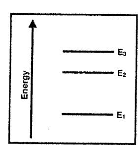
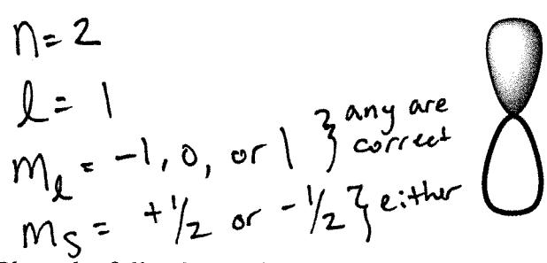
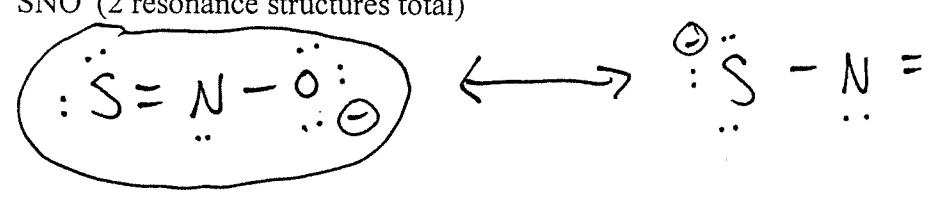
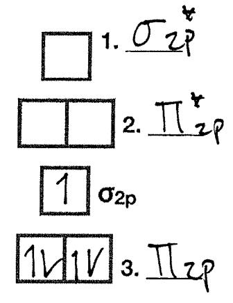

## Chemistry 141 Third Exam Fall 2018

Part I. Short Answer. Answer 7 of the next 8 questions. You MUST cross out the one you wish not to be graded. 5 points each.

1. Place the following elements in order of increasing first ionization energy: Mg, Na, Rb, Cl.

lowest IE  $\frac{Rb}{Rb} < \frac{Na}{La} < \frac{Mq}{La} < \frac{Cl}{La}$  highest IE

2. Which transition would involve the emission of a photon with the longest wavelength?

Circle ONE A)  $E_1 \rightarrow E_3$ B)  $E_2 \rightarrow E_3$ C)  $E_3 \rightarrow E_1$  $D_{\lambda}E_3 \rightarrow E_2$ 

longest wavelength is the lowest DE. E= hc

3. Place the following isoelectronic ions in order of increasing ionic radius.  $Na^{+}$ ,  $O^{2-}$ ,  $F^{-}$ 

smallest radius  $Ma^+ < F^- < O^{2-}$  largest radius

4. Identify the elements or ions represented by the following electronic configurations.

 $X^{-}$  [He]  $2s^{2} 2p^{4}$ 

 $X^{2+}$  [Ar]  $3d^2$ 

$$X^{2+} = Ti^{2+}$$

 $X: [Kr] 5s^2 4d^{10} 5p^4$ 

5. Give the ground state electronic configuration for the following atoms and ions.

A) Cl

6. Identify four quantum numbers that can be used to describe an electron in the depicted atomic orbital.

7. Place the following molecules in order of increasing polarity: HF, Cl2, NO, HCl.

> less polar C/2 < NO < HCI < HF more polar

8. Which third period element has the successive ionization energies (IE) given in kJ/mol in the table?

| IE (1) |     | IE(2) | IE(3) | IE(4) |  |
|--------|-----|-------|-------|-------|--|
| Ĺ      | 737 | 1451  | 7733  | 10540 |  |

A) Cl B) P (C) Mg D) Na

Mg has a really high 3rd lonitation Energy belove l is removed from the noble gas core

Part II. Problems. Answer 3 of the next 4 questions. You MUST cross out the one you wish not to be graded. 11 points each.

9. A. Calculate the uncertainty in position of an electron moving at a speed of  $(1.50 \times 10^5 \pm 1. \times 10^3)$  m/s.

 $0 \times 7 \frac{h}{4\pi \, \text{m bV}} \frac{6.626 \times 10^{-34} \, \text{J} \text{S}}{4.71 \cdot 9.10939 \, \text{s} \times 10^{-31} \, \text{kg} \cdot 10^{3} \, \text{m}} \frac{7}{5.79 \, \text{s} \times 10^{-8} \, \text{m}}}{0 \times 7 \, 6 \times 10^{-8} \, \text{m}}$ 

B. Is the uncertainty in position larger or smaller than the de Broglie wavelength of the electron Show your work.

ow your work.  $\chi = \frac{h}{mv} = \frac{(6.626 \times 10^{-34} \text{ Js})}{9.10939 \times 10^{-31} \text{ kg} \cdot [.5 \times 10^{5} \text{ m}]} = 0.4849 \times (6^{-8} \text{ m})}{1.5 \times 10^{-9} \text{ m}} = 0.4849 \times (6^{-8} \text{ m})}$ The uncertainty is larger than the wavelength.

| CH141  | Third  | Evam |
|--------|--------|------|
| CILLAI | LIIIIU | Cxam |

|   | 1   |   |
|---|-----|---|
| _ | . 1 |   |
| - | .,  | - |

initials Key

10. How many electrons in an atom can have the following quantum numbers?

A) n=2, l=3,  $m_1=-3$ 

\_\_\_\_\_electrons

B) n=2 *l*=0

electrons

C) n=3, l=2, ms= +1/2

\_\_\_\_\_\_\_\_electrons

11. Label each as having either a paramagnetic or diamagnetic ground state electron configuration. In ONE sentence, explain how you know.

A) Ca2+ diamagnetic

Why? All electrons are paired. Electron configuration, 5 the same as Ar

B) K Paramagnific

Why? There is an uppared electron in the 4s orbital

C) O2 Deramagnetic

Why? This was an in class demo. We saw it stick to the magnet. The Mo diagram also shows us thre are unpaired e in the Tizp orbital.

12. **Fill** the empty MO diagrams below and **rank** H2, H2, and H2+ in terms of increasing bond order.

 $\begin{array}{cccccccccccccccccccccccccccccccccccc$ 

Bond order = (# e- in bonding orbitals) - (# e- in antiboday orbitals)

) \_ 1/ = 1

Hz=1/2

Hz+=1/2

Ranking: Hz = Hz < Hz

Part III. Problems. Answer 2 of the next 3 questions. You MUST cross out the one you wish not to be graded. 16 points each.

- 13. Isoprene is a molecule produced and naturally released into the atmosphere by plants. It is partially responsible for making the Blue Ridge Mountains in Virginia appear blue.
- A) Complete the Lewis structure of isoprene (C5H8) so that all formal charges are zero. Fill in the blanks about the molecular geometry and bond angles of the three indicated carbons.

$$\begin{array}{cccccccccccccccccccccccccccccccccccc$$

The molecular geometry of Ca is +etrahedral. The bond angles of Ca are 109.56.

The molecular geometry of  $C_b$  is  $\frac{120^b}{1000}$ . The bond angles of  $C_b$  are  $\frac{120^b}{1000}$ .

The molecular geometry of  $C_c$  is  $\frac{120^\circ}{}$ . The bond angles of  $C_c$  are  $\frac{120^\circ}{}$ .

- B) Fill in the blank: There are  $\frac{12}{2}$  sigma ( $\sigma$ ) bonds and  $\frac{2}{2}$  pi ( $\pi$ ) bonds in isoprene.
- C) Using the bond enthalpies, what is the enthalpy of combustion for isoprene (C5H8) expressed in kJ/mol?

| Bond Type                    | С-Н | C-C | C-O | О-Н | C=O | C=C | 0=0 |
|------------------------------|-----|-----|-----|-----|-----|-----|-----|
| Bond Enthalpy (kJ/mol) | 413 | 348 | 358 | 463 | 799 | 614 | 495 |

$$DH = H(bands broken) - H(bands formed)$$
  
 $DH = 8(C-H) + 2(C-C) + 2(C=0) + 7(0)$ 

$$\Delta H = 8(C-H) + 2(C-C) + 2(C=0) + 7(0=0)$$

$$-(10(C=0) + 8(H-0))$$

- 14. For each of the following molecules;
- a) draw a reasonable Lewis structure and resonance structures if indicated,
- b) describe the molecular geometry and polarity, and
- c) give the **hybridization** on the central atom.

Trigonal pyramidal H - AS-H Polar H Hypridization Sp3

## B. SO2 (S is central atom)

Polar hybridization SPZ

C. SNO (2 resonance structures total)

But polar hybridization: Spz

D. Circle the most stable resonance structure for SNO in part (C) and in one sentence explain why it is the most stable.

The negative formal charge is placed on the most electronegative atom.

- 15. Below is template for the molecular orbital diagram of BN-
- A) Fill in the labels for the three unnamed molecular orbitals.

$$\boxed{1} \sigma^*_{2s}$$

B) Using the above molecular orbital diagram, determine the bond order of BN.

$$B.0. = \frac{7}{2} - \frac{7}{2} = \frac{5}{2} = 2.5$$

C) Is BN- paramagnetic or diamagnetic?

D) Sketch a picture of the  $\sigma_{2p}$  orbital.

Electron dusity
15 between the two nucle:

B

N

A node 15 Located on\neach atom.