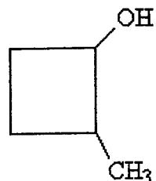
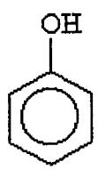

·.

E) amine.

E) aldehyde.

|                                                                                                          | 1) Compounds that have the same molecular formula but different arrangements of atoms are called                                        |            |             |            | 1) |
|----------------------------------------------------------------------------------------------------------|-----------------------------------------------------------------------------------------------------------------------------------------|------------|-------------|------------|----|
| A) isozymes.                                                                                             |                                                                                                                                         |            |             |            |    |
| B) isomers.                                                                                              |                                                                                                                                         |            |             |            |    |
| C) indicators.                                                                                           |                                                                                                                                         |            |             |            |    |
| D) isotopes.                                                                                             |                                                                                                                                         |            |             |            |    |
| E) isometrics.                                                                                           |                                                                                                                                         |            |             |            |    |
|                                                                                                          | 2) The functional group contained in the compound CHJ-CH2-0H is a(n)                                                                    |            |             |            | 2) |
| A) ether.                                                                                                | B) aldehyde.                                                                                                                            | q alcohol. | D) alkene.  | E) ketone. |    |
|                                                                                                          | 3) The special feature that determines the family name and chemical reactivity of the organic compound it is found in is called a(n) |            |             |            | 3) |
| A) organic compound B) identifying group. C)ionicbond D) covalent bond. E) functional group. |                                                                                                                                         |            |             |            |    |
|                                                                                                          | 4) An alkene is a carbon compound that contains a                                                                                       |            | bond.       |            |    |
| A) single                                                                                                | B) hydrogen                                                                                                                             | q double   | D) aromatic | E) triple  | 4) |
|                                                                                                          |                                                                                                                                         |            |             |            |    |
|                                                                                                          |                                                                                                                                         | 0 II    |             |            |    |

0 II 6) The functional group contained in the compound CH 3-CH 2-c-O-CH *3* is a(n) A) carboxylic acid. B) amide. C) ester. D) thiol. 6) \_\_ \_

A) alcohol. B) ketone. q ether. D) alkene.

7) Carbon atoms always have how many covalent bonds? A) four B) three q two D) one E) five 7) \_\_ \_

8) What is the name of this compound? 8) ---

A) butane B) hexane C) heptane D) octane E) pentane

| 9) The reaction of butane with oxygen is called A) neutralization. B) substitution. C) addition. D) titration. E) combustion.                                                              |  9)  |
|-----------------------------------------------------------------------------------------------------------------------------------------------------------------------------------------------------------|---------|
| 10) What is the IUP AC name for this alkane?                                                                                                                                                              |  10) |
| CH2 -CH3 ! ~ I ., CH3 - C H- CH- CH2 - CH3 I CH3                                                                                                                               |         |
| A) 4-ethyl-3-m.ethylpentane B) 2-ethyl-3-methylpentane C) 2, 3-diethylbutane D) 3, 4-dimethylhexane E) octane                                                                                 |         |
| 11) An unsaturated compound always A) contains a double bond. B) contains at least one double or triple bond. C) is a cycloal.kane. D) is aromatic. E) contains a triple bond.             |  11} |
| 12) The lUP AC name of CH3cH = CH-cH3 is                                                                                                                                                                  |  12) |
| A) 1-putene. B) butene. C) 2-butane. D) 2-butene. E) 2-butyne.                                                                                                                                |         |
| 13) Which one of the following compounds has the smallest number of hydrogen atoms? A) 2-methylcyclopropane. B) butyne. C) butane. D) 2-methylpropane. E) butene.                          |  13) |
| 14) What is the condensed structural formula for the compound 3-hexene? A) CH2 = CHcH2-cH2-CH2-cH3 B) CH3-cH = CH-cH2-cH2-cH3 C) CH3cH2cH2-cH = CH-cH3 D) CH3-cH2-cH =CH-cH2-cH3 CH3 E) |  14} |

·.

CH3-CH2 -C H-CH2-CH3

15) Which of the following pairs of compounds are cis-trans isomers?

15) \_\_

A)

·.

CH3, /CH3 /C=C, CH3 CH3 and

B) HC=C-cH3 and CH3-c=CH

q

D)

E)

$$CH_3$$
  $CH_3$   $CH_3$   $CH_3$   $C=C$   $CH_3$   $C=C$   $CH_3$ 

16) What is the major product of the reaction shown below?

$$CH_3-CH_2-CH=CH_2+HOH \rightarrow$$

A) OH OH I I CH3- CH- CH-CH3

B) OH OH I I CH3- CH2- C H- C H2

q OH I CH3-CH2- CH-CH3

E) OH 
$$|$$
 CH3 - CH2 - C = CH2

16) \_\_

| 17) The compound b                                               | pelow is named                                |                       |                                |           | 17) |
|------------------------------------------------------------------|-----------------------------------------------|-----------------------|--------------------------------|-----------|-----|
|                                                                  |                                               |                       |                                |           |     |
| $\Diamond$                                                       |                                               |                       |                                |           |     |
| $[\bigcirc]$                                                     |                                               |                       |                                |           |     |
|                                                                  |                                               |                       |                                |           |     |
| A) cyclobenze                                                    |                                               |                       |                                |           |     |
| B) cyclohexen                                                    |                                               |                       |                                |           |     |
| C) cyclohexyn                                                    | ne.                                           |                       |                                |           |     |
| D) benzene.                                                      |                                               |                       |                                |           |     |
| E) cyclohexan                                                    | ie.                                           |                       |                                |           |     |
| 18) What is the name                                             | e of the compound sho                         | own below?            |                                |           | 18) |
|                                                                  |                                               |                       |                                |           | ,   |
| СН 3 -СН 2 СН 2 - С=С Н Н |                                               |                       |                                | •         |     |
| A) cis-3-hexe                                                    |                                               |                       |                                |           |     |
| B) trans-3-he                                                    |                                               |                       |                                |           |     |
| C) cis-2-hexer                                                   |                                               |                       |                                |           |     |
| D) 3-hexyne                                                      |                                               |                       |                                |           |     |
| E) 3-hexene                                                      |                                               |                       |                                |           |     |
| ·                                                                |                                               |                       |                                |           |     |
| 19) Which of the follo                                           | owing compounds co                            | uld have the molecula | ar formula C7H 16 ? |           | 19) |
| A) 2-methylhe                                                    | eptane                                        |                       |                                |           |     |
| B) 3-ethylhex                                                    |                                               |                       |                                |           |     |
| C) pentane                                                       |                                               |                       |                                |           |     |
| D) hexane                                                        |                                               |                       |                                |           |     |
| E) 2,3-dimeth                                                    | ylpentane                                     |                       |                                |           |     |
| 20) What is the name                                             | of the alkyl group CF                         | Ha= CHa= CHa=?        |                                |           | 20) |
| A) ethyl                                                         | B) propyl                                     | C) propane            | D) methyl                      | E) ethane |     |
| rij cutyi                                                        | b) propyr                                     | C) proparie           | D) Heatyr                      | L) ediane | •   |
| 21) The compound C                                               | H 3 CH 2 - SH is in the | organic family know   | n as                           |           | 21) |
| A) ethers.                                                       |                                               |                       |                                |           |     |
| B) sulfides.                                                     |                                               |                       |                                |           |     |
| C) alcohols.                                                     |                                               |                       |                                |           |     |
| D) amino acids                                                   | 3.                                            |                       |                                |           |     |
| E) thiols.                                                       |                                               |                       |                                |           |     |

| 22) V | What is | the IUPAC | name for | this | compound |
|-------|---------|-----------|----------|------|----------|
|-------|---------|-----------|----------|------|----------|

22) \_\_\_\_\_

- A) 2-methylcyclobutanol.
- B) 2-hydroxy-1-methylcyclobutane.
- C) cyclobutylmethanol.
- D) 2-methyl-1-cyclobutanol.
- E) methylcyclobutanol.
- 23) What is the name for this compound?

23) \_\_\_\_\_

- A) cyclobenzenol.
- B) phenol.
- C) cyclohexanol.
- D) cyclopentanol.
- E) glycerol.
- 24) The dehydration product of  $CH_3$ — $CH_2$ — $CH_2$ —O—H in the presence of acid is

24)

- A) cyclopropane.
- B) propyne.
- C)  $CH_2 = C = CH_2$ .
- D) cyclopropene.
- E) propene.
- 25) In the oxidation of an alcohol to a ketone, there is

25)

- A) a loss of oxygen.
- B) a loss of carbon.
- C) a gain of oxygen.
- D) a gain of hydrogen.
- E) a loss of hydrogen.

26) What is the product when this compound undergoes gentle oxidation?

26) \_\_

CH3 I CH3 - C - CH2 - CH2 - OH I CH3

A) hexanal

·.

- B) 3,3-dimethyl-1-butanone
- C) 2,2-dimethyl-4-butanone
- D) 2,2-dimethylbutanal
- E) 3,3-dimethylbutanal
- 27) Tertiary alcohols cannot be oxidized because
  - A) there are no hydrogen atoms attached to the alcohol carbon.
  - B) the alcohol carbon is too electronegative to have hydrogen removed from it.
  - C) the alcohol carbon is bonded to four groups so no hydrogen can be added to it.
  - D) the alcohol carbon is bonded to four groups so no oxygen can be added to it.
  - E) there are no oxygen atoms to remove from the alcohol carbon.
- 28) In the dehydration of an alcohol to an alkene, what is produced in addition to the alkene?
- 28) ---

29) \_\_

- A) water
- B) oxygen
- C) carbon monoxide
- D) hydrogen
- E) carbon dioxide
- 29) Thiols can be gently oxidized to
  - A) carboxylic acids.
  - B) disulfides.
  - C) thioethers.
  - D) aldehydes.
  - E) ketones.

30) Which of the following compounds contains a ketone functional group?

30) \_\_

'.

- A) 0 II CH3-CH2- C -CH3
- C) 0 II CH3- C-H
- D) CH3 I CH3- C-0-H I CH3

31) Which functional group is a carboxylic acid?

- A)- OH
- C) OH I - C-OH I
- D) 0 II -C-OH
- E) 0 II -C-0-

32) Which of the following is found in vinegar?

- A) formic acid
- B) butyric acid
- C) propionic acid
- D) acetic acid
- E) nitric acid

31) \_\_

32) \_\_

33) What is the IUP AC name for this compound? 33) ---

. ..

CH3 0 I II CH3 -C H-CH2 -C -OH

- A) 2-methyl butyric acid
- B) pentanoic acid

·.

- C) 2-methyl-4-butanoic acid
- D) 2-methylbutanoic acid
- E) 3-methylbutanoic acid

34) The neutralization of formic acid by NaOH produces 34) \_\_ \_

- A) formate ion and hydronium ion.
- B) methyl alcohol.
- C) sodium formate as the only product.
- D) sodium formate and H20.
- E) sodium formaldehyde.

35) Which of the following is the reaction for the neutralization of 3-hydroxybutanoic acid with NaOH? 35) \_\_ \_

A) OH 0 OH 0 I II I II CH3 -C H-CH2 -C -OH + NaOH - CH3 -C H-CH2 -C -0- Na+ + H20

B) O O 
$$\parallel$$
  $\parallel$   $\parallel$   $\parallel$  CH3-CH2-CH- C - OH + 2 NaOH  $\rightarrow$  CH3-CH2-CH- C - O-Na+ + H2O  $\parallel$  O H O H

C) OH 0 OH 0 I II I II CH3-CH2- C H- C -OH + NaOH - CH3-CH2 -C H -C -O-Na+ + H20

D) OH 0 o-Na+ 0 I II I II CH3 -C H-CH2 -C -OH + 2 NaOH - CH3 -C H-CH2- C -O-Na+ + 2 H20

E) OH 0 OH 0 I II I II CH3 -C H-CH2 -C- OH + NaOH - CH3 -C -CH2 -C -OH + NaH I OH

36) What is the name of this compound?

36) \_\_

A) diethyl ester

·.

- B) ethyl methanoate
- q 2-ether-2-butanone
- D) ethyl methyl ester
- E) ethyl acetate

37) Which of these compounds is the ester formed from the reaction of acetic acid and 1-propanol? 37) \_\_ \_

A) 0 II CH3-CH2-CH2-0-CH2 -C -OH

B) OH I CH3-CH2 -C- OH I O-CH2-CH3

q OH I CH3-C-OH I 0 -CH2-CH2-CH3

D) 0 II GH3 -C -O-CH2-CH2-CH3

E) 0 II CH3-CH2- C -O-CH2-CH3

38) The reaction of an ester with NaOH is known as

38) ---

- A) neutralization.
- B) esterification.
- q saponification.
- D) oxidation.
- E) reduction.

| 39) What is the common name for ethanoic acid? |  39) |
|------------------------------------------------|---------|

- A) citric acid
- B) acetic acid
- C) formic acid
- D) butyric acid
- E) stearic acid
- 40) What is the major functional group in the following compound? 40) \_\_

'. "" ..

' .

- A) amine
- B) amide
- C) ketone
- D) ester

...

E) carboxylic acid

## Answer Key

## Testname: SAMPLE( CHAP 10,11,12,14) CHEM 1406 FALL 2011

- 1) B
- 2) c
- 3) E
- 4) c
- 5) E
- 6) c
- 7)A
- 8) c
- 9) E
- 10) D
- 11) B
- 12) D
- 13) B
- 14) D
- 15) E
- 16) c
- 17) D
- 18) A
- 19) E
- 20) B
- 21) E
- 22)A
- 23) B
- 24) E
- 25) E
- 26) E
- 27)A
- 28)A
- 29) B
- 30)A 31) D
- 32)D
- 33) E
- 34)D
- 35)A
- 36) E
- 37)D
- 38) c
- 39) B
- 40) B