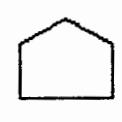
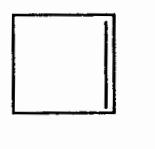
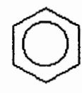
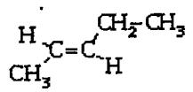
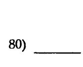
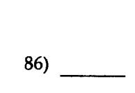

Dr. Ranjana Segal

SEGAL, R. CHEM 1406

| Mama | not remove tape, staples or separate pages. |
|------|---------------------------------------------|
| N    | /1                                          |

| MULTIPLE CHOICE. | Choose the one alternative that | t best completes the statement or a | nswers the question. |
|------------------|---------------------------------|-------------------------------------|----------------------|
|------------------|---------------------------------|-------------------------------------|----------------------|

| 1) How many centi                     | meters are there in 57.0 | in.?                    |                        |                       | 1) |
|---------------------------------------|--------------------------|-------------------------|------------------------|-----------------------|----|
| A) 140 cm                             | B) 22.4 cm               | C) 0.0445 cm            | D) 22 cm               | E) 145 cm             |    |
| 2) Miliah of the foll                 | owing is a measuremen    | t of mass in the met    | ric exetam?            |                       | 2) |
| •                                     | owing is a measuremen    | t of mass it the met    | ne system.             |                       |    |
| A) meter                              |                          |                         |                        |                       |    |
| B) centimeter                         |                          |                         |                        |                       |    |
| C) Celsius                            |                          |                         |                        |                       |    |
| D) milliliter                         |                          |                         | •                      |                       |    |
| E) kilogram                           |                          |                         |                        |                       |    |
| 3) The measuremen                     | nt 0.000 004 3 m, expres | sed correctly using s   | cientific notation, is |                       | 3) |
| A) 0.43 x 10 <sup>-5</sup>            | m.                       |                         |                        |                       |    |
| B) $4.3 \times 10^{-7}$               | m.                       |                         |                        |                       |    |
| C) 4.3 m.                             |                          |                         |                        |                       |    |
| D) 4.3 x 10 <sup>-6</sup> s           | m.                       |                         |                        |                       |    |
| E) 4.3 x 10 <sup>6</sup> m            | ı <b>.</b>               |                         |                        |                       |    |
| 1) Minish of the fall                 | owing numbers contain    | s the decimated CC      | DDECT number of a      | vicanificant ficures? | 4) |
| A) 156 000                            | 3 significant figures    | s the designated CC     | ACCI number or s       | ngiuncant figures:    | 4) |
| •                                     |                          |                         |                        |                       |    |
| B) 0.04300                            | 5 significant figures    |                         |                        |                       |    |
| C) 3.0650                             | 4 significant figures    |                         |                        |                       |    |
| D) 0.00302                            | 2 significant figures    |                         |                        |                       |    |
| E) 1.04                               | 2 significant figures    |                         |                        |                       |    |
| 5) How many kilog                     | grams are in 30.4 lb?    |                         |                        |                       | 5) |
| A) 66.88 kg                           | B) 13.8 kg               | C) 66.9 kg              | D) 14 kg               | E) 67 kg              |    |
| 6) Diamond has a c<br>mass of 15.1 g? | lensity of 3.52 g/mL. WI | nat is the volume in    | cubic centimeters of   | a diamond with a      | 6) |
| A) 0.233 cm <sup>3</sup>              | B) 53.2 cm <sup>3</sup>  | C) 4.29 cm <sup>3</sup> | D) 4.3 cm <sup>3</sup> | E) 53 cm <sup>3</sup> |    |

## DO NOT REMOVE FROM TCC LIBRARY -

| 7)<br>_<br>7) Which of the following is an example of potential energy?<br>A) water stored in a reservoir<br>B) a fan blade turning<br>q riding an exercise bike<br>D) chewing food<br>E) burning wood<br><br>8)<br>_<br>8) A temperature of 41 op is the same as<br>B) 42"C.<br><br>9)<br>_<br>9) Absolute zero is<br>A) the boiling point of liquid nitrogen.<br>B) the freezing point of water using the Celsius scale.<br>q the temperature on the Kelvin scale corresponding to 32°F.<br>D) the coldest temperature possible.<br>E) the freezing point of liquid nitrogen.<br><br>10)<br>10) In a gas, the distance between the particles is<br>A) very close relative to the size of the molecules.<br>B) fixed relative to the size of the molecules.<br>q close relative to the size of the molecules.<br>D) very large relative to the size of the molecules.<br>E) small relative to the size of the molecules.<br>11) How many calories are required to increase the temperature of 13 g of alcohol from ll°C to 23°C?<br>11)<br>The specific heat of alcohol is 0.58 cal/g oe,<br>q 170cal<br>E) 90. cal<br>D)0.54cal<br>B) 83cal<br>A) 0.63cal<br><br>12) A potato contains 20 g of carbohydrate. If carbohydrate has a caloric value of 4 kcal/g, how many<br>12)<br>kcal are obtained from the carbohydrate in the potato?<br>q 60kcal<br>E) 40kcal<br>D) 80kcal<br>B) 20kcal<br>13)<br>13) What is the density of a substance with a mass of 45.00 g and a volume of 26.4 mL?<br>A) 0.587 g!mL<br>B) 1.7 g!mL<br>q 45.0g!mL<br>D) 1.70g!mL |             |  |  |  |
|------------------------------------------------------------------------------------------------------------------------------------------------------------------------------------------------------------------------------------------------------------------------------------------------------------------------------------------------------------------------------------------------------------------------------------------------------------------------------------------------------------------------------------------------------------------------------------------------------------------------------------------------------------------------------------------------------------------------------------------------------------------------------------------------------------------------------------------------------------------------------------------------------------------------------------------------------------------------------------------------------------------------------------------------------------------------------------------------------------------------------------------------------------------------------------------------------------------------------------------------------------------------------------------------------------------------------------------------------------------------------------------------------------------------------------------------------------------------------------------------------------------------------------------------------------|-------------|--|--|--|
|                                                                                                                                                                                                                                                                                                                                                                                                                                                                                                                                                                                                                                                                                                                                                                                                                                                                                                                                                                                                                                                                                                                                                                                                                                                                                                                                                                                                                                                                                                                                                            |             |  |  |  |
|                                                                                                                                                                                                                                                                                                                                                                                                                                                                                                                                                                                                                                                                                                                                                                                                                                                                                                                                                                                                                                                                                                                                                                                                                                                                                                                                                                                                                                                                                                                                                            |             |  |  |  |
|                                                                                                                                                                                                                                                                                                                                                                                                                                                                                                                                                                                                                                                                                                                                                                                                                                                                                                                                                                                                                                                                                                                                                                                                                                                                                                                                                                                                                                                                                                                                                            |             |  |  |  |
|                                                                                                                                                                                                                                                                                                                                                                                                                                                                                                                                                                                                                                                                                                                                                                                                                                                                                                                                                                                                                                                                                                                                                                                                                                                                                                                                                                                                                                                                                                                                                            |             |  |  |  |
|                                                                                                                                                                                                                                                                                                                                                                                                                                                                                                                                                                                                                                                                                                                                                                                                                                                                                                                                                                                                                                                                                                                                                                                                                                                                                                                                                                                                                                                                                                                                                            |             |  |  |  |
|                                                                                                                                                                                                                                                                                                                                                                                                                                                                                                                                                                                                                                                                                                                                                                                                                                                                                                                                                                                                                                                                                                                                                                                                                                                                                                                                                                                                                                                                                                                                                            |             |  |  |  |
|                                                                                                                                                                                                                                                                                                                                                                                                                                                                                                                                                                                                                                                                                                                                                                                                                                                                                                                                                                                                                                                                                                                                                                                                                                                                                                                                                                                                                                                                                                                                                            |             |  |  |  |
|                                                                                                                                                                                                                                                                                                                                                                                                                                                                                                                                                                                                                                                                                                                                                                                                                                                                                                                                                                                                                                                                                                                                                                                                                                                                                                                                                                                                                                                                                                                                                            |             |  |  |  |
|                                                                                                                                                                                                                                                                                                                                                                                                                                                                                                                                                                                                                                                                                                                                                                                                                                                                                                                                                                                                                                                                                                                                                                                                                                                                                                                                                                                                                                                                                                                                                            |             |  |  |  |
|                                                                                                                                                                                                                                                                                                                                                                                                                                                                                                                                                                                                                                                                                                                                                                                                                                                                                                                                                                                                                                                                                                                                                                                                                                                                                                                                                                                                                                                                                                                                                            |             |  |  |  |
|                                                                                                                                                                                                                                                                                                                                                                                                                                                                                                                                                                                                                                                                                                                                                                                                                                                                                                                                                                                                                                                                                                                                                                                                                                                                                                                                                                                                                                                                                                                                                            |             |  |  |  |
|                                                                                                                                                                                                                                                                                                                                                                                                                                                                                                                                                                                                                                                                                                                                                                                                                                                                                                                                                                                                                                                                                                                                                                                                                                                                                                                                                                                                                                                                                                                                                            |             |  |  |  |
|                                                                                                                                                                                                                                                                                                                                                                                                                                                                                                                                                                                                                                                                                                                                                                                                                                                                                                                                                                                                                                                                                                                                                                                                                                                                                                                                                                                                                                                                                                                                                            |             |  |  |  |
|                                                                                                                                                                                                                                                                                                                                                                                                                                                                                                                                                                                                                                                                                                                                                                                                                                                                                                                                                                                                                                                                                                                                                                                                                                                                                                                                                                                                                                                                                                                                                            |             |  |  |  |
|                                                                                                                                                                                                                                                                                                                                                                                                                                                                                                                                                                                                                                                                                                                                                                                                                                                                                                                                                                                                                                                                                                                                                                                                                                                                                                                                                                                                                                                                                                                                                            |             |  |  |  |
|                                                                                                                                                                                                                                                                                                                                                                                                                                                                                                                                                                                                                                                                                                                                                                                                                                                                                                                                                                                                                                                                                                                                                                                                                                                                                                                                                                                                                                                                                                                                                            |             |  |  |  |
|                                                                                                                                                                                                                                                                                                                                                                                                                                                                                                                                                                                                                                                                                                                                                                                                                                                                                                                                                                                                                                                                                                                                                                                                                                                                                                                                                                                                                                                                                                                                                            |             |  |  |  |
|                                                                                                                                                                                                                                                                                                                                                                                                                                                                                                                                                                                                                                                                                                                                                                                                                                                                                                                                                                                                                                                                                                                                                                                                                                                                                                                                                                                                                                                                                                                                                            |             |  |  |  |
|                                                                                                                                                                                                                                                                                                                                                                                                                                                                                                                                                                                                                                                                                                                                                                                                                                                                                                                                                                                                                                                                                                                                                                                                                                                                                                                                                                                                                                                                                                                                                            |             |  |  |  |
|                                                                                                                                                                                                                                                                                                                                                                                                                                                                                                                                                                                                                                                                                                                                                                                                                                                                                                                                                                                                                                                                                                                                                                                                                                                                                                                                                                                                                                                                                                                                                            |             |  |  |  |
|                                                                                                                                                                                                                                                                                                                                                                                                                                                                                                                                                                                                                                                                                                                                                                                                                                                                                                                                                                                                                                                                                                                                                                                                                                                                                                                                                                                                                                                                                                                                                            |             |  |  |  |
|                                                                                                                                                                                                                                                                                                                                                                                                                                                                                                                                                                                                                                                                                                                                                                                                                                                                                                                                                                                                                                                                                                                                                                                                                                                                                                                                                                                                                                                                                                                                                            |             |  |  |  |
|                                                                                                                                                                                                                                                                                                                                                                                                                                                                                                                                                                                                                                                                                                                                                                                                                                                                                                                                                                                                                                                                                                                                                                                                                                                                                                                                                                                                                                                                                                                                                            |             |  |  |  |
|                                                                                                                                                                                                                                                                                                                                                                                                                                                                                                                                                                                                                                                                                                                                                                                                                                                                                                                                                                                                                                                                                                                                                                                                                                                                                                                                                                                                                                                                                                                                                            |             |  |  |  |
|                                                                                                                                                                                                                                                                                                                                                                                                                                                                                                                                                                                                                                                                                                                                                                                                                                                                                                                                                                                                                                                                                                                                                                                                                                                                                                                                                                                                                                                                                                                                                            |             |  |  |  |
|                                                                                                                                                                                                                                                                                                                                                                                                                                                                                                                                                                                                                                                                                                                                                                                                                                                                                                                                                                                                                                                                                                                                                                                                                                                                                                                                                                                                                                                                                                                                                            |             |  |  |  |
|                                                                                                                                                                                                                                                                                                                                                                                                                                                                                                                                                                                                                                                                                                                                                                                                                                                                                                                                                                                                                                                                                                                                                                                                                                                                                                                                                                                                                                                                                                                                                            |             |  |  |  |
|                                                                                                                                                                                                                                                                                                                                                                                                                                                                                                                                                                                                                                                                                                                                                                                                                                                                                                                                                                                                                                                                                                                                                                                                                                                                                                                                                                                                                                                                                                                                                            |             |  |  |  |
|                                                                                                                                                                                                                                                                                                                                                                                                                                                                                                                                                                                                                                                                                                                                                                                                                                                                                                                                                                                                                                                                                                                                                                                                                                                                                                                                                                                                                                                                                                                                                            |             |  |  |  |
|                                                                                                                                                                                                                                                                                                                                                                                                                                                                                                                                                                                                                                                                                                                                                                                                                                                                                                                                                                                                                                                                                                                                                                                                                                                                                                                                                                                                                                                                                                                                                            |             |  |  |  |
|                                                                                                                                                                                                                                                                                                                                                                                                                                                                                                                                                                                                                                                                                                                                                                                                                                                                                                                                                                                                                                                                                                                                                                                                                                                                                                                                                                                                                                                                                                                                                            |             |  |  |  |
|                                                                                                                                                                                                                                                                                                                                                                                                                                                                                                                                                                                                                                                                                                                                                                                                                                                                                                                                                                                                                                                                                                                                                                                                                                                                                                                                                                                                                                                                                                                                                            | E) 0.59g!mL |  |  |  |

| A) 540 kcal                                                                 | ~ 2.7 kcal                                             | q 5.0 kcal                                                              | D) 5.4 kcal | E) 110 kcal |         |
|-----------------------------------------------------------------------------|--------------------------------------------------------|-------------------------------------------------------------------------|-------------|-------------|---------|
| Select the correct symbol fur the element named.                            |                                                        |                                                                         |             |             |         |
| 15) silver                                                                  |                                                        |                                                                         |             |             | <br>15) |
| A) AG                                                                       | B) S                                                   | QAg                                                                     | D)Au        | E) Si       |         |
| 16) Which of the following is a characteristic of the modem periodic table? |                                                        |                                                                         |             |             | 16)     |
|                                                                             | A) A period is a column on the periodic table.         |                                                                         |             |             |         |
|                                                                             | B) A group is a horizontal row on the periodic table.  |                                                                         |             |             |         |
|                                                                             |                                                        | q The elements in each group have similar chemical properties.          |             |             |         |
| ~                                                                           | D) The B groups contain the representative elements.   |                                                                         |             |             |         |
|                                                                             | E) The A groups contain the transition elements.       |                                                                         |             |             |         |
| 17) Which of the following is a characteristic of nonmetals?                |                                                        |                                                                         |             |             | <br>17) |
|                                                                             | A) good conductors of electricity                      |                                                                         |             |             |         |
| B) malleable                                                                |                                                        |                                                                         |             |             |         |
| q good conductors of heat                                                   |                                                        |                                                                         |             |             |         |
| D) low melting points                                                       |                                                        |                                                                         |             |             |         |
| E) shiny                                                                    |                                                        |                                                                         |             |             |         |
| 18) Which of the following descriptions of a subafomic particle is correct? |                                                        |                                                                         |             |             | <br>18) |
|                                                                             |                                                        | A) A neutron has a positive charge and a mass of approximately 1 amu.   |             |             |         |
|                                                                             |                                                        | B) A proton has a positive charge and a mass of approximately 1 amu.    |             |             |         |
|                                                                             |                                                        | q A proton has a positive charge and a negligible mass.                 |             |             |         |
|                                                                             | D) A neutron has no charge and its mass is negligible. |                                                                         |             |             |         |
|                                                                             |                                                        | E) An electron has a negative charge and a mass of approximately 1 amu. |             |             |         |
| 19) In an atom, the nucleus contains                                        |                                                        |                                                                         |             |             | <br>19) |
|                                                                             | A) all the protons and electrons.                      |                                                                         |             |             |         |
|                                                                             | B) all the protons and neutrons.                       |                                                                         |             |             |         |
|                                                                             | q an equal number of protons and electrons.            |                                                                         |             |             |         |
| D) only protons.                                                            |                                                        |                                                                         |             |             |         |
| E) only neutrons.                                                           |                                                        |                                                                         |             |             |         |

-

E) 32.

A) 18. B) 8. q2. D) 10.

| 21) Identify the noble gas in the following list.                               |                                                      |        |                                                                                           |           | <br>21) |
|---------------------------------------------------------------------------------|------------------------------------------------------|--------|-------------------------------------------------------------------------------------------|-----------|---------|
| A) chlorine                                                                     | B) helium                                            | q gold | D) nitrogen                                                                               | E) oxygen |         |
|                                                                                 |                                                      |        |                                                                                           |           |         |
| 22) The atomic size of atoms                                                    |                                                      |        |                                                                                           |           | 22)     |
|                                                                                 | A) increases going across a period                   |        |                                                                                           |           |         |
|                                                                                 | B) increases going down within a group.              |        |                                                                                           |           |         |
|                                                                                 | q decreases going down within a group.               |        |                                                                                           |           |         |
|                                                                                 | D) does not change going down within a group.        |        |                                                                                           |           |         |
| E) None of the above.                                                           |                                                      |        |                                                                                           |           |         |
|                                                                                 |                                                      |        |                                                                                           |           |         |
| 23) In ionic compounds,                                                         |                                                      |        | lose their valence electrons to form positively charged                                   |           | 23)     |
| A) metals, polyatomic ions                                                      |                                                      |        |                                                                                           |           |         |
| B) metals, anions                                                               |                                                      |        |                                                                                           |           |         |
| q nonmetals, anions                                                             |                                                      |        |                                                                                           |           |         |
| D) metals, cations                                                              |                                                      |        |                                                                                           |           |         |
| E) nonmetals, cations                                                           |                                                      |        |                                                                                           |           |         |
|                                                                                 |                                                      |        |                                                                                           |           |         |
| 24) The number of electrons in an ion with 20 protons and an ionic charge of 2- |                                                      |        | is                                                                                        |           | 24)     |
| A) 16.                                                                          | B) 18.                                               | C) 22. | D) 20.                                                                                    | E) 24.    |         |
| 25) The correct formula for the compound formed from Mg and Sis                 |                                                      |        |                                                                                           |           | 25)     |
|                                                                                 | B)MgS.                                               |        |                                                                                           | E) Mg2SJ· |         |
|                                                                                 |                                                      |        |                                                                                           |           |         |
| 26) What is the correct formula for the iron (II) ion?                          |                                                      |        |                                                                                           |           | 26)     |
| A) Fe~-                                                                         | B) Fe2+                                              | q Fe+  | D) Fe2-                                                                                   | E) Fe3+   |         |
|                                                                                 |                                                      |        |                                                                                           |           |         |
| 27) In a molecule with covalent bonding,                                        |                                                      |        |                                                                                           |           | 27)     |
|                                                                                 | A) atoms of metals form bonds to atoms of nonmetals. |        |                                                                                           |           |         |
|                                                                                 |                                                      |        | B) atoms of noble gases are held together by attractions between oppositely charged ions. |           |         |
|                                                                                 | q atoms of different metals form bonds.              |        |                                                                                           |           |         |
|                                                                                 | D) atoms are held together by sharing electrons.     |        |                                                                                           |           |         |
|                                                                                 |                                                      |        | E) oppositely charged ions are held together by strong electrical attractions.            |           |         |

|                         | 28) The correct name for the compound N20J is                       |     |                                                                                                   |      | 28)     |
|-------------------------|---------------------------------------------------------------------|-----|---------------------------------------------------------------------------------------------------|------|---------|
| A) nitrogen oxide.      |                                                                     |     |                                                                                                   |      |         |
| B) nitrogen trioxide.   |                                                                     |     |                                                                                                   |      |         |
| C) dinitrogen trioxide. |                                                                     |     |                                                                                                   |      |         |
| D) dinitride trioxide.  |                                                                     |     |                                                                                                   |      |         |
| E) dinitrogen oxide.    |                                                                     |     |                                                                                                   |      |         |
|                         | 29) Which of the following would NOT be a physical change?          |     |                                                                                                   |      | <br>29) |
|                         | A) boiling water for soup                                           |     |                                                                                                   |      |         |
|                         | B) freezing water to make ice cubes                                 |     |                                                                                                   |      |         |
|                         | C) melting gold to make jewelry                                     |     |                                                                                                   |      |         |
|                         | D) burning gasoline in a lawnmower                                  |     |                                                                                                   |      |         |
|                         | E) tearing a piece of aluminum foil                                 |     |                                                                                                   |      |         |
|                         |                                                                     |     |                                                                                                   |      |         |
|                         |                                                                     |     | 30) What coefficient is placed in front of ~ to complete the balancing of the following equation? |      | <br>30) |
|                         |                                                                     |     |                                                                                                   |      |         |
|                         |                                                                     |     |                                                                                                   |      |         |
| A)1                     | B) 9                                                                | C)5 | D)7                                                                                               | E) 3 |         |
|                         |                                                                     |     |                                                                                                   |      |         |
|                         | 31) What is oxidized and what is reduced in the following reaction? |     |                                                                                                   |      | 31)     |
| 2AI + 3Bf2 -            | 2AIBr3                                                              |     |                                                                                                   |      |         |
|                         | A) AI is oxidized and BQ is reduced.                                |     |                                                                                                   |      |         |
|                         | B) AIB_r3 is oxidized and AI is reduced.                            |     |                                                                                                   |      |         |
|                         | C) AIBr3 is reduced and BQ is oxidized.                             |     |                                                                                                   |      |         |
|                         | D) AI is reduced and Bf2 is oxidized.                               |     |                                                                                                   |      |         |
|                         |                                                                     |     |                                                                                                   |      |         |
|                         | E) AIBr3 is reduced and AI is oxidized.                             |     |                                                                                                   |      |         |
|                         | 32) What is the classification for this reaction?                   |     |                                                                                                   |      | 32)     |
|                         |                                                                     |     |                                                                                                   |      |         |
|                         |                                                                     |     |                                                                                                   |      |         |
| A) replacement          |                                                                     |     |                                                                                                   |      |         |
| B) oxidation reduction  |                                                                     |     |                                                                                                   |      |         |
| C) double replacement   |                                                                     |     |                                                                                                   |      |         |
| D) combination          |                                                                     |     |                                                                                                   |      |         |
| E) decomposition        |                                                                     |     |                                                                                                   |      |         |

| 33) The molar mass of potassium is                                              |                                                       |                                                              |           |           | <br>33) |
|---------------------------------------------------------------------------------|-------------------------------------------------------|--------------------------------------------------------------|-----------|-----------|---------|
| A) 39.1g.                                                                       |                                                       |                                                              |           |           |         |
| B) 31.0g.                                                                       |                                                       |                                                              |           |           |         |
| q 19g.                                                                          |                                                       |                                                              |           |           |         |
| D) 15g.                                                                         |                                                       |                                                              |           |           |         |
| E) 6.02 x to23 grams.                                                           |                                                       |                                                              |           |           |         |
| 34) What is the molar mass of copper(II) sulfate, CuS04?                        |                                                       |                                                              |           |           | <br>34) |
| A) 63.60.g                                                                      | B) 159.6g                                             | q 111.6g                                                     | D) 16.00g | E) 319.2g |         |
| For the following question(s), consider the following balanced equation.        |                                                       |                                                              |           |           |         |
|                                                                                 |                                                       |                                                              |           |           |         |
| 35) When 2.00 moles of H20 react, how many grams of NH3 are produced?           |                                                       |                                                              |           |           | <br>35) |
| A) 5.67g                                                                        | B) 11.3g                                              | q lO.Og                                                      | D) 102g   | E) 34.0g  |         |
| 36) The force of gas particles against the walls of a container is called       |                                                       |                                                              |           |           | <br>36) |
| A) quantity of gas.                                                             |                                                       |                                                              |           |           |         |
| B) temperature.                                                                 |                                                       |                                                              |           |           |         |
| q volume.                                                                       |                                                       |                                                              |           |           |         |
| D) pressure.                                                                    |                                                       |                                                              |           |           |         |
| E) density.                                                                     |                                                       |                                                              |           |           |         |
| 37) Which of the following is NOT part of the kinetic theory of gases?          |                                                       |                                                              |           |           | <br>37) |
|                                                                                 | A) Gas particles do not attract or repel one another. |                                                              |           |           |         |
|                                                                                 | B) A gas is composed of very small particles.         |                                                              |           |           |         |
|                                                                                 | q Gas particles move rapidly.                         |                                                              |           |           |         |
|                                                                                 |                                                       | D) Gas particles move faster when the temperature increases. |           |           |         |
|                                                                                 | E) There is very little empty space in a gas.         |                                                              |           |           |         |
| 38) The unit of 1 atmosphere used to describe the pressure of a gas is equal to |                                                       |                                                              |           |           | <br>38) |
| A) lOOmmHg.                                                                     |                                                       |                                                              |           |           |         |
| B)760mmHg.                                                                      |                                                       |                                                              |           |           |         |
| q 600mmHg.                                                                      |                                                       |                                                              |           |           |         |
| D) lmmHg.                                                                       |                                                       |                                                              |           |           |         |
| E) 200mmHg.                                                                     |                                                       |                                                              |           |           |         |

| 39) The pressure of 5.0 L of gas increases from 1.50 atm to 1240 mm Hg. What is the final volume of the<br>gas, assuming constant temperature? |                                                        |           |                                                                                         |            | <br>39)<br>_ |
|------------------------------------------------------------------------------------------------------------------------------------------------|--------------------------------------------------------|-----------|-----------------------------------------------------------------------------------------|------------|--------------|
| A) 4.6L                                                                                                                                        | B) 4100L                                               | Q5.0L     | D) 5.4 L                                                                                | E) 0.0060L |              |
| 40) At 570. mm Hg and 25°C, a gas sample has a volume of 2270 mL. What is the final pressure (in mm                                            | Hg) at a volume of 1250 mL and a temperature of 175°C? |           |                                                                                         |            | <br>40)<br>_ |
| A) 690mmHg                                                                                                                                     |                                                        |           |                                                                                         |            |              |
| B)210mmHg                                                                                                                                      |                                                        |           |                                                                                         |            |              |
| Q470mmHg                                                                                                                                       |                                                        |           |                                                                                         |            |              |
| D) 1560mmHg                                                                                                                                    |                                                        |           |                                                                                         |            |              |
| E) 7000mmHg                                                                                                                                    |                                                        |           |                                                                                         |            |              |
|                                                                                                                                                |                                                        |           |                                                                                         |            |              |
| 41) 1 mole of a gas occupies 22.4 L at                                                                                                         |                                                        |           |                                                                                         |            | 41)          |
| A) 0°C and 760 mm Hg.                                                                                                                          |                                                        |           |                                                                                         |            |              |
| B) 0 K and 1 atm.                                                                                                                              |                                                        |           |                                                                                         |            |              |
| q 100°C and 1 atm.                                                                                                                             |                                                        |           |                                                                                         |            |              |
| D) 10ooc and 10 atm.                                                                                                                           |                                                        |           |                                                                                         |            |              |
| E) ooc and 0.50 atm.                                                                                                                           |                                                        |           |                                                                                         |            |              |
| 42) A sample of argon at 300. oc and 50.0 atm pressure is cooled in the same container to a temperature<br>of 0. oc. What is the new pressure? |                                                        |           |                                                                                         |            | <br>42)      |
| A) 45.5atm                                                                                                                                     | B) 54.9atm                                             | C) 105atm | D) 42.7atm                                                                              | E) 23.8atm |              |
| 43) A hydrogen bond is                                                                                                                         |                                                        |           |                                                                                         |            | <br>43)      |
|                                                                                                                                                | A) a covalent bond between H and 0.                    |           |                                                                                         |            |              |
| B) thepolarO-Hbondin water.                                                                                                                    |                                                        |           |                                                                                         |            |              |
|                                                                                                                                                | C) an ionic bond between H and another atom.           |           |                                                                                         |            |              |
|                                                                                                                                                |                                                        |           | D) an attraction between a hydrogen atom attached to N, 0, or F and an N, 0, or F atom. |            |              |
|                                                                                                                                                | E) a bond that is stronger than a covalent bond.       |           |                                                                                         |            |              |
|                                                                                                                                                |                                                        |           |                                                                                         |            |              |
| 44) In water, a substance that ionizes completely in solution is called a                                                                      |                                                        |           |                                                                                         |            | <br>44)      |
| A) weak electrolyte.                                                                                                                           |                                                        |           |                                                                                         |            |              |
| B) nonelectrolyte.                                                                                                                             |                                                        |           |                                                                                         |            |              |
| q strong electrolyte.                                                                                                                          |                                                        |           |                                                                                         |            |              |
| D) nonconductor.                                                                                                                               |                                                        |           |                                                                                         |            |              |
| E) semiconductor.                                                                                                                              |                                                        |           |                                                                                         |            |              |

| 45)<br>45) An increase in the temperature of a solution usually<br>A) increases the solubility of a solid solute in the solution.<br>B) decreases the solubility of a solid solute in the solution.<br>q increases the solubility of a gas in the solution.<br>D) decreases the solubility of a liquid solute in the solution.<br>E) increases the boiling point.<br><br>46) Rubbing alcohol is 70.% isopropyl alcohol by volume. How many mL of isopropyl alcohol are in a<br>46)<br>_<br>1 pint (473 mL) container?<br>Q70.mL<br>D) 680mL<br>A) 330mL<br>B) 0.15mL<br>E)470mL<br><br><br>47) In the process known as osmosis,<br>moves through a semipermeable membrane into an area of<br>47)<br>concentration.<br>A) solute, higher solute<br>B) solute, lower solute<br>q solvent, lower solute<br>D) solvent, higher solvent<br>E) solvent, lower solvent<br><br>48) A solution that has an osmotic pressure less than that of red blood cells is called<br>48)<br>A) hypertonic.<br>B) saturated.<br>q isotonic.<br>D) unsaturated.<br>E) hypotonic.<br>49) What is the molarity of a solution containing 5.0 moles of KO in 2.0 L of solution?<br>49)<br>Q2.0M<br>A) 5.0M<br>B) 2.5M<br>D) 1.0M<br>E) 10. M<br>50) According to the Arrhenius concept, if HN03 were dissolved in water, it would act as<br>50)<br>A) anacid.<br>B) a source of hydroxide ions.<br>q a proton acceptor.<br>D) a base. |                   |       |  |  |
|--------------------------------------------------------------------------------------------------------------------------------------------------------------------------------------------------------------------------------------------------------------------------------------------------------------------------------------------------------------------------------------------------------------------------------------------------------------------------------------------------------------------------------------------------------------------------------------------------------------------------------------------------------------------------------------------------------------------------------------------------------------------------------------------------------------------------------------------------------------------------------------------------------------------------------------------------------------------------------------------------------------------------------------------------------------------------------------------------------------------------------------------------------------------------------------------------------------------------------------------------------------------------------------------------------------------------------------------------------------------------------------------------------------|-------------------|-------|--|--|
|                                                                                                                                                                                                                                                                                                                                                                                                                                                                                                                                                                                                                                                                                                                                                                                                                                                                                                                                                                                                                                                                                                                                                                                                                                                                                                                                                                                                              |                   |       |  |  |
|                                                                                                                                                                                                                                                                                                                                                                                                                                                                                                                                                                                                                                                                                                                                                                                                                                                                                                                                                                                                                                                                                                                                                                                                                                                                                                                                                                                                              |                   |       |  |  |
|                                                                                                                                                                                                                                                                                                                                                                                                                                                                                                                                                                                                                                                                                                                                                                                                                                                                                                                                                                                                                                                                                                                                                                                                                                                                                                                                                                                                              |                   |       |  |  |
|                                                                                                                                                                                                                                                                                                                                                                                                                                                                                                                                                                                                                                                                                                                                                                                                                                                                                                                                                                                                                                                                                                                                                                                                                                                                                                                                                                                                              |                   |       |  |  |
|                                                                                                                                                                                                                                                                                                                                                                                                                                                                                                                                                                                                                                                                                                                                                                                                                                                                                                                                                                                                                                                                                                                                                                                                                                                                                                                                                                                                              |                   |       |  |  |
|                                                                                                                                                                                                                                                                                                                                                                                                                                                                                                                                                                                                                                                                                                                                                                                                                                                                                                                                                                                                                                                                                                                                                                                                                                                                                                                                                                                                              |                   |       |  |  |
|                                                                                                                                                                                                                                                                                                                                                                                                                                                                                                                                                                                                                                                                                                                                                                                                                                                                                                                                                                                                                                                                                                                                                                                                                                                                                                                                                                                                              |                   |       |  |  |
|                                                                                                                                                                                                                                                                                                                                                                                                                                                                                                                                                                                                                                                                                                                                                                                                                                                                                                                                                                                                                                                                                                                                                                                                                                                                                                                                                                                                              |                   |       |  |  |
|                                                                                                                                                                                                                                                                                                                                                                                                                                                                                                                                                                                                                                                                                                                                                                                                                                                                                                                                                                                                                                                                                                                                                                                                                                                                                                                                                                                                              |                   |       |  |  |
|                                                                                                                                                                                                                                                                                                                                                                                                                                                                                                                                                                                                                                                                                                                                                                                                                                                                                                                                                                                                                                                                                                                                                                                                                                                                                                                                                                                                              |                   |       |  |  |
|                                                                                                                                                                                                                                                                                                                                                                                                                                                                                                                                                                                                                                                                                                                                                                                                                                                                                                                                                                                                                                                                                                                                                                                                                                                                                                                                                                                                              |                   |       |  |  |
|                                                                                                                                                                                                                                                                                                                                                                                                                                                                                                                                                                                                                                                                                                                                                                                                                                                                                                                                                                                                                                                                                                                                                                                                                                                                                                                                                                                                              |                   |       |  |  |
|                                                                                                                                                                                                                                                                                                                                                                                                                                                                                                                                                                                                                                                                                                                                                                                                                                                                                                                                                                                                                                                                                                                                                                                                                                                                                                                                                                                                              |                   |       |  |  |
|                                                                                                                                                                                                                                                                                                                                                                                                                                                                                                                                                                                                                                                                                                                                                                                                                                                                                                                                                                                                                                                                                                                                                                                                                                                                                                                                                                                                              |                   |       |  |  |
|                                                                                                                                                                                                                                                                                                                                                                                                                                                                                                                                                                                                                                                                                                                                                                                                                                                                                                                                                                                                                                                                                                                                                                                                                                                                                                                                                                                                              |                   |       |  |  |
|                                                                                                                                                                                                                                                                                                                                                                                                                                                                                                                                                                                                                                                                                                                                                                                                                                                                                                                                                                                                                                                                                                                                                                                                                                                                                                                                                                                                              |                   |       |  |  |
|                                                                                                                                                                                                                                                                                                                                                                                                                                                                                                                                                                                                                                                                                                                                                                                                                                                                                                                                                                                                                                                                                                                                                                                                                                                                                                                                                                                                              |                   |       |  |  |
|                                                                                                                                                                                                                                                                                                                                                                                                                                                                                                                                                                                                                                                                                                                                                                                                                                                                                                                                                                                                                                                                                                                                                                                                                                                                                                                                                                                                              |                   |       |  |  |
|                                                                                                                                                                                                                                                                                                                                                                                                                                                                                                                                                                                                                                                                                                                                                                                                                                                                                                                                                                                                                                                                                                                                                                                                                                                                                                                                                                                                              |                   |       |  |  |
|                                                                                                                                                                                                                                                                                                                                                                                                                                                                                                                                                                                                                                                                                                                                                                                                                                                                                                                                                                                                                                                                                                                                                                                                                                                                                                                                                                                                              |                   |       |  |  |
|                                                                                                                                                                                                                                                                                                                                                                                                                                                                                                                                                                                                                                                                                                                                                                                                                                                                                                                                                                                                                                                                                                                                                                                                                                                                                                                                                                                                              |                   |       |  |  |
|                                                                                                                                                                                                                                                                                                                                                                                                                                                                                                                                                                                                                                                                                                                                                                                                                                                                                                                                                                                                                                                                                                                                                                                                                                                                                                                                                                                                              |                   |       |  |  |
|                                                                                                                                                                                                                                                                                                                                                                                                                                                                                                                                                                                                                                                                                                                                                                                                                                                                                                                                                                                                                                                                                                                                                                                                                                                                                                                                                                                                              |                   |       |  |  |
|                                                                                                                                                                                                                                                                                                                                                                                                                                                                                                                                                                                                                                                                                                                                                                                                                                                                                                                                                                                                                                                                                                                                                                                                                                                                                                                                                                                                              |                   |       |  |  |
|                                                                                                                                                                                                                                                                                                                                                                                                                                                                                                                                                                                                                                                                                                                                                                                                                                                                                                                                                                                                                                                                                                                                                                                                                                                                                                                                                                                                              |                   |       |  |  |
|                                                                                                                                                                                                                                                                                                                                                                                                                                                                                                                                                                                                                                                                                                                                                                                                                                                                                                                                                                                                                                                                                                                                                                                                                                                                                                                                                                                                              |                   |       |  |  |
|                                                                                                                                                                                                                                                                                                                                                                                                                                                                                                                                                                                                                                                                                                                                                                                                                                                                                                                                                                                                                                                                                                                                                                                                                                                                                                                                                                                                              |                   |       |  |  |
|                                                                                                                                                                                                                                                                                                                                                                                                                                                                                                                                                                                                                                                                                                                                                                                                                                                                                                                                                                                                                                                                                                                                                                                                                                                                                                                                                                                                              | E) a source of H- | ions. |  |  |

51) Identify the Bronsted-Lowry acid in the following reaction.

51)---

2- - H20 + C0 <sup>3</sup>- HC0 <sup>3</sup>+ OH-

l A) CO~- B) HC03

qoH-

52) For Kw, the product of [H3o+] and [OH-] is

52)---

A) 1.0 x 10-1.

B) 1.0 X 1014.

q 1.0

D) 1.0 X 10-7.

E) 1.0 X 10-14. \

53) A solution with a pH of 4 is

53)---

A) moderately acidic.

B) neutral.

q extremely basic.

D) slightly basic.

E) extremely acidic.

54) \_\_

54) What is the pH of a solution with [OH-] *=* 1 x 10-4M?

A) 1.0 x 1o-1o

B) 10.0

Q4.0

D) -4.0.

E) -10.0

55)---

55) Which of the following is correctly identified?

A) Ca(OH}2, weak base

B) HO, weak acid

q H2C03, strong acid

D) N aOH, strong base

E) NH3, strong acid

| 56) Which of the foll                    | owing is a buffer syste  | m?                                            |                                            |                       | 56)         |
|------------------------------------------|--------------------------|-----------------------------------------------|--------------------------------------------|-----------------------|-------------|
| A) NaCl and l                            |                          |                                               |                                            |                       |             |
| B) NaCl and l                            |                          |                                               |                                            |                       |             |
| C) HCl and N                             |                          |                                               |                                            |                       |             |
| D) H <sub>2</sub> O and I                |                          |                                               |                                            |                       |             |
| E) H <sub>2</sub> CO <sub>3</sub> ar     |                          |                                               |                                            |                       |             |
|                                          |                          |                                               |                                            |                       |             |
| 57) What is the nucl                     | lear symbol for a radio  | active isotope of cop                         | per with a mass num                        | ber of 60?            | 57)         |
| A) $\frac{31}{29}$ Cu                    | B) 60 Cu                 | C) $\frac{29}{60}$ Cu                         | D) 29Cu                                    | E) $\frac{60}{31}$ Cu |             |
| 58) The nuclear syn                      | nbol of helium, 4 He, is | s also the symbol for                         | designating a(n)                           |                       | 58)         |
| A) beta parti                            | de.                      |                                               |                                            |                       |             |
| B) gamma ra                              | ay.                      |                                               |                                            |                       |             |
| C) neutron.                              |                          |                                               |                                            |                       |             |
| D) alpha par                             | tide.                    |                                               |                                            |                       |             |
| E) proton.                               |                          |                                               |                                            |                       |             |
| 59) Which of the fo                      | ollowing types of radia  | tion has the highest e                        | energy?                                    |                       | 59)         |
| A) γ-rays                                |                          |                                               |                                            |                       |             |
| B) β-particle                            | es                       |                                               |                                            |                       |             |
| C) visible lig                           | ght                      |                                               |                                            |                       |             |
| D) $\alpha$ -particle                    | les                      |                                               |                                            |                       |             |
| E) All of the                            | ese have the same ener   | gy.                                           |                                            |                       |             |
| 60) For $\frac{85}{38}$ Sr, then         | e are                    |                                               |                                            |                       | 60)         |
| A) 85 proto                              | ns and 47 neutrons.      |                                               |                                            |                       |             |
|                                          | ns and 38 neutrons.      |                                               |                                            |                       |             |
|                                          | ns and 85 neutrons.      |                                               |                                            |                       |             |
|                                          | ns and 38 neutrons.      |                                               |                                            |                       |             |
|                                          | ons and 47 neutrons.     |                                               |                                            |                       |             |
|                                          | ,                        |                                               | and the second                             | 1                     | <b>41</b> \ |
| 61) Nitrogen-17 i<br>A) $\frac{13}{5}$ B | s a beta emitter. What   | is the isotope product $C$ ) $\frac{13}{9}$ F | ced in the radioactive D) $\frac{18}{6}$ C | E) 17 O               | 61)         |
| 3                                        | •                        | -                                             |                                            |                       |             |

| 62) What is the radioactive particle released in the following nuclear equation?                                    |                                   |             |             |              | <br>62) |
|---------------------------------------------------------------------------------------------------------------------|-----------------------------------|-------------|-------------|--------------|---------|
|                                                                                                                     |                                   |             |             |              |         |
| A) alpha particle                                                                                                   |                                   |             |             |              |         |
| B) gamma ray                                                                                                        |                                   |             |             |              |         |
| q beta particle                                                                                                     |                                   |             |             |              |         |
| D) neutron                                                                                                          |                                   |             |             |              |         |
| E) proton                                                                                                           |                                   |             |             |              |         |
| 63) Sodium-24 has a half-life of 15 hours. How many hours is three half-lives?                                      |                                   |             |             |              | <br>63) |
| A) 7.5 hours                                                                                                        | B) 60 hours                       | q 30 hours  | D) 15 hours | E) 45hours   |         |
| 64) In the three-dimensional structure of methane, CH4, the hydrogen atoms attached to a carbon<br>atom are aligned |                                   |             |             |              | <br>64) |
| A) in a straight line.                                                                                              |                                   |             |             |              |         |
| B) at the comers of a square.                                                                                       |                                   |             |             |              |         |
|                                                                                                                     | q at the comers of a tetrahedron. |             |             |              |         |
| D) at the comers of a cube.                                                                                         |                                   |             |             |              |         |
| E) at the comers of a rectangle.                                                                                    |                                   |             |             |              |         |
| 65) The functional group contained in the compound CH3-CH2-0H is a(n)                                               |                                   |             |             |              | <br>65) |
| A) alkene.                                                                                                          | B) alcohol.                       | q ketone.   | D) ether.   | E) aldehyde. |         |
| 66) What is the name of this compound?                                                                              |                                   |             |             |              | <br>66) |
| a                                                                                                                   |                                   |             |             |              |         |
| I<br>CH3-                                                                                                           | CH-CH2 -CH2 -0                    |             |             |              |         |
| A) 1,4-dichlorobutane                                                                                               |                                   |             |             |              |         |
| B) dichlorobutane                                                                                                   |                                   |             |             |              |         |
| q 1,2,-dichlorobutane                                                                                               |                                   |             |             |              |         |
| D) 1,3-dichlorobutane                                                                                               |                                   |             |             |              |         |
| E) 1,1-dichlorobutane                                                                                               |                                   |             |             |              |         |
| 67) An alkene is a carbon compound that contains a                                                                  |                                   | <br>bond.   |             |              | <br>67) |
| A) hydrogen                                                                                                         | B) double                         | C) aromatic | D) triple   | E) single    |         |

|                                                                                |                                              | II                                                                               |            |             |         |
|--------------------------------------------------------------------------------|----------------------------------------------|----------------------------------------------------------------------------------|------------|-------------|---------|
| 68) The functional group contained in the compound CH 3-C-H is a(n)            |                                              |                                                                                  |            |             | 68)     |
| A) alkene.                                                                     | B) ether.                                    | q aldehyde.                                                                      | D) ketone. | E) alcohol. |         |
|                                                                                |                                              |                                                                                  | 0          |             |         |
|                                                                                |                                              |                                                                                  | II         |             |         |
| 69) The functional group contained in the compound CH 3-CH 2-<br>C-NH2 is a(n) |                                              |                                                                                  |            |             |         |
| A) amide.                                                                      |                                              |                                                                                  |            |             |         |
| B) thiol.                                                                      |                                              |                                                                                  |            |             |         |
| q carboxylic acid.                                                             |                                              |                                                                                  |            |             |         |
| D) amine.                                                                      |                                              |                                                                                  |            |             |         |
| E) ester.                                                                      |                                              |                                                                                  |            |             |         |
|                                                                                |                                              |                                                                                  |            |             |         |
|                                                                                |                                              | 70) Isomers are molecules that share the same formula and have                   |            |             | 70)     |
|                                                                                |                                              | A) the same arrangement of atoms within the molecule.                            |            |             |         |
|                                                                                |                                              | B) a different arrangement of atoms within the molecule.                         |            |             |         |
|                                                                                | q a different shape to the molecule.         |                                                                                  |            |             |         |
|                                                                                | D) the same shape in each molecule.          |                                                                                  |            |             |         |
| E) identical boiling points.                                                   |                                              |                                                                                  |            |             |         |
|                                                                                |                                              | 71) Alkenes and alkynes are called unsaturated compounds because                 |            |             | <br>71) |
|                                                                                | A) they have more carbon atoms than alkanes. |                                                                                  |            |             |         |
| compound.                                                                      |                                              | B) they have the maximum number of hydrogen atoms attached to each carbon in the |            |             |         |
|                                                                                | q they have fewer carbon atoms than alkanes. |                                                                                  |            |             |         |
|                                                                                |                                              | D) they have fewer hydrogen atoms attached to the carbon chain than alkanes.     |            |             |         |
|                                                                                |                                              | E) they have more hydrogen atoms attached to the carbon chain than alkanes.      |            |             |         |

0

A)



- B) CH3-C = CH2
- q CH2 = CH-CH = CH2

D)



E)



73) Which of the following compounds is an alkyne?

73) --

- A) 2-pentene
- B)C3H6
- q CH3-CH2-CH3
- D) H2C = CH-CH = CH2
- E) CH3-Q1:2-C ::CH
- 74) The IUPACname of CH3-CH = CH-CH3 is

74) ---

- A) 2-butyne. B) 2-butane. q 2-butene.
- D) 1-butene. E) butene.

75) What is the IUP AC name for the following compound?

CH3 a I I CH3-CH-C- CH=CH I I CH3 CH3

- A) 3-chloro-2,3,5-trimethyl-4-pentene
- B) 3-chloro-1,3,4-trimethyl-1-pentene
- q 4-chloro-4,5-dimethyl-2:-hexene
- D) 3-chloro-2,3-dimethyl-4-hexene
- E) 3-chloro-1,3,4,4-tetramethyl-1-butene

76) The compound 1-butyne contains

- A) a ring structure. B) a double bond.
- q all single bonds.
- D) a bromine atom.
- E) a triple bond.

77) What is the name of the compound shown below?



- A) 2-pentene
- B) tr~-2-pentene
- q cis-2-pentene
- D) cis-3-pentene
- E) trans-3-pentene

76) \_\_

77) \_\_

- A) CH3-CH=CH-CH2-CH3
- B)CH3-S-H
- *q*  OH I CH3 -CH-CH3
- D) 0 II CH3-CH2 -C -H

79) What is the IUP AC name of this compound?

OH I CH3-C-CH3 I CH3

- A) 2-methylbutanol
- B) propanol
- *q* butanol
- D) 2-propanol
- E) 2-methyl-2-propanol

80) What is the name for this compound?



79) \_\_

- OH ©
- A) cyclohexanol.
- B) phenol.
- *q* cyclobenzenol.
- D) glycerol.
- E) cyclopentanol.

| 0-<br>81) The common name of CH3-CH2-<br>CH2-CH3 is |  |
|-----------------------------------------------------|--|
|-----------------------------------------------------|--|

- A) 2-etherbutane.
- B) diethyl ether.
- q dibutyl ether.
- D) dimethyl ether.
- E) butyl ether.

## 82) When 2-methyl-2-butanol undergoes dehydration in acid, one product is

82) --

- A) 2-methylbutanal.
- B) 2-methyl-2-butene.
- q 2-pentanone.
- D) hexene.
- E) 2-methylbutanone.

## 83) Which of the following compounds is a secondary alcohol?

83) ---

A) CH3 - CH-O-CH3 I CH3

B) OH I CH3-CH2 -C- CH3 I CH3

QCH3-CH-OH I CH3

D) CH3 I CH3- C-CH3 I OH

84) What classification of alcohol undergoes oxidation to yield a ketone?

- A) secondary alcohol
- B) primary alcohol
- *q* both secondary and tertiary alcohols
- D) both primary and secondary alcohols
- E) all classes of alcohols
- 85) Which functional group is a carboxylic acid?

85) \_\_

- A)- OH
- B) OH I - C-OH I
- D) 0 II -COH
- E) 0 II -C-0-
- 86) This functional group is known as a(n)



- o· II -C-0-C
- A) ester.
- B) carboxylic acid.
- q alcohol.
- D) acetal.
- E) aldehyde.

87) Which of the following is found in vinegar?

- A) acetic acid
- B) butyric acid
- C) formic acid
- D) nitric acid
- E) propionic acid
- 88) Which of the following is the reaction for the ionization of 3-hydroxypropanoic acid in water?

88)

A) O O

B) O O

C) O O || CH<sub>3</sub>CH C OH + H<sub>2</sub>O  $\leftrightarrow$  CH<sub>3</sub>CH C OH + H<sub>3</sub>O+ | OH O-

D) O O CH3CH C OH + H2O  $\leftrightarrow$  CH3CH C OT + H3O\* OH OH

E) O OH  $\parallel$   $\parallel$   $\parallel$   $\parallel$   $\parallel$   $\parallel$   $\parallel$   $\parallel$ 

| 89) Which of the following compounds is most soluble in water?<br>A) CH.3CH2CH3                 | <br>89) |
|-------------------------------------------------------------------------------------------------|---------|
|                                                                                                 |         |
| q<br>0<br>II<br>CH3COH                                                                          |         |
|                                                                                                 |         |
| 0<br>E)                                                                                         |         |
| 90) Which compound below contains an ester functional group?<br>OH<br>A)<br>I<br>CH3 C HCH2CH.3 | <br>90) |
| 0<br>B)<br>II<br>0-<br>H C-<br>CH2CH3                                                           |         |
|                                                                                                 |         |
|                                                                                                 |         |
| 0<br>E)<br>II<br>CH3C-OH                                                                        |         |
| 91) Many of the fragrances of flowers and the flavors of fruits are due to<br>A) ethers.        | <br>91) |

B) amines. q esters.

E) amides.

D) carboxylic adds.

| · -92) The reactants that will form an ester in the presence of an acid catalyst are                                        | <br>92)      |
|-----------------------------------------------------------------------------------------------------------------------------|--------------|
| A) two carboxylic acids.                                                                                                    |              |
| B) a carboxylic acid and an alcohoL                                                                                         |              |
| q an aldehyde and an alcohol.                                                                                               |              |
| D) two alcohols.                                                                                                            |              |
| E) two aldehydes.                                                                                                           |              |
| 93) A carbohydrate that gives two molecules when it is completely hydrolyzed is known as a                                  | <br>93)      |
| A) monosaccharide.                                                                                                          |              |
| B) starch.                                                                                                                  |              |
| q trisaccharide.                                                                                                            |              |
| D) disaccharide.                                                                                                            |              |
| E) polysaccharide.                                                                                                          |              |
| 94) Which group of carbohydrates cannot be hydrolyzed to give smaller molecules?                                            | <br>94)      |
| A) disaccharides                                                                                                            |              |
| B) oligosaccharides                                                                                                         |              |
| q polysaccharides                                                                                                           |              |
| D) monosaccharides                                                                                                          |              |
| E) trisaccharides                                                                                                           |              |
| 95) A monosaccharide that contains 4 carbon atoms, one of which is in an aldehyde group, is classified<br>as a(n)           | <br>95)<br>_ |
| A) aldopentose.                                                                                                             |              |
| '<br>B) aldotetrose.                                                                                                        |              |
| q ketotetrose.                                                                                                              |              |
| D) ketopentose.                                                                                                             |              |
| E) aldohexose.                                                                                                              |              |
| 96) In the L-<br>isomer of a Fischer projection of a monosaccharide, the -OH group furthest from the<br>carbonyl is written | <br>_<br>96) |
| A) on the left of the bottom chiral carbon.                                                                                 |              |
| B) on the right of the bottom chiral carbon.                                                                                |              |
| q on the right of the top chiral carbon.                                                                                    |              |
| D) on the left of the middle chiral carbon.                                                                                 |              |
| E) on the left of the top chiral carbon.                                                                                    |              |

| ~7) The sugar also known as grape sugar, dextrose, and blood sugar is |              |            |               |             | 97)  |
|-----------------------------------------------------------------------|--------------|------------|---------------|-------------|------|
| A) fructose.                                                          | B) lactose.  | q glucose. | D) galactose. | E) sucrose. |      |
| 98) Which sugar is NOT a reducing sugar?                              |              |            |               |             |      |
| A) fructose                                                           | B) maltose   | q sucrose  | D) galactose  | E) glucose  |      |
| 99) Maltose is a                                                      |              |            |               |             | 99)  |
| A) phosphosaccharide.                                                 |              |            |               |             |      |
| B) monosaccharide.                                                    |              |            |               |             |      |
| q disaccharide.                                                       |              |            |               |             |      |
| D) polysaccharide.                                                    |              |            |               |             |      |
| E) trisaccharide.                                                     |              |            |               |             |      |
| 100) Under acid hydrolysis conditions, starch is converted to         |              |            |               |             | 100) |
| A) xylose.                                                            | B) fructose. | q glucose. | D) galactose. | E) maltose. |      |

r-

Answer Key Testname: FINALS- CHEM 1406( SAMPLE)

```
1) E
2) E
```

- 3) D
- 4) A
- 5) B 6) C
- 7) A
- 8) E
- 9) D
- 10) D
- 11) E
- 12) D
- 13) D
- 14) B
- 15) C 16) C
- 17) D
- 18) B
- 19) B
- 20) A
- 21) B
- 22) B
- 23) D 24) C
- 25) B
- 26) B
- 27) D
- 28) C
- 29) D
- 30) D
- 31) A
- 32) D
- 33) A
- 34) B
- 35) B
- 36) D
- 37) E
- 38) B
- 39) A
- 40) D 41) A
- 42) E
- 43) D
- 44) C
- 45) A
- 46) A
- 47) E
- 48) E
- 49) B
- 50) A

- 51) D
- 52) E
- 53) A
- 54) B
- 55) D
- 56) E
- 57) B
- 58) D
- 59) A
- 60) E
- 61) E
- 62) C
- 63) E
- 64) C
- 65) B
- 66) D
- 67) B
- 68) C
- 69) A
- 70) B
- 71) D
- 72) D
- 73) E
- 74) C 75) C
- 76) E
- 77) B
- 78) C
- 79) E
- 80) B
- 81) B
- 82) B
- 83) C
- 84) A
- 85) D 86) A
- 87) A
- 88) A
- 89) C
- 90) B
- 91) C
- 92) B
- 93) D
- 94) D 95) B
- 96) A
- 97) C
- 98) C
- 99) C
- 100) C