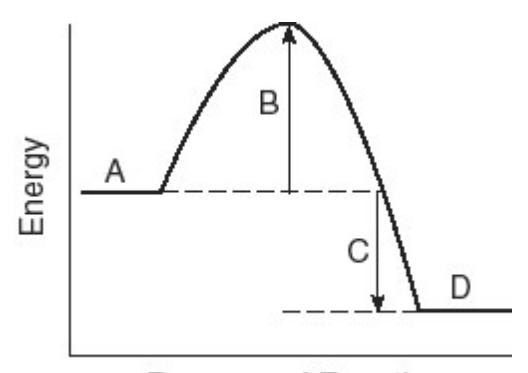
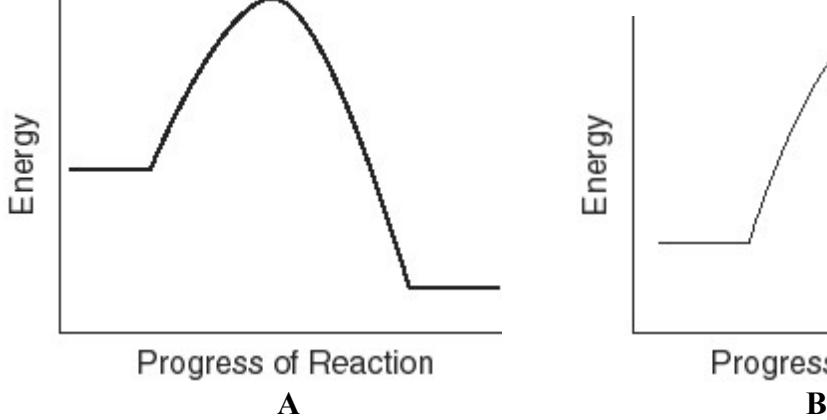
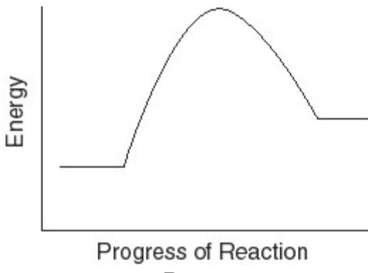

# General, Organic, and Biological Chemistry Practice Exam Questions

You may use a periodic table and a calculator only. Some of these questions may cover material your instructor did not emphasize in your course. Just skip those and focus on the material that was covered in your particular course.

*Source: Test Bank, Timberlake, Structures of Life, 4e (Pearson)*

### **Chapter 1: Chemistry and Measurements**

- 1) The measurement 0.000 0043 m, expressed correctly using scientific notation, is
- A) 4.3 × 10-7 m.
- B) 4.3 × 10-6 m.
- C) 4.3 × 106 m.
- D) 0.43 × 10-5 m.
- E) 4.3 m.
- 2) Which of the following numbers contains the designated CORRECT number of significant figures?
- A) 0.04300 5 significant figures
- B) 0.00302 2 significant figures
- C) 156 000 3 significant figures
- D) 1.04 2 significant figures
- E) 3.0650 4 significant figures
- 3) Which of the answers for the following conversions contains the correct number of significant figures?

A) 2.543 m 
$$\times \frac{39.4 \text{ in}}{1 \text{ m}} = 100.1942 \text{ in}$$

B) 
$$2 L \times \frac{1.06 \text{ qt}}{1 L} = 2.12 \text{ qt}$$

C) 24.95 min 
$$\times \frac{1 \text{ hr}}{60 \text{ min}} = 0.4158 \text{ hr}$$

D) 12.0 ft 
$$\times \frac{12 \text{ in}}{1 \text{ ft}} \times \frac{2.54 \text{ cm}}{1 \text{ in}} = 370 \text{ cm}$$

E) 24.0 kg 
$$\times \frac{1 \text{ lb}}{2.20 \text{ kg}} = 11 \text{ lb}$$

- 4) Which of the following measurements are NOT equivalent?
- A) 25 mg = 0.025 g
- B) 183 L = 0.183 kL
- C) 150. msec = 0.150 sec
- D) 84 cm = 8.4 mm
- E) 24 dL = 2.4 L

- 5) Which of the following setups would convert centimeters to feet?
- A) cm  $\times \frac{2.54 \text{ in.}}{1 \text{ cm}} \times \frac{1 \text{ ft}}{12 \text{ in.}}$
- B) cm  $\times \frac{2.54 \text{ cm}}{1 \text{ in.}} \times \frac{12 \text{ in.}}{1 \text{ ft}}$
- C) cm  $\times \frac{1 \text{ in.}}{2.54 \text{ cm}} \times \frac{1 \text{ ft}}{12 \text{ in.}}$
- D) cm  $\times \frac{1 \text{ in.}}{2.54 \text{ cm}} \times \frac{12 \text{ in.}}{1 \text{ ft}}$
- E) cm  $\times \frac{2.54 \text{ in.}}{1 \text{ cm}} \times \frac{1 \text{ ft}}{12 \text{ in.}}$
- 6) A doctor's order is 0.125 g of ampicillin. The liquid suspension on hand contains 250 mg/5.0 mL. How many milliliters of the suspension are required?
- A) 0.0025 mL
- B) 3.0 mL
- C) 2.5 mL
- D) 6.3 mL
- E) 0.0063 mL
- 7) A nugget of gold with a mass of 521 g is added to 50.0 mL of water. The water level rises to a volume of 77.0 mL. What is the density of the gold?
- A) 10.4 g/mL
- B) 6.77 g/mL
- C) 1.00 g/mL
- D) 0.0518 g/mL
- E) 19.3 g/mL
- 8) Which one of the following substances will float in gasoline, which has a density of  $0.66 \, \text{g/mL}$ ?
- A) table salt (density = 2.16 g/mL)
- B) balsa wood (density = 0.16 g/mL)
- C) sugar (density = 1.59 g/mL)
- D) aluminum (density = 2.70 g/mL)
- E) mercury (density = 13.6 g/mL)

Match the type of measurement (#9-14 below) to the unit given, options A through E.

- A) mass
- B) volume
- C) distance
- D) temperature
- E) density
- 9) milliliter\_\_\_\_
- 10) mm \_\_\_\_
- 11) gram \_\_\_\_
- 12) 125 K\_\_\_\_
- 13) kilometer\_\_\_\_
- 14) milligram\_\_\_\_

*For #15-22, select the correct prefix to complete the equality.*

A) 1000 B) 10 C) 1 D) 0.01 E) 1 × 10 12 F) 100 G) 0.001 H) 1 × 1012 I) 1 × 10-12 J) 0.1

| 15) 1 g = kg  |  |
|---------------|--|
| 16) 1 m = mm  |  |
| 17) 1 cm = mm |  |
| 18) 1 dL = mL |  |
| 19) 1 kg = g  |  |
| 20) 1 pg = g  |  |
| 21) 1 g = pg  |  |
| 22) 1 mL = cc |  |

### **Chapter 2: Energy and Matter**

- 23) When a solid is converted directly to a gas, the change of state is called
- A) freezing.
- B) melting.
- C) boiling.
- D) condensation.
- E) sublimation.
- 24) In a gas, the distance between the particles is
- A) very close relative to the size of the molecules.
- B) close relative to the size of the molecules.
- C) fixed relative to the size of the molecules.
- D) small relative to the size of the molecules.
- E) very large relative to the size of the molecules.
- 25) Helium is a(n)
- A) compound.
- B) heterogeneous mixture.
- C) element.
- D) homogeneous mixture.
- E) electron.
- 26) Air is a(n)
- A) compound.
- B) heterogeneous mixture.
- C) element.
- D) homogeneous mixture.
- E) None of the above.

- 27) Which of the following is a chemical change?
- A) cutting a rope
- B) bending a steel rod
- C) making a snowman
- D) burning sugar
- E) melting gold
- 28) Which of the following is a physical change?
- A) baking a cake
- B) dry ice subliming
- C) fermenting grapes to produce wine
- D) digesting a meal
- E) a tomato ripening
- 29) How many calories are required to raise the temperature of a 150. g sample of gold from 25 °C to 175 °C? The specific heat of gold is 0.0308 cal/g °C.
- A) 4.62 cal
- B) 116 cal
- C) 22500 cal
- D) 693 cal
- E) 130 cal

*For #30-38 below, identify each of the following transformations as a physical (A) or chemical (B) change* 

- A) physical
- B) chemical
- 30) water evaporating
- 31) silver tarnishing
- 32) cutting the grass
- 33) a nail rusting
- 34) baking a cake
- 35) placing photographs in a scrapbook
- 36) formation of green leaves on a plant
- 37) burning leaves
- 38) melting ice

## **Chapter 3: Atoms and Elements**

- 39) Which of the following elements is a metal?
- A) nitrogen
- B) fluorine
- C) argon
- D) strontium
- E) phosphorus

| 40) Which of the following elements is a noble gas? A) oxygen B) chlorine C) bromine D) argon E) nitrogen                                                                                                                                                                                                                                                                                                      |
|-------------------------------------------------------------------------------------------------------------------------------------------------------------------------------------------------------------------------------------------------------------------------------------------------------------------------------------------------------------------------------------------------------------------------------|
| 41) The element in this list with chemical properties similar to magnesium is A) sodium. B) boron. C) carbon. D) strontium. E) chlorine.                                                                                                                                                                                                                                                                       |
| 42) Which of the following descriptions of a subatomic particle is correct? A) A proton has a positive charge and a mass of approximately 1 amu. B) An electron has a negative charge and a mass of approximately 1 amu. C) A neutron has no charge and its mass is negligible. D) A proton has a positive charge and a negligible mass. E) A neutron has a positive charge and a mass of approximately 1 amu. |
| 43) The mass number of an atom can be calculated from A) the number of electrons. B) the number of protons plus neutrons. C) the number of protons. D) the number of electrons plus protons. E) the number of neutrons.                                                                                                                                                                                        |
| 44) The correct symbol for the isotope of potassium with 22 neutrons is A) K.                                                                                                                                                                                                                                                                                                                                           |
| B) K.                                                                                                                                                                                                                                                                                                                                                                                                                      |
| C) P.                                                                                                                                                                                                                                                                                                                                                                                                                      |
| D) P.                                                                                                                                                                                                                                                                                                                                                                                                                      |
| E) K.                                                                                                                                                                                                                                                                                                                                                                                                                      |
| 45) Which of the following gives the correct numbers of protons, neutrons, and electrons in a neutral atom of Sn?                                                                                                                                                                                                                                                                                                       |
| A) 118 protons, 50 neutrons, 118 electrons B) 118 protons, 118 neutrons, 50 electrons C) 50 protons, 68 neutrons, 50 electrons D) 68 protons, 68 neutrons, 50 electrons E) 50 protons, 50 neutrons, 50 electrons                                                                                                                                                                                                  |

46) Isotopes are atoms of the same element that have A) different atomic numbers. B) the same atomic numbers but different numbers of protons. C) the same atomic numbers but different numbers of electrons. D) the same atomic number but different numbers of neutrons. E) the same atomic mass but different numbers of protons. 47) A sample of chlorine has two naturally occurring isotopes. The isotope Cl-35 (mass 35.0 amu) makes up 75.8% of the sample, and the isotope Cl-37 (mass = 37.0 amu) makes up 24.3% of the sample. What is the average atomic mass for chlorine? A) 36.0 amu B) 35 amu C) 36.6 amu D) 35.5 amu E) 35.521 amu 48) A sample of silicon has three naturally occurring isotopes: Si-28 (mass 28.0 amu); Si-29 (mass 29.0 amu) and Si-30 (mass = 30.0 amu). If the average atomic mass of silicon is 28.1 amu, which isotope is the most abundant? A) Si-28 B) Si-29 C) Si-30 D) All isotopes have the same natural abundance. 49) The number of electrons in the outer energy level of a neutral atom of boron (atomic number 5) is A) 2. B) 3. C) 5. D) 8. E) 10. 50) What is the electron configuration for potassium (atomic number 19)?

A) 1s22s22p63s23p7 B) 1s22s22p63s23p53d2 C) 1s22s22p83s23p5 D) 1s22s22p63s23p64s1 E) 1s22s22p63s23p54s1

A) one. B) two. C) three. D) four. E) five.

51) The number of dots in the electron dot structure of carbon is

| Classify the following elements (#52-57 below) with options A through F. |
|-----------------------------------------------------------------------------|
| A) noble gas                                                                |

- B) alkali metal
- C) nonmetal
- D) alkaline earth metal
- E) transition element
- F) halogen
- 52) sodium
- 53) argon
- 54) bromine
- 55) copper
- 56) magnesium
- 57) phosphorus

## **Chapter 4: Nuclear Chemistry**

58) What is the nuclear symbol for a radioactive isotope of copper with a mass number of 60?

- A) Cu
- B) Cu
- C) 29Cu
- D) Cu
- E) Cu

59) The nuclear symbol of helium, He, is also the symbol for designating a(n)

- A) proton.
- B) neutron.
- C) gamma ray.
- D) beta particle.
- E) alpha particle.

60) The symbol *e* is a symbol used for a(n)

- A) proton.
- B) neutron.
- C) gamma ray.
- D) beta particle.
- E) alpha particle.

61) What is missing in the nuclear reaction shown below?

$${}^{10}_{5}\text{B} + {}^{4}_{2}\text{He} \rightarrow {}^{13}_{7}\text{N} + \underline{\hspace{1cm}}$$

- A) gamma radiation
- B) a positron
- C) a neutron
- D) an alpha particle
- E) a beta particle
- 62) What is the radioactive particle released in the following nuclear equation?

$$\frac{159}{74}$$
W  $\rightarrow \frac{155}{72}$ Hf + ?

- A) alpha particle
- B) beta particle
- C) gamma ray
- D) proton
- E) neutron
- 63) A sample of cerium-141 for a diagnostic test was dissolved in saline solution to an activity of 4.5 millicuries/mL. If the patient undergoing the test needs a dose of 10. millicuries, how much of the solution should be injected into the patient?
- A) 45 mL
- B) .45 mL
- C) 2.2 mL
- D) 22 mL
- E) 4.5 mL
- 64) The half-life of a radioisotope is
- A) one-half of the time it takes for the radioisotope to completely decay to a nonradioactive isotope.
- B) the time it takes for the radioisotope to become an isotope with one-half of the atomic weight of the original radioisotope.
- C) the time it takes for the radioisotope to become an isotope with one-half the atomic number of the original radioisotope.
- D) the time it takes for the radioisotope to lose one-half of its neutrons.
- E) the time it takes for one-half of the sample to decay.
- 65) Krypton-79 has a half-life of 35 hours. How many half-lives have passed after 105 hours?
- A) 1 half-life
- B) 2 half-lives
- C) 3 half-lives
- D) 4 half-lives
- E) 5 half-lives

| 66) The half-life of bromine-74 is 25 min. How much of a 4.0 mg sample is still active after 75 min? A) 0.50 mg B) 1.0 mg C) 2.0 mg D) 0.25 mg E) 4.0 mg    |  |  |  |  |
|-------------------------------------------------------------------------------------------------------------------------------------------------------------------------------|--|--|--|--|
| Chapter 5: Compounds and their Bonds                                                                                                                                          |  |  |  |  |
| 67) How many electrons will aluminum gain or lose when it forms an ion? A) lose 1 B) gain 5 C) lose 2 D) lose 3 E) gain 1                                      |  |  |  |  |
| 68) What is the symbol for the ion with 19 protons and 18 electrons? A) F+ B) F C) Ar+ D) K E) K+                                                              |  |  |  |  |
| 69) The correct formula for a compound formed from the elements Al and O is A) AlO. B) Al2O. C) Al3O2. D) AlO3 E) Al2O3                                        |  |  |  |  |
| 70) The compound MgCl2 is named A) magnesium chlorine. B) magnesium dichloride. C) magnesium (II) chloride. D) magnesium chloride. E) dimagnesium chloride. |  |  |  |  |
| 71) Fe2(SO4)3 is called A) iron sulfate. B) iron (II) sulfate. C) iron (III) sulfate. D) diiron trisulfate. E) iron trisulfate.                             |  |  |  |  |

| 72) Which of the following elements does NOT exist as a diatomic molecule? A) hydrogen B) nitrogen C) chlorine D) oxygen E) carbon                                    |
|--------------------------------------------------------------------------------------------------------------------------------------------------------------------------------------|
| 73) Choose the best electron-dot structure for OCl2. A) B) C) D) E)                                                                                                   |
| 74) The correct name of the compound NCl3 is A) nitrogen chloride. B) trinitrogen chloride C) nitrogen(III) chloride. D) nickel chloride. E) nitrogen trichloride. |
| 75) Which of the following substances contains a nonpolar covalent bond? A) H2O B) NaCl C) NH3 D) MgF2 E) N2                                                       |
| 76) Which of the following compounds contains a polar covalent bond? A) NaF B) HCl C) Br2 D) MgO E) O2                                                                |
| 77) Which of the following compounds contains an ionic bond? A) NH3 B) H2O C) CaO D) H2 E) CH4                                                                        |
| 78) If the electronegativity difference between elements X and Y is 2.1, the bond between the elements X-Y is A) ionic. B) nonpolar ionic.                                  |

- C) nonpolar covalent. D) polar covalent. E) impossible.
- 79) The shape of the ammonia molecule (NH3) is
- A) linear.
- B) square.
- C) pyramidal.
- D) hexagonal.
- E) octagonal.
- 80) The shape of the carbon dioxide (CO2) is
- A) linear.
- B) square.
- C) pyramidal.
- D) hexagonal.
- E) bent.
- 81) The strongest interactions between molecules of ammonia ( NH3 ) are
- A) ionic bonds.
- B) hydrogen bonds.
- C) polar covalent.
- D) dipole-dipole.
- E) dispersion forces.

*Match the chemical name (#82-86) with the correct formula A through E.*

- A) MgSO4
- B) Mg(HSO4)2
- C) MgS
- D) MgSO3
- E) Mg(HSO3)2
- 82) magnesium sulfate
- 83) magnesium hydrogen sulfate
- 84) magnesium sulfide
- 85) magnesium sulfite
- 86) magnesium hydrogen sulfite

*Identify each of the following molecules (#87-92) as polar (A) or nonpolar (B).*

- 87) carbon tetrachloride
- 88) water
- 89) carbon dioxide
- 90) hydrogen sulfide
- 91) hydrogen fluoride
- 92) carbon monoxide

## **Chapter 6: Chemical Reactions and Quantities**

93) Which of the following gives the balanced equation for this reaction?

$$K_3PO_4 + Ca(NO_3)_2 \rightarrow Ca_3(PO_4)_2 + KNO_3$$

- A) KPO4 + CaNO3 + KNO3
- B) K3PO4 + Ca(NO3)2 → Ca3(PO4)2 + 3KNO3
- C) 2K3PO4 + Ca(NO3)2 → Ca3(PO4)2 + 6KNO3
- D) 2K3PO4 + 3Ca(NO3)2 → Ca3(PO4)2 + 6KNO3
- E) K3PO4 + Ca(NO3)2 → Ca3(PO4)2 + KNO3
- 94) The following reaction takes place when an electric current is passed through water. It is an example of a \_\_\_\_\_\_\_\_\_\_ reaction.

$$2 \text{ H}_2\text{O} \rightarrow 2\text{H}_2 + \text{O}_2$$

- A) combination
- B) single replacement
- C) dehydration
- D) decomposition
- E) double replacement
- 95) Which of the following is an oxidation-reduction reaction?
- A) CaCl2 + Na2SO4 → CaSO4 + 2NaCl
- B) KOH + HNO3 → H2O + KNO3
- C) N2 + O2 → 2NO
- D) AgNO3 + NaCl → AgCl + NaNO3
- E) Al4(SO4)3 + 6KOH → 2 Al(OH)3 + 3K2SO4
- 96) What is oxidized and what is reduced in the following reaction?

$$2Al(s) + 3Br_2(g) \rightarrow 2AlBr_3(s)$$

- A) Al is oxidized and Br2 is reduced.
- B) AlBr3 is reduced and Br2 is oxidized.
- C) Al is reduced and Br2 is oxidized.
- D) AlBr3 is reduced and Al is oxidized.
- E) AlBr3 is oxidized and Al is reduced.
- 97) Which of the following describes an oxidation reaction?
- A) loss of electrons or loss of oxygen
- B) loss of electrons or gain of oxygen
- C) loss of electrons or gain of hydrogen
- D) gain of electrons or gain of oxygen
- E) gain of electrons or loss of H

- 98) How many molecules of water, H2O, are present in 75.0 g of H2O?
- A) 75.0 molecules
- B) 4.17 molecules
- C) 7.53 × 1024 molecules
- D) 2.51 × 1024 molecules
- E) 5.02 × 1024 molecules
- 99) Avogadro's number is the number of
- A) particles in 1 mole of a substance.
- B) amu in 1 mole of a substance.
- C) grams in 1 mole of a substance.
- D) moles in 6.02 × 1023 grams of an element.
- E) moles in 6.02 × 1023 amu of an element.
- 100) One mole of helium gas weighs
- A) 1.00 g.
- B) 2.00 g.
- C) 3.00 g.
- D) 4.00 g.
- E) 8.00 g.
- 101) What is the molar mass of Mg3(PO4)2, a substance formerly used in medicine as an antacid?
- A) 71.3 g
- B) 118.3 g
- C) 150.3 g
- D) 214.3 g
- E) 262.9 g
- 102) Given the following equation, what is the correct form of the conversion factor needed to convert the number of moles of O2 to the number of moles of Fe2O3 produced?

$$4Fe(s) + 3O_2(g) \rightarrow 2Fe_2O_3(s)$$

- A) O2 3molesof Fe 4 molesof
- B) Fe2O3 3moles of Fe 4 moles of
- C) Fe2O3 3moles of O2 3moles of
- D) 4 moles of Fe Fe2O3 2 moles of
- E) O2 3molesof Fe2O3 2 molesof

| For questions #103-105, consider the following equation.                                                                                                                                                       |  |  |  |  |
|-------------------------------------------------------------------------------------------------------------------------------------------------------------------------------------------------------------------|--|--|--|--|
| 2Mg + O2 → 2MgO                                                                                                                                                                                                   |  |  |  |  |
| 103) The number of moles of oxygen gas needed to react with 4.0 moles of Mg is A) 1.0 mole. B) 2.0 moles. C) 3.0 moles. D) 4.0 moles. E) 6.0 moles.                                                |  |  |  |  |
| 104) The number of moles of MgO produced when 0.20 mole of O2 reacts completely is A) 0.10 mole. B) 0.20 mole. C) 0.40 mole. D) 0.60 mole. E) 0.80 mole.                                     |  |  |  |  |
| 105) How many moles of magnesium are needed to react with 0.50 mole of O2? A) 0.50 mole B) 1.0 moles C) 2.0 moles D) 3.0 moles E) 4.0 moles                                                        |  |  |  |  |
| 106) When 4 moles of aluminum are allowed to react with an excess of chlorine gas, Cl2, how many moles of aluminum chloride are produced? A) 1 mole B) 2 moles C) 3 moles D) 4 moles E) 5 moles |  |  |  |  |
| 107) How many grams of NO are required to produce 145 g of N2 in the following reaction?                                                                                                                       |  |  |  |  |
| 4NH3(g) + 6NO(g) → 5N2 (g) + 6H2O(l)                                                                                                                                                                           |  |  |  |  |
| A) 186 g                                                                                                                                                                                                          |  |  |  |  |

108) The \_\_\_\_\_\_\_\_\_\_ is the minimum energy needed for a chemical reaction to begin.

B) 155 g C) 125 g D) 129 g E) 145 g

A) reaction energy B) activation energy C) energy of reactants D) energy of products E) heat of reaction

- 109) A reaction that releases energy as it occurs is classified as a(n) \_\_\_\_\_\_\_\_\_\_.
- A) endothermic reaction
- B) exothermic reaction
- C) oxidation-reduction reaction
- D) catalyzed reaction
- E) decomposition reaction

*Identify the energy (A thorugh D) associated with each of the labeled parts (#110-114) of the following diagram.*

- A) heat of reaction
- B) activation energy
- C) energy of reactants
- D) energy of products
- 110) Region A
- 111) Region B
- 112) Region C
- 113) Region D

*Identify the letter of the diagram corresponding to the given type of reaction.*

- 114) endothermic reaction (A or B)
- 115) exothermic reaction (A or B)

#### **Chapter 7: Gases**

This chapter is not covered by many instructors. Wrong answers to questions on gases on the exam will not be counted against you.

#### **Chapter 8: Solutions**

E) MgCl2

| 116) Which of the following molecules can form hydrogen bonds? A) CH4 B) NaH C) NH3 D) BH3 E) HI                                                                                                                                                                                                                                                                                                                                                           |
|------------------------------------------------------------------------------------------------------------------------------------------------------------------------------------------------------------------------------------------------------------------------------------------------------------------------------------------------------------------------------------------------------------------------------------------------------------------------------|
| 117) A solution is prepared by dissolving 2 g of KCl in 100 g of H2O. In this solution, H2O is the A) solute. B) solvent. C) solution. D) solid. E) ionic compound.                                                                                                                                                                                                                                                                                        |
| 118) Oil does not dissolve in water because A) oil is polar. B) oil is nonpolar. C) water is nonpolar. D) water is saturated. E) oil is hydrated.                                                                                                                                                                                                                                                                                                             |
| 119) When KCl dissolves in water A) the Cl- ions are attracted to dissolved K+ ions. B) the Cl- ions are attracted to the partially negative oxygen atoms of the water molecule. C) the K+ ions are attracted to Cl- ions on the KCl crystal. K+ D) the ions are attracted to the partially negative oxygen atoms of the water molecule. E) the K+ ions are attracted to the partially positive hydrogen atoms of the water molecule. |
| 120) Which one of the following compounds will NOT be soluble in water? A) NaOH B) PbS C) K2SO4 D) LiNO3                                                                                                                                                                                                                                                                                                                                                      |

- 121) A hydrogen bond is A) an attraction between a hydrogen atom attached to N, O, or F and an N, O, or F atom on another molecule. B) a covalent bond between H and O. C) an ionic bond between H and another atom. D) a bond that is stronger than a covalent bond. E) the polar O-H bond in water.
- 122) What is the concentration, in mass percent, of a solution prepared from 50.0 g NaCl and 150.0 g of water? A) 0.250%
- B) 33.3% C) 40.0%
- D) 25.0% E) 3.00%
- 123) Rubbing alcohol is 70.% isopropyl alcohol by volume. How many mL of isopropyl alcohol are in a 1 pint (473 mL) container?
- A) 70. mL
- B) 0.15 mL
- C) 680 mL
- D) 470 mL
- E) 330 mL
- 124) What is the concentration, in m/v percent, of a solution prepared from 50. g NaCl and 2.5 L of water?
- A) 5.0%
- B) 2.0%
- C) 0.020%
- D) 0.050%
- E) 20.%
- 125) How many grams of glucose are needed to prepare 400. mL of a 2.0%(m/v) glucose solution?
- A) 800. g
- B) 0.0050 g
- C) 8.0 g
- D) 2.0 g
- E) 200. g
- 126) A patient needs to receive 85 grams of glucose every 12 hours. What volume of a 5.0%(m/v) glucose solution needs to be administered to the patient each 12 hours?
- A) 1700 mL
- B) 60 mL
- C) 6000 mL
- D) 17 mL
- E) 204 mL

- 127) How many milliliters of a 25% (m/v) NaOH solution would contain 75 g of NaOH? A) 25 mL B) 75 mL C) 33 mL D) 19 mL E) 3.0 × 102 mL 128) What is the molarity of a solution that contains 17 g of NH3 in 0.50 L of solution? A) 34 M B) 2.0 M C) 0.50 M D) 0.029 M E) 1.0 M 129) When 200. mL of water are added to 100. mL of 12% KCl solution the final concentration of KCl is (Assume the volumes add.) A) 12%. B) 4.0%. C) 36%. D) 6.0%. E) 8.0%. 130) How many moles of CaCl2 are in 250 mL of a 3.0 M of CaCl2 solution? A) 750 moles B) 1.3 moles C) 83 moles D) 0.75 mole E) 3.0 moles 131) What volume of a 1.5 M KOH solution is needed to provide 3.0 moles of KOH? A) 3.0 L B) 0.50 L C) 2.0 L D) 4.5 L E) 0.22 L 132) During the process of diluting a solution to a lower concentration, A) the amount of solute does not change. B) the amount of solvent does not change.
- C) there is more solute in the concentrated solution.
- D) the volume of the solution does not change.
- E) water is removed from the concentrated solution.

### **Chapter 9: Reaction Rates and Chemical Equilibrium**

- 133) In any chemical reaction, the rate of the reaction can be increased by
- A) decreasing the temperature.
- B) changing the size of the container.
- C) adding water to the reaction.
- D) adding product molecules to the reaction mixture.
- E) increasing the concentrations of the reactants.

- 134) A catalyst is
- A) a reactant in a chemical reaction.
- B) a product in a chemical reaction.
- C) a substance that speeds up a reaction without being consumed in the reaction.
- D) a substance that increases the energy of the products.
- E) a substance that decreases the energy of the products.
- 135) The activation energy of a chemical reaction is the energy that
- A) must be removed from the mixture.
- B) must be released from the mixture.
- C) initiates the reaction.
- D) activates the catalyst.
- E) is the difference in the energies of the starting materials and products.
- 136) In a catalyzed chemical reaction, one function of a catalyst is to
- A) increase the number of successful reactant collisions.
- B) decrease the concentration of reactants.
- C) change the equilibrium concentrations of the products and reactants.
- D) increase the energy given off during the reaction.
- E) increase the temperature at which the reaction is carried out.

*Indicate the effect of each change (#138) upon the rate of a reaction (increases, A or decreases, B).*

- 137) adding a catalyst
- 138) removing some reactant
- 139) the temperature is doubled.
- 140) The concentration of a reactant is decreased.
- 141) More collisions between molecules occur.

## **Chapter 10: Acids and Bases**

- 142) According to the Arrhenius concept, if NaOH were dissolved in water, it would act as
- A) a base.
- B) an acid.
- C) a source of hydronium ions.
- D) a source of H- ions.
- E) a proton donor.
- 143) According to the Arrhenius concept, if HNO3were dissolved in water, it would act as
- A) a base.
- B) an acid.
- C) a source of hydroxide ions.
- D) a source of H- ions.
- E) a proton acceptor.
- 144) The name given to an aqueous solution of HBr is
- A) hydrogen bromide.
- B) hydrobromic acid.
- C) bromic acid.

| D) bromous acid. E) hypobromous acid. |
|------------------------------------------|
|                                          |

- 145) The name given to an aqueous solution of HNO3 is
- A) nitric acid.
- B) nitrous acid.
- C) hydrogen nitrate.
- D) hydronitrogen acid.
- E) hyponitric acid.
- 146) The conjugate base of HClO3 is
- A) HClO2.
- B) ClO3 -.
- C) Cl(OH)2.
- D) ClO3.
- E) HClO.
- 147) The conjugate acid of HSO4- is
- A) SO42-.
- B) HSO4.
- C) H2SO4.
- D) H2SO4-.
- E) HSO3-.
- 148) Which of the following statements correctly describes the hydronium-hydroxide balance in the given solution?
- A) In acids, [OH-] is greater than [H3O+].
- B) In bases, [OH-] = [H3O+].
- C) In neutral solutions, [H3O+] = [ O].
- D) In bases, [OH-] is greater than [H3O+].
- E) In bases, [OH-] is less than [H3O+].
- 149) What is the [H3O+] in a solution with [OH-] = 1 × 10-12 M?
- A) 1 × 10-12 M
- B) 1 × 102 M
- C) 1 × 10-7 M
- D) 1 × 10-8 M
- E) 1 × 10-2 M

- 150) What is the [OH-] in a solution that has a [H3O+] = 1 × 10-6 M?
- A) 1 × 10-2 M
- B) 1 × 10-6 M
- C) 1 × 10-8 M
- D) 1 × 10-10 M
- E) 1 × 10-12 M
- 151) What is the pH of a solution with [OH-] = 1 × 10-4 M?
- A) 10.0
- B) -10.0
- C) 4.0
- D) -4.0
- E) 1.0 × 10-10
- 152) The [H3O+] of a solution with pH = 2 is
- A) 10 M.
- B) -10 M.
- C) 1 × 102 M.
- D) 1 × 10-2 M.
- E) 1 × 10-12 M.
- 153) Which of the following is the correctly balanced equation for the complete neutralization of H3PO4 with Ca(OH)2?
- A) H3PO4 + Ca(OH)2 → CaHPO4 + 2H2O
- B) 3H3PO4 + Ca(OH)2 → Ca3(PO4)2 + 5H2O
- C) H3PO4 + Ca(OH)2 → Ca3(PO4)2 + H2O
- D) 2H3PO4 + 3Ca(OH)2 → Ca3(PO4)2 + 6H2O
- E) 4H3PO4 + 6Ca(OH)2 → 2Ca3(PO4)2 + 12H3O
- 154) The neutralization reaction between Al(OH)3 and HNO3 produces the salt with the formula
- A) H2O.
- B) AlNO3.
- C) AlH2.
- D) Al(NO3)3.
- E) NO3OH.
- 155) Which of the following is a neutralization reaction?
- A) KCl + NaNO3 → KNO3 + NaCl
- B) HNO3 + KOH → H2O + KNO3
- C) H2O + SO3 → H2SO4
- D) 4Na + O2 → 2Na2O
- E) 2NO2 → 2NO + O2

- 156) The function of a buffer is to
- A) change color at the end point of a titration.
- B) maintain the pH of a solution.
- C) be a strong base.
- D) maintain a neutral pH.
- E) act as a strong acid.
- 157) In a buffer system of HF and its salt, NaF,
- A) the HF neutralizes added acid.
- B) the HF neutralizes added base.
- C) the HF is not necessary.
- D) the F- neutralizes added H2O.
- E) the F- neutralizes added base.
- 158) Which of the following is a buffer system?
- A) NaCl and NaNO3
- B) HCl and NaOH
- C) H2CO3 and KHCO3
- D) NaCl and NaOH
- E) H2O and HCl

#### Matching Questions

*Identify each of the following compounds as an acid (A), a base (B), or neither (C).*

- 159) HCl
- 160) NaOH
- 161) NH3
- 162) H2SO4
- 163) CO32-
- 164) NaCl
- 165) CN-
- 166) H2CO3

*In the following solutions, is the [OH-] greater than, less than, or equal to the* [H3O+]?

- A) greater than
- B) equal to
- C) less than
- 167) acid
- 168) base
- 169) [H3O+] = 1.0 × 10-6 M
- 170) [H3O+] = 1.0 × 10-10 M
- 171) [H3O+] = 1.0 × 10-7 M
- 172) pH = 2
- 173) pH = 9

*Identify the following as acids (A), bases (B), or neutral (C) solutions.*

- 174) has a sour taste
- 175) has a pH = 4.5
- 176) turns blue litmus paper red
- 177) contains more hydronium ions than hydroxide ions
- 178) H2O
- 179) [H3O+] = 3.4 × 10-5 M
- 180) [OH-] = 2.8 × 10-2 M
- 181) Ca(OH)2
- 182) pH =9.0
- 183) [H3O+] = 1.0 × 10-7 M

| Answers: | 46) D | 92) A  | 138) B |
|----------|-------|--------|--------|
| 1) B     | 47) D | 93) D  | 139) A |
| 2) C     | 48) A | 94) D  | 140) B |
| 3) C     | 49) B | 95) C  | 141) A |
| 4) C     | 50) D | 96) A  | 142) A |
| 5) C     | 51) D | 97) B  | 143) B |
| 6) C     | 52) B | 98) D  | 144) B |
| 7) E     | 53) A | 99) A  | 145) A |
| 8) B     | 54) F | 100) D | 146) B |
| 9) B     | 55) E | 101) E | 147) C |
| 10) C    | 56) D | 102) E | 148) D |
| 11) A    | 57) C | 103) B | 149) E |
| 12) D    | 58) A | 104) C | 150) C |
| 13) C    | 59) E | 105) B | 151) A |
| 14) A    | 60) D | 106) D | 152) D |
| 15) G    | 61) C | 107) A | 153) D |
| 16) A    | 62) A | 108) B | 154) D |
| 17) B    | 63) C | 109) B | 155) B |
| 18) F    | 64) E | 110) C | 156) B |
| 19) A    | 65) C | 111) B | 157) B |
| 20) I    | 66) A | 112) A | 158) C |
| 21) E    | 67) D | 113) D | 159) A |
| 22) C    | 68) E | 114) B | 160) B |
| 23) E    | 69) E | 115) A | 161) B |
| 24) E    | 70) D | 116) C | 162) A |
| 25) C    | 71) C | 117) B | 163) B |
| 26) D    | 72) E | 118) B | 164) C |
| 27) D    | 73) E | 119) D | 165) B |
| 28) B    | 74) E | 120) B | 166) A |
| 29) D    | 75) E | 121) A | 167) C |
| 30) A    | 76) B | 122) D | 168) A |
| 31) B    | 77) C | 123) E | 169) C |
| 32) A    | 78) A | 124) B | 170) A |
| 33) B    | 79) C | 125) C | 171) B |
| 34) B    | 80) A | 126) A | 172) C |
| 35) A    | 81) B | 127) E | 173) A |
| 36) B    | 82) A | 128) B | 174) A |
| 37) B    | 83) B | 129) B | 175) A |
| 38) A    | 84) C | 130) D | 176) A |
| 39) D    | 85) D | 131) C | 177) A |
| 40) D    | 86) E | 132) A | 178) C |
| 41) D    | 87) B | 133) E | 179) A |
| 42) A    | 88) A | 134) C | 180) B |
| 43) B    | 89) B | 135) C | 181) B |
| 44) A    | 90) A | 136) A | 182) B |
| 45) C    | 91) A | 137) A | 183) C |
|          |       | •      | *      |