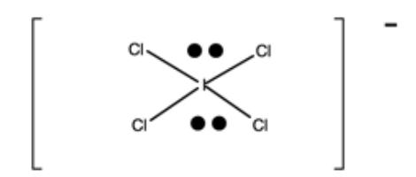

Name: \_\_\_\_\_\_\_\_\_\_\_\_\_\_\_\_\_\_\_\_\_\_\_

| Part I. Multiple Choice:                                                                         |
|--------------------------------------------------------------------------------------------------|
| 1. Which of the following pairs of atoms/ions is isoelectronic?                                  |
| A. O–2 , S–2                                                                                  |
| B. Na, Na+1                                                                                      |
| C. Br–1 , Kr                                                                                  |
| D. Cu, Zn                                                                                        |
| E. none of these                                                                                 |
|                                                                                                  |
| 2. Which of the following quantum number sets describes a 4f orbital?                            |
| A. n=2, l=0, ml = 0                                                                           |
| B. n=3, l=1, ml = -1                                                                          |
| C. n=3, l=2, ml = -1                                                                          |
| D. n=4, l=2, ml = +1                                                                          |
| E. n=4, l=3, ml = +2                                                                          |
|                                                                                                  |
| 3. Which element below has the largest atomic radius?                                            |
| A. S                                                                                             |
| B. P                                                                                             |
| C. N                                                                                             |
| D. B                                                                                             |
| E. F                                                                                             |
|                                                                                                  |
| 4. Which element below has the highest electronegativity?                                        |
| A. C                                                                                             |
| B. P                                                                                             |
| C. N                                                                                             |
| D. B                                                                                             |
| E. Be                                                                                            |
|                                                                                                  |
| 5. Order the elements S, Cl, and F in terms of increasing atomic radii.                       |
| A. S, Cl, F                                                                                      |
| B. Cl, F, S                                                                                      |
| C. F, S, Cl                                                                                      |
| D. F, Cl, S                                                                                      |
| E. S, F, Cl                                                                                      |
| 6. Which of the following statements is true?                                                    |
| A. Electrons are never found in an antibonding MO.                                               |
| B. All antibonding MOs are higher in energy than the atomic orbitals of which they are composed. |
| C. Antibonding MOs have electron density mainly outside the space between the two nuclei.        |
| D. None of the above is true.                                                                    |
| E. Two of the above statements are true.                                                         |

## **Part II. Short Answers and Calculations** *To get full credit you must show all your work!*

| 7. Give the electron configuration for the following atoms and ions (condensed notation is OK).                                                                                                              |
|--------------------------------------------------------------------------------------------------------------------------------------------------------------------------------------------------------------|
| Zr                                                                                                                                                                                                        |
| V+3                                                                                                                                                                                                       |
| 8. Circle the correct answer for each of the following:                                                                                                                                                      |
| a) The lowest (least endothermic) 1st ionization energy: Li, Na, Mg                                                                                                                                 |
| b) The greatest (most exothermic) electron affinity: As, Se, Br                                                                                                                                  |
| 9. Rank the following orbitals in an atom of hydrogen from lowest to highest energy (list them below in order using the < symbol and the = symbol if any orbitals are the same energy): 1s, 2s, 2p, 3s |
| lowest energy highest energy                                                                                                                                                                              |
| 10. Rank the following orbitals in an atom of sodium from lowest to highest energy (list them below in order using the < symbol and the = symbol if any orbitals are the same energy): 1s, 2s, 2p, 3s  |
| lowest energy highest energy                                                                                                                                                                              |
| 11. How many electrons can be accommodated in the n = 4 quantum shell?                                                                                                                                 |
| 12. In one sentence, clearly explain why NO has a small bond dipole (polar compound) and the oxygen has a partial negative charge. You can draw a picture to support your answer.                      |

13. In one sentence, clearly explain why CO has a small bond dipole (polar compound) and the oxygen has a partial positive charge. *You can draw a picture to support your answer.* 14. In one sentence, clearly explain why MgO has a much higher lattice energy than NaF. 15. For laughing gas, N2O a) Draw a valid Lewis structure below (connectivity N–N–O). Assign formal charges to all atoms. b) Draw two additional resonance structures of the structure you drew in part (a). Assign formal charges to all atoms. c) Circle the single structure above (from the three structures in parts (a) and (b)) that most closely represents the true structure of N2O and briefly explain your choice.

16. Phosgene (COCl2) was used as a chemical warfare agent in World War I. It can be synthesized by reacting carbon monoxide with chlorine as shown below. Use the table of bond enthalpies to estimate the heat of reaction (ΔHrxn) for the formation of phosgene.

$$CO + Cl_2 \rightarrow COCl_2$$

| Bond type | Bond Enthalpy |
|-----------|---------------|
|           | (kJ/mol)      |
| C–O       | 360           |
| C=O       | 750           |
| C≡O       | 1070          |
| C–Cl      | 330           |
| Cl–Cl     | 240           |

## 16. Complete the following Table:

| Chemical Formula: SiF4                                                                        | + Chemical Formula: NO2                                                                    |
|--------------------------------------------------------------------------------------------------|--------------------------------------------------------------------------------------------------|
| Lewis Structure:                                                                                 | Lewis Structure: (nitrogen is the central atom)                                               |
| Molecular Geometry: (words only, you do not have to draw the molecule in three dimensions) | Molecular Geometry: (words only, you do not have to draw the molecule in three dimensions) |
| Molecular Polarity (yes/no):                                                                  | Molecular Polarity (yes/no):                                                                  |
| Hybridization of the Si atom:                                                                 | Hybridization of the N atom:                                                               |
| Bond Angle for F–Si–F                                                                         | Bond Angle for O–N–O                                                                          |
| Number of σ bonds for SiF4                                                                    | + Number of σ bonds for NO2                                                                |
| Number of π bonds for SiF4                                                                    | + Number of π bonds for NO2                                                                |

## **Extra Practice Problems (beyond the length of a 60-min exam)**

- 11. Draw a valid Lewis dot structure for the following molecules:
  - a) NCO-
  - b) NF3

12. Indicate the shape and bond angles and polarity of each molecule given the following Lewis structures:

- 13. Which of the following molecules are polar (SHOW WORK)?
- CCl4 H2O CO2 O3

character of the NO2

|                                          |                   |               |        |                                |    |    |                     |    |     | ,         | ۲up      | sin       | uəų      | Эp                 | əilc  | ld∀      | pu               | ie e  | un,    | 9 ło      | uoin          | U lar | ioit | kus          | əţu           | l əq  | J 'ጋ | Αqι    | าเอเต                 | © 5(                                          |
|------------------------------------------|-------------------|---------------|--------|--------------------------------|----|----|---------------------|----|-----|-----------|----------|-----------|----------|--------------------|-------|----------|------------------|-------|--------|-----------|---------------|-------|------|--------------|---------------|-------|------|--------|-----------------------|-----------------------------------------------|
| 18 2 18 | helium 4.003   | 10            | Š      | neon 20.18                  | 18 | Ā  | argon 39,95      | 36 | Ā   | krypton   | 00:00    | to '      | ×        | xenon              | 86    | 2        | radon            |       |        |           |               |       |      |              |               |       |      |        |                       |                                               |
|                                          | 17                | 6             | ш      | fluorine 19.00              | 17 | ਠ  | chlorine 35.45   | 35 | Ä   | bromine   | 06:67    | £ .       | _        | iodine             | 82    | <b>*</b> | astatine         |       |        |           |               |       | 7.1  | 3            | lutetium      | 175.0 | 103  | בֿ     | lawrencium            | This periodic table is dated 19 February 2010 |
|                                          | 16                | 8             | 0      | oxygen 16.00                | 16 | တ  | sulfur 32.07     | 34 | Se  | selenium  | (6)96(9) | 75        | <u>e</u> | tellurium 127 6 | 84    | 0        | <b>D</b> olonium |       |        |           |               |       | 70   | <del>ک</del> | ytterbium     | 173.1 | 102  | 2      | nobelium              | ated 19 Feb                                   |
|                                          | 15                | 7             | z      | nitrogen 14.01              | 15 | Δ. | phosphorus 30,97 |    |     | arsenic   |          |           | Sp       | antimony           | 83    | ä        | pismuth          | 209.0 |        |           |               |       | 69   | E            | thulium       | 168.9 | 101  | ğ      | mendelevium           | ic table is da                                |
|                                          | 4                 | 9             | ပ      | carbon 12.01                | 14 | S  | silicon 28.09    | 32 | Ge  | germanium | t 0.5.   | G (       | S        | tin 118.7       | 82    | 5        | lead             | 207.2 |        |           |               |       | 89   | ш            | erbinm        | 167.3 | 100  | Ē      | fermium               | This period                                   |
|                                          | 13                | 5             | മ      | boron 10.81                 | 13 | ₹  | aluminium 26.98  |    |     | gallium   |          | 4 ' D  |          | indium 114.8    | . 8   | F        | thallium         | 204.4 |        |           |               |       |      |              | holmium       |       | 66   | ЕS     | einsteinium           |                                               |
|                                          |                   |               |        |                                | •  |    | 12                  | 30 | Zn  | Zinc      | 40.30(2) | 84 (      | ၓ        | cadmium            | 80    | Ī        | mercury          | 200.6 | 112    | ت ت    | copernicium   |       | 99   | ۵            | dysprosium    | 162.5 | 86   | ຽ      | californium           |                                               |
| ements                                   |                   |               |        |                                |    |    | E                   | 29 | Cn  | copper    | 65.33    | , ,       | Ag       | silver             | 62    | -        | <b>D</b> plog    | 197.0 | 111    | Rg        | roentgenium   |       |      |              | terbium       |       | 97   | 쓢      | berkelium             |                                               |
| the Ele                                  |                   |               |        |                                |    |    | 10                  | 28 | Z   | nickel    | 36.69    | o 1       | Pd       | palladium 106.4 | 78    | ă        | platinum         | 195.1 | 110    | Ds        | darmstadtium  |       | 64   | g            | gadolinium    | 157.3 | 96   | S      | curium                |                                               |
| able of                                  |                   |               |        |                                |    |    | 6                   | 27 | ပ္ပ | cobalt    | 00:90    | t + 1     | 몺        | modium 102 a    | 77    | <u> </u> | iridium          | 192.2 | 109    | ¥         | meitnerium    |       | 63   | Д            | europium      | 152.0 | 96   | Am     | americium             |                                               |
| iodic Ta                                 |                   |               |        |                                |    |    | ω                   | 26 | a   | iron      | 20.00    | 4 4    | <b>%</b> | ruthenium          | 92    | č        | osmium           | 190.2 | 108    | Hs        | hassium       |       | 62   | Sm           | samarium      | 150.4 | 82   | Pn     | plutonium             |                                               |
| IUPAC Periodic Table of the Elements     |                   |               |        |                                |    |    | 7                   | 25 | Z   | manganese | 4.94     | 4 2    | ည        | technetium         | 75    | 0        | rhenium          | 186.2 | 107    | Bh        | bohrium       |       | 61   | Pa           | promethium    |       | 93   | 2 Z | neptunium             |                                               |
| IUP                                      |                   |               |        |                                |    |    | 9                   | 24 | ပ်  | chromium  | 35.00    | 74 -      | <b>§</b> | molybdenum         | 74    | 3        | tungsten         | 183.9 | 106    | Sg        | seaborgium    |       | 09   | Š            | neodymium     | 144.2 | 92   | _      | uranium 238.0      | able                                          |
|                                          |                   | oer .         | _      | eight                          | ]  |    | 2                   | 23 | >   | vanadium  |          |           |          | miobium 92 91   |       | Ļ        | tantalum         | 180.9 | 105    | В         | dubnium       |       | 59   | ቯ            | min           | 140.9 | 91   | Ба     | protactinium 231.0 | /periodic_t                                   |
|                                          | Key:              | atomic number | Symbol | name standard atomic weight |    |    | 4                   | 22 | F   | titanium  |          | 04        | ZĽ       | zirconium 91 22 | 72    | Ĭ        | hafnium          | 178.5 | 104    | ጁ         | rutherfordium |       | 28   | ပိ           | cerium        | 140.1 | 06   | £      | thorium 232.0      | org/reports                                   |
|                                          | - 1               |               |        |                                | -  |    | က                   | 21 | SC  | scandium  | 96.4     | 99° -     | >        | yttrium 88 91   | 57-71 |          | lanmanoids       |       | 89-103 | actinoids |               |       | 25   | Ë            | lanthanum     | 138.9 | 68   | Ac     | actinium              | www.iupac.org/reports/periodic_table          |
|                                          | 2                 | 4             | Be     | beryllium 9.012             | 12 | Mg | magnesium 24.31  |    |     | _         |          | , 58 ( | တ်       | strontium 87.61 | 26    | ä        | parium           | 137.3 | 88     | Ra        | radium        |       |      |              |               |       |      |        | ]                     | -                                             |
| - <b>=</b>                               | hydrogen 1.008 | 3             | ≔      | lithium 6.941(2)            | #  | Na |                     | 19 | ¥   | potassium | 39.10    | ۱۵/       | 8        | rubidium 85.47  | 55    | ۲        | caesium          | 132.9 | 87     | ŗ         | francium      |       |      | 4            | To the second |       |      | 2      |                       |                                               |

## **Equations and Constants**

$$q = C\Delta T = mc\Delta T$$

$$\Delta E_{universe} = 0$$
  $\Delta E_{system} + \Delta E_{surroundings} = 0$ 

$$\Delta E_{system} = -\Delta E_{surroundings}$$
  $q_{system} = -q_{surroundings}$ 

$$E_{\scriptscriptstyle k} = \frac{1}{2} \, m v^2 \qquad E_{\scriptscriptstyle P} = m g h \qquad \quad \Delta E = q + w \label{eq:epsilon}$$

$$w = F d = F \Delta x$$
  $w = -P\Delta V$ 

$$\Delta H = \Delta E + P \Delta V \ = \ q_P \qquad \qquad q_V = \Delta E$$

$$\Delta H_{rxn} = \sum \! n \; \Delta H_{f}(products) \; \text{-} \; \sum \! m \; \Delta H_{f}(reactants)$$

 $\Delta H_{rxn}$  = bonds broken – bonds formed

$$N_{A} = 6.022 x 10^{23} \ mol^{\text{--}1} \qquad \qquad h = 6.626 x 10^{\text{--}34} \ J \ s \qquad \qquad c = 2.998 x 10^{8} \ m \ s^{\text{--}1}$$

$$c = 2.998 \times 10^8 \text{ m s}^{-1}$$

$$e = 1.602 \times 10^{-19} \text{ C}$$

$$m_e = 9.109 \times 10^{-31} \text{ kg}$$
 1 Å =  $1 \times 10^{-10} \text{ m}$ 

$$1 \text{ Å} = 1 \text{x} 10^{-10} \text{ m}$$

$$R_H = 1.0968 \times 10^7 \text{ m}^{-1}$$

$$R_H = 1.0968 \times 10^7 \text{ m}^{-1}$$
 hc $R_H = 2.178 \times 10^{-18} \text{ J}$ 

$$E_{\scriptscriptstyle K}=1\!\!/_{\!\!2}\;m\;\upsilon^2$$

$$\Delta E = hv$$

$$\nu\lambda=c$$

$$\Delta E = \frac{hc}{\lambda}$$

$$p = \frac{h}{\lambda}$$

$$\lambda = \frac{h}{mv}$$

$$\Delta E = \frac{hc}{\lambda}$$
  $p = \frac{h}{\lambda}$   $\lambda = \frac{h}{mv}$   $\Delta x \Delta p \ge \frac{h}{4\pi}$ 

$$\frac{1}{\lambda} = R_H \left( \frac{1}{n_1^2} - \frac{1}{n_2^2} \right)$$

$$\Delta E = 2.178 \times 10^{-18} \text{ J} \left( \frac{1}{n_f^2} - \frac{1}{n_i^2} \right)$$

$$V = \frac{\kappa \; Q_1 Q_2}{d} \qquad \kappa = 8.99 x 10^9 \; \text{J-m/C}^2 \qquad \qquad \mu = Q \; r \qquad \qquad 1 \; D = 3.336 x 10^{-30} \; \text{C} \bullet \text{m}$$

$$\mu = Q r$$

$$1 D = 3.336 \times 10^{-30} C \cdot m$$