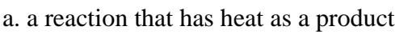
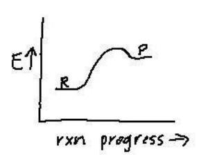
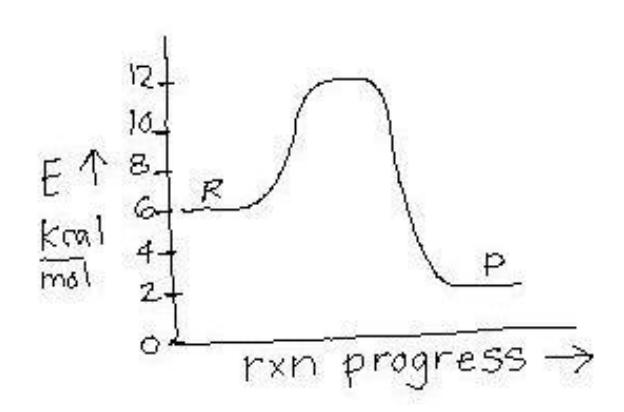

## CH 107 Introductory Chemistry Final Test used as a practice for CH 109 Placement Test December 14, 2005 (am)

Choose the BEST answer for each multiple choice. For all equilibrium reactions the arrow will be double-headed  $(\leftrightarrow)$ . Remember to balance any chemical reactions before calculating if appropriate.

- 1. The number of significant figures in the number 3005 is?
  - a. 1
- b. 2
- c. 3
- d. 4
- e. 2 or 4
- 2. Convert 115 lb/min to mg/sec (454 g = 1.0 lb; you are expected to know metric conversions)
- a. 8.70 x 10-3 mg/sec
- b. 869 mg/sec
- c. 15.2 mg/sec
- d. 8.69 x 105 mg/sec
- e. 4.32 x 106 mg/sec
- 3. What is true about potassium (K)?
  - a. It is a nonmetal.
  - b. It is a group II element.
  - c. It is a liquid at room temperature.
  - d. It is very unreactive.
  - e. Its Lewis dot structure looks like K•
- 4. Convert 33 millimeters to meters.
  - a.  $3.3 \times 10^{-3} \text{ m}$
  - b.  $3.3 \times 10^{-2} \text{ m}$
  - c. 150 m
  - d. 0.33 m
  - e. none of these
- 5. One quart of juice costs 75¢ and one liter of juice costs 78¢. Which is the better buy? (0.946 L = 1.0 qt) quarts)
  - a. the liter
  - b. the quart
  - c. they are of equal value
  - d. more information is needed
- 6. What is true about isotopes?
- a. they are different forms of an element differing in mass
- b. they are always radioactive
- c. hydrogen has no isotopes
- d. they are different forms of an element differing in numbers of electrons
- e. none of these

| 7. The total number of electrons Na + has is?                                                                                                          |                   |                    |                         |                      |  |  |  |  |
|-------------------------------------------------------------------------------------------------------------------------------------------------------------------|-------------------|--------------------|-------------------------|----------------------|--|--|--|--|
| a. 10                                                                                                                                                             | b. 11             | c. 12              | d. 23                   | e. 1                 |  |  |  |  |
| 8. Which of the following elements would have the most similar properties to Br?                                                                                  |                   |                    |                         |                      |  |  |  |  |
| a. Na                                                                                                                                                             | b. S              | c. Be              | d. Cl                   | e. Ar                |  |  |  |  |
| 9. Choose the                                                                                                                                                     | e most stable io  | n for oxygen.      |                         |                      |  |  |  |  |
| a. O                                                                                                                                                              | b. O + | c. O 2- | d. O 2+      | e. doesn't make ions |  |  |  |  |
| 10. The form                                                                                                                                                      | ula for the com   | pound made fro     | om calcium and          | sulfur is?           |  |  |  |  |
| a. $Ca=S$ b. $Ca_2S$ c. $CaS_6^3$ d. $CaS_2$ e. $CaS$                                                                                                 | -                 |                    |                         |                      |  |  |  |  |
| 11. The char                                                                                                                                                      | ge on phosphat    | e is?              |                         |                      |  |  |  |  |
| a. 0                                                                                                                                                              | b. +2             | c. +3              | d3                      | e1                   |  |  |  |  |
| 12. Draw the Lewis dot structure for HCH the shape of this molecule is?                                                                                           |                   |                    |                         |                      |  |  |  |  |
| <ul><li>a. linear</li><li>b. trigonal pyramidal</li><li>c. bent or angular</li><li>d. trigonal planar</li><li>e. tetrahedral</li></ul>                            |                   |                    |                         |                      |  |  |  |  |
| 13. "Like dissolves like" means that certain types of substances will dissolve more easily in water. Which type of substance would dissolve most easily in water? |                   |                    |                         |                      |  |  |  |  |
| a. nonpolar b. polar c. noble gases d. the diatomic gases such as $O_2$ , $H_2$ , and $N_2$ e. hydrocarbons like oil and gasoline                                 |                   |                    |                         |                      |  |  |  |  |
| 14. How many moles are contained in 96.00 g of O 2 ?                                                                                                   |                   |                    |                         |                      |  |  |  |  |
| 14. How man                                                                                                                                                       | ny moles are co   | ontained in 96.0   | 0 g of O 2 ? |                      |  |  |  |  |

Use the following reaction to answer the next two questions.

 $O_2(g) \rightarrow$  $CO_2(g)$  $C_3H_8(g) +$  $H_2O(g)$ 

15. If 14.5 g of C3H8 react completely in the presence of unlimited amounts of oxygen, how many grams of water will be made? (You will need to calculate molecular weights.)

a. 5.92 g

b. 36.0 g

c. 73.8 g

d. 23.7 g

e. 8.75 g

16. If 5 moles of  $C_3H_8$  and 15 moles of  $O_2$  are present, which reagent (reactant) will limit the reaction?

a.  $C_3H_8$ 

b. O2 c. neither

d. H2O

e. need more info

17. Based on solubility rules choose the compound that is **NOT** soluble in water.

a. KOH

d. PbSO4

c.  $Al(NO_3)_3$ 

b. Mg(CH3COO)2

e. NH4Cl

18. In the reaction shown below, which species is being reduced?

$$\operatorname{Cd}^{2+}_{(aq)} + \operatorname{Zn}_{(s)} \rightarrow \operatorname{Cd}_{(s)} + \operatorname{Zn}^{2+}_{(aq)}$$

a. Zn(s)

b.  $Zn^{2+}$  (aq)

c. Cd2+

d. Cd (s)

e. it depends upon the solubility of the ions

19. If an ideal gas at *constant pressure* and a volume of 10.00 L and a temperature of 25.00 °C, is allowed to expand to 50.00 L, what will the new temperature be?

$$\begin{array}{ccc} \underline{P_1}\underline{V_1} &=& \underline{P_2}\underline{V_2} \\ T_1 & & T_2 \end{array}$$

a. 125.0 °C

b. 273.0 °C

c. 1490 °C d. 1217 °C

e. 37.00 °C

20. What is the volume of 0.75 moles of a gas at 37 °C if the pressure is 5.0 atm? PV = nRT

a. 3.8 L

b. 0.46 L

c. 38 L

d. 21 L

e. 0.83 L

21. Which is NOT a type of intermolecular force?

a. London dispersion forces

c. dipole-dipole forces

b. hydrogen bonding

d. ionic bonding

|                                                                                                 |               | 22. Which compound will have the highest boiling point?                  |                                                                                                      |             |
|-------------------------------------------------------------------------------------------------|---------------|--------------------------------------------------------------------------|------------------------------------------------------------------------------------------------------|-------------|
| a. CH3CH3 d. CH3CH2CH2CH2CH2CH3                                                              |               | b. O2 e. CO2                                                          | c.                                                                                                   |             |
| 23. Which compound can                                                                          |               | form hydrogen bonds to itself?                                        |                                                                                                      |             |
| a. CH4                                                                                          | b. CH3CH2OCH3 | c. NH3                                                                   | d. CHCl3                                                                                             | e. CF4      |
| a. condensation b. solidification c. evaporation d. sublimation e. super-saturation |               | 24. The name of the process in which a solid turns into a gas is called? |                                                                                                      |             |
| 25. If the solubility of AgNO3 solution is?                                                  |               |                                                                          | is 63.7 g/100 mL water and you have 4.37 g dissolved in 10 mL of water, your                         |             |
| a. cloudy b. unsaturated c. green, but clear d. saturated e. super-saturated        |               |                                                                          |                                                                                                      |             |
| 26. The molarity of a 0.50                                                                      |               | L of solution that contains 186.9 g of MgF2                              | (FW = 62.3                                                                                           | g/mol) is ? |
| a. 0.50 M                                                                                       | b. 1.0 M   | c. 2.0 M                                                                 | d. 4.0 M                                                                                          | e. 6.0 M |
| M1V1 = M2V2                                                                                     |               |                                                                          | 27. What volume of a 12 M stock solution of HCl would be needed to make 835 mL of a 0.95 M solution? |             |
| a. 26 mL                                                                                     | b. 13 mL      | c. 66 mL                                                              | d. 0.013 mL                                                                                          | e. 86 mL    |
|                                                                                                 |               | 28. The % (w/v) of 8.00 g of sucrose in 200.0 mL of coffee is?           |                                                                                                      |             |
| a. 3.00 %                                                                                       | b. 2.00 %     | c. 4.00 %                                                                | d. 11.6 %                                                                                            | e. 4.32 %   |

29. Which compound will be least soluble in water?

- a. glucose (C6H12O6) d. CH2F2

- b. HCl e. NaOH

c. CH3CH3

30. A particular blood cell has an internal osmolarity of 0.30 osmol. Which solution should this cell be placed in if one wanted to cause crenation (cause the cell to shrivel)?

Osmol = nM ; where M is molarity and n = number of particles

- a. 0.50 M NaCl
- b. 0.10 M Na2SO4
- c. 0.15 M glucose (C6H12O6)
- d. 0.0050 M CH3OH
- e. need to know the size of the blood cell

31. An endothermic reaction can be described as?

- b. a reaction that has a large Keq value
- c. a reaction that has a small Keq value
- d. a really fast reaction
- e. what is shown on the plot at the right

32. Which effect does a catalyst have on an equilibrium reaction?

- a. the equilibrium shifts to the products
- b. equilibrium is reached faster
- c. the equilibrium shifts to the reactants
- d. the equilibrium constant gets much larger
- e. it depends on the particular reaction

33. For the equilibrium reaction shown below predict what would happen if more hydrogen fluoride was added, according to Le Chatelier's principle.

$$H_2 + F_2 \leftrightarrow HF + 35 \text{ kcal}$$

- a. the equilibrium shifts to the left
- b. the equilibrium shifts to the right
- c. there is no effect on equilibrium
- d. the value for Keq changes
- e. more than one of these is true

34. For the reaction shown below calculate the [H2] if the Keq is 8.00, [N2] = 0.250 M, and [NH3] = 1.50 M.

$$H_2 + N_2 \leftrightarrow NH_3 \qquad K_{eq} = \underbrace{[C]^c [D]^d}_{[A]^a [B]^b}$$

- a. 1.42 M b. 0.750 M c. 1.04 M d. 0.843 M e. 0.228 M

Use the following energy diagram to answer the next two questions.

- 35. The energy for the overall reaction is?
- a. 6 kcal/mol
- b. 4 kcal/mol
- c. 12 kcal/mol
- d. 10 kcal/mol
- e. 2 kcal/mol

- 36. The activation energy of this reaction is?
- a. 6 kcal/mol
- b. 4 kcal/mol
- c. 12 kcal/mol
- d. 10 kcal/mol
- e. 2 kcal/mol

37. If 
$$[H_3O^+] = 1.0 \times 10^{-9} \text{ M}$$
, then  $[OH^-] = ?$   $K_w = [OH^-][H_3O^+]$ ;  $K_w = 1.0 \times 10^{-14}$ 

$$K_w = [OH^-][H_3O^+]; K_w = 1.0 \times 10^{-14}$$

- a. 1.0 x 10-14 M
- b. 1.0 x 10-9 M
- c. 1.0 x 10-5 M
- d. 1.0 x 10-23 M
- e. 1.0 x 10-7 M
- 38. What is the  $[H_3O^+]$  in a solution that has a pH of 3.12?  $pH = -log[H_3O^+]$
- a.  $1.32 \times 10^3 \text{ M}$
- b. 1.32 x 10-11 M
- c. 6.23 x 10-6 M
- d. 7.59 x 10-4 M
- e. 1.0 x 10-4 M
- 39. If the hydronium ion  $(H_3O^+)$  concentration is 1 x  $10^{-10}$  M, the pH of the solution is?
- a. 1
- b. 2
- c. 4
- d. 7
- e. 10
- 40. The products of the <u>first dissociation</u> of carbonic acid (H2CO3) in water are?
- a. H2O, CO32-
- b. H3O+, CO32-
- c. OH-, HCO3-
- d. H3O+, HCO3-
- e. OH-, H2CO3

41. Choose the strongest acid.

- a. HCOOH
- b. HCN
- c. H3PO4
- $d. H_3BO_3$
- e. HBr

42. Choose the weakest base.

- a. NH3
- b. KOH
- c. LiOH
- d.  $Ba(OH)_2$
- e. NaOH

43. What is true about weak acids?

- a. they are all diprotic or triprotic
- b. they completely dissociate in water
- c. HCl is one
- d. the  $K_a$  for the reaction is always less than 1.0
- e. the pH of a weak acid solution is always higher than 12

44. If a substance is amphoteric it means the substance is/can?

- a. catalyze chemical reactions
- b. positively charged
- c. a transition metal
- d. act as both an acid and a base
- e, insoluble in water

45. For a buffer solution made of 0.500 M sodium acetate and 0.0500 M acetic acid, the pH would be?

$$pH = pK_a + log [A^-]/[HA]$$

- a. 3.75
- b. 4.75
- c. 5.75
- d. 4.98
- e. 2.66

46. Which acid would be in a buffer if the pH was 9.41 and the solution was made from 4.50 M acid and 1.50 M conjugate base.

$$pH = pK_a + log[A^-]/[HA]$$

- a. lactic acid
- b. acetic acid
- c. phosphoric acid
- d. boric acid
- e. phenol

47. Buffers are important to biological organisms because?

- a. they maintain an organism's temperature at 37 °C
- b. they provide a source of fresh water for drinking
- c. they keep organisms from damaging delicate internal organs
- d. they maintain the organism's pH at a relatively constant value
- e. they provide electronic interfaces between the organism and environmental odors

|                                                                                                 | 48. What is true about the dyes that function as pH indicators?                                                                                                                                                                                                                    |             |          |          |                                                                                                         |          |  |
|-------------------------------------------------------------------------------------------------|------------------------------------------------------------------------------------------------------------------------------------------------------------------------------------------------------------------------------------------------------------------------------------|-------------|----------|----------|---------------------------------------------------------------------------------------------------------|----------|--|
| e. all of these are true                                                                        | a. they change color based on the pH of a solution b. a mixture of them in one solution is called "universal" indicator c. a popular one called phenolphthalein turns dark pink in the presence of base d. they can be used to make colorful demos in a chemistry lecture |             |          |          |                                                                                                         |          |  |
|                                                                                                 | 49. Choose the substance that would have a pH of greater than 7.                                                                                                                                                                                                                   |             |          |          |                                                                                                         |          |  |
| a. lemon juice b. drain cleaner c. vinegar d. pure water e. gastric (stomach) juice |                                                                                                                                                                                                                                                                                    |             |          |          |                                                                                                         |          |  |
|                                                                                                 | MaVa = MbVb                                                                                                                                                                                                                                                                     |             |          |          | 50. A 0.50 M base is used to titrate 150 mL of 0.15 M HCl to its endpoint. How much base was needed?    |          |  |
| a. 5.0 x 102 mL                                                                                 |                                                                                                                                                                                                                                                                                    | b. 11 mL |          | c. 45 mL | d. 5.0 x 10-4 mL                                                                                        | e. 32 mL |  |
| point of neutralization?                                                                        |                                                                                                                                                                                                                                                                                    |             |          |          | 51. If 25 mL of 1.0 M HCl are neutralized by NaOH, how many moles of base must have been present at the |          |  |
| a. 1.0                                                                                          | b. 0.25                                                                                                                                                                                                                                                                            | c. 5.0      | d. 0.025 |          | e. need more info                                                                                       |          |  |
| 52. The normality of a 2.0 M solution of H2SO4 is?                                        |                                                                                                                                                                                                                                                                                    |             |          |          |                                                                                                         |          |  |
| a. 1.0 N                                                                                        | b. 2.0 N                                                                                                                                                                                                                                                                           | c. 4.0 N    | d. 6.0 N | e. 0.5 N |                                                                                                         |          |  |
|                                                                                                 | 53. Rutherford's experiment showed that some radiation consists of?                                                                                                                                                                                                                |             |          |          |                                                                                                         |          |  |
| b. charged particles c. uranium atoms d. heavy water e. all of these                   | a. transition metals and therefore is colorful                                                                                                                                                                                                                                     |             |          |          |                                                                                                         |          |  |
|                                                                                                 | 54. In the following transmutation reaction, what is the other product?                                                                                                                                                                                                            |             |          |          |                                                                                                         |          |  |
|                                                                                                 | 245Cm                                                                                                                                                                                                                                                                             | 4He +    |          |          |                                                                                                         |          |  |
| 241Cf a.                                                                                     | b. 249Pu                                                                                                                                                                                                                                                                           | c. 243Am    |          | d. 249Es | 241Pu e.                                                                                             |          |  |

- 55. The main danger to the human body from ionizing radiation is?
- a. creation of highly reactive free radicals like •OH which damage DNA
- b. termination of hair growth
- c. drastic changes in blood pH
- d. accelerated growth in extremities
- e. induction of autoimmune diseases like lupus and MS
- 56. If a lead-lined box had 400.0 g of 32P (half-life of approximately 14.0 days) how much would be left after 70.0 days?
- a. 80.0 g b. 25.0 g c. 225 g d. 12.5 g e. 105 g