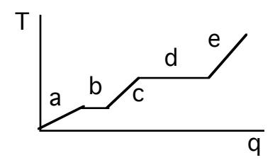
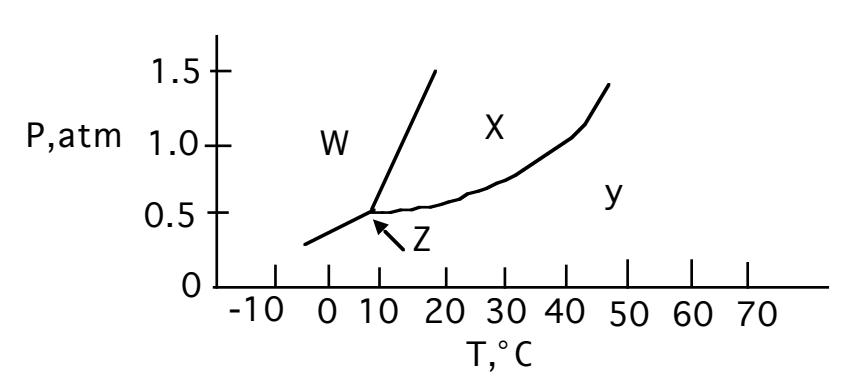
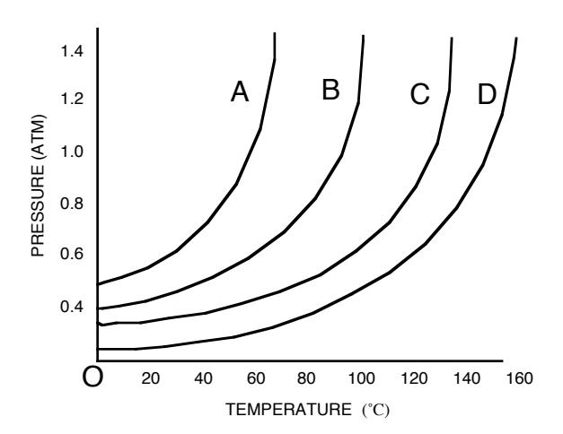
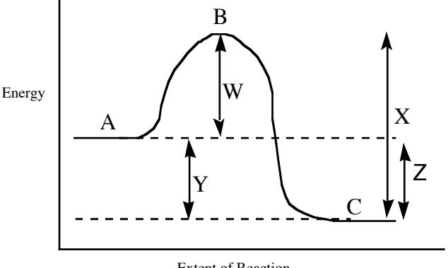

## JASPERSE CHEM 210 PRACTICE TEST 1 VERSION 1

Forces and Intermolecular Forces between Ions and Molecules Solutions and Their Colligative Properties

Chemical Kinetics: Rates of Reactions

Formulas for First Order Reactions: kt = ln ([Ao]/[At]) kt1/2 = 0.693

- 1. Which of the following would have the highest molar heat of vaporization?

  - a. I2 b. Br2 c. Cl2 d. F2

- 2. Which of the following would have the highest vapor pressure at 25˚C?

- a. C4H10 b. NaCl c. C6H12O6 d. C4H9NH2
- 3. Arrange CH3OH, NaF, and CO2 in order of increasing boiling point.
  - a. CH3OH < CO2 < NaF
  - b. CO2 < NaF < CH3OH
  - c. CO2 < CH3OH < NaF
  - d. NaF < CO2 < CH3OH
  - e. none of the above
- 4. Region "c" on the heating curve shown (Temperature versus heat, "q") corresponds to:
  - a. a pure gas increasing in temperature
  - b. a liquid increasing in temperature
  - c. a solid increasing in temperature
  - d. a solid melting
  - e. a liquid boiling

- 5. Which of the following would have the highest boiling point?
  - a. CH3CH2CH2OH b. CH3CH2OCH3 c. CH3CH2OH d. CH3CH2CH2CH3

6. In which phase does the substance whose phase diagram is shown below exist at 0˚C and atmospheric pressure?

a. gas b. liquid c. solid d. supercritical fluid

7. Which of the following would have the greatest surface tension at 25˚C?

a. CH4 b. CH3F c. CH3OH d. CO

8. Which of the following shows a relatively high boiling temperature due to hydrogen bonding?

a. CH3OH b. CH3SH c. CH3OCH3 d. SnH4

9. Which of the following substances has London dispersion forces as its only intermolecular force?

a. HCN b. CH4 c. NH3 d. H2S

10. Which is a gas at room temperature? (You may apply memory as well as principle to answer this question!)

a. Na2S b. NO2 c. H2O d. Fe

11. Which is a brittle, high-melting solid but dissolves in water?

a. I2 b. K2CO3 c. C12H26 d. Al

## 12. Which of the following statements is true?

- a. All of the molecules in the liquid state have the same energy
- b. When evaporation occurs the average kinetic energy of the molecules remaining in the liquid state is lower than that of the molecules that left, resulting in cooling of the liquid
- c. The vapor pressure of a liquid decreases as the temperature increases
- d. The rate of evaporation is faster for substances with lower vapor pressures than for substances with higher vapor pressures

## 13. In a liquid, the attractive intermolecular forces are:

- a. weaker than in a substance that is a gas at the same temperature
- b. always insignificant and unable to keep molecules close together
- c. so strong that molecules are locked close together and are unable to move
- d. strong enough to hold molecules relatively close but not strong enough to keep molecules from moving past each other
- 14. Which of the following statements is false for the vapor pressure/temperature diagram shown:?

- a. the vapor pressure for C at 60˚ is about 0.4 atm
- b. substance D has the weakest binding forces
- c. the normal boiling point for A is about 58˚
- d. to achieve a vapor pressure of 0.4 atm, substance D must be heated to about 100˚C

## 15. Which of the following statements is false?

- a. diamond is higher melting than CH3CH2OH (alcohol)
- b. solid glucose is less dense than melted, liquid glucose
- c. CH2Br2 is more volatile than CBr4 at room temperature
- d. evaporation of freon-12 absorbs heat from the surroundings

| 16. | a. b. c. d.         | Potassium hydroxide dissolves readily in water due to                                                                                                                                                               | strong solute-solute interactions strong solvent-solvent interactions strong solute-solvent interactions weak solute-solvent interactions |        |                                                                                                                                              |                                                                                                                                                                                  |
|-----|------------------------------|---------------------------------------------------------------------------------------------------------------------------------------------------------------------------------------------------------------------|----------------------------------------------------------------------------------------------------------------------------------------------------|--------|----------------------------------------------------------------------------------------------------------------------------------------------|----------------------------------------------------------------------------------------------------------------------------------------------------------------------------------|
| 17. |                              |                                                                                                                                                                                                                     |                                                                                                                                                    |        | Which of the following substances would be the most soluble in water?                                                                        |                                                                                                                                                                                  |
|     | a. Ar                        |                                                                                                                                                                                                                     | b. CH3CH2CH2CH3                                                                                                                                    |        | c. NaCl                                                                                                                                      | d. CH4                                                                                                                                                                           |
| 18. | a. b. c. d.         | Which of the following effects would not the melting point would decrease the boiling point would decrease the vapor pressure would decrease the electrical conductivity of the solution would increase |                                                                                                                                                    |        | result when CaCl2                                                                                                                            | was added to water?                                                                                                                                                              |
| 19. | a. b. c. CCl4 d. | Which relationship is false for solubility in water? C5H11OH > C11H23OH C5H11OH > C5H12 > CaCl2 CH3OCH3 > CH3CCl3                                                                                    |                                                                                                                                                    |        |                                                                                                                                              |                                                                                                                                                                                  |
| 20. | a. b. c. d.         | Which of the following statements is true? differs from the rate at which solid material is reforming increasing disorder                                                                                     |                                                                                                                                                    |        | Any and every solid that dissolves in water does so in an exothermic way The solubility of a solid always decreases at higher temperature | In a saturated solution at equilibrium, the rate at which solid material is dissolving For solids that dissolve in water, the primary reason is because dissolving results in |
| 21. |                              |                                                                                                                                                                                                                     |                                                                                                                                                    |        | Which of the following should be least miscible in carbon tetrachloride, CCl4?                                                               |                                                                                                                                                                                  |
|     | a. C6H14                     |                                                                                                                                                                                                                     | b. CH3OH                                                                                                                                           | c. Br2 |                                                                                                                                              | d. C3H8                                                                                                                                                                          |
| 22. |                              | melting/freezing point?                                                                                                                                                                                             |                                                                                                                                                    |        | Which one of the following 0.1 M aqueous solutions would have the lowest                                                                     |                                                                                                                                                                                  |

melting/freezing point?

- a. CH3CH2OH
- b. AlPO4
- c. NaNO3
- d. CaBr2

- 23. Consider the following four solutions, and choose which statement is false :
  - a) 1 L of Pure Water
  - b) 1 L of water with 0.15 moles of CH3OH added
  - c) 1 L of water with 0.15 moles of CH3CH2OH
  - d) 1 L of water with 0.15 moles of NaCl added
  - a. The pure water solution will have the highest vapor pressure
  - b. The solution with 0.15 moles of CH3OH will have the same vapor pressure as the solution with 0.15 moles of CH3CH2OH
  - c. The solution with 0.15 moles of CH3OH will have higher vapor pressure than the solution with 0.15 moles of NaCl
  - d. The solution with 0.15 moles of NaCl will have the highest vapor pressure
- 24. Which of the following statements is false?
  - a. C6H14 has very low solubility in water because it can't hydrogen bond to itself or to water
  - b. NaCl has poor solubility in CCl4 because strong solute-solute interactions are replaced by feeble solute-solvent interactions, making things strongly endothermic
  - c. C6H14 has good solubility in CCl4 . Neither original nor final intermolecular interactions are very strong.
  - d. CH3OCH3 has very low solubility in water because it can't hydrogen bond to itself or to water
- 25. If the reaction 2A + 3D à products is first-order in A and second-order in D, then the rate law will have the form, rate =
  - a. k[A][D] b. k[A]2
- [D]3 c. k[A][D]2 d. k[A]2
  - [D]

- e. k[A]2 [D]2
- 26. Consider the reaction A + B à 4C, if the rate of disappearance of A is 0.16 mol/min, what is the rate of formation of C?
  - a. 0.04 mol/min b. 0.16 mol/min c. 0.32 mol/min d. 0.64 mol/min

- e. none of the above
- 27. What is the rate law for the reaction A + 3B à products

| Initial [A] | Initial [B] | rate |
|-------------|-------------|------|
| 0.273       | 0.763       | 3.0  |
| 0.273       | 1.526       | 3.0  |
| 0.819       | 0.763       | 27.0 |

- a. rate = k[A][B] b. rate = k[A] c. rate = k[A]2 d. rate = k[A]3
- e. none of the above

28. What is the rate constant k (ignore units) for the reaction shown, if the reaction is first order in both A and B. 2A + 3B à 2C

| Initial [A] | Initial [B] | rate |
|-------------|-------------|------|
| 0.23        | 0.17        | 0.33 |

- a. 8.4
- b. 5.6
- c. 0.67
- d. 0.18
- 29. What is the rate law for the reaction 2A + 5B à products

| Initial [B] | rate      |
|-------------|-----------|
| 0.234       | 6.4 x 104 |
| 0.234       | 1.3 x 105 |
| 0.468       | 2.6 x 105 |
|             |           |

- a. rate = k[A][B] b. rate = k[B] c. rate = k[A][B]2 d. rate = k[A][B]3

- e. none of the above
- 30. If the rate law for a reaction is rate = k[A]2 [B], what is the effect on the overall rate of doubling the concentration of both A and B?
  - a. rate increases by 2 b. rate increases by 4 c. rate increases by 8

- d. rate increases by 16 e. none of the above
- 31. AàB is a first order reaction. If k = 6.30 x 10-4 s-1 , and the initial [A] = 0.100 M, what is [A] after 1000 s?
  - a. 0.0533
  - b. 0.0234
  - c. 0.188
  - d. 0.427
  - e. 0.000100

32. AàB is a first order reaction. What is the rate constant for the reaction (in s-1 ).

|          | time (sec) | [A] (M) |        |
|----------|------------|---------|--------|
|          | 0.0        | 1.60    |        |
|          | 5.0        | 0.80    |        |
|          | 10.0       | 0.40    |        |
|          | 15.0       | 0.20    |        |
|          | 20.0       | 0.10    |        |
| a) 0.013 | b) 0.030   | c) 0.14 | d) 3.0 |

33. For the reaction diagram shown, which of the following statements is true?

Extent of Reaction

- a. Line W represents the ∆H for the forward reaction; point B represents the transition state
- b. Line W represents the activation energy for the forward reaction; point B represents the transition state
- c. Line Y represents the activation energy for the forward reaction; point C represents the transition state
- d. Line X represents the ∆H for the forward reaction; point B represents the transition state
- 34. Given the mechanism shown, what would be the rate law?

$$2 \text{ NO} \rightarrow \text{N}_2\text{O}_2$$
 fast, equilibrium  $\text{N}_2\text{O}_2 + \text{Br}_2 \rightarrow 2\text{NOBr}$  slow

a. rate = 
$$k[NO]^2[Br_2]$$

b. rate = 
$$k[N_2O_2]^2$$
 [Br2]

c. rate = 
$$k[NO]^2[N_2O_2][Br_2]$$

d. 
$$rate = k[NO][Br_2]$$

e. 
$$rate = k[NO]$$

- 35. A catalyst increases the reaction rate by
  - a. always reducing the number of elementary steps in the mechanism
  - b. always making the overall transition state higher in energy
  - c. changing the mechanism to lower the overall activation energy barrier

| 36.         |         | In any multistep reaction mechanism, the rate of the overall reaction is determined by the |            |  |
|-------------|---------|--------------------------------------------------------------------------------------------|------------|--|
| rate of the |         | step in the mechanism.                                                                     |            |  |
|             |         |                                                                                            |            |  |
| a) first    | b) last | c) slowest                                                                                 | d) fastest |  |

- 37. Which of the following statements is true?
  - a. the activation energy always increases as temperature rises
  - b. the activation energy always decreases as temperature rises
  - c. the rate constant always decreases as temperature rises
  - d. the rate constant always increases as temperature rises
  - e. the rate constant always increases as the activation energy increases
- 38. Which of the following statements is false regarding collision theory?
  - a. As temperature rises, a higher number of bimolecular collisions result in successful reaction
  - b. As the concentration of either chemical increases, the bimolecular collision frequency increases
  - c. Not all bimolecular collisions result in successful reactions
  - d. Elementary steps are routine that are either termolecular (three molecules colliding at once) or tetramolecular (four molecules colliding at once)

Jasperse Chem 21 0 Practice Test1 Version 1 Answers

- 1. A
- 2. A
- 3. C
- 4. B
- 5. A
- 6. C
- 7. C
- 8. A
- 9. B
- 10. B
- 11. B
- 12. B
- 13. D
- 14. B
- 15. B
- 16. C
- 17. C
- 18. B
- 19. C
- 20. B
- 21. B
- 22. D
- 23. D
- 24. D
- 25. C
- 26. D
- 27. C
- 28. A
- 29. C
- 30. C
- 31. A
- 32. C
- 33. B
- 34. A
- 35. C
- 36. C 37. D
- 38. D