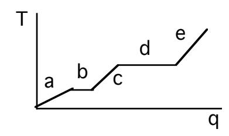
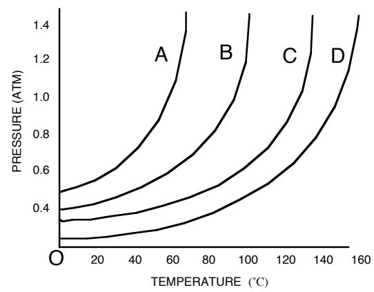
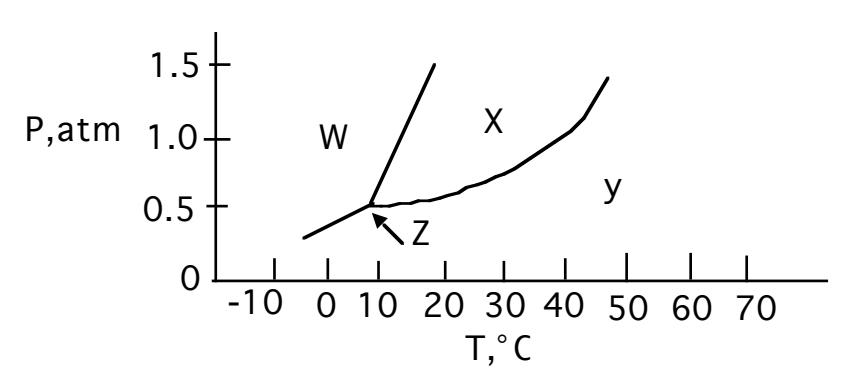
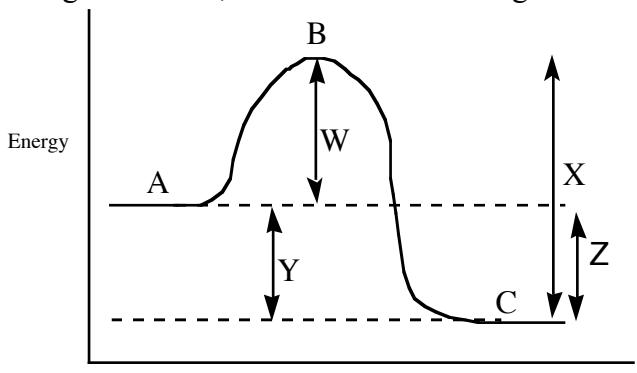

## JASPERSE CHEM 210 PRACTICE TEST 1 VERSION 2

Forces and Intermolecular Forces between Ions and Molecules

Solutions and Their Colligative Properties

Chemical Kinetics: Rates of Reactions

## Constants and/or Formulas Formulas

Formulas for First Order Reactions: kt = ln ([Ao]/[At]) kt1/2 = 0.693

## Note: This practice test is a little longer than the real one will be.

- 1. Increasing the pressure above a liquid will cause the boiling point of the liquid to:

- a. increase b. decrease c. remain the same d. depends on the liquid
- 2. Which of the following is a gas at room temperature?
- a. KCl b. C2H6 c. Fe(NO3)2 d. Al e. C38H62O4
- 3. The intermolecular force(s) responsible for NH3 having the highest boiling point in the set NH3, PH3, AsH3, SbH3,is/are:
  - a. hydrogen bonding
  - b. dipole-dipole interactions
  - c. London-dispersion forces
  - d. Mainly London-dispersion forces but also dipole-dipole intereactions
- 4. Region "b" on the heating curve shown (Temperature versus heat, "q") corresponds to:
  - a. a pure gas increasing in temperature
  - b. a liquid increasing in temperature
  - c. a solid increasing in temperature
  - d. a solid melting
  - e. a liquid boiling



- 5. Which of the following indicates the existence of strong noncovalent forces of attraction in a liquid?
  - a. a very low boiling point
  - b. a very low vapor pressure
  - c. a very low viscosity
  - d. a very low molar heat of vaporization

- 6. Which of the following would have the <u>highest melting point</u>?
  - a. H<sub>2</sub>O
- b. CO<sub>2</sub>
- c. Br<sub>2</sub>
- d. NaCl
- e.  $C_3H_8$
- 7. Which one of the following substances would have hydrogen bonding as one of its intermolecular forces?

  - a. H. H. H. H. F. C. H. H. H. H. H. H. H. H. H. H. H. H. H.
- 8. Which of the following statements is <u>false</u> for the vapor pressure/temperature diagram shown:?



- a. the vapor pressure for C at 60° is about 0.4 atm
- b. substance D has the weakest binding forces
- c. the normal boiling point for A is about 58°
- d. to achieve a vapor pressure of 0.4 atm, substance D must be heated to about 96°C
- 9. The vapor pressure of a liquid:
  - a. Increases with increasing intermolecular force
  - b. Increases with increasing temperature
  - c. Decreases with increasing temperature
  - d. Is completely unrelated to molecular structure
- 10. The substance with the largest heat of vaporization is:
  - a. I<sub>2</sub>

- b. Br<sub>2</sub>
- c. Cl<sub>2</sub>
- d. F<sub>2</sub>

- 11. In which phase does the substance whose phase diagram is shown below exist at 30˚C and 0.2 atm pressure?

- a. gas b. liquid c. solid d. supercritical fluid



- 12. Which of the following liquids would have the lowest vapor pressure, factoring in both the impact of the substance and the temperature?
  - a. CH4 at 60˚
  - b. CH3OH at 20˚
  - c. CH3OH at 60˚
  - d. CH3CH2OH at 20˚
  - e. CH3CH2OH at 60˚
- 13. Rank the following in terms of increasing melting point:

NaNO3 CH4 CH3OCH3 CH3CH2CH2CH2OH

- a. NaNO3 < CH4 < CH3OCH3 < CH3CH2CH2CH2OH
- b. CH4 < CH3OCH3 < CH3CH2CH2CH2OH < NaNO3
- c. NaNO3 < CH3CH2CH2CH2OH < CH3OCH3 < CH4
- d. CH3CH2CH2CH2OH < CH3OCH3 < CH4 < NaNO3
- e. CH4 < CH3CH2CH2CH2OH < CH3OCH3 < NaNO3
- 14. Which is a brittle, high-melting solid but dissolves in water?
  - a. C16H32O2 b. MgCl2 c. C12H26 d. Fe

- 15. Which is the following is polar?
- a. CH4 b. H2S c. . CH3CH3 d. F2
- 16. Which of the following is most likely to be soluble in water?
  - a. Pentane, C5H12
  - b. Tetrachloromethane, CCl4
  - c. Methanol, CH3OH
  - d. Bromoethane, C2H5Br

- 17. Which of the following statements is false?
  - a. While temperature reflects the average kinetic energy for molecules in the liquid stage, some molecules have well-above-average kinetic energy
  - b. Evaporation occurs below room temperature because some above-average molecules have enough energy to escape
  - c. Evaporation increases at higher temperature because then a higher percentage of molecules have enough energy to escape
  - d. Evaporation is endothermic and results in cooling of the liquid because as the highenergy molecules leave, the average kinetic energy of the remaining molecules is reduced
  - e. For two liquids at the same temperature, the reason that one evaporates faster than the other is because the more volatile liquid has stronger noncovalent binding forces
- 18. What is the nature of the intermolecular attractive forces that exist between the solvent and solute molecules shown, if/when the solute was dissolved in the solvent?

Solvent: CH3OH Solute: CH4

- a. Dipole-dipole attractions
- b. Hydrogen bonding
- c. London dispersion force
- d. Ion-dipole attractions
- 19. The following molecule "ethanal" is highly soluble in water. The reason this is possible is because of:

<sup>H</sup> <sup>C</sup> <sup>C</sup> <sup>H</sup> <sup>H</sup> <sup>H</sup> O

- a. Strong hydrogen-bonding between ethanal and water
- b. Strong London forces between ethanal and water
- c. Strong hydrogen-bonding between ethanal and other ethanal molecules
- d. Weak intermolecular forces between ethanal and water
- 20. Which relationship is true for solubility in water?
  - a. C5H11Br > C5H11OH
  - b. C6H14 > C3H7OH
  - c. C6H14 > NaNO3
  - d. C3H7OH > C7H15OH
- 21. As the concentration of a solute in a solution increases, the freezing point of the solution , the vapor pressure of the solution , and the boiling point of the solution ?
  - a. Increases, increases, increases
  - b. Decreases, decreases, decreases
  - c. decreases, decreases, increases
  - d. decreases, increases, decreases

- 22. Which of the following statements is <u>false</u>?
  - a. In a saturated solution, both dissolved solute and undissolved solid are present, and the rate of crystallization equals the rate of dissolving
  - b. When solids dissolve in water, the process may be exothermic or endothermic
  - c. When solids dissolve in water, the primary reason is because of increasing disorder/entropy
  - d. The solubility of a solid usually increases at higher temperature
  - e. A solid will fail to dissolve only if the process is prohibitively endothermic
  - f. A dissolving will fail only if the resulting solvent-solute intermolecular forces are much stronger than the original solute-solute and solvent-solvent binding forces
- 23. The aqueous solution with which of the following concentrations of solute will have the lowest melting/freezing point?
  - a.  $0.20 \text{ M} \text{ CH}_3\text{CH}_2\text{NO}_2$
  - b. 0.15 M NaOH
  - $c. \quad 0.13 \; M \quad MgBr_2$
  - d. 0.05 M MgBr<sub>2</sub>
- 24. In the reaction  $2NO_2 \rightarrow 2NO + O_2$  [NO<sub>2</sub> drops from 0.0100 to 0.00650 M in 100s. What is the average rate of disappearance of NO<sub>2</sub> for this period in M/s?
  - a. 0.35
- b. 0.0035
- c. 0.000035
- d. 0.0070

- e. 0.0018
- 25. Consider the reaction A  $\rightarrow$  2B, if the rate of disappearance of A is 0.40 mol/min, what is the rate of formation of B?
  - a. 0.40 mol/min
- b. 0.20 mol/min
- c. 0.80 mol/min
- d. 1.60 mol/min
- 26. The following reaction was found to be first order in both [A] and [B]. Calculate the value for the rate constant.

$$A + 2B \rightarrow C$$

- a. 0.12
- b. 19
- c. 27
- d. 8.4
- 27. What is the rate law for the reaction  $2A + B \rightarrow products$

| Initial [A] | Initial [B] | rate (M/s) |
|-------------|-------------|------------|
| 0.130       | 0.230       | 0.400      |
| 0.260       | 0.230       | 0.800      |
| 0.130       | 0.460       | 1.600      |

- a. rate =  $k[A]^2[B]$
- b. rate = k[A][B]
- c. rate =  $k[A][B]^2$

- d. rate =  $k[A]^2[B]^2$
- e. none of the above

28. For the reaction shown in the previous problem, what would be the value for k?

a. 58.2 M-2

s-1 b. 13.4 M-1

s-1 c. 0.0172 M-2

s-1 d. 13.4 M-1 s-1

29. For the reaction used in the previous 2 problems, what would be the rate when [A] = 0.36M and [B]=0.45M?

a. 9.43 M/s b. 4.24 M/s c. 15.7 M/s d. 0.139 M/s

30. What is the rate law for the reaction A + 2B à C

Initial [A] Initial [B] rate (M/s) 0.20 0.17 0.33 0.40 0.17 2.64 0.20 0.51 0.33

a. rate = k[A][B] b. rate = k[A][B]2 c. rate = k[A]2

- d. rate = k[A]3 e. rate = k[A]4
- 31. If the rate law for a reaction is rate = k[A]2 [B], what is the effect on the overall rate of cutting in half the concentrations of both A and B?

a. rate decreases by 1/2 b. rate decreases by 1/4

c. rate decreases by 1/8 d. rate decreases by 1/16 e. none of the above

32. AàB is a first order reaction. What is the half-life (in seconds) for the reaction?

| time (sec) | [A] (M) |
|------------|---------|
| 0.0        | 1.22    |
| 3.0        | 0.86    |
| 6.0        | 0.61    |
| 9.0        | 0.43    |
| 12.0       | 0.31    |
|            |         |

a) 3 b) 6 c) 0.7 d) 0.1

- 33. AàB is a first order reaction. If k = 0.33 min-1 , and the initial [A] = 0.13 M, how many minutes will it take for [A] to decrease to 0.088M?
  - a. 1.2
  - b. 1.4
  - c. 0.51
  - d. 0.13
- 34. AàB is a first order reaction. If k = 0.0286 min-1 , and the initial [A] = 0.80 M, what will be the concentration of [A] after 35.0 min?
  - a. 0.080M
  - b. 0.43M
  - c. 0.29M
  - d. 1.25M
- 35. For the reaction diagram shown, which of the following statements is false?



Extent of Reaction

- a. For the forward reaction, line W represents the activation energy, and the forward reaction would be exothermic by the quantity Y
- b. For the reverse reaction, line X represents the activation energy, and the reverse reaction would be endothermic by the quantity Z
- c. The reverse reaction should be faster than the forward reaction
- d. In both the forward and the reverse direction, point B represents the Transition State
- 36. The reaction 2A + B à C + D has the rate law rate = k[A]2 . Which of the following will not increase the rate of the reaction?
  - a. Increasing the concentration of reactant A
  - b. Increasing the concentration of reactant B
  - c. Increasing the temperature of the reaction
  - d. Adding a catalyst

- 37. Which of the following statements about changes in temperature is false?
  - a. Increasing the temperature increases the rate of a reaction
  - b. Increasing the temperature increases the rate constant of a reaction
  - c. Increasing the temperature lowers the activation energy of a reaction
  - d. Increasing the temperature increases the percentage of reactants that are capable of crossing over the reaction's transition state
- 38. Given the mechanism shown, what would be the useful overall rate law?

```
A + B à C fast, equilibrium
```

$$C + D \rightarrow E + F$$
 slow

- a. rate = k[A][B]
- b. rate = k[C][D]
- c. rate = k[A][B][C][D]
- d. rate = k[A][B][D]
- e. rate = k[A][B][D]2
- 39. Given the mechanism shown, which of the following statements would be false?

$$A + B \rightarrow C$$
 slow  $C + D \rightarrow E + F$  fast

- a. The rate law would be rate = k[A][B]
- b. Increasing the concentration of [D] would not accelerate the reaction
- c. C is an intermediate
- d. C is a catalyst
- e. The overall balanced reaction would be A + B + D à E + F
- 40. For the reaction shown, which of the following statements is false?

$$A + B \rightarrow C$$
 slow  $C + D \rightarrow E + F$  fast

- a. The first step is bimolecular
- b. Increasing the concentration of A will increase the rate, because the collision frequency will increase
- c. Every time A + B collide, reaction will take place
- d. Doubling the concentration of both A and B will increase the collision frequency by a factor of four.
- 41. Which of the following statements about catalysts is false:
  - a. Catalysts do not appear in the balanced reaction
  - b. Although a catalyst is used early in a reaction mechanism, it is regenerated later
  - c. Catalysts do appear in the catalyzed reaction mechanism
  - d. Catalysts do not alter the activation energy for a reaction, relative to the uncatalyzed version
  - e. Catalysts do not alter the ∆H for a reaction, relative to the uncatalyzed version
  - f. Catalysts can be used in small amounts

Jasperse Chem 21 0 Practice Test1 Version 2 Answers

- 1. A
- 2. B
- 3. A
- 4. D
- 5. B
- 6. D
- 7. D
- 8. B
- 9. B
- 10. A
- 11. A
- 12. D
- 13. B
- 14. B
- 15. B
- 16. C
- 17. E
- 18. C
- 19. A
- 20. D 21. C
- 22. F
- 23. C
- 24. C
- 25. C
- 26. D
- 27. C
- 28. A
- 29. B
- 30. D 31. C
- 32. B
- 33. A
- 34. C
- 35. C
- 36. B
- 37. C
- 38. D
- 39. D
- 40. C
- 41. D