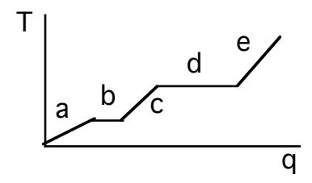
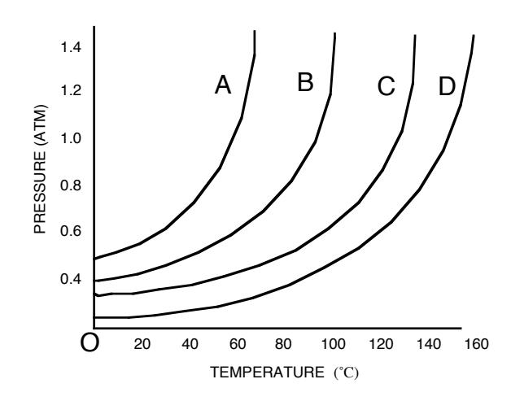
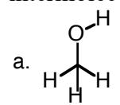
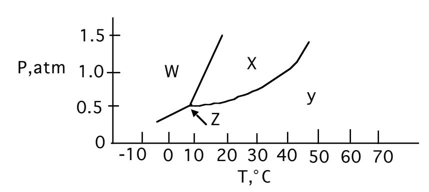
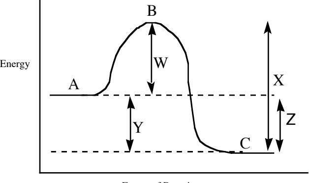

## JASPERSE CHEM 160 PRACTICE TEST 1 **VERSION 3**

Forces and Intermolecular Forces between Ions and Molecules

Solutions and Their Colligative Properties

Chemical Kinetics: Rates of Reactions

Formulas for First Order Reactions:  $kt = ln ([A_o]/[A_t])$ 

 $kt_{1/2} = 0.693$ 

- 1. Region "e" on the heating curve shown (Temperature versus heat, "q") corresponds to:
  - a. a pure gas increasing in temperature
  - b. a liquid increasing in temperature
  - c. a solid increasing in temperature
  - d. a solid melting
  - e. a liquid boiling

2. Which of the following statements is <u>false</u> for the vapor pressure/temperature diagram shown:?

- a. the vapor pressure for B at 60° is about 0.6 atm
- b. substance D has the strongest binding forces
- c. the normal boiling point for B is about 83°
- d. substance D would evaporate most quickly
- 3. Which one of the following substances would <u>not</u> have hydrogen bonding as one of its intermolecular forces?

- 4. In which phase does the substance whose phase diagram is shown below exist at 0˚C and 1.0 atm pressure?

- a. gas b. liquid c. solid d. supercritical fluid

- 5. Which of the following is a molecular solid at room temperature?
- a. I2 b. diamond c. Fe(NO3)2 d. Al e. F2
- 6. Which one of the following has London forces as it's only noncovalent binding force?
  - a. CH3OH
  - b. NH3
  - c. PCl3
  - d. CCl4
- 7. The reason butane, C4H10, has a higher boiling point than propane, C3H8, is best explained by the concept of: ?
  - a. Hydrogen bonding
  - b. Dipole-dipole interactions
  - c. Ion-dipole interactions
  - d. London forces
- 8. Which of the following would have the lowest melting point?
- a. CaCl2 b. Cu c. C5H10O2 d. NaCl

- 9. The vapor pressure of a liquid:
  - a. Increases with increasing intermolecular force
  - b. Increases as solute is dissolved in a liquid
  - c. Increases with decreasing temperature
  - d. Is equal to the external pressure when a liquid reaches it's boiling point

|     | 10. Which of the following is an exothermic process:                                                                                                                                                                                                           |  |  |  |  |  |  |
|-----|-------------------------------------------------------------------------------------------------------------------------------------------------------------------------------------------------------------------------------------------------------------------|--|--|--|--|--|--|
|     | a. sublimation b. melting c. condensation d. evaporation                                                                                                                                                                                     |  |  |  |  |  |  |
|     | 11. Which of the following will have the highest boiling point:                                                                                                                                                                                                |  |  |  |  |  |  |
|     | a. N2 b. Br2 c. H2 d. Cl2                                                                                                                                                                                                                                |  |  |  |  |  |  |
|     | 12. Which of the following liquids would have the highest vapor pressure, factoring in both the impact of the substance and the temperature?                                                                                                                |  |  |  |  |  |  |
|     | a. CH3OH at 20˚ b. CH3OH at 60˚ c. CH3CH2OH at 20˚ d. CH3CH2OH at 60˚                                                                                                                                                                                    |  |  |  |  |  |  |
| 13. | Rank the following in terms of increasing melting point: NaNO3 CH4 CH3OCH3 CH3CH2CH2CH2OH                                                                                                                                                             |  |  |  |  |  |  |
|     | a. NaNO3 < CH4 < CH3OCH3 < CH3CH2CH2CH2OH b. CH4 < CH3OCH3 < CH3CH2CH2CH2OH < NaNO3 c. NaNO3 < CH3CH2CH2CH2OH < CH3OCH3 < CH4 d. CH3CH2CH2CH2OH < CH3OCH3 < CH4 < NaNO3 e. CH4 < CH3CH2CH2CH2OH < CH3OCH3 < NaNO3 |  |  |  |  |  |  |
| 14. | Which of the following properties of a liquid is not affected by an increase in intermolecular force?                                                                                                                                                          |  |  |  |  |  |  |
|     | a. viscosity b. molecular weight c. heat of vaporization d. boiling point                                                                                                                                                                                |  |  |  |  |  |  |
| 15. | Which of the following will be the most viscous?                                                                                                                                                                                                                  |  |  |  |  |  |  |
|     | a. CH3CH2CH2CH2OH b. CH3CH2OHc. CH3CH2OCH2CH3 d. Cl2                                                                                                                                                                                                        |  |  |  |  |  |  |
| 16. | Which is the following is polar?                                                                                                                                                                                                                                  |  |  |  |  |  |  |
|     | a. CH4 b. PH3 c CH3CH3 d. F2                                                                                                                                                                                                                             |  |  |  |  |  |  |

- 17. Which of the following statements is false?
  - a. Vapor pressure occurs in a closed container when the rate at which molecules are leaving the liquid phase and entering the gas phases is equal to the rate at which gas molecules are returning to the liquid phase
  - b. Evaporation can occur below the boiling point because even then some molecules have enough kinetic energy to escape
  - c. Evaporation decreases at low temperature because then a lower percentage of molecules have enough energy to escape
  - d. At a given temperature molecules in the gas phase have more energy than molecules in the liquid phase
  - e. The stronger the noncovalent binding forces, the faster a liquid will evaporate
- 18. Which of the following is most likely to be soluble in water?
  - a. Hexane, C6H14
  - b. CH2Cl2
  - c. CH3OCH3
  - d. CCl4
- 19. Which of the following is most likely to be soluble in CCl4?
  - a. CH3CH2OH
  - b. H2O
  - c. NH3
  - d. H3CCH3
- 20. What is the nature of the intermolecular attractive forces that exist between the solvent and solute molecules shown, if/when the solute was dissolved in the solvent?

Solvent: C6H14 Solute: CF4

- a. Dipole-dipole attractions
- b. Hydrogen bonding
- c. London dispersion force
- d. Ion-dipole attractions
- 21. Which relationship is true for solubility in water?
  - a. C2H5Cl > C2H5OH
  - b. C6H14 > C3H7OH
  - c. C6H14 > NaNO3
  - d. C3H7NH2 > C7H15NH2

- 22. The pairs shown below represent solutions in which the first member of the pair is the solute and the second member is the solvent. Which solution would have hydrogen bonds as one of the attractive forces between solute and solvent particles?
  - a. CH2Cl2/CH3OH
  - b. CH4/CH3OH
  - c. C6H6/C5H12
  - d. HF/H2O
- 23. Which of the following statements is false about solubility?
  - a. Entropy considerations usually favor solubility
  - b. Energy considerations consistently favor solubility
  - c. In the case of "like dissolves like", the resulting solvent-solute intermolecular forces are comparable to the original solute-solute and solvent-solvent binding forces, such that ∆H isn't very positive if at all
  - d. In the case of "like/unlike", the resulting solvent-solute intermolecular forces are weaker than the original solute-solute and solvent-solvent binding forces, such that ∆H is prohibitively positive
- 24. Which of the following statements is false?
  - a. The solubility of a solid usually increases at higher temperature
  - b. A "supersaturated" solution is not at equilibrium. The solvent holds more solute than it would like, but the crystallization process just can't get started.
  - c. A "saturated" solution is at equilibrium. Molecules are going from the solid phase to the liquid phase (dissolving) at exactly the same rate that molecules are going from the liquid phase to the solid phase (crystallizing).
  - d. In an "unsaturated" solution, the solvent holds less solute than it could. No crystallization is occurring.
  - e. When a hot saturated solution is cooled, the amount of crystalline solid decreases
- 25. The aqueous solution with which of the following concentrations of solute will have the lowest melting/freezing point?
  - a. 0.13 M CaCl2
  - b. 0.10 M Al2(SO4)3
  - c. 0.40 M CH3CH2NO2
  - d. 0.22 M NaCl
- 26. Which of the following effects would not result when some CaCl2 was dissolved in water?
  - a. the melting point/freezing point would decrease
  - b. the boiling point would decrease
  - c. the vapor pressure of the water would decrease
  - d. the rate of evaporation would decrease

27. If the rate of formation of oxygen is 3.20 mol/h, what is the rate of disappearance of hydrogen peroxide (in mol/h)? 2H2O2 à 2H2O + O2

a. 6.40 b. 3.20 c. 1.60

28. The following reaction was found to be first order in [A] and second order in [B]. Calculate the value for the rate constant.

$$2A + 2B \rightarrow C + 2D$$

Initial [A] Initial [B] rate (M/s) 0.270 0.150 0.230

a. 0.12 b. 16.1 c. 37.9 d. 8.4

29. What is the rate law for the reaction 2A + 4B à products

| Initial [A] | Initial [B] | rate (M/s) |
|-------------|-------------|------------|
| 0.140       | 0.320       | 9.2 x 10-8 |
| 0.280       | 0.320       | 9.2 x 10-8 |
| 0.140       | 0.640       | 7.4 x 10-7 |

a. rate = k[B] b. rate = k[A][B] c. rate = k[A]3

[B]5

d. rate = k[B]3e. none of the above

30. If the rate law for a reaction is rate = k[A][B], what is the effect on the overall rate of tripling the concentrations of both A and B?

a. rate increases by 3 b. rate increases by 6

c. rate increases by 9 d. rate increases by 27 e. none of the above

31. What is the rate law for the reaction A + 2B à C

| Initial [A] | Initial [B] | rate (M/s) |
|-------------|-------------|------------|
| 0.20        | 0.17        | 0.33       |
| 0.40        | 0.17        | 1.32       |
| 0.20        | 0.51        | 0.99       |

a. 
$$rate = k[A][B]$$
 b.  $rate = k[A]^2[B]$  c.  $rate = k[A]^2$  d.  $rate = k[A]^3$  e.  $rate = k[A]^4$ 

- 32. For the reaction used in the previous problem, what would be the rate when [A] = 0.36M and [B]=0.45M?

- a. 9.43 M/s b. 2.83 M/s c. 15.7 M/s d. 0.139 M/s
- 33. AàB is a first order reaction. The half life for the reaction is 25.3 seconds. If a solution that is 0.050 M in A is allowed to react for 50.6 seconds, what concentration of A will remain?
  - a. 0.040M
  - b. 0.032M
  - c. 0.022M
  - d. 0.0125M
- 34. AàB is a first order reaction. The value of the rate constant k is 0.015 min-1 . How long will it take for the concentration of A to fall from 0.035 M to 0.025 M?
  - a. 46 min
  - b. 34 min
  - c. 22 min
  - d. 17 min
- 35. AàB is a first order reaction. The concentration of A falls from 0.050 M to 0.015 M after a period of 20 minutes. What is the rate constant, k, for this reaction?
  - a. 17 min-1
  - b. 380 min-1
  - c. 2.6 x 10-6 min-1
  - d. 0.060 min-1

## 36. Which of the following statements is true?

- a. As the activation energy increases the number of effective collisions is increased
- b. All molecular collisions are effective at causing chemical reactions to proceed
- c. Only molecular collisions that can achieve the activation energy can be successful in causing a chemical reaction.
- d. When the temperature increases, the activation energy decreases
- 37. For the reaction diagram shown, which of the following statements is false?

- Extent of Reaction
- a. In the forward direction, the reaction shown is exothermic
- b. For the forward reaction, line W represents the activation energy
- c. For the forward reaction, line W represents the ∆H
- d. The reverse reaction should be slower than the forward reaction
- e. In both the forward and the reverse direction, point B represents the Transition State

## 38. Which of the following statements is true?

- a. The concentration of a catalysts steadily decreases as a reaction proceeds
- b. A catalyst functions by selectively retarding the reverse directions
- c. A catalyst functions by lowering the activation energy for a reaction.
- d. A catalyst changes the ∆H for the reaction.

## 39. The reaction 2A + B + C àD + 2E has the rate law rate = k[A][B]2 . Which of the following will not increase the rate of the reaction?

- a. Increasing the concentration of reactant A
- b. Increasing the concentration of reactant B
- c. Increasing the concentration of reactant C
- d. Increasing the temperature of the reaction
- e. Adding a catalyst

40. Given the mechanism shown, what would be the useful overall rate law?

A + B à C fast, equilibrium C + D à E + F fast, equilibrium

E + G à H + I slow

- a. rate = k[A][B]
- b. rate = k[E][G]
- c. rate = k[A][B][D][G]
- d. rate = k[A][B][C][D][E][G]
- e. rate = k[A][B][D]

41. Given the mechanism shown, which of the following statements would be false?

A + B à C fast, equilibrium

C + D à E + F slow E + G à H + I fast

- a. The rate law would be rate = k[A][B][D]
- b. Increasing the concentration of [D] would accelerate the reaction
- c. Increasing the concentration of [G] would not accelerate the reaction
- d. The overall balanced reaction would be A + B + D + Gà F + H + I
- e. Both C and E are catalysts
- f. Both C and E are intermediates

42. For the reaction shown, which of the following statements is false?

A + B à C slow C + D à E + F fast

- a. The first step is bimolecular
- b. Increasing the concentration of A will increase the rate, because the collision frequency will increase
- c. Every time A + B collide, reaction will take place
- d. Doubling the concentration of both A and B will increase the collision frequency by a factor of four.

| Jasperse Answers                                                                                                                                                                                                                 | Chem 21 0 | Practice Test 1                                                                                                                                                                                              | Version 3        |
|-------------------------------------------------------------------------------------------------------------------------------------------------------------------------------------------------------------------------------------|--------------|--------------------------------------------------------------------------------------------------------------------------------------------------------------------------------------------------------------|------------------|
| 1. A 2. D 3. C 4. C 5. A 6. D 7. D 8. C 9. D 10. C 11. B 12. B 13. B 14. B 15. A 16. B 17. E 18. C 19. D 20. C |              | 24. E 25. B 26. B 27. 28. C 29. 30. C 31. B 32. B 33. 34. C 35. 36. C 37. C 38. C 39. C 40. C 41. E 42. C | A D D D |
| 21. D 22. D 23. B                                                                                                                                                                                                    |              |                                                                                                                                                                                                              |                  |