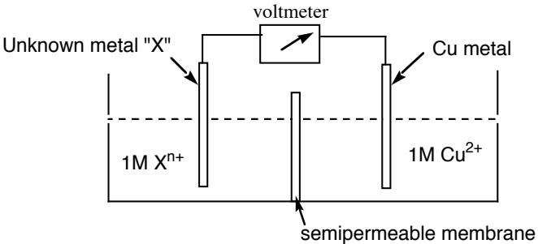
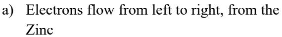
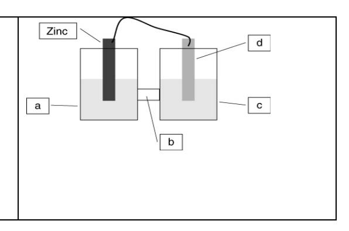

JASPERSE CHEM 210 PRACTICE TEST 4 VERSION 1

Ch. 19 Electrochemistry

Ch. 20 Nuclear Chemistry

Formulas:  $E^{\circ}_{cell} = E^{\circ}_{reduction} + E^{\circ}_{oxidation}$   $\Delta G^{\circ} = -nFE^{\circ}_{cell}$  (for kJ, use F = 96.5)

 $E_{cell} = E^{\circ} - [0.0592/n] \log Q$  $\log K = nE^{\circ}/0.0592$ 

Mol  $e^- = [A \cdot time (sec)/96,500]$ time (sec)= mol e  $\cdot$  96,500/current (in A)

 $t = (t_{1/2}/0.693) \ln (A_o/A_t)$  $\ln (A_o/A_t) = 0.693 \cdot t /t_{1/2}$ 

 $E = \Delta mc^2$  (m in kg, E in J,  $c = 3x10^8$  m/s)

- 1. What is the oxidation number of As in NaAsO3?
  - a. 0
  - b. +2
  - c. +4
  - d. +5
  - e. none of the above
- 2. What substance is reduced in the following reaction?

$$Cr_2O_7^{2-}$$
 +  $6S_2O_3^{2-}$  +  $14H^+$   $\rightarrow$   $2Cr^{3+} + 3S_4O_6^{2-} + 7H_2O$ 

- a.  $Cr_2O_7^{2-}$
- b.  $S_2O_3^{2-}$
- c. H+
- $d. \quad Cr^{3+}$
- $\begin{array}{ll} e. & S_4 O_6{}^{2-} \\ f. & H_2 O \end{array}$
- 3. Which substance is the reducing agent in the reaction below?

$$Pb + PbO_2 + 2H_2SO_4 \rightarrow 2PbSO_4 + 2H_2O$$

- a. Pb
- b.  $H_2SO_4$
- c. PbO2 d. PbSO4
- 4. What is the coefficient of the permanganate ion when the following equation is correctly balanced?

$$H^{+} + MnO_{4}^{-} + Br^{-} \rightarrow Mn^{2+} + Br_{2} + H_{2}O$$

- a. 1
- b. 2
- c. 3
- d. 5

- 5. The electrode at which oxidation occurs is called the
  - a. oxidizing agent
  - b. cathode
  - c. reducing agent
  - d. anode
- 6. Which transformation could take place at the anode of an electrochemical cell?
  - a.  $Cr^{3+}$  to  $Cr_2O_7^{2-}$
  - b.  $F_2$  to  $F^-$
  - c. O2 to H2O
  - d. AsO2 to As
- 7. From the information given, which of the following statements is true?

| Substance                | Reduction Potential (V) |
|--------------------------|-------------------------|
| $F_2 \rightarrow 2F^-$   | 2.85                    |
| $Cl_2 \rightarrow 2Cl^-$ | 1.36                    |
| $Br_2 \rightarrow 2Br^-$ | 1.09                    |
| $I_2 \rightarrow 2I^-$   | 0.54                    |

- a. F2 is the best oxidizing agent, F- is the best reducing agent
- b. I2 is the best oxidizing agent, F- is the best reducing agent
- c. I2 is the best oxidizing agent, I- is the best reducing agent
- d. F2 is the best oxidizing agent, I- is the best reducing agent
- e. F2 is the best oxidizing agent, I2 is the best reducing agent
- 8. The two electrodes  $Cr(s)/Cr^{3+}(aq)$  and  $Sn(s)/Sn^{2+}(aq)$  are combined to afford a product–favored electrochemical equation. The standard reduction potentials in V for  $Cr^{3+}(aq)$  and  $Sn^{2+}(aq)$  are -0.74V and -0.14V, respectively. E° in V is: ?
  - a. +0.88V
  - b. -0.88V
  - c. +0.60V
  - d. -0.60V
  - e. +2.50V
- 9. The standard reduction potentials are -0.13 V for  $Pb^{2+}$  and +0.80 V for  $Ag^{+}$ . Calculate  $E^{\circ}$  for the following reaction:

$$Pb + 2Ag^+ \rightarrow Pb^{2+} + 2Ag$$

- a. 0.93
- b. 0.67
- c. 1.73
- d. 1.47

10. A cell is constructed as shown below in which copper is one of the electrodes, and in which the overall E° is 0.46 ± 0.01V. Given the following standard reduction potentials, identify which metal is "X" (Do not assume that the left half is anode and the ride cathode or vice versa).

## **Reduction Potentials**

$$Ag^{+}$$
 →  $Ag$  +0.80 V  
 $Cu^{2+}$  →  $Cu$  +0.34 V  
 $Fe^{2+}$  →  $Fe$  -0.41 V  
 $Zn^{2+}$  →  $Zn$  -0.76 V  
 $Mn^{2+}$  →  $Mn$  -1.18 V

- a. Ag
- b. Fe
- c. Mn
- d. Zn
- 11. The reduction potentials for  $Ag^+$  and  $Zn^{2+}$  are +0.80 and -0.76. Which substance would be oxidized in a voltaic cell involving silver and zinc?
  - a. Ag
  - b. Ag+
  - c. Zn
  - d.  $Zn^{2+}$
- 12. Based on the periodic table and general patterns of activity, which of the following would react with metallic Zn?

HBr NaI MgCl2 AgBr

- a. All four
- b. MgCl2 only
- c. HBr only
- d. NaI and MgCl2 only
- e. HBr and AgBr only
- 13. Why is it generally necessary to store reducing agents such that they are not in contact with air?
  - a. they rapidly react with atmospheric water vapor
  - b. to prevent oxidation by atmospheric oxygen
  - c. they are usually highly volatile substances that will vaporize and be lost
  - d. they are generally highly hygroscopic and will hydrate extensively with atmospheric water vapor
  - e. they are rapidly deactivated by reaction with even trace amounts of carbon dioxide

14. Which could be used to oxidize iodide to iodine?

| Reduction Potentials     |                   |  |
|--------------------------|-------------------|--|
| $Br_2 \rightarrow 2Br^-$ | 1.09              |  |
| $I_2 \rightarrow 2I^-$   | 0.54              |  |
| $Cu^{2+} \rightarrow Cu$ | +0.34 V           |  |
| $H^+ \rightarrow H_2$    | $0.00~\mathrm{V}$ |  |
| $Ni^{2+} \rightarrow Ni$ | -0.28 V           |  |

- a. Br2
- b.  $Cu^{2+}$
- c. H+
- d. Ni
- e. Ni2+

15. A product–favored electrochemical reaction has:

- a.  $\Delta G^{\circ} = 0$ ,  $E^{\circ} = 0$ , and K >> 1
- b.  $\Delta G^{\circ} < 0, E^{\circ} > 0, \text{ and } K > 1$
- c.  $\Delta G^{\circ} > 0$ ,  $E^{\circ} < 0$ , and K < 1
- d.  $\Delta G^{\circ} > 0$ ,  $E^{\circ} < 0$ , and K > 1
- e.  $\Delta G^{\circ} < 0$ ,  $E^{\circ} = 0$ , and K >> 1

16. What is the value for  $\Delta G^{\circ}$  (in kJ/mol) for the following reaction? (F = 96.5 kJ/V•mol)

$$Pb(s) + 2H^{+}(aq) \rightarrow Pb^{2+}(aq) + H_{2}(g)$$
  $E^{\circ} = +0.13V$ 

- a. -25
- b. +25
- c. -12 d. +12
- e. none of the above

17. The value of E° for the following reaction is 1.10 V. What is the value of Ecell when the concentration of Ag+ is 0.12 M and the concentration of Cr3+ is 0.40 M?

$$Cr(s) + 3Ag^{+}(aq) \rightarrow 3Ag(s) + Cr^{3+}(aq)$$
  $E^{\circ} = 1.54 \text{ V}$   
0.12 M 0.40 M

- a. 1.49 V
- b. 1.44 V
- c. 1.59 V
- d. 1.64 V
- e. none of the above

18. How long will it take to plate out 2.19 g of chromium metal (52.0 g/mol) from a solution of CrBr3, using a current of 35.2 amps?

- a. 5.77 minutes
- b. 346 minutes
- c. 115 minutes
- d. 1.92 minutes
- e. none of the above

- 19. How many grams of Cu metal (63.55 g/mol) will be produced by passing a current of 12 amps through a solution of CuSO4 for 15 minutes.
  - a. 0.016 g
  - b. 3.6 g
  - c. 7.1 g
  - d. 14 g
  - e. none of the above
- 20. Which of the following correctly ranks the "activity" (strength as reducing agents) of the elements Cu, Cd, and Zn, given the following observed reactivity information?

$$Zn + CuBr_2 \rightarrow Cu + ZnBr_2$$

$$Cd + ZnBr_2 \rightarrow No Reaction$$

$$Cu + CdBr_2 \rightarrow No Reaction$$

- a. Zn > Cu > Cd
- b. Zn > Cd > Cu
- c. Cd > Cu > Zn
- d. Cu > Cd > Zn
- 21. A voltaic cell is constructed based on the <u>oxidation of zinc metal</u> and the <u>reduction of silver cations</u>. Solutions of silver nitrate and zinc nitrate also were used. <u>Which statement is true</u> regarding the direction of electron flow through the external wire?

- b) Electrons flow from right to left, to the Zinc
- c) The zinc electrode will get larger as more zinc forms.
- d) Anions will flow through the "bridge" from the zinc side to the silver side

- 22. Based on the periodic table and general patterns of activity, which of the following would react with metallic **sodium**?
  - $I_2$   $I^-$
- FeCl2
- $NiBr_2$

- a. I2 only
- b. I only
- c. NiBr2 only
- d. I2, FeCl2 and NiBr2

- 23. Of the following processes, which one does not change the atomic number?
  - a. alpha emission
  - b. beta emission
  - c. electron capture
  - d. gamma emission
  - e. positron emission
- 24. By what process does Th-230 decay to Ra-226?
  - a. gamma emission
  - b. alpha emission
  - c. beta emission
  - d. electron capture
  - e. positron emission
- 25. 41Ca undergoes electron capture; the resulting isotope then undergoes positron decay. What is the final product after both reactions have occurred?
  - a. Ti
  - b. Ca
  - c. Ar d. Cl
- 26. What is the missing product from this reaction?

$$\frac{32}{15}$$
P  $\rightarrow \frac{32}{16}$ S + ???

a. 
$$\frac{4}{2}$$
He

b. 
$$\frac{0}{-1}$$
e

c. 
$$\frac{0}{0}\gamma$$

d. 
$$\frac{0}{+1}$$
e

27. Which of these nuclides is certain to be radioactive?

a. 
$$\frac{39}{19}$$
 K

a. 
$$\frac{39}{19}$$
 K b.  $\frac{27}{13}$  Al c.  $\frac{127}{53}$  I

c. 
$$\frac{127}{53}$$

d. 
$$\frac{243}{95}$$
 Am

- 28. Bombardment of U–235 with a neutron generates Te–135, 2 neutrons and:
  - a. Sr-99
  - b. Kr-101
  - c. Kr–99
  - d. Zr-99
  - e. Zr–00

- 29. The beta decay of Cs–137 has a half–life of 30.0 years. How many years must pass to reduce a 25 mg sample of Cs–137 to 0.78 mg?
  - a. 60 years
  - b. 150 years
  - c. 180 years
  - d. 750 years
  - e. 5 years
- 30. I–131 has a half–life of 8.04 days. Assuming you start with a 1.35 mg sample, how much will remain after 13.0 days?
  - a. 0.835 mg
  - b. 0.268 mg
  - c. 0.422 mg
  - d. 0.440 mg
  - e. none of the above
- 31. Which of the following statement is true?
  - a. When energy is released during a nuclear reaction, the total mass of the products is less than the total mass of the reactants
  - b. The biological impact of different forms of radiation is the same
  - c. Isotopes have the same number of neutrons but differing numbers of electrons
  - d. A strong nuclear force is required to overcome the repulsion between neutrons
  - e. All stable nuclei have a 1:1 ratio of neutrons to protons
- 32. Fact: 40Sc is unstable and radioactive. Is its n/p ratio too high or too low? In that case, which process could lead to stability? (Make sure that both parts of the answer are correct.)
  - a. Its n/p ratio is too low. It could attain stability by electron capture only
  - b. Its n/p ratio is too low. It could attain stability by beta emission.
  - c. Its n/p ratio is too low. It could attain stability by electron capture or positron emission.
  - d. Its n/p ratio is too high. It could attain stability by beta emission.
  - e. Its n/p ratio is too high. It could attain stability by positron emission.
- 33. The isotope 90Sr has a half–life of 28.8 years. How long will be required for a 5.40 g sample to decay to 2.44 g?
  - a. 33 years
  - b. 30 years
  - c. 14 years
  - d. 42 years
  - e. none of the above

## Answers, Test4–210–Version 1 Electrochemistry and Nuclear Chemistry

- 1. D
- 2. A
- 3. A
- 4. B
- 5. D
- 6. A
- 7. D
- 8. C
- 9. A
- 10. A
- 11. C
- 12. E
- 13. B
- 14. A
- 15. B
- 16. A 17. A
- 18. A
- 19. B
- 20. B 21. A
- 22. D
- 23. D 24. B
- 25. C
- 26. B
- 27. D
- 28. D
- 29. B
- 30. D
- 31. A
- 32. C
- 33. A