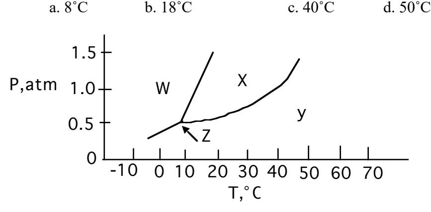
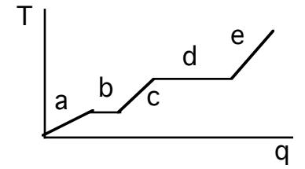
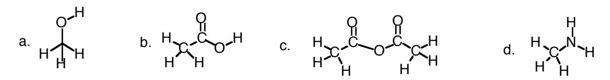
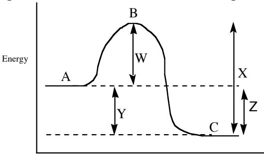

Chem 210 Jasperse Final Exam- Version 1

Note: See the very last page to see the formulas that will be provided with the final exam.

- 1. Which of the following liquids would have the highest vapor pressure, factoring in both the impact of the substance and the temperature?
  - a. C5H13OH at 25˚C
  - b. C5H13OH at 90˚C
  - c. FeCl3 at 25˚C
  - d. C8H15OH at 25˚C
  - e. C8H15OH at 90˚C
- 2. Which would have the highest melting point?

- a. CO2 b. H2O c. NaCl d. CH3Cl e. CH3CH2Br
- 3. What is the melting point at 1.5 atm pressure for the substance described by the following phase diagram?

- 4. Region "d" on the heating curve shown (Temperature versus heat, "q") corresponds to:
  - a. a pure gas increasing in temperature
  - b. a liquid increasing in temperature
  - c. a solid increasing in temperature
  - d. a solid melting
  - e. a liquid boiling

5. Which one of the following substances would <u>not</u> have hydrogen bonding as one of its intermolecular forces?

- 6. Rank the following in terms of increasing boiling point: KBr C2H5OH C2H6 He
  - a. He < KBr < C2H5OH < C2H6
  - b.  $KBr < C_2H_6 < C_2H_5OH < He$
  - c.  $He < C_2H_6 < C_2H_5OH < KBr$
  - d.  $KBr < C_2H_6 < He < C_2H_5OH$
  - e.  $C_2H_5OH < C_2H_6 < He < KBr$
- 7. At room temperature, the <u>vapor pressure</u> pattern is acetone > heptane > ethanol. Which <u>one</u> of the following statements is <u>FALSE</u>:

$$H_3C$$
  $CH_3$  >  $C_7H_{16}$  >  $C_2H_5OH$  acetone heptane ethanol 100 g/mol 46 g/mol

- a. a substance with lower vapor pressure is held together by stronger binding forces
- b. ethanol has the <u>lowest vapor</u> pressure, and <u>London force</u> explains why
- c. ethanol has the lowest vapor pressure, and <u>hydrogen bonding</u> explains why, even though it has the weakest London force.
- d. The reason that heptane has a lesser vapor pressure than acetone is because heptane is heavier and has substantially greater London dispersion force, even though acetone has dipole-dipole interactions in its favor.
- 8. For the reaction  $A + 2B + 3C \rightarrow \text{products}$ , the rate law is: rate  $=k[A]^2[B]^1$  Which of the following statements is <u>false</u>:
  - a. the reaction is 3rd order overall
  - b. the reaction is second order in [A]
  - c. the reaction is third order in [C]
  - d. the reaction is first order in [B]
- 9. Why does CH3CH2NH2 dissolve readily in water but C4H10 does not?
  - a. Hydrogen bonding between  $CH_3CH_2NH_2$  and water is strong. But interactions between  $C_4H_{10}$  and water are weaker than the water-water interactions that would need to be sacrificed in order to dissolve  $C_4H_{10}$ .
  - b.  $C_4H_{10}$  has strong hydrogen bonding with water.
  - c. CH3CH2NH2 has only induced dipole forces (London forces)
  - d. C4H10 is much more polar than CH3CH2NH2

10. Which relationship is true for solubility in water?

- a. C6H14 > NaCl
- b. C11H23NH2 > C3H7NH2
- c. CH3OH > CHCl3
- d. CH3CCl3 > CH3CH2OH
- 11. Which of the following statements is false?
  - a. When a solute is dissolved in water, the freezing point of water goes down
  - b. A saturated solution contains dissolved solute in equilibrium with undissolved solid
  - c. Dissolving a solid results in a decrease in entropy and will only occur if the dissolving is exothermic.
  - d. Smaller gases have higher velocity at room temperature than do larger molecules.
- 12. What is the rate law for the reaction A + 2B + C à products:

| Initial [A] | Initial [B] | Initial [C] | rate |
|-------------|-------------|-------------|------|
| 0.25        | 0.25        | 0.25        | 3.0  |
| 2.5         | 0.25        | 0.25        | 30.0 |
|             |             |             |      |
| 0.25        | 0.25        | 0.75        | 27.0 |
| 0.25        | 0.50        | 0.25        | 6.0  |

- a. rate = k[A][B][C]2
- b. rate = k[A][B]
- c. rate = k[A][B]2 [C]3
- d. rate = k[A][B]2 [C]
- 13. Substance X has a half life of 20 days. If a sample is originally 12 g, how much will be left after 80 days?
  - a. 0.75 g
  - b. 1.5 g
  - c. 0.45 g
  - d. 3.0 g
  - e. none of the above

14. For the reaction diagram shown, which of the following statements is true?

Extent of Reaction

- a. Line W represents the  $\Delta H$  for the forward reaction; point B represents the transition state
- b. Line W represents the activation energy for the forward reaction; point B represents the transition state
- c. Line Y represents the activation energy for the forward reaction; point C represents the transition state
- d. Line X represents the  $\Delta H$  for the forward reaction; point B represents the transition state
- 15. Given the mechanism shown, what would be the rate law?

$$A+B \rightarrow C+D$$
 fast  
 $C+B \rightarrow F+G$  slow  
 $G+H \rightarrow I+J$  fast

- a. rate = k[A][B]
- b. rate =  $k[A][B]^2$
- c. rate =  $k[A][B]^2[C]$
- d. rate =  $k[A][B]^2[C][G][H]$
- e. none of the above
- 16. Which expression represents K correctly for the following reaction?

$$C(s) + O_2(g) + 5H_2(g) \implies C_2H_6(g) + 2H_2O(g)$$

- a.  $[O_2][H_2]^5/[C_2H_6][H_2O]$
- b.  $[C_2H_6][H_2O]^2/[O_2][H_2]^5$
- c.  $[C_2H_6][H_2O]/[C][O_2][H_2]^5$
- d.  $[C_2H_6](2[H_2O])^2/[CO](5[H_2])^5$
- 17. Calculate K for the following reaction if the equilibrium concentrations of B, C, and D are as shown.

$$A(s) + 2B(g) \implies 3C(g) + D(g) \quad K = ??$$

Equilibrium Concentrations (M): .50 M .20 M .40 M

- a) 0.0128
- b) 1.0 x 10-2
- c) 25
- d) 63

18. When 5 mol of A and 3 mol of B are placed in a container and allowed to come to equilibrium, the resulting mixture is found to contain 1 mol of B. What are the amounts of A, C, and D at equilibrium?

$$A(g) + 2B(g) \implies 3C(g) + D(g)$$

Initial: 5.0 mol 3.0 mol 0 mol 0.00 mol

Equilibrium: 1.0 mol

- a. 1.0 mol A, 3.0 mol C, 1.0 mol D
- b. 4.0 mol A, 3.0 mol C, 1.0 mol D
- c. 1.0 mol A, 6.0 mol C, 1.0 mol D
- d. 3.0 mol A, 2.0 mol C, 2.0 mol D
- e. 4.0 mol A, 3.0 mol C, 4.0 mol D

19. What is the equilibrium concentration of C if [A] = 0.40 M and [B] = 0.15 M at equilibrium? A(g) + 2B (g) 2C (g) K = 2.56 x 10-3

- a. 3.2 x 10-2 M
- b. 8.0 x 10-4 M
- c. 0.20 M
- d. 0.10 M
- e. 4.8 x 10-3 M

20. 0.80 mol of A and 0.80 mol of B are placed in a 1.00 L flask and allowed to reach equilibrium. (There is no C at first.) After reaching equilibrium, the flask is found to contain 0.64 mol of C. What is the value of K for this reaction?

$$2A(g) + 1B(g) \Longrightarrow 2C(g)$$

Initial: 0.80 0.80 0

Change:

Equilibrium: 0.64

- a) 11
- b) 4.0
- c) 33
- d) 6.1

21. Given: 
$$2A(g) = 1B(g) + 2C(g)$$
  $\Delta H^{\circ} = -69 \text{ kJ}$   $K = 1 \times 10^{-6}$ 

If the above reactants and products are contained in a closed vessel and the reaction system is at equilibrium, the number of moles of B can be increased by

- a. removing some C from the system.
- b. removing some A from the system.
- c. decreasing the size/volume of the reaction vessel.
- d. increasing the temperature of the reaction system.

22. What is the final concentration of C at equilibrium if the initial [A] concentration is 0.70M?

$$2A(g) \implies 1B(g) + 2C(g)$$

 $K = 2.2 \times 10^{-8}$ 

Initial:

0.70

0

# Equilibrium:

- a.  $7.7 \times 10^{-7}$
- b.  $1.6 \times 10^{-3}$
- c.  $2.8 \times 10^{-3}$
- d. 6.2 x 10-4
- e. none of the above

23. Calculate the pH of a solution that is  $2.3 \times 10^{-4} M$  in HNO3.

- a. 1.32
- b. 3.64
- c. 3.43
- d. 11.36
- e. none of the above

24. What is the [OH-] concentration of a solution with pH=9.18?

- a.  $5.6 \times 10^{-10} \text{ M}$
- b. 4.6 x 10-6 M
- c. 1.51 x 10-5 M
- d. 4.8 x 10-4 M
- e. none of the above

25. Calculate the pH of 0.20 M weak acid HA,  $K_a = 1.5 \times 10^{-8}$ .

- a. 3.29
- b. 4.26
- c. 6.59
- d. 10.71
- e. none of the above

26. An 0.60 M solution of weak acid HZ has a pH of 4.28. What is the value of Ka for HZ?

- a.  $5.2 \times 10^{-3}$
- b. 4.6 x 10-9
- c. 2.8 x 10-5
- d. 1.9 x 10-12
- e. none of the above

27. Which function as <u>bases</u> in the following equilibrium?

$$CH_3OH(1) + H_2PO_2(aq) + \longrightarrow H_3PO_2(aq) + CH_3O(aq)$$

- a. H2PO2- and CH3O-
- b. H2PO2- and CH3OH
- c. H3PO2 and CH3O-
- d. CH3OH and H3PO2
- 28. Which of the following statements is true relative to NaBr, KN3, NH4NO3, and CrBr3.
  - a. NH4NO3 would give an acidic solutions; NaBr and KN3 would give neutral solutions
  - b. NaBr and CrBr3 would give neutral solutions; and KN3 would give a basic solution
  - c. NH4NO3, and CrBr3 would give acidic solutions; NaBr and KN3 would give basic solutions
  - d. NH4NO3, and CrBr3 would give acidic solutions and KN3 would give a basic solution
- 29. For the reaction shown, which of the following statements would be <u>false</u>?

$$HA (aq) + B^{-} (aq) \implies HB (aq) + A^{-} (aq)$$
  $K = 2.5 \times 10^{-5}$ 

- a) The equilibrium is reactant favored
- b) B anion is the weakest base present
- c) A anion is the strongest base present
- d) HA is the strongest acid present
- e) The solution will contain more HA than HB at equilibrium
- 30. Which of the following would give a <u>basic</u> solution when dissolved in water?
  - a. HNO2
  - b. Na2CO3
  - c. NaCl
  - d. CrCl3
- 31. When the following chemicals are mixed, each in 1 liter of water, which would give an acidic pH at the end?
  - a) 1 mole of NaCN and 1 mole of HCl
  - b) 1 mole of HCN and 1 mole of NaOH
  - c) 1 mole of HCl and 1 mole of NaOH
  - d) 1.5 mole of KOH and 1 mole of HCl
- 32.  $K_a$  for weak acid HZ is 2.8 x  $10^{-5}$ . The pH of a buffer prepared by combining 50.0 mL of 1.00 M NaZ and 22.0 mL 1.00 M HZ is
  - a) 4.19
  - b) 4.55
  - c) 4.91
  - d) 5.14
  - e) none of the above

| 33. | Consider a solution that contains 0.50 moles of HN3 and 0.50 moles of NaN3 in 1.0 L of water. If 0.15 mol of HNO3 is added to this buffer solution, the pH of the solution will get slightly . The pH does not change more drastically because the HNO3 reacts with the present in the buffer solution. |
|-----|------------------------------------------------------------------------------------------------------------------------------------------------------------------------------------------------------------------------------------------------------------------------------------------------------------------------------------|
|     | a) higher, NaN3 b) higher, HN3 c) lower, NaN3 d) lower, HN3                                                                                                                                                                                                                                                               |
| 34. | When placed in 1 L of water, which of the following combinations would give a buffer solution? (Remember, in some cases they might react with each other…) 1) 0.5 mol HF and 0.5 mol NaF 2) 1 mol HCl and 0.5 mol NaF 3) 0.5 mol HCl and 1.0 mol NaF 4) 0.5 mol HCl and 1.0 mol NaOH                                |
|     | a) 1 only b) 1 and 2 only c) 1 and 3 only d) 3 and 4 only e) all would give buffer solutions                                                                                                                                                                                                                           |
| 35. | What is the pH when 40 mL of 1.0 M HCl is added to 80 mL of 0.5 M NaZ? (HZ has Ka = 2.6 x 10-6 ) a) 2.94 x 10-3 b) 4.59 c) 7.00 d) 3.03 e) none of the above                                                                                                                                               |
| 36. | An initial pH of 3.5 and an equivalence point at pH 9.1 correspond to a titration curve for a a) strong acid to which strong base is added                                                                                                                                                                                      |
|     | b) strong base to which strong acid is added c) weak acid to which strong base is added d) weak base to which strong acid is added                                                                                                                                                                                           |
| 37. | What is the molarity of an HCl solution if 28 mL of this solution required 41 mL of 0.63 M NaOH to reach the equivalence point?                                                                                                                                                                                                 |
|     | a) 0.92 M b) 0.43 M                                                                                                                                                                                                                                                                                                             |

c) 0.48 M d) 1.3 x 10-4 M e) none of the above

- 38. Suppose calcium sulfate has solubility of 2.5 x 10-4 mol/L when added to distilled water. Which of the following statements would be **false**?
  - a) The solubility would <u>increase</u> at pH = 2 because the acid would react with the sulfate anion and pull the equilibrium to the right
  - b) The solubility of the calcium sulfate would <u>decrease</u> if Ca(NO3)2 was added to the solution
  - c) The solubility of the calcium sulfate would <u>decrease</u> if Na2SO4 was added to the solution
  - d) The solubility would <u>decrease</u> if the temperature was raised from room temperature to 80°C
- 39. The solubility of MX2 is 9.1 x  $10^{-7}$  mol/L. What is the Ksp of MX2?
  - a) 9.1 X 10-9
  - b) 8.3 X 10-17
  - c) 3.0 X 10-18
  - d) 3.0 X 10-10
  - e) none of the above
- 40. What is the solubility (in moles/L) of CuBr in a solution that also contains  $0.020 \text{ M CuNO}_3$  (the latter is fully soluble). ( $K_{sp}$  CuBr =  $5.4 \times 10^{-9}$ )
  - a)  $5.3 \times 10^{-9}$
  - b) 7.3 X 10-5
  - c) 1.8 X 10-7
  - d) 2.7 X 10-7
  - e) none of the above
- 41. Under which conditions is a reaction sure to be **reactant-favored**?
  - a) the reaction is **endothermic** and its  $\Delta S$  is **negative**
  - b) the reaction is **endothermic** and its  $\Delta S$  is **positive**
  - c) the reaction is **exothermic** and its  $\Delta S$  is **negative**
  - d) the reaction is **exothermic** and its  $\Delta S$  is **positive**
- 42. Which one of the following reactions would have a <u>positive</u> value for  $\Delta S^{\circ}$ ?
  - a)  $C_6H_{12}(g) + 9O_2(g) \rightarrow 6CO_2(g) + 6H_2O(1)$
  - b)  $N_2(g) + 3H_2(g) \rightarrow 2NH_3(g)$
  - c)  $H_2O(1) \rightarrow H_2O(s)$
  - d)  $BaCO_3(s) \rightarrow BaO(s) + CO_2(g)$
  - e) none of the above
- 43. Calculate ΔS° (at 25°C in J/K) for the following reaction, given the standard entropies shown (in J/mol-K):

$$2A(g) + B(g) \rightarrow 3C(l) + 3D(g)$$
Standard entropies: 187 186 78 131

- a) +120
- b) +59
- c) + 67
- d) -59

44. Consider the following reaction at 25°C.

$$A(g) + B(g) \rightarrow C(s) + D(g)$$
  $\Delta H^{\circ} = -48 \text{ kJ/mol} \quad \Delta S^{\circ} = -222 \text{ J/mol} \cdot \text{K}$ 

What is the value of  $\Delta G^{\circ}$  for this reaction, in kJ, at 73°C, and would it be product-favored at 73°C?

- a) -4.0 x 104 kJ and reactant favored
- b) 28.8 kJ and reactant favored
- c) 131 kJ and reactant favored
- d) -91 kJ and product favored
- 45. For the following reaction, under which temperature circumstances (in °C) will it be **product-favored**?

$$A(g) + B(g) \rightarrow C(s) + D(g)$$
  $\Delta H^{\circ} = -76 \text{ kJ/mol}$   
 $\Delta S^{\circ} = -210 \text{ J/K-mol}$ 

- a) It will be product-favored at temperatures below 362 °C
- b) It will be product-favored at temperatures below 89 °C
- c) It will be product-favored at all temperatures
- d) It will be product-favored at temperatures above 43 °C
- e) It will be product-favored at temperatures below 316 °C
- 46. What is the oxidation number of Cl in HClO3?
  - a. +3
  - b. +4
  - c. +5
  - d. +7
  - e. none of the above
- 47. After balancing the following redox reaction, what is the coefficient for H2O?

$$H_2CrO_4 + Fe \rightarrow Cr_2O_3 + Fe_2O_3 + H_2O$$

- a. 1
- b. 2
- c. 5
- d. 8
- e. none of the above
- 48. Which substance is the <u>oxidizing agent</u> in the following reaction?

$$3Mg + 2FeBr_3 \rightarrow 3MgBr_2 + 2Fe$$

- a. Fe°
- b. Mg2+
- c. Fe3+
- d. Mg°
- e. none of the above

49. Given the following reduction potentials, what would be the E° for a cell for a product favored reaction involving the chemicals shown?

$$Cl_2 + 2e^- \rightarrow 2Cl^ E^{\circ} = +1.32 \text{ V}$$
  
 $Cr^{3+} + 3e^- \rightarrow Cr$   $E^{\circ} = -0.74 \text{ V}$ 

- a. 2.1V
- b. 4.9 V
- c. 0.58 V
- d. 1.72 V
- e. none of the above

50. Balance the reaction and determine E° for the following <u>unbalanced</u> reaction?

Al + 
$$Co^{2+}$$
  $\rightarrow$  Al3+ + Co  $\Delta G^{\circ} = -799 \text{ kJ}$ 

- a. +0.275 V
- b. +0.490 V
- c. +1.38 V
- d. +2.55 V
- e. none of the above

51. Which transformation could take place at the <u>anode</u> of an electrochemical cell?

- a.  $Mn^{2+}$  to Mn
- b. H2O to O2
- $\begin{array}{ll} c. & H_2SO_4 \ to \ H_2S_2O_3 \\ d. & Br_2 \ to \ Br^- \end{array}$
- e. none of the above

52. Calculate the value of E° for the reaction shown, given the standard reduction potentials:

$$\begin{array}{cccc} \underline{Reduction\ Potentials} & \underline{Overall\ Reaction} \\ Br_2 \rightarrow 2Br^- & E^\circ = +1.08\ V \\ Zn^{2+} \rightarrow Zn & E^\circ = -0.76\ V \end{array} \qquad \begin{array}{c} \underline{Overall\ Reaction} \\ Zn + Br_2 \rightarrow ZnBr_2 & E^\circ = ?? \end{array}$$

- a. 0.38 V
- b. -0.38 V
- c. 0.68 V
- d. 1.84 V

53. The value of E° for the following reaction is 1.52 V. What is the value of Ecell with the concentrations shown?

$$2A1 + 3Sn^{2+} \rightarrow 3Sn \quad 2A1^{3+} \qquad E^{\circ} = 1.52$$
  
0.1 M \qquad 0.9 M

- a. 1.40
- b. 1.55
- c. 1.49
- d. 0.80

54. Given the following reduction potentials, which species would react with Cu2+?

| $Br_2 + 2e^- \rightarrow 2Br^-$   | $E^{\circ} = +1.08 \text{ V}$ |
|-----------------------------------|-------------------------------|
| $Cu^{2+} + 2e^{-} \rightarrow Cu$ | $E^{\circ} = +0.34 \text{ V}$ |
| $Ni^{2+} + 2e^- \rightarrow Ni$   | $E^{\circ} = -0.13 \text{ V}$ |
| $Cd^{2+} + 2e^{-} \rightarrow Cd$ | $E^{\circ} = -0.40 \text{ V}$ |
| $A1^{3+} + 3e^{-} \rightarrow A1$ | $E^{\circ} = -1.66 \text{ V}$ |

- a. Br only
- b. Cd and Al only
- c.  $Cd^{2+} + Al^{3+}$  only
- d. Ni, Cd and Al
- 55. Molten PbCl2 is subjected to electrolysis in order to form elemental lead and chlorine. Which of the following is <u>false</u>?
  - a. Elemental lead metal is formed and deposited at the cathode
  - b. Elemental chlorine gas is formed at the cathode and bubbles away
  - c. Electrons flow from the anode to the cathode
  - d. none of the above
- 56. How many grams of Zn metal (65.4 g/mol) will be produced by passing a current of 6.6 amps through a solution of ZnI2 for 45 minutes.
  - a. 6.0 g
  - b. 0.111 g
  - c. 3.3 g
  - d. 6.6 g
  - e. none of the above
- 57. What particles are produced in the following reaction?  $^{238}U + ^{16}O \rightarrow ^{140}Ba + ^{110}Mo +$ 
  - a. 2 neutrons
  - b. 4 neutrons
  - c. 1 alpha particle
  - d. 2 alpha particles
  - e. 4 alpha particles
- 58. Fact: 14O is unstable and radioactive. Is its n/p ratio too high or too low? In that case, which process could lead to stability? (Make sure that both parts of the answer are correct.)
  - a. Its n/p ratio is too low. It could attain stability by electron capture or positron emission.
  - b. Its n/p ratio is <u>too low</u>. It could attain stability by <u>beta emission</u>.
  - c. Its n/p ratio is too high. It could attain stability by electron capture.
  - d. Its n/p ratio is too high. It could attain stability by beta emission.
  - e. Its n/p ratio is too high. It could attain stability by positron emission.

| 59. | What is the missing product from this reaction: |  |  | 28Al à | 28Si + |
|-----|-------------------------------------------------|--|--|--------|--------|
|     |                                                 |  |  |        |        |

| 28 A1 <del>-</del> | → 28 Si + |  |
|-------------------------------|----------------------|--|
|-------------------------------|----------------------|--|

- a. alpha particle
- b. beta ray
- c. positron
- d. gamma ray
- e. neutron

### 60. The half–life for radioactive element Z is 6 hours. If there is originally 50 g of sample Z, how much will be left after 15 hours?

- a. 8.8 g
- b. 11 g
- c. 24 g
- d. 16 g
- e. none of the above

Chem 210 Final Exam Answers Practive Version 1

| Test1   | Test2   | Test3   | Test4   |
|---------|---------|---------|---------|
| Answers | Answers | Answers | Answers |
| 1.      | 16.     | 31.     | 46.     |
| B       | B       | A       | C       |
| 2.      | 17.     | 32.     | 47.     |
| C       | A       | C       | B       |
| 3.      | 18.     | 33.     | 48.     |
| B       | B       | C       | C       |
| 4.      | 19.     | 34.     | 49.     |
| E       | E       | C       | A       |
| 5.      | 20.     | 35.     | 50.     |
| C       | C       | D       | C       |
| 6.      | 21.     | 36.     | 51.     |
| C       | A       | C       | B       |
| 7.      | 22.     | 37.     | 52.     |
| B       | C       | A       | D       |
| 8.      | 23.     | 38.     | 53.     |
| C       | B       | D       | C       |
| 9.      | 24.     | 39.     | 54.     |
| A       | C       | C       | D       |
| 10.     | 25.     | 40.     | 55.     |
| C       | B       | D       | B       |
| 11.     | 26.     | 41.     | 56.     |
| C       | B       | A       | A       |
| 12.     | 27.     | 42.     | 57.     |
| A       | A       | D       | C       |
| 13.     | 28.     | 43.     | 58.     |
| A       | D       | C       | A       |
| 14.     | 29.     | 44.     | 59.     |
| B       | D       | B       | B       |
| 15.     | 30.     | 45.     | 60.     |
| B       | B       | B       | A       |
|         |         |         |         |

General Chemistry II Jasperse Final Exam- Key Equations, Constants and Formulas

Test 1

| PV=nRT                                 | R=0.0821 L•atm/mol•K | 1 atm = 760 mm Hg | K=273 + ºC |
|----------------------------------------|----------------------|-------------------|------------|
| 1 mol = 22.4 L (at STP)                |                      |                   |            |
| Formulas for First Order Reactions: | kt = ln ([Ao]/[At])  | kt1/2 = 0.693  |            |

## Tests 2 and 3

| [H+][HO-] = 1.00 x 10-14                     | log[H+] pH = -                          | pZ= -logZ General definition for p of anything                         |
|----------------------------------------------|--------------------------------------------|------------------------------------------------------------------------------|
| pH + pOH = 14                                | [H+] = 10-pH                               | 2 b b 4 ac − ± − x = 2 a Quadratic Equation |
| For weak acids alone in water:               | [H+] = Kax[WA]                          | = [H+]2/[HA]init Ka                                                       |
| For weak bases alone in water: €          | [OH-] = Kbx[WB]                         | = [OH-]2 Kb /[Base]init                                                |
| For conjugate acid/base pair:                | KaKb= 1.00 x 10-14                         |                                                                              |
| pH = pKa + log[base]/[acid] For Buffer | €                                          |                                                                              |
| ∆G˚ = G˚ (products) - G˚ (reactants)   | ∆S˚ = S˚ (products) – S˚ (reactants) | ∆G˚ = ∆H˚ –T∆S˚ (T in Kelvin)                                             |

### Test 4

| E˚cell=E˚reduction + E˚oxidation             | ∆G˚ = –96.5nE˚cell                           |
|----------------------------------------------|----------------------------------------------|
| Ecell = E˚ – [0.0592/n]log Q           | log K = nE˚/0.0592                           |
| Mol e– = [A • time (sec)/96,500]             | time (sec)= mol e • 96,500/current (in A) |
| t = (t1/2/0.693) ln (Ao/At)                  | ln (Ao/At) = 0.693•t /t1/2                   |
| E = ∆mc2 (m in kg, E in J, c = 3x108 m/s) |                                              |