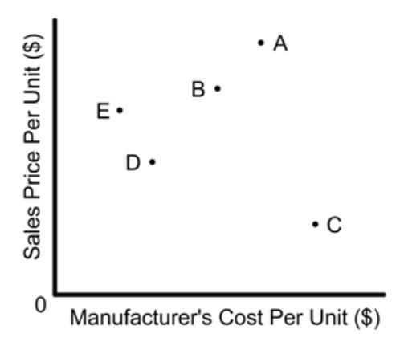

| Multip Identif |    | Choice e letter of the choice that best comp             | letes the statemen   | t or answers the question.        |  |  |  |
|-------------------|----|-------------------------------------------------------------|----------------------|-----------------------------------|--|--|--|
|                   | 1. | Express the sum of 7.68 m and 5.                            | 0 m using the corr   | ect number of significant digits. |  |  |  |
|                   |    | a. 12.68 m                                                  | c.                   | 13 m                              |  |  |  |
|                   |    | b. 12.7 m                                                   | d.                   |                                   |  |  |  |
|                   |    | 5. 1 <b>2.</b> 1, 11.                                       | <b>U.</b>            | 10 111                            |  |  |  |
|                   | 2. | What is the measurement 111.009                             | 9 mm rounded off     | to four significant digits?       |  |  |  |
|                   |    | a. 111 mm                                                   | c.                   | 111.01 mm                         |  |  |  |
|                   |    | b. 111.0 mm                                                 | d.                   | 110 mm                            |  |  |  |
|                   | 3. | Using the periodic table, determine                         | ne the number of n   | eutrons in 16 O.       |  |  |  |
|                   |    | a. 4                                                        | c.                   | 16                                |  |  |  |
|                   |    | b. 8                                                        | d.                   | 24                                |  |  |  |
|                   | 4. | Which of the following isotopes l                           | has the same numb    | per of neutrons as phosphorus-31? |  |  |  |
|                   |    | a. $^{32}_{15}P$                                            |                      | 29 14 Si    |  |  |  |
|                   |    |                                                             |                      |                                   |  |  |  |
|                   |    | b. $^{32}_{16}$ S                                           | d.                   | 28 14 Si    |  |  |  |
|                   | 5. | When an electron moves from a l                             | ower to a higher e   | nergy level, the electron         |  |  |  |
|                   |    | a. always doubles its energy                                |                      |                                   |  |  |  |
|                   |    | b. absorbs a continuously varial                            |                      | gy                                |  |  |  |
|                   |    | c. absorbs a quantum of energy                              | •                    |                                   |  |  |  |
|                   |    | d. moves closer to the nucleus                              |                      |                                   |  |  |  |
|                   | 6. | What is the electron configuration                          | n of potassium?      |                                   |  |  |  |
|                   |    | a. $1s^2 2s^2 2p^2 3s^2 3p^2 4s^1$                          | c.                   | $1s^2 2s^2 3s^2 3p^6 3d^1$        |  |  |  |
|                   |    | b. $1s^2 2s^2 2p^{10} 3s^2 3p^3$                            | d.                   | $1s^2 2s^2 2p^6 3s^2 3p^6 4s^1$   |  |  |  |
|                   | 7. | Which of the following elements                             | is a transition met  | al?                               |  |  |  |
|                   |    | a. cesium                                                   | c.                   | tellurium                         |  |  |  |
|                   |    | b. copper                                                   |                      | tin                               |  |  |  |
|                   | 8. | Atomic size generally                                       |                      |                                   |  |  |  |
|                   |    | a. increases as you move from I                             | left to right across | a period                          |  |  |  |
|                   |    | b. decreases as you move from                               |                      |                                   |  |  |  |
|                   |    | c. remains constant within a per                            |                      |                                   |  |  |  |
|                   |    | d. decreases as you move from left to right across a period |                      |                                   |  |  |  |
|                   | 9. | Which of the following elements                             | has the smallest fi  | rst ionization energy?            |  |  |  |
|                   |    | a. sodium                                                   | С.                   | potassium                         |  |  |  |
|                   |    | b. calcium                                                  | d.                   | magnesium                         |  |  |  |
|                   |    |                                                             |                      | _                                 |  |  |  |

|  10. | a. The radius of an anion is greater than the radius of its neutral atom. b. The radius of an anion is identical to the radius of its neutral atom. c. The radius of a cation is greater than the radius of its neutral atom. d. The radius of a cation is identical to the radius of its neutral atom. |          | Which of the following statements correctly compares the relative size of an ion to its neutral atom? |  |  |
|---------|------------------------------------------------------------------------------------------------------------------------------------------------------------------------------------------------------------------------------------------------------------------------------------------------------------------------------|----------|-------------------------------------------------------------------------------------------------------|--|--|
|  11. | As you move from left to right across the second period of the periodic table                                                                                                                                                                                                                                                |          |                                                                                                       |  |  |
|         | a. ionization energy increases b. atomic radii increase                                                                                                                                                                                                                                                             | c. d. | electronegativity decreases atomic mass decreases                                                  |  |  |
|  12. | What is the electron configuration of the calcium ion?                                                                                                                                                                                                                                                                       |          |                                                                                                       |  |  |
|         | 2 2 2p6 2 3p6 a. 1s 2s 3s                                                                                                                                                                                                                                                                            | c.       | 2 2 2p6 2 5 1 1s 2s 3s 3p 4s                                            |  |  |
|         | 2 2 2p6 2 4 2 b. 1s 2s 3s 3p 4s                                                                                                                                                                                                                                                             | d.       | 2 2 2p6 2 1s 2s 3s                                                                  |  |  |
|  13. | How many valence electrons are in an atom of phosphorus?                                                                                                                                                                                                                                                                     |          |                                                                                                       |  |  |
|         | a. 2                                                                                                                                                                                                                                                                                                                      | c.       | 4                                                                                                     |  |  |
|         | b. 3                                                                                                                                                                                                                                                                                                                      | d.       | 5                                                                                                     |  |  |
|  14. | How many valence electrons are in an atom of magnesium?                                                                                                                                                                                                                                                                      |          |                                                                                                       |  |  |
|         | a. 2                                                                                                                                                                                                                                                                                                                      | c.       | 4                                                                                                     |  |  |
|         | b. 3                                                                                                                                                                                                                                                                                                                      | d.       | 5                                                                                                     |  |  |
|  15. | What is the formula unit of sodium nitride?                                                                                                                                                                                                                                                                                  |          |                                                                                                       |  |  |
|         | a. NaN                                                                                                                                                                                                                                                                                                                    | c.       | Na3N                                                                                                  |  |  |
|         | b. Na2N                                                                                                                                                                                                                                                                                                                   | d.       | NaN3                                                                                                  |  |  |
|  16. | Which of the following compounds has the formula KNO3                                                                                                                                                                                                                                                                        |          | ?                                                                                                     |  |  |
|         | a. potassium nitrate                                                                                                                                                                                                                                                                                                      | c.       | potassium nitrite                                                                                     |  |  |
|         | b. potassium nitride                                                                                                                                                                                                                                                                                                      | d.       | potassium nitrogen oxide                                                                              |  |  |
|  17. | Which of these elements does not exist as a diatomic molecule?                                                                                                                                                                                                                                                               |          |                                                                                                       |  |  |
|         | a. Ne                                                                                                                                                                                                                                                                                                                     | c.       | H                                                                                                     |  |  |
|         | b. F                                                                                                                                                                                                                                                                                                                      | d.       | I                                                                                                     |  |  |
|  18. | A molecule with a single covalent bond is                                                                                                                                                                                                                                                                                    |          |                                                                                                       |  |  |
|         | a. CO2                                                                                                                                                                                                                                                                                                                    | c.       | CO                                                                                                    |  |  |
|         | b. Cl2                                                                                                                                                                                                                                                                                                                    | d.       | N2                                                                                                    |  |  |
|  19. | Which of the following formulas represents an ionic compound?                                                                                                                                                                                                                                                                |          |                                                                                                       |  |  |
|         | a. CS2                                                                                                                                                                                                                                                                                                                    | c.       | N2O4                                                                                                  |  |  |
|         | b. BaI2                                                                                                                                                                                                                                                                                                                   | d.       | PCl3                                                                                                  |  |  |
|         |                                                                                                                                                                                                                                                                                                                              |          |                                                                                                       |  |  |

|  20. | Sulfur hexafluoride is an example of a                                                                                                                                      |    |                                     |
|---------|-----------------------------------------------------------------------------------------------------------------------------------------------------------------------------|----|-------------------------------------|
|         | a. monatomic ion                                                                                                                                                         | c. | binary compound                     |
|         | b. polyatomic ion                                                                                                                                                        | d. | polyatomic compound                 |
|  21. | Which of the following compounds contains the lead(II) ion?                                                                                                                 |    |                                     |
|         | a. PbO                                                                                                                                                                   | c. | Pb2O                                |
|         | b. PbCl4                                                                                                                                                                 | d. | Pb2S                                |
|  22. | Which of the following elements exists as a diatomic molecule?                                                                                                              |    |                                     |
|         | a. neon                                                                                                                                                                  | c. | nitrogen                            |
|         | b. lithium                                                                                                                                                               | d. | sulfur                              |
|  23. | How many moles of tungsten atoms are in 4.8 × 1025 atoms of tungsten?                                                                                                       |    |                                     |
|         | 8.0 × 102 a. moles                                                                                                                                                    | c. | 1.3 × 10−1 moles                 |
|         | 8.0 × 101 b. moles                                                                                                                                                    | d. | 1.3 × 10−2 moles                 |
|  24. | How many moles of silver atoms are in 1.8 × 1020 atoms of silver?                                                                                                           |    |                                     |
|         | 3.0 × 10−4                                                                                                                                                                  |    | 3.0 × 102                           |
|         | a.                                                                                                                                                                          | c. |                                     |
|         | 3.3 × 10−3 b.                                                                                                                                                            | d. | 1.1 × 1044                          |
|  25. | What is the molar mass of (NH4 )2CO3 ?                                                                                                                                |    |                                     |
|         | a. 144 g                                                                                                                                                                 | c. | 96 g                                |
|         | b. 138 g                                                                                                                                                                 | d. | 78 g                                |
|  26. | What is the percent composition of carbon, in heptane, C7H16                                                                                                                |    | ?                                   |
|         | a. 12%                                                                                                                                                                   | c. | 68%                                 |
|         | b. 19%                                                                                                                                                                   | d. | 84%                                 |
|  27. | Which of the following is the correct skeleton equation for the reaction that takes place when solid phosphorus combines with oxygen gas to form diphosphorus pentoxide? |    |                                     |
|         | a. P(s) + O2 (g) → PO2 (g)                                                                                                                                         | c. | P(s) + O2(g) → P2O5 (s)          |
|         | P(s) + O(g) → P5O2 b. (g)                                                                                                                                             | d. | (s) → P2 (s) + O2 P2O5 (g) |
|  28. | Chemical equations must be balanced to satisfy                                                                                                                              |    |                                     |
|         | a. the law of definite proportions                                                                                                                                       | c. | the law of conservation of mass     |
|         | b. the law of multiple proportions                                                                                                                                       | d. | Avogadro's principle                |
|  29. | What are the missing coefficients for the skeleton equation below? Cr(s) + Fe(NO3 )2 (aq) → Fe(s) + Cr(NO3 )3 (aq)                                           |    |                                     |
|         | a. 4, 6, 6, 2                                                                                                                                                            | c. | 2, 3, 3, 2                          |
|         | b. 2, 3, 2, 3                                                                                                                                                            | d. | 1, 3, 3, 1                          |

|  30. Which of the following is an INCORRECT interpretation of the balanced equation shown below? 2S(s) + 3O2 (g) → 2SO3 (g) |                                        |                                                                                                                              |          |                                                                                                        |  |  |
|--------------------------------------------------------------------------------------------------------------------------------------------|----------------------------------------|------------------------------------------------------------------------------------------------------------------------------|----------|--------------------------------------------------------------------------------------------------------|--|--|
|                                                                                                                                            |                                        | → 2 molecules SO3 a. 2 atoms S + 3 molecules O2                                                                        |          |                                                                                                        |  |  |
|                                                                                                                                            |                                        | b. 2 g S + 3 g O2 → 2 g SO3                                                                                            |          |                                                                                                        |  |  |
|                                                                                                                                            |                                        | c. 2 mol S + 3 mol O2 → 2 mol SO3                                                                                      |          |                                                                                                        |  |  |
|                                                                                                                                            |                                        | d. none of the above                                                                                                      |          |                                                                                                        |  |  |
|                                                                                                                                            |                                        |                                                                                                                              |          |                                                                                                        |  |  |
|                                                                                                                                            | 31.                                    | How many moles of glucose, C6H12O6                                                                                           |          | , can be "burned" biologically when 10.0 mol of oxygen is available?                                   |  |  |
|                                                                                                                                            |                                        | C6H12O6 (s) + 6O2 (g) → 6CO2 (g) + 6H2O(l)                                                                          |          |                                                                                                        |  |  |
|                                                                                                                                            |                                        | a. 0.938 mol                                                                                                              | c.       | 53.3 mol                                                                                               |  |  |
|                                                                                                                                            |                                        | b. 1.67 mol                                                                                                               | d.       | 60.0 mol                                                                                               |  |  |
|                                                                                                                                            | 32.                                    |                                                                                                                              |          | At STP, how many liters of oxygen are required to react completely with 3.6 liters of hydrogen to form |  |  |
|                                                                                                                                            |                                        | water?                                                                                                                       |          |                                                                                                        |  |  |
|                                                                                                                                            |                                        | 2H2 (g) + O2 (g) → 2H2O(g)                                                                                             |          |                                                                                                        |  |  |
|                                                                                                                                            |                                        | a. 1.8 L                                                                                                                  | c.       | 2.0 L                                                                                                  |  |  |
|                                                                                                                                            |                                        | b. 3.6 L                                                                                                                  | d.       | 2.4 L                                                                                                  |  |  |
|                                                                                                                                            | 33.                                    |                                                                                                                              |          | How are conditions of pressure and temperature, at which two phases coexist in equilibrium, shown on a |  |  |
|                                                                                                                                            |                                        | phase diagram?                                                                                                               |          |                                                                                                        |  |  |
|                                                                                                                                            |                                        | a. by a line separating the phases                                                                                        |          |                                                                                                        |  |  |
|                                                                                                                                            |                                        | b. by the endpoints of the line segment separating the phases c. by the planar regions between lines in the diagram |          |                                                                                                        |  |  |
|                                                                                                                                            | d. by a triple point on the diagram |                                                                                                                              |          |                                                                                                        |  |  |
|                                                                                                                                            |                                        |                                                                                                                              |          |                                                                                                        |  |  |
|                                                                                                                                            | 34.                                    | As the temperature of a fixed volume of a gas increases, the pressure will                                                   |          |                                                                                                        |  |  |
|                                                                                                                                            |                                        | a. vary inversely b. decrease                                                                                       | c. d. | not change increase                                                                                 |  |  |
|                                                                                                                                            |                                        |                                                                                                                              |          |                                                                                                        |  |  |
|                                                                                                                                            | 35.                                    | Which of the following compounds is a nonelectrolyte?                                                                        |          |                                                                                                        |  |  |
|                                                                                                                                            |                                        | a. sodium bromide                                                                                                         | c.       | copper chloride                                                                                        |  |  |
|                                                                                                                                            |                                        | b. magnesium sulfate                                                                                                      | d.       | carbon tetrachloride                                                                                   |  |  |
|                                                                                                                                            | 36.                                    | What mass of Na2SO4 is needed to make 2.5 L of 2.0M solution? (Na = 23 g; S = 32 g; O = 16 g)                                |          |                                                                                                        |  |  |
|                                                                                                                                            |                                        | a. 178 g                                                                                                                  | c.       | 356 g                                                                                                  |  |  |
|                                                                                                                                            |                                        | b. 284 g                                                                                                                  | d.       | 710 g                                                                                                  |  |  |
|                                                                                                                                            | 37.                                    | What is the number of moles of K+ ions are present in 250 mL of a 0.4M KCl solution?                                         |          |                                                                                                        |  |  |
|                                                                                                                                            |                                        | a. 0.1 mol                                                                                                                | c.       | 0.62 mol                                                                                               |  |  |
|                                                                                                                                            |                                        | b. 0.16 mol                                                                                                               | d.       | 1.6 mol                                                                                                |  |  |

|  38. | To 225 mL of a 0.80M solution of KI, a student adds enough water to make 1.0 L of a more dilute KI |          |                                                                                              |
|---------|----------------------------------------------------------------------------------------------------|----------|----------------------------------------------------------------------------------------------|
|         | solution. What is the molarity of the new solution?                                                |          |                                                                                              |
|         | a. 180M b. 2.8M                                                                           | c. d. | 0.35M 0.18M                                                                               |
|  39. | Why does a higher temperature cause a reaction to go faster?                                       |          |                                                                                              |
|         | a. There are more collisions per second only.                                                   |          |                                                                                              |
|         | b. Collisions occur with greater energy only.                                                   |          |                                                                                              |
|         | c. There are more collisions per second and the collisions are of greater energy.               |          |                                                                                              |
|         | d. There are more collisions per second or the collisions are of greater energy.                |          |                                                                                              |
|  40. | Which of these solutions is the most basic?                                                        |          |                                                                                              |
|         | [H+ ] = 1 × 10−2 a. M                                                                     | c.       | [H+ ] = 1 × 10−11M                                                                        |
|         | [OH−] = 1 × 10−4 b. M                                                                        | d.       | [OH−] = 1 × 10−13M                                                                           |
|  41. | What volume, in liters, of 0.40 M NaCl solution contains 0.10 moles of NaCl                        |          |                                                                                              |
|         | a. 0.040                                                                                        | c.       | 0.25                                                                                         |
|         | b. 0.10                                                                                         | d.       | 0.40                                                                                         |
|  42. | Which substance is liquid at room temperature and 1 atmosphere pressure?                           |          |                                                                                              |
|         | sulfur a.                                                                                       | c.       | silicon                                                                                      |
|         | mercury b.                                                                                      | d.       | barium                                                                                       |
|  43. | Groups of elements                                                                                 |          |                                                                                              |
|         | have the same number of isomers. a.                                                             |          |                                                                                              |
|         | have the same principle quantum number (n). b.                                                  |          |                                                                                              |
|         | have the same number of valence electrons. c.                                                   |          |                                                                                              |
|         | both (b) and (c) are correct. d.                                                                |          |                                                                                              |
|  44. | If 0.015 moles of NaOH is added to 0.015 moles of H2SO4,                                           |          |                                                                                              |
|         | an acidic solution results. a.                                                                  |          |                                                                                              |
|         | a basic solution results. b.                                                                    |          |                                                                                              |
|         | a neutral solution results. c.                                                                  |          |                                                                                              |
|         | H2 gas is formed. d.                                                                            |          |                                                                                              |
|  45. |                                                                                                    |          | If 1 part water is mixed with 3 parts 0.2 M NaCl (aq), what is the molarity of this mixture? |
|         | 0.67 M a.                                                                                       | c.       | 0.15 M                                                                                       |
|         | 0.5 M b.                                                                                        | d.       | 0.2 M                                                                                        |
|  46. | Which process has a negative value of ΔG at room temperature and 1 atm pressure?                   |          |                                                                                              |
|         | water freezing a.                                                                               | c.       | ice melting                                                                                  |
|         | water boiling b.                                                                                | d.       | both (a) and (b) are correct                                                                 |
|         |                                                                                                    |          |                                                                                              |

- \_\_\_\_ 47. An irregularly shaped object weighed 122.9 g. When placed in a graduated cylinder that originally contained 24.3 ml of water, the resulting volume was 35.7 ml. What is the density of the object?

  - a. 5.06 g/ml c. 10.8 g/ml
  - b. 3.44 g/ml d. 20.5 g/ml
- \_\_\_\_ 48. If one 5-kg log is burned in a first fireplace, and two 5-kg logs are burned in a second fireplace, then
  - a. slightly more heat is produced in the first fireplace.
  - b. twice as much heat is produced in the first fireplace.
  - c. slightly more heat is produced in the second fireplace.
  - d. twice as much heat is produced in the second fireplace.
  - e. the same amount of heat will be produced in each fireplace.
- \_\_\_\_ 49. An example of a pure substance is

  - a. uranium d. carbon dioxide
  - b. sodium chloride e. all of the above

- c. pure water
- \_\_\_\_ 50. Companies A, B, C, D, and E all manufacture and sell a similar product. The graph below compares manufacturing costs and sales prices per unit among the five companies. If all five companies have sold the same number of units, which company has earned the greatest profit from those sales?

- a. A d. D b. B e. E

c. C

- \_\_\_\_ 51. A parking garage charges \$2.00 for the first hour and \$1.50 for each additional hour. Saturday and Sunday, the rates are decreased by 50%. How much does it cost to park a car from 5 p.m. on Friday until 2 a.m. on Saturday?
  - a. \$9.50 d. \$12.75
  - b. \$9.75 e. \$14.00

c. \$12.50

|  52. | regular price?                                                                                                                                                                                   |    | A television is on sale for \$300. If the sale price is 20% less than the regular price, what was the                                                                         |  |
|---------|--------------------------------------------------------------------------------------------------------------------------------------------------------------------------------------------------|----|-------------------------------------------------------------------------------------------------------------------------------------------------------------------------------|--|
|         | \$240 a.                                                                                                                                                                                      | d. | \$600                                                                                                                                                                         |  |
|         | \$360 b.                                                                                                                                                                                      | e. | \$1,500                                                                                                                                                                       |  |
|         | c. \$375                                                                                                                                                                                      |    |                                                                                                                                                                               |  |
|  53. | 23 L of the 30.% solution and 277 L of the 18% solution a. 75 L of the 30.% solution and 225 L of the 18% solution b. 131 L of the 30.% solution and 169 L of the 18% solution c. |    | A chemist has one solution that is 30.% acid and another solution that is 18% acid. How much of each solution should be used to get 300. L of a solution that is 21% acid? |  |

d. 138 L of the 30.% solution and 162 L of the 18% solution e. 244 L of the 30.% solution and 56 L of the 18% solution

## **Chemistry Challenge Pracitce Exam #1 Answer Section**

#### **MULTIPLE CHOICE**

- 1. B
- 2. B
- 3. B
- 4. B
- 5. C
- 6. D
- 7. B
- 8. D
- 9. C
- 10. A
- 11. A
- 12. A
- 13. D 14. A
- 15. C
- 16. A
- 17. A
- 18. B
- 19. B
- 20. C
- 21. A
- 22. C
- 23. B
- 24. A
- 25. C
- 26. D
- 27. C 28. C
- 29. C
- 30. B 31. B
- 32. A
- 33. A 34. D
- 35. D
- 36. D
- 37. A
- 38. D
- 39. C
- 40. C

- 41. C
- 42. B
- 43. C
- 44. A
- 45. D
- 46. C
- 47. C
- 48. D
- 49. E
- 50. E 51. C
- 52. C
- 53. B