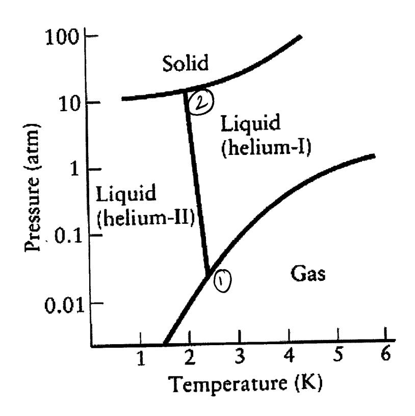

## ANSWER KEY

1) Show that at 0°C a pressure of 1 atm supports a column of mercury (Hg) in a barometer to a height of 760 mm. Density of mercury at 0°C is 13.5951 g cm-3. (5 points)

$$\begin{array}{cccccccccccccccccccccccccccccccccccc$$

2) Calculate the volume of carbon dioxide, at 25°C and 1.0 atm that plants need to make 1.00 g of glucose,  $C_6H_{12}O_6$ , by photosynthesis in the reaction:

$$6~\mathrm{CO_2(g)} + 6~\mathrm{H_2O(l)} \boldsymbol{\rightarrow} \mathrm{C_6H_{12}O_6}~(\mathrm{s}) + 6~\mathrm{O_2(g)}$$

(6 points)

Moler Mass of C6H12O6 = 180.1g/mo [2]

Invole of C6H12O6 is produced from 6,0333 moles co2

$$P V = n RT$$

$$V = 0.0333 \text{ mols} \times 0.0820518 \text{ Laten mol'k-'} \times 298 \text{ K}$$

$$= 0.81. \text{ L} \qquad (1)$$

- 3) An equimolar (same number of moles) mixture of gaseous methane ( $CH_4$ ) and propane ( $C_3H_8$ ) is trapped in a container of fixed volume at constant temperature.
- a) Is the average kinetic energy of methane greater than, less than, or equal to, the average kinetic energy of propane? Briefly explain your answer. (4 points)

Equal to. 2 Average KE depends on Trust wass. Since T's the same for both CH4 & C3H8, average KE of both one the same

b) Is the partial pressure of methane greater than, less than, or equal to, the partial pressure of propane?

Briefly explain your answer.

(4 points)

Some (2)
Equinvolor => equal mole faction

vole faction & pontial pressur

Hence, portial pressure some

(2)

c) If the container develops a very small leak, allowing the trapped gases to effuse out, would you expect the composition of escaped gas to be richer in methane or propane? Briefly explain your answer.

(4 points)

Methane 2

Rote of efficien & Jones

Sike Chilo ligher, it effises out faster 2

4) Why does it take longer to cook a hard-boiled egg in Denver, the "mile-high city" (~5300 feet above sea level) than it does in New York City? (6 points)

liquid boils when vaporpossue equals atmospheric possure. Atmospheric possure in Denver is tower than that in NYC. Water boils et a tower temperature on Denver tower in NYC since in Denver a lower in Denver tower temperature is report prossure is required, and hence tower temperature to vapor prossure to equal atmospheric prossure. It is prossure to equal atmospheric prossure. Since water boils at a lower temp, takes longer since water boils at a lower temp, to atles longer tower temp.

5) For each of the following which would be a better solvent, water (H2O) or carbon tetrachloride (CCl4)? For each, briefly explain your choice of solvent.

a) NH3 - Wester (1)

NH3 inpolar, Hro is polar locar dispolars in polar

NH3 inpolar, Hro is polar. Islandispolar in polar

NH3 inpolar, Hro is polar. Islandispolar in polar

Letter Solvent for NH3

2)

b) HCl - polar. H20 is a better solvens (3 points)

c) I2 von polor. Huce non polor CCLy (3 points)\nis a better solvent. Non polor disgolves easier in a
non polor solvent

(2)

6) The phase diagram for Helium, He, is shown below. As can be seen from this phase diagram, two phases of liquid He exists, helium –I and helium-II. Helium is the only substance known to have two liquid phases.

Use the phase diagram of He to answer the following questions:

a) What is the maximum temperature at which helium-II can exist?

(3 points)

b) What is the minimum pressure at which solid helium can exist?

(3 points)

c) What is the normal boiling point of helium-I?

(3 points)

| ď, | Can | solid | helium | sublime?   | ? |
|----|-----|-------|--------|------------|---|
| u, | Can | SOHE  | HOHUH  | Submitte ! | ۰ |

(3 points)

No

- e) Describe the phases in equilibrium at each of helium's triple points?

  (3 points)

  Helium I, helium I, salid 1.5

  Helium I, helium I, salid 1.5
- f) Which liquid phase is more dense, helium-I or helium-II? Explain your answer. (5 points)

Helium I 3)
Density is wars/sume. Hursis independent of
person, while volume decreases with increase\nin pressure. The travial that exists at Wigher pressures
will have the smaller volume and homa
greater density.

7) A sample of 2.00 millimoles Cl2 was sealed into a 2.00 L reaction vessel and heated to 1000 K to study its dissociation into Cl atoms

$$Cl_2(g) \leftrightarrow 2 \ Cl(g)$$

The value of K given holds for concentrations expressed as moles L-1

7a) Calculate the equilibrium composition of the mixture expressing the concentration of each component present in the equilibrium mixture as moles  $L^{-1}$ . (8 points)

component present in the equilibrium mixture as moles L?

$$\begin{array}{cccccccccccccccccccccccccccccccccc$$

7

7b) In (a) determine the percentage decomposition of the  $Cl_2(g)$  at  $1000 \, \text{K}$  (7 points)

1 Learning osition =  $\frac{\text{annowat} \text{decomposition}}{\text{on } p \text{ nel annowat}} \times 100 \, \text{h}$ =  $\frac{5.5 \, \text{Nio}^5}{\text{o. 00100}} \times 100 \, \text{h}$ 

=0.55 % (2)

7c) Consider the reaction  $F_2(g) \leftrightarrow 2F(g)$ . At 1000 K the equilibrium constant for this reaction is  $1.2 \times 10^{-4}$ . At 1000K, which is more stable relative to its atoms,  $Cl_2$  or  $F_2$ ? Explain your answer.

At 1000k on equilibrium constant for dissociation of F2 to Fatans is larger trans out for the dissociation of U2 to claters.

This indicates that at 1000k more F2 will dissociate to Fatans that U2 to Claters.

Dissociate to Fatans that U2 to Claters.

Hence U2 is more stable eleting to its atoms, then

F2 at 1000k

8) The four gases NH3, O2, NO, and H2O are mixed in a reaction vessel and allowed to reach equilibrium in the reaction. The result is an endothermic reaction:

$$4 \text{ NH}_3(g) + 5 \text{ O}_2(g) \leftrightarrow 4 \text{ NO}(g) + 6 \text{ H}_2\text{O}(g)$$

a) Certain changes (see below) are then made to this mixture. Considering each separately, state the effect (increase, decrease, or no change) that the change has on the original equilibrium values of the quantity in the second column. The temperature and volume are kept constant.

| <b>Change</b> Add NO | Quantity amount of $H_2O$ | (2 points) |
|-------------------------|---------------------------|------------|
| d                       | 1 cress                   |            |
| Add NO .                | amount of O 2  | (2 points) |
| inco                    | ease                      |            |
| Add NH 3     | equilibrium constant, K   | (2 points) |
| vo c                    | hange                     |            |
| Remove NO               | amount of NH 3 | (2 points) |
| dec                     | rease                     |            |

b) What effect does a decrease in the volume of the reaction mixture have on the position of the equilibrium of the above reaction. Temperature is held constant.

#4 gas prone makes in reactants (#1 gas plane make in products

Decrease in source favor direction is source fewer

gas plane makes = equivision swifted to be left

f) What effect does raising the temperature have on the position of the equilibrium of the above reaction. (2 points)

Endo bernic reaction Hence variging temp forons products Equilibrium swepts to the right. 9) a) Intravenous medications are often administered in 5.0% glucose ( $C_6H_{12}O_6$ ) by mass. What is the osmotic pressure of such solutions at 37°C (body temperature)? Assume that the density of the solution at 37°C is 1.0 g/cm3. (5 points)

b) Based on your answer in (a) estimate the osmotic pressure of blood. Explain how you came to your answer.

(5 points)

osmotic pressur y blood must abobe ~ 7.1 etm if it was loss tom 7.1 etm or greater trans. 7.1 etm, the cells in the Hood will be damaged.