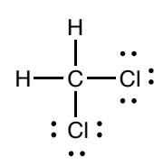
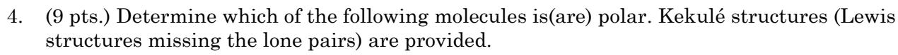
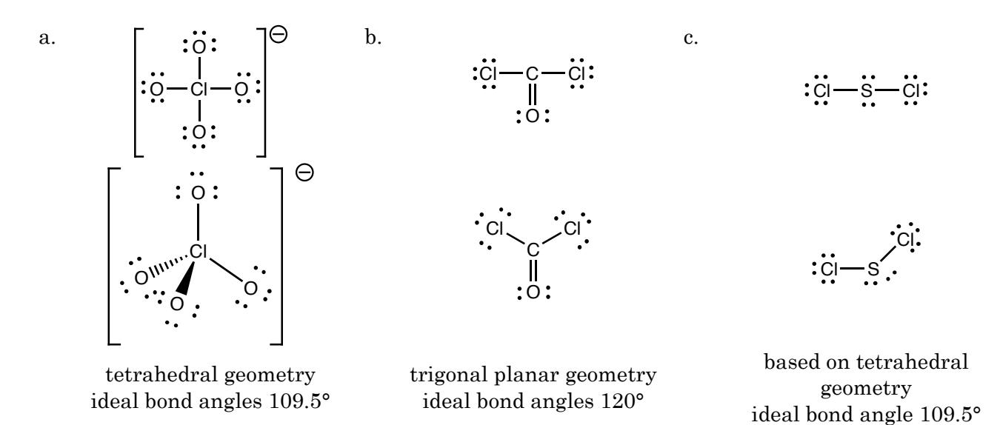

- 1. (8 pts.) Draw Lewis structures for the following elements and ions.
- a. O O b.
- Cl– Cl

- c. P
- P d. Si Si
- 2. (16 pts.) Draw Lewis structures for the following molecules and ions (it is not necessary to calculate formal charges).
- a. CH2Cl2

b. NH4+

$$\begin{bmatrix} H \\ I \\ H \longrightarrow N \longrightarrow H \end{bmatrix}^+$$

c. CO C O c. CH3SH

H C H S H H

- 3. A Lewis structure for SO2 is drawn below.
- a. (4 pts.) Determine the formal charges for all of the elements. Label the neutral elements with a 0.
- b. (4 pts.) Draw the two other resonance forms for SO2.

$$\ddot{\circ} - \ddot{s} = \ddot{\circ} \longleftrightarrow \ddot{\circ} = \ddot{s} - \ddot{\circ} : \longleftrightarrow \ddot{\circ} = \ddot{s} = \ddot{\circ}$$

a. H C H F F **polar** b. F C H F H **polar** c. Cl C H Cl C H H H **polar** d. H C O H **polar** e. Cl C Cl H C H H H **polar** f. H C H H O H **polar** g. H O H **polar** h. O C O **non-polar** i. O S O **polar**

5. (9 pts.) Draw wedge and dashed bond shapes for the following molecules. Alternatively, you may name the shape and provide approximate bond angles.

6. (10 pts.) A 35.0-g sample of water that was initially at 95.0 °C released 1,334 J of energy. Considering that the heat capacity of water is 4.184 J•g-1•K-1, determine the final temperature of the water.

–1334 J = (35.0 g)(4.184 J•g-1•K-1)(Tf – 95.0 °C) –1334/(35.0 x 4.184) = Tf – 95.0 –9.1095 = Tf – 95.0 Tf = 85.89084.9 °C **Tf = 85.9 °C**

7. (10 pts.) If DHcombustion = -2598.8 kJ•mol-1 for C2H2. Determine the mass, in grams, of C2H2 required to produce 1,755 kJ of heat.

$$-1755 \text{ kJ x} \ \underline{1 \text{ mol } C_2H_2} \text{ x} \ \underline{26.038 \text{ g} \ C_2H_2} = 17.5838$$
  $17.58 \text{ g} \ C_2H_2$   $-2598.8 \text{ kJ} \ 1 \text{ mol } C_2H_2$ 

8. (10 pts.) Considering that DHf° for AlCl3(s) is –704 kJ, DHf° for H2O(l) is –286 kJ, DHf° for H2O(g) is –242 kJ, DHf° for HCl(g) is –92 kJ, and DHf° for Al(OH)3(s) is –1276 kJ, determine DH°reaction for the following reaction.

$$AICI_3(s) + 3 H_2O(I) \longrightarrow AI(OH)_3(s) + 3 HCI(g)$$

$$\Delta H_{reaction} = \Sigma \Delta H^{\circ}_{f,products} - \Sigma \Delta H^{\circ}_{f,reactants}$$

$$\Delta H_{reaction} = [(3(-92) + (-1276)] - [3(-286) + (-704)]$$

$$\Delta H_{reaction} = 10 \text{ kJ}$$

- 9. A sample of metal released 367 J of energy, and all of the energy was transferred to a sample of water
  - a. (5 pts.) Determine qmetal. –367 J b. (5 pts.) Determine qwater. 367 J
- 10. (5 pts.) An exothermic reaction is a reaction that absorbs or releases energy?

## **releases**

(5 pts.) The sign of q for an exothermic reaction is positive or negative?

## **negative**